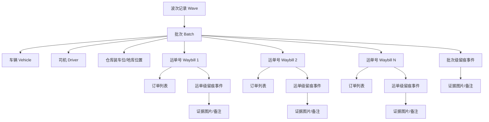
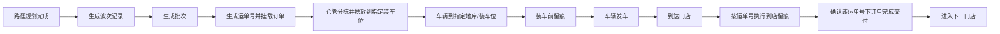
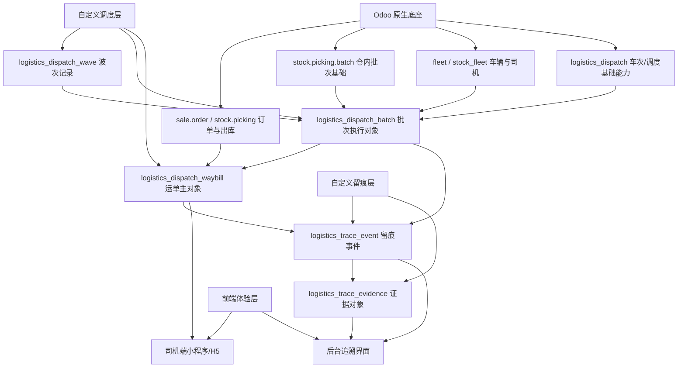

# Odoo19物流留痕系统运单主对象与留痕主流程设计

本文档用于重新明确当前系统的留痕主对象、业务组织层级和核心留痕流程。

这份文档很重要，因为它修正了一个关键认知：

- 留痕不是按订单逐条执行
- 留痕的直接归属对象不是单个订单
- 留痕的直接主对象应当是“门店运单号”

也就是说，订单是履约明细对象，运单号才是现场留痕和证据归档的主对象。

如果此前其他文档里存在“订单是证据主对象”或“订单级留痕闭环”的表述，以本文档为后续设计优先依据。

相关文档：

- `Odoo19物流留痕系统总体设计与边界说明.md`
- `Odoo19物流留痕系统跨模块接口与数据约束总规范.md`
- `Odoo19物流留痕系统统一命名状态机与编号规则.md`
- `Odoo19物流留痕系统调度主流程设计.md`

---

## 1. 先给结论

当前系统最合适的业务组织方式是：

```text
波次记录 -> 批次 -> 运单号 -> 运单下订单列表 -> 留痕事件 -> 证据图片/备注
```

其中：

- 波次记录表示一次集中调度和发货组织
- 批次表示一辆车或一条执行路线承接的一组运单
- 运单号表示一个门店在当日配送中的唯一交付对象
- 订单列表表示归属于该运单号的多个订单
- 留痕事件表示一次装车、到店、签收、异常等现场事实
- 证据对象表示图片、备注、签名等材料

最关键的一句话是：

**留痕是围绕运单号做闭环，不是围绕单个订单做闭环。**

---

## 2. 为什么运单号才是留痕主对象

你现在的现场执行方式并不是“每个订单拍一次照片”，而是：

- 一辆车送多个店铺
- 每个店铺可能对应多个订单
- 司机到店后只会对这个店铺的整车交付结果做留痕
- 留痕图片和运单号关联，而不是和每个订单逐条关联

因此，系统要表达的事实不是：

- 某个订单单独完成了留痕

而应该是：

- 某个店铺当日这个运单号下的全部订单，已经完成本次配送交付

这也是为什么“运单号”必须成为留痕的直接归属对象。

订单仍然重要，但它的定位应调整为：

- 运单号下的业务明细
- 履约归集对象
- 统计和追溯时可展开查看的从属对象

而不是留痕图片的直接主键挂载点。

---

## 3. 核心业务对象层级

建议按下面这套层级来组织系统：



---

## 4. 三层执行组织的职责

## 4.1 波次记录

波次记录用于表达“一波货物、大致同时发货”的调度组织结果。

它主要回答这些问题：

- 今天有哪些货是一波发出的
- 这一波是由哪次调度产生的
- 这一波包含哪些批次
- 这一波的总体计划出发时间是什么

波次记录不是直接留痕对象，它是调度组织和现场准备的最高层视角。

建议波次记录至少关联：

- 调度日期
- 调度轮次或波次编号
- 仓库信息
- 计划出发时间
- 批次列表
- 总订单数
- 总运单数
- 总车数

## 4.2 批次

批次是执行层最关键的对象之一。

结合你当前业务，批次更像“某辆车本次装车和配送任务”的承载容器。

它主要回答这些问题：

- 这辆车这次装什么货
- 去哪些店铺
- 装车前去哪个地库或装车位
- 由哪个司机执行
- 这批货对应哪些运单号

建议批次至少关联：

- 所属波次记录
- 车辆信息
- 司机信息
- 装车仓库
- 装车位或地库位置
- 计划发车时间
- 路线顺序摘要
- 运单号列表

这里要特别注意：

**批次可以关联多个运单号，但批次本身不是门店交付留痕的替代对象。**

## 4.3 运单号

运单号是本系统最重要的现场留痕主对象。

一个运单号应表达：

- 某一天
- 某个店铺
- 某次配送
- 该店铺本次配送下的全部订单集合

运单号必须具备“每日唯一、门店唯一、现场可识别”的特性。

建议运单号至少关联：

- 运单号本身
- 配送日期
- 店铺信息
- 所属批次
- 所属车辆
- 所属司机
- 路线顺序
- 订单列表
- 当前运单执行状态
- 到店留痕状态
- 签收留痕状态

---

## 5. 订单在这套系统里的正确定位

订单不是被删掉，而是被重新放到了更合理的位置。

订单的职责是：

- 提供商品明细
- 提供重量、体积、件数汇总基础
- 参与调度预处理
- 被归并到运单号下面
- 作为后续追溯时可展开查看的业务明细

订单不直接承担的职责是：

- 不要求逐单拍照留痕
- 不要求逐单上传现场证明
- 不要求逐单形成证据链入口

因此，系统里应该支持：

- 从运单号查看订单列表
- 从订单反查所属运单号
- 从订单反查所属批次和车辆

但不应该把“订单表”直接当成现场留痕表来使用。

---

## 6. 留痕主流程

结合你当前业务，留痕流程建议统一理解为下面这条链：



这条链里有两个最关键的现场节点：

- 装车前留痕
- 门店交付留痕

---

## 7. 装车前留痕

装车前留痕是批次级留痕，不是订单级留痕。

它的作用是证明：

- 这辆车确实来到指定装车位置
- 这批货开始装车或已经完成装车
- 当前批次在仓库侧已经进入执行状态

建议装车前留痕至少记录：

- 所属批次
- 所属车辆
- 所属司机
- 装车仓库
- 装车位或地库位置
- 留痕时间
- 留痕图片
- 备注信息

如果业务后面需要更细，可以继续拆成：

- 到达装车位
- 开始装车
- 装车完成

但第一阶段至少要先把“装车前/装车完成”的证据链打通。

---

## 8. 门店交付留痕

门店交付留痕是运单级留痕，是本系统最核心的留痕环节。

司机到达某个店铺后，不是对订单逐条留痕，而是对该门店对应的运单号执行留痕。

它的作用是证明：

- 车辆已到达该店铺
- 该运单号对应的货已完成本次交付
- 该运单号下全部订单的履约结果已经成立

建议门店交付留痕至少记录：

- 运单号
- 店铺信息
- 所属批次
- 所属车辆
- 所属司机
- 到店时间
- 留痕图片
- 备注信息
- 是否异常

必要时可以继续扩展：

- 到店留痕
- 卸货完成留痕
- 签收留痕
- 异常留痕

但这些都仍然应挂在“运单号”下面，而不是拆成订单级证据。

---

## 9. 运单号的关键约束

你已经明确了一个重要规则：

- 每个店铺的运单号是独一无二的
- 今天和明天不会相同

建议把它固化成下面几条约束：

## 9.1 唯一性约束

- 运单号全局唯一
- 或者至少满足“配送日期 + 店铺 + 运单号”唯一

如果业务已经保证跨日也不重复，那么直接采用全局唯一更简单。

## 9.2 关联约束

一个运单号必须能稳定关联到：

- 店铺信息
- 车辆信息
- 司机信息
- 批次信息
- 订单列表
- 配送日期
- 路线顺序

## 9.3 留痕约束

一个运单号应支持挂载多次留痕事件，但必须有明确事件类型。

例如：

- `arrive_store`
- `deliver_finish`
- `signoff`
- `exception_report`

## 9.4 完成性约束

运单完成状态不能只看司机手工点了“完成”，还应结合：

- 是否已有必要留痕
- 是否已上传必要证据图片
- 是否存在未关闭异常

---

## 10. 批次的关键约束

你已经明确提到，批次表格需要关联多个运单号，以及初始仓库位置信息。

因此批次至少应满足：

- 一个批次可以关联多个运单号
- 一个批次有明确装车仓库
- 一个批次有明确装车位或地库位置
- 一个批次通常对应一辆执行车辆
- 一个批次通常对应一个主司机

批次适合承载这些信息：

- 路线整体摘要
- 车辆执行状态
- 装车留痕状态
- 运单完成统计
- 异常汇总统计

但批次不适合直接承载：

- 某个门店是否已完成交付的最终事实

这个最终事实应由运单号来表达。

---

## 11. 建议的数据组织方式

如果按照当前业务来重构，建议把核心数据主线组织成下面这样：

```text
调度结果
  -> 波次记录
    -> 批次
      -> 运单号
        -> 运单订单关系
        -> 运单级留痕事件
          -> 图片证据/备注
      -> 批次级留痕事件
        -> 图片证据/备注
```

这套结构的好处是：

- 调度层有自己的组织对象
- 现场执行层有自己的承载对象
- 证据层有明确挂载点
- 不会把订单、批次、运单、证据混成一团

---

## 12. 与 Odoo 的承载关系

建议在 Odoo 里按下面这套关系落位：



这里最重要的边界是：

- Odoo 原生对象继续承接订单、库存、车辆、批次基础能力
- 自定义调度层承接波次、批次、运单这条执行主线
- 自定义留痕层承接现场事实和证据材料

---

## 13. 对模块设计的直接影响

这次澄清之后，后续模块设计应同步调整：

## 13.1 `logistics_dispatch`

除了调度算法前后编排，还要正式承接：

- 波次记录
- 批次对象
- 运单生成
- 运单与订单归并关系
- 运单与路线顺序关系

## 13.2 `logistics_trace_core`

不再默认按订单创建留痕，而应支持：

- 批次级留痕事件
- 运单级留痕事件

## 13.3 `logistics_trace_evidence`

证据挂载点要支持两类主体：

- 批次级留痕事件证据
- 运单级留痕事件证据

## 13.4 `logistics_trace_mobile`

司机端页面不应该让司机选订单留痕，而应让司机按下面方式操作：

- 查看本车批次
- 查看路线顺序
- 点击当前门店运单号
- 拍照留痕
- 提交完成并进入下一站

## 13.5 后台追溯界面

后台查询主线也要从“订单查留痕”改成：

- 波次看整体
- 批次看装车和路线
- 运单看门店交付证据
- 运单下再展开订单明细

---

## 14. 第一阶段最应该先补的设计文档

基于这次澄清，建议优先补下面几份文档：

1. 《调度波次、批次、运单数据模型设计》
2. 《运单生成规则与唯一性约束设计》
3. 《批次级与运单级留痕事件设计》
4. 《司机端按运单留痕页面流程设计》
5. 《后台按波次/批次/运单追溯页面设计》

---

## 15. 最终结论

你这套系统后面的主链不应再理解成：

```text
订单 -> 留痕 -> 图片
```

而应理解成：

```text
波次记录 -> 批次 -> 运单号 -> 留痕事件 -> 图片证据
                    -> 运单下订单列表
```

所以后面不管是数据库设计、接口设计、前端设计，还是 Odoo 模块建模，都应该围绕下面这条原则展开：

**订单是履约明细对象，运单号是留痕主对象，批次是执行组织对象，波次记录是调度组织对象。**
