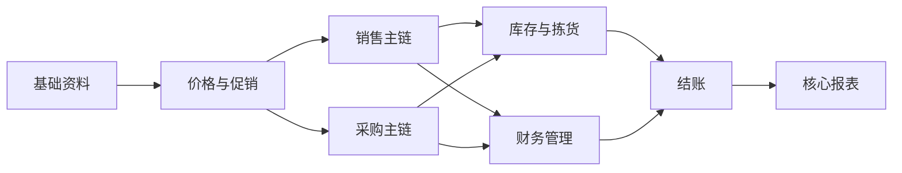

# 福科系统功能一览表

## 目录

1. 总体说明
2. 一眼看懂：第一版功能结构
3. 核心功能总览
4. 第一版必须保留
5. 第一版建议保留
6. 第一版暂不保留
7. 综合结论

## 1. 总体说明

这次的边界与之前相比有几个明确变化：

- `财务管理` 要保留
- `结账` 要保留
- `系统管理` 不进入当前核心功能范围
- `监控及分析` 不单独做模块
- `配送管理` 不做完整配送体系，只保留仓库相关的 `拣货状态` 和 `拣货顺序/线路可视化`

因此，这份一览表不再追求“把福科所有菜单都列出来”，而是只保留对第一版真正有价值的业务板块。

对应参考文档：

- [福科核心功能保留建议.md](D:\Desktop\福科管理系统\福科核心功能保留建议.md)
- [销售主链第一版业务设计草案.md](D:\Desktop\福科管理系统\销售主链第一版业务设计草案.md)
- [采购主链第一版业务设计草案.md](D:\Desktop\福科管理系统\采购主链第一版业务设计草案.md)
- [库存与往来第一版业务设计草案.md](D:\Desktop\福科管理系统\库存与往来第一版业务设计草案.md)

## 2. 一眼看懂：第一版功能结构

可以把第一版理解成 8 个核心块：

1. `基础资料`
2. `价格与促销`
3. `销售主链`
4. `采购主链`
5. `库存与拣货`
6. `财务管理`
7. `结账`
8. `核心报表`

其中最核心的运行骨架是：

- `销售主链`
- `采购主链`
- `库存与拣货`
- `财务管理`

而 `结账` 和 `报表` 是把系统从“能记业务”提升到“能管经营”的关键。

## 3. 核心功能总览

| 功能模块 | 主要作用 | 第一版定位 | 说明 |
| --- | --- | --- | --- |
| 基础资料 | 管理商品、客户、供应商、仓库、库位等主数据 | 必须保留 | 不做主数据，后续业务无法稳定运行 |
| 价格与促销 | 管理基础价、客户价、行业价及简化促销能力 | 必须保留 | 福科的价格能力很强，第一版至少保留核心价盘能力 |
| 销售主链 | 从销售订单到出库、退货、收款 | 必须保留 | 决定收入形成与客户履约 |
| 采购主链 | 从采购订单到入库、退货、付款 | 必须保留 | 决定供货补充与采购执行 |
| 库存与拣货 | 管理库存、库位、拣货执行、库存调整、盘点 | 必须保留 | 是仓库执行与账实一致的底层支撑 |
| 财务管理 | 管理应收、应付、收款、付款、对账、基础财务执行 | 必须保留 | 不做总账全套，但必须做业务财务执行层 |
| 结账 | 管理期间控制、月结、反结账、历史锁定 | 必须保留 | 让经营数据可封账、可追溯、可回看 |
| 核心报表 | 输出销售、采购、库存、往来、毛利等结果 | 必须保留 | 第一版不必复杂，但必须能看经营结果 |
| 复杂费用与返点 | 管理复杂采购费用、返点、促销分摊 | 暂不保留 | 规则复杂，建议后续迭代 |
| 复杂分析壳页 | 大量专项查询、一览表、排行榜 | 暂不保留 | 不建议照搬福科的报表壳层结构 |

## 4. 第一版必须保留

这一部分是“第一版没有就跑不顺”的能力。

### 4.1 基础资料

必须保留：

- 商品资料
- 客户资料
- 供应商资料
- 仓库资料
- 库位资料
- 业务员或责任人资料

核心价值：

- 这是整个系统的对象底座
- 销售、采购、库存、财务都要依赖同一套主数据

### 4.2 价格与促销

必须保留：

- 基础销售价
- 最新进价参考
- 客户价
- 行业价
- 价格调整记录

第一版建议：

- 先保留最核心的价格层级
- 促销先做轻量能力，不追求一开始就复杂

一句话理解：

- 这一块负责决定“卖多少钱、对谁卖什么价”

### 4.3 销售主链

必须保留：

- 销售订单
- 销售出库
- 销售退货
- 客户收款
- 客户对账
- 销售查询和基础报表

一句话理解：

- 这条主链负责把“客户需求”变成“收入和回款”

标准流转：

1. 建客户订单
2. 做销售出库
3. 需要时做销售退货
4. 做客户收款
5. 通过对账和报表查看执行结果

### 4.4 采购主链

必须保留：

- 采购订单
- 验收入库
- 采购退货
- 供应商付款
- 供应商对账
- 采购查询和基础报表

一句话理解：

- 这条主链负责把“采购需求”变成“库存补充和付款结算”

标准流转：

1. 建采购订单
2. 做验收入库
3. 需要时做采购退货
4. 做供应商付款
5. 通过对账和报表查看执行结果

### 4.5 库存与拣货

必须保留：

- 库存余额查询
- 库存流水查询
- 库存调整
- 基础盘点
- 库位管理
- 拣货状态
- 拣货顺序/线路可视化

一句话理解：

- 这一块负责把“货”真正管起来，并让仓库现场可执行

补充说明：

- `库位` 必须纳入第一版
- `拣货状态` 必须纳入第一版
- `拣货顺序/线路可视化` 必须纳入第一版
- 第一版只做基础拣货执行，不做完整配送派车体系

### 4.6 财务管理

必须保留：

- 客户应收台账
- 供应商应付台账
- 收款单
- 付款单
- 销售对账
- 采购对账
- 往来核销
- 基础账龄查看

一句话理解：

- 这一块不是完整会计总账，而是“业务财务执行层”

为什么必须保留：

- 销售不只要出货，还要能回款
- 采购不只要入库，还要能付款
- 老板和财务最关心的是余额、对账和未结清款项

### 4.7 结账

必须保留：

- 期间控制
- 结账
- 取消结账
- 库存月结或月度锁定
- 历史数据锁定

一句话理解：

- 这块负责让系统从“流水记录”升级成“可结算、可封账、可回看”的经营系统

为什么必须保留：

- 如果没有期间控制，历史数据会反复被修改
- 如果没有结账能力，月度经营结果就不稳定
- 如果没有反结账规则，后期纠错会非常混乱

### 4.8 核心报表

必须保留：

- 销售汇总
- 采购汇总
- 库存余额
- 出入库流水
- 应收应付余额
- 基础毛利分析
- 收付款汇总

一句话理解：

- 第一版不能只有单据录入，必须能快速看经营结果

## 5. 第一版建议保留

这一部分不是绝对必需，但如果保留，体验和业务适配会明显更好。

### 5.1 促销增强

建议保留：

- 产品调价
- 促销文件
- 促销销售状态查询

原因：

- 福科的价格和促销能力是它的强项
- 如果你们业务经常有阶段性活动，这一块很有价值

### 5.2 会员积分与礼品活动

建议保留但可以弱化：

- 会员积分
- 积分兑换
- 礼品发放计划

适用前提：

- 如果你们有零售、门店或会员经营场景，可以保留
- 如果主要是纯 B 端贸易，可以放到后续版本

### 5.3 轻量经营分析

建议保留：

- 客户促销成本分析
- 促销产品销售状况
- 供应商支持力度分析

说明：

- 这些能力可以并入报表或经营复盘视图
- 不建议单独做成“监控及分析”模块

## 6. 第一版暂不保留

这一部分不是说没有价值，而是“第一版先不做更合理”。

### 6.1 复杂采购增强

建议先不做：

- 重型询价链
- 复杂采购合同链
- 差价单
- 折扣单
- 虚拟入库单
- 复杂返点体系
- 复杂采购费用归集

原因：

- 规则复杂
- 行业差异大
- 对第一版上线不是绝对阻塞项

### 6.2 复杂财务能力

建议先不做：

- 完整总账体系
- 三大财务报表完整复制
- 复杂票据流
- 复杂多单核销分摊
- 高级账龄策略

原因：

- 第一版目标是先把业务财务执行层跑顺
- 不必一开始就做成重型财务系统

### 6.3 完整配送与地图能力

建议先不做：

- 派车调度
- 车辆管理
- 地图线路配送
- 外勤定位

原因：

- 你已经明确说了只保留与仓库直接相关的两个能力
- 第一版不需要把配送扩成独立业务域

### 6.4 系统管理与监控模块

建议先不做：

- 独立系统管理模块
- 独立监控及分析模块
- 大量通用排行榜
- 大量结构相似的一览表

原因：

- 这类模块容易快速膨胀
- 第一版更应该把精力放在核心交易链和财务闭环上

## 7. 综合结论

如果按你现在的最新边界来收敛，福科第一版最值得保留的，不是“全菜单”，而是下面这 8 块：

1. `基础资料`
2. `价格与促销`
3. `销售主链`
4. `采购主链`
5. `库存与拣货`
6. `财务管理`
7. `结账`
8. `核心报表`

其中真正的重点不是模块数量，而是这条闭环有没有跑通：

**报价/定价 -> 销售 -> 采购 -> 库存/拣货 -> 收付款 -> 对账 -> 结账 -> 报表**

这版收敛后的结构，比之前更接近“能真正落地的一版产品范围”：

- 保留了业务运行必须的 `财务管理`
- 保留了经营稳定必须的 `结账`
- 保留了仓库现场必须的 `拣货状态` 和 `拣货顺序/线路可视化`
- 去掉了你明确不想做的 `系统管理` 和 `监控及分析`

如果后面继续往下做，我建议下一步就不是继续扩菜单，而是基于这 8 块，收成一份更像立项文件的：

- `第一版产品范围说明`
- 或 `第一版页面清单与对象清单`
