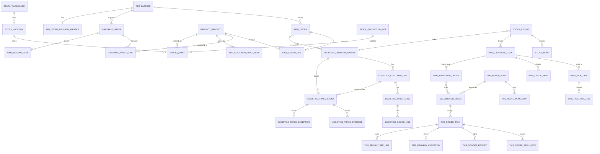

# 主外键关系图

文档类型：
- 专题方案

当前状态：
- active

当前角色：
- `专题设计/ODOO原生模块设计/01_模块设计/` 本期关系结构图

上游文档：
- `2026-05-12_本期数据库新增字段与新表清单.md`
- `2026-05-12_本期接口新增表.md`
- `2026-05-12_状态映射表.md`
- `2026-05-12_本期功能范围_vs_ERP_WMS_TMS_BI_归属表.md`

---

## 1. Objective

在正式进入 ORM 模型和迁移脚本前，先把本期核心对象之间的主外键关系收口，回答 4 个问题：

1. 每个主责域的核心主表是谁
2. 哪些关系是一对多、哪些是一对一、哪些是多对多
3. 哪些关系只保留引用，不复制主档
4. 既有物流域与 ERP/WMS/TMS 之间如何挂接而不混主语义

---

## 2. 使用原则

- 主数据只保留一个主档源头
- 能用外键引用的，不复制主档字段
- 跨域联动优先通过“主对象 + 关系表 + 摘要字段”实现
- 本期先锁主干关系，不追求把所有边角表一次画全
- 既有物流域继续保留主表，不回退到官方单据表替代

---

## 3. 分域主表清单

| 域 | 核心主表 | 说明 |
|---|---|---|
| ERP 主数据 | `res.partner`、`product.template/product.product` | 客户、供应商、门店经营主档、商品主档 |
| ERP 交易 | `sale.order`、`purchase.order`、`account.move`、`account.payment` | 销售、采购、发票、收付款 |
| ERP 补充 | `erp_customer_price_rule`、`erp_partner_statement`、`erp_period_closing_record` | 价格、对账、结账 |
| WMS | `stock.warehouse`、`stock.location`、`stock.picking`、`stock.move`、`stock.quant`、`wms_*` 任务表 | 仓库、库位、作业任务、实物库存 |
| TMS | `tms_store_delivery_profile`、`tms_route_plan`、`tms_dispatch_order`、`tms_driver_task`、`tms_signoff_receipt`、`tms_delivery_exception` | 配送档案、线路、派车、签收、异常 |
| BI | `bi_daily_kpi_snapshot`、`bi_exception_snapshot`、`bi_cost_profit_snapshot` | 快照与看板数据 |
| 系统底座 | `res.users`、`core_module_permission_map`、`core_operation_audit_log` | 账号、权限、审计 |
| 既有物流域 | `logistics.dispatch.waybill`、`logistics.dispatch.waybill.customer.line`、`logistics.trace.event`、`logistics.trace.evidence`、`logistics.trace.exception` | 长期物流对象 |

---

## 4. 主关系清单

### 4.1 ERP 主数据与交易关系

| 主表 | 子表/关联表 | 关系 | 说明 |
|---|---|---|---|
| `res.partner` | `sale.order` | 1:N | 一个客户可对应多张销售订单 |
| `res.partner` | `purchase.order` | 1:N | 一个供应商可对应多张采购订单 |
| `res.partner` | `tms_store_delivery_profile` | 1:1 或 1:N | 一个门店经营主档对应一个配送档案，冷启动可按 1:1 先落 |
| `product.product` | `sale.order.line` | 1:N | 商品被销售订单行引用 |
| `product.product` | `purchase.order.line` | 1:N | 商品被采购订单行引用 |
| `product.product` | `erp_customer_price_rule` | 1:N | 一个商品对应多条客户价/行业价规则 |
| `sale.order` | `sale.order.line` | 1:N | 销售订单行明细 |
| `purchase.order` | `purchase.order.line` | 1:N | 采购订单行明细 |
| `sale.order` | `erp_partner_statement_line` | 1:N | 对账时可关联多个销售来源 |
| `purchase.order` | `erp_partner_statement_line` | 1:N | 对账时可关联多个采购来源 |
| `account.move` | `erp_partner_statement_line` | 1:N | 发票/账单可进入对账明细 |
| `account.payment` | `erp_partner_statement_line` | 1:N | 收付款可进入对账明细 |

### 4.2 WMS 主关系

| 主表 | 子表/关联表 | 关系 | 说明 |
|---|---|---|---|
| `stock.warehouse` | `stock.location` | 1:N | 一个仓库对应多个库位 |
| `stock.location` | `stock.quant` | 1:N | 一个库位对应多个 quant 记录 |
| `product.product` | `stock.quant` | 1:N | 一个商品在多库位/批次有 quant |
| `stock.production.lot` | `stock.quant` | 1:N | 一个批次对应多条 quant |
| `stock.picking` | `stock.move` | 1:N | picking 下有多个 move |
| `stock.picking` | `wms_outbound_task` | 1:1 或 1:N | 一张出库/收货单据可生成一个或多个 WMS 任务 |
| `wms_outbound_task` | `wms_pick_task` | 1:N | 一个出库任务拆多个拣货任务 |
| `wms_pick_task` | `wms_pick_task_line` | 1:N | 拣货任务明细 |
| `wms_outbound_task` | `wms_check_task` | 1:N | 一个出库任务可对应一到多个复核任务 |
| `wms_outbound_task` | `wms_handover_order` | 1:N | 一个出库任务可进入装车交接 |
| `wms_receipt_task` | `stock.picking` | N:1 | 收货任务回指 ERP/库存来源单 |
| `wms_putaway_task` | `stock.location` | N:1 | 上架任务落到目标库位 |
| `wms_inventory_count_order` | `wms_inventory_count_line` | 1:N | 盘点单与盘点明细 |

### 4.3 TMS 主关系

| 主表 | 子表/关联表 | 关系 | 说明 |
|---|---|---|---|
| `res.partner` | `tms_store_delivery_profile` | 1:1 或 1:N | 门店主档与配送档案 |
| `tms_route_plan` | `tms_route_plan_stop` | 1:N | 一条线路多个门店停靠点 |
| `tms_route_plan` | `tms_dispatch_order` | 1:N | 一条线路可对应多次派车 |
| `fleet.vehicle` 或 TMS 车辆档案 | `tms_dispatch_order` | 1:N | 一辆车可执行多次派车 |
| `hr.employee` 或 TMS 司机档案 | `tms_driver_task` | 1:N | 一个司机可有多个司机任务 |
| `tms_dispatch_order` | `tms_driver_task` | 1:N | 一张派车单对应多个司机任务节点记录 |
| `tms_driver_task` | `tms_driver_task_node` | 1:N | 一个司机任务多个节点上报 |
| `tms_driver_task` | `tms_signoff_receipt` | 1:N | 一个司机任务多个签收回单 |
| `tms_driver_task` | `tms_delivery_exception` | 1:N | 一个司机任务多个异常 |
| `tms_driver_task` | `tms_freight_fee_line` | 1:N | 一个司机任务多个运费明细 |

### 4.4 既有物流域主关系

| 主表 | 子表/关联表 | 关系 | 说明 |
|---|---|---|---|
| `logistics.dispatch.waybill` | `logistics.dispatch.waybill.customer.line` | 1:N | 运单与门店节点 |
| `logistics.dispatch.waybill.customer.line` | `order_line` | 1:N | 门店节点与订单行 |
| `order_line` | `goods_line` | 1:N | 订单行与货物行 |
| `logistics.dispatch.waybill` | `logistics.trace.event` | 1:N | 运单与留痕事件 |
| `logistics.dispatch.waybill.customer.line` | `logistics.trace.event` | 1:N | 门店节点上下文与留痕事件 |
| `logistics.trace.event` | `logistics.trace.evidence` | 1:N | 留痕事件与证据 |
| `logistics.trace.event` | `logistics.trace.exception` | 1:N | 留痕事件与异常 |

---

## 5. 跨域关系清单

### 5.1 ERP -> WMS

| ERP 表 | WMS 表 | 关系 | 说明 |
|---|---|---|---|
| `sale.order` | `wms_outbound_task` | 1:N | 一张销售订单可拆多个出库任务 |
| `purchase.order` | `wms_receipt_task` | 1:N | 一张采购订单可拆多个收货任务 |
| `sale.order.line` | `wms_pick_task_line` | 1:N 或 N:N | 初期可通过来源行号/来源单行字段简化，不必一开始做独立关系表 |
| `sale.order` | `stock.picking` | 1:N | 销售订单对应一个或多个库存出库单 |
| `purchase.order` | `stock.picking` | 1:N | 采购订单对应一个或多个收货单 |

### 5.2 WMS -> TMS

| WMS 表 | TMS 表 | 关系 | 说明 |
|---|---|---|---|
| `wms_handover_order` | `tms_dispatch_order` | 1:N | 一张装车交接单可进入一个或多个派车单 |
| `wms_handover_order` | `tms_driver_task` | 1:N | 交接单驱动具体司机任务 |
| `wms_outbound_task` | `tms_route_plan` | N:1 | 多个出库任务可汇入一条线路 |

### 5.3 TMS -> ERP

| TMS 表 | ERP 表 | 关系 | 说明 |
|---|---|---|---|
| `tms_signoff_receipt` | `erp_partner_statement_line` | N:1 或 1:N | 回单结果用于客户对账 |
| `tms_delivery_exception` | `erp_settlement_deduction_rule` / 结算单据 | N:1 | 异常可触发扣赔/赔付 |
| `tms_freight_fee_line` | `account.move` / 结算单 | N:1 | 运费明细进入财务结算 |

### 5.4 ERP/WMS/TMS -> BI

| 来源表 | BI 表 | 关系 | 说明 |
|---|---|---|---|
| `sale.order` / `purchase.order` / `account.*` | `bi_daily_kpi_snapshot` | N:1 | 日维度汇总 |
| `wms_*` 任务表 | `bi_daily_kpi_snapshot` | N:1 | 作业结果汇总 |
| `tms_driver_task` / `tms_signoff_receipt` / `tms_delivery_exception` | `bi_daily_kpi_snapshot` | N:1 | 配送与异常汇总 |
| `tms_delivery_exception` / `wms_*异常来源` | `bi_exception_snapshot` | N:1 | 异常快照 |
| `account.*` / `tms_freight_fee_line` | `bi_cost_profit_snapshot` | N:1 | 成本利润快照 |

### 5.5 ERP/WMS/TMS -> 既有物流域

| 来源表 | 既有物流表 | 关系 | 说明 |
|---|---|---|---|
| `sale.order` | `logistics.dispatch.waybill` | N:N | 一张销售订单可能关联多个运单，一个运单可能汇总多个销售单 |
| `stock.picking` | `logistics.dispatch.waybill` | N:N | picking 与运单建议通过关系表挂接 |
| `res.partner`(门店) | `logistics.dispatch.waybill.customer.line` | 1:N | 门店主档与 customer_line 对齐 |
| `tms_driver_task` | `logistics.trace.event` | 1:N | 配送节点可映射为留痕上下文 |
| `tms_signoff_receipt` | `logistics.trace.evidence` | 1:N 或 N:N | 签收照片/回单可作为证据引用来源 |
| `tms_delivery_exception` | `logistics.trace.exception` | 1:N 或 N:1 | 配送异常与既有异常对象联动 |

---

## 6. 建议新增关系表

对于明显的多对多关系，建议新增关系表而不是硬塞 JSON 或逗号串：

| 建议关系表名 | 两端对象 | 用途 | 本期必要性 |
|---|---|---|---|
| `rel_waybill_sale_order` | `waybill` <-> `sale.order` | 运单与销售单挂接 | P2 |
| `rel_waybill_stock_picking` | `waybill` <-> `stock.picking` | 运单与出库/收货单挂接 | P2 |
| `rel_handover_dispatch_order` | `wms_handover_order` <-> `tms_dispatch_order` | 装车交接与派车关联 | P1 |
| `rel_receipt_statement_line` | `tms_signoff_receipt` <-> `erp_partner_statement_line` | 回单与对账明细关联 | P2 |

---

## 7. Mermaid 关系图

---

## 8. 本期必须先锁的关键关系

在正式编码前，建议优先锁定下面这些关系，不然后面很容易返工：

1. `sale.order -> stock.picking -> wms_outbound_task`
2. `purchase.order -> wms_receipt_task -> stock.picking`
3. `wms_handover_order -> tms_dispatch_order -> tms_driver_task`
4. `tms_driver_task -> tms_signoff_receipt / tms_delivery_exception / tms_freight_fee_line`
5. `sale.order / stock.picking <-> waybill`
6. `res.partner(store) -> tms_store_delivery_profile`
7. `res.partner(store) -> logistics.dispatch.waybill.customer.line`

---

## 9. Verify

这份关系图是否可用，可以用下面 7 条检查：

1. 是否每个主责域都有清晰主表
2. 是否主数据只保留一个源头
3. 是否明显多对多关系已经单独列出关系表建议
4. 是否 ERP/WMS/TMS 之间的主链关系清晰
5. 是否 BI 保持汇总快照，不反挂业务主链
6. 是否既有物流域被保留为独立主表体系
7. 是否可以直接作为 ORM 模型设计和迁移脚本关系输入

---

## 10. Next Suggestion

建议下一步继续补：

1. `数据迁移与初始化策略`
2. `字段命名规范与枚举规范`
