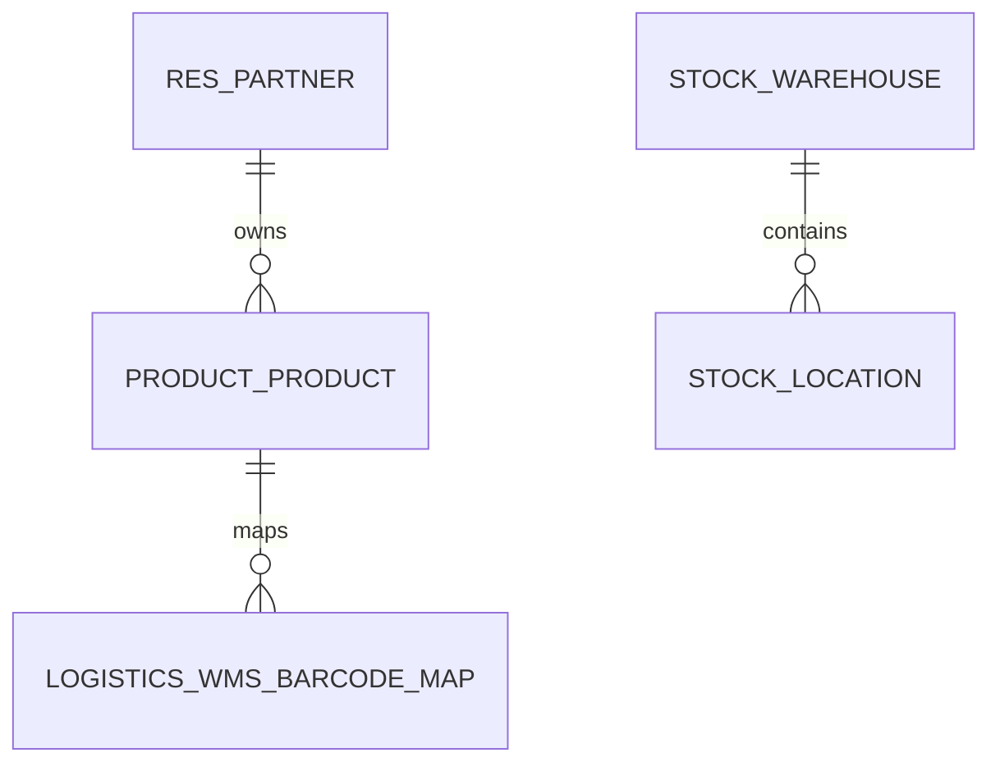
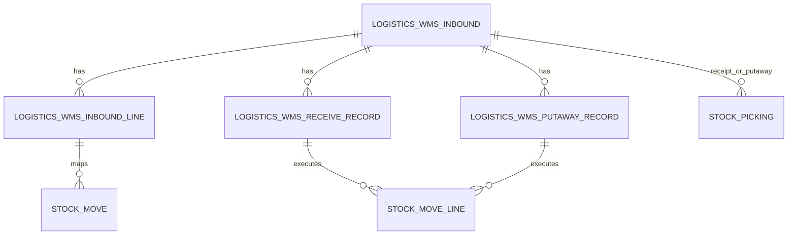
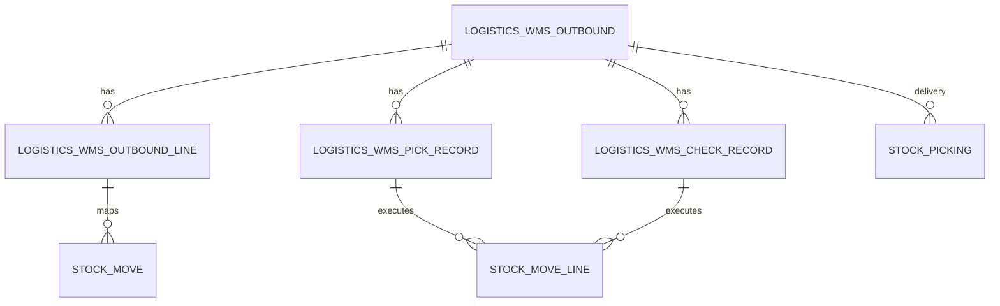
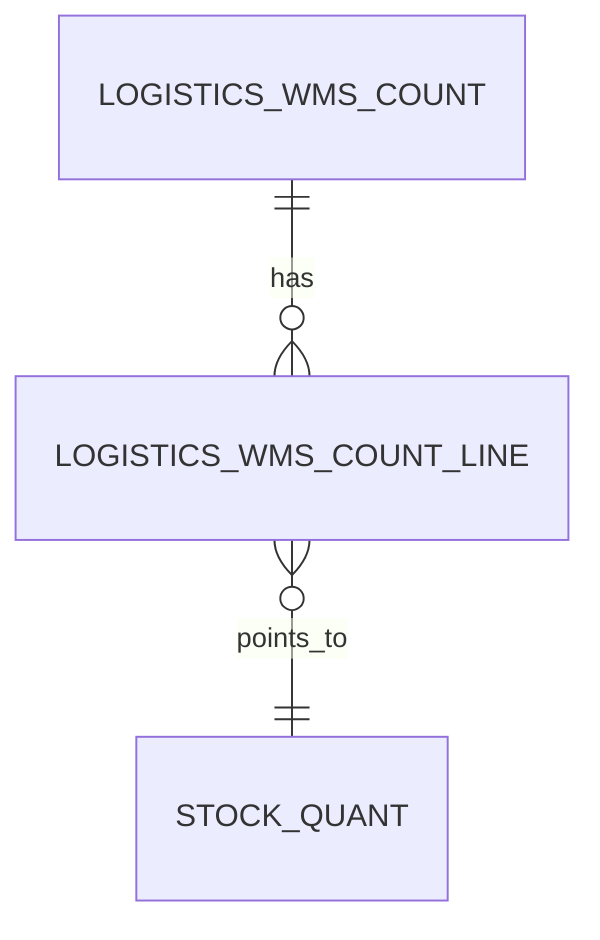
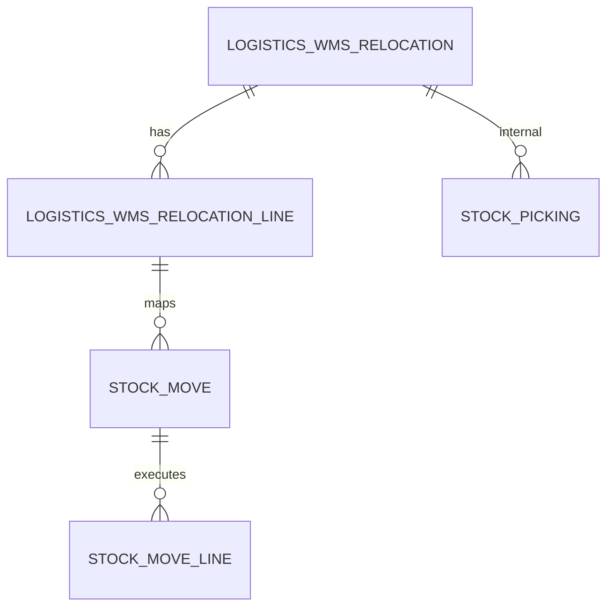
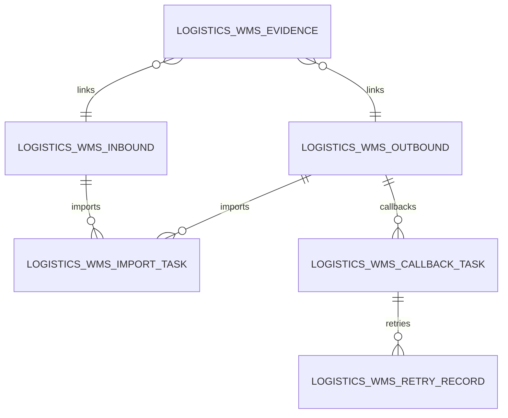
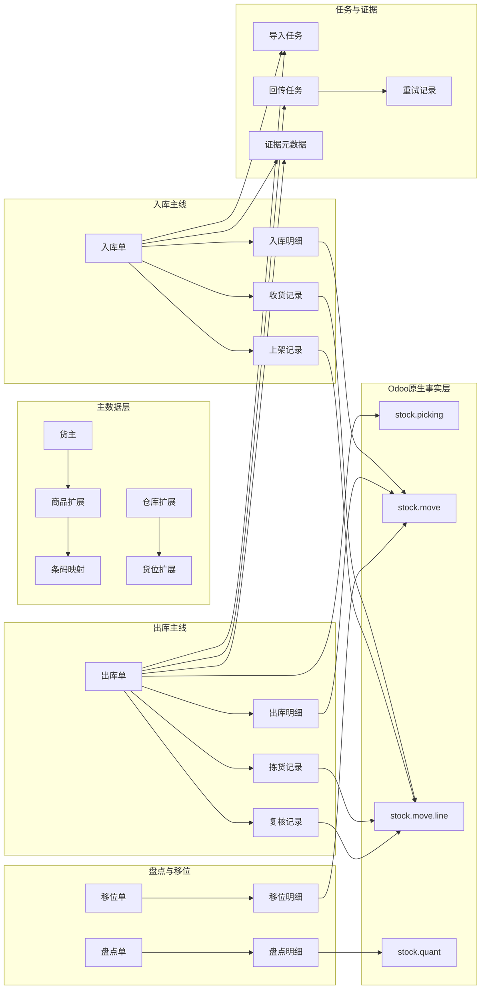

# 数据库 ER 关系图图形版草稿 v0.1（最终校正版）

## 版本信息

- 文档名称：数据库 ER 关系图图形版草稿
- 当前版本：`v0.1`
- 当前阶段：正式 ER 图前的图形草稿最终校正版
- 所属专题：仓管模块 / 跨模块规范 / 接口与数据
- 当前用途：
  - 作为 [数据库设计规范草稿](./01_数据库设计规范草稿.md) 的图形版配套稿
  - 用于在正式 ER 图工具建模前，先稳定一期对象关系主链
  - 用于后续 draw.io / ProcessOn / Mermaid 图继续升级时的统一入口
  - 作为当前 ER 图专题 `v0.1` 的最终校正版基线

## 目录索引

- `1. 文档定位`
- `2. 使用边界`
- `3. 图形版草稿阅读顺序`
- `4. 主数据关系图`
- `5. 入库主链关系图`
- `6. 出库主链关系图`
- `7. 盘点主链关系图`
- `8. 移位主链关系图`
- `9. 任务与证据关系图`
- `10. 一期总览关系图`
- `11. 图形版关系图与字段关系总表之间的双向编号索引`
  - `11.1 行级编号规则`
  - `11.2 行级编号对照表`
  - `11.3 行级编号到正式 ER 图节点编号的继续映射`
  - `11.4 行级编号到节点编号的当前映射示例`
  - `11.5 正式 ER 图节点编号到图形工具节点 ID 的映射建议`
  - `11.6 节点编号到图形工具节点 ID 的当前映射示例`
  - `11.7 图形工具节点 ID 到正式图页签 / 图层的映射建议`
  - `11.8 图形工具节点 ID 到页签 / 图层的当前映射示例`
  - `11.9 页签 / 图层到正式图模板文件的映射建议`
  - `11.10 页签 / 图层到正式图模板文件的当前映射示例`
  - `11.11 图模板文件到评审稿 / 输出稿命名规范`
  - `11.12 图模板文件到评审稿 / 输出稿的当前示例`
  - `11.13 图模板文件到实际存放目录 / 归档目录的映射建议`
  - `11.14 图模板文件到实际存放目录 / 归档目录的当前示例`
  - `11.15 图模板文件到实际发布包目录 / 提交包目录的映射建议`
  - `11.16 图模板文件到实际发布包目录 / 提交包目录的当前示例`
  - `11.17 提交包 / 发布包目录到最终归档版本号策略的映射建议`
  - `11.18 提交包 / 发布包目录到最终归档版本号策略的当前示例`
  - `11.19 最终归档版本号策略到正式图库索引的映射建议`
  - `11.20 最终归档版本号策略到归档目录命名规则的映射建议`
  - `11.21 正式图库索引到版本生效清单的映射建议`
  - `11.22 正式图库索引到图库目录树的映射建议`
  - `11.23 版本生效清单到图库发布流程 / 生效切换清单的映射建议`
  - `11.24 版本生效、生效切换与图库发布衔接时的当前统一建议`
  - `11.25 图库发布流程 / 生效切换清单到回退发布 / 失效切换清单的映射建议`
  - `11.26 图库发布、切换、回退与失效衔接时的当前统一建议`
  - `11.27 回退发布 / 失效切换清单到重新启用清单 / 二次生效清单的映射建议`
  - `11.28 回退、失效、重新启用与二次生效衔接时的当前统一建议`
  - `11.29 重新启用清单 / 二次生效清单到正式关闭清单 / 稳定版冻结清单的映射建议`
  - `11.30 重新启用、二次生效、正式关闭与稳定版冻结衔接时的当前统一建议`
  - `11.31 稳定版冻结清单到长期归档基线 / 下一轮版本解冻清单的映射建议`
  - `11.32 稳定版冻结、长期归档与下一轮解冻衔接时的当前统一建议`
  - `11.33 下一轮版本解冻清单到新周期评审清单 / 新一轮图库草稿基线的映射建议`
  - `11.34 下一轮版本解冻、新周期评审与新一轮图库草稿基线衔接时的当前统一建议`
  - `11.35 新一轮图库草稿基线到下一轮正式图模板 / 正式图库索引重建清单的映射建议`
  - `11.36 新一轮图库草稿、正式图模板与图库索引重建衔接时的当前统一建议`
  - `11.37 正式图库索引重建清单到下一轮生效清单 / 发布确认清单的映射建议`
  - `11.38 索引重建、下一轮生效与发布确认衔接时的当前统一建议`
  - `11.39 发布确认清单到下一轮稳定版冻结清单 / 周期归档确认清单的映射建议`
  - `11.40 发布确认、稳定冻结与周期归档确认衔接时的当前统一建议`
  - `11.41 周期归档确认清单到长期图库基线确认清单 / 下轮归档起点清单的映射建议`
  - `11.42 周期归档确认、长期图库基线确认与下轮归档起点衔接时的当前统一建议`
  - `11.43 下轮归档起点清单到长期图库新周期基线 / 下轮图模板起始清单的映射建议`
  - `11.44 下轮归档起点、长期图库新周期基线与下轮图模板起始衔接时的当前统一建议`
  - `11.45 下轮图模板起始清单到正式图模板首轮基线 / 首轮评审清单的映射建议`
  - `11.46 下轮图模板起始、正式图模板首轮基线与首轮评审衔接时的当前统一建议`
  - `11.47 首轮评审清单到首轮评审结论确认清单 / 首轮模板修订清单的映射建议`
  - `11.48 首轮评审、评审结论确认与模板修订衔接时的当前统一建议`
  - `11.49 首轮模板修订清单到首轮修订后再评审清单 / 首轮模板定稿清单的映射建议`
  - `11.50 首轮模板修订、再评审与模板定稿衔接时的当前统一建议`
  - `11.51 首轮模板定稿清单到首轮正式发布模板清单 / 首轮归档模板清单的映射建议`
  - `11.52 首轮模板定稿、正式发布与归档模板衔接时的当前统一建议`
  - `11.53 首轮归档模板清单到首轮稳定版模板基线清单 / 二轮模板起始清单的映射建议`
  - `11.54 首轮归档、稳定版模板基线与二轮模板起始衔接时的当前统一建议`
  - `11.55 首轮稳定版模板基线清单到二轮正式模板基线清单 / 二轮首轮评审清单的映射建议`
  - `11.56 首轮稳定版模板基线、二轮正式模板基线与二轮首轮评审衔接时的当前统一建议`
  - `11.57 二轮首轮评审清单到二轮评审结论确认清单 / 二轮模板修订清单的映射建议`
  - `11.58 二轮首轮评审、评审结论确认与二轮模板修订衔接时的当前统一建议`
  - `11.59 二轮模板修订清单到二轮修订后再评审清单 / 二轮模板定稿清单的映射建议`
  - `11.60 二轮模板修订、再评审与二轮模板定稿衔接时的当前统一建议`
  - `11.61 二轮模板定稿清单到二轮正式发布模板清单 / 二轮归档模板清单的映射建议`
  - `11.62 二轮模板定稿、正式发布与归档模板衔接时的当前统一建议`
  - `11.63 二轮归档模板清单到二轮稳定版模板基线清单 / 三轮模板起始清单的映射建议`
  - `11.64 二轮归档、稳定版模板基线与三轮模板起始衔接时的当前统一建议`
  - `11.65 三轮模板起始清单到三轮正式模板基线清单 / 三轮首轮评审清单的映射建议`
  - `11.66 三轮模板起始、三轮正式模板基线与三轮首轮评审衔接时的当前统一建议`
  - `11.67 三轮首轮评审清单到三轮评审结论确认清单 / 三轮模板修订清单的映射建议`
  - `11.68 三轮首轮评审、评审结论确认与三轮模板修订衔接时的当前统一建议`
- `12. 当前不建议的一期画法`
- `13. v0.1 收口与后续补充方向`

## 章节总览

这份 `v0.1` 当前可以按 3 条主线来读：

### A. 先看局部主链怎么连
对应章节：
- `4. 主数据关系图`
- `5. 入库主链关系图`
- `6. 出库主链关系图`
- `7. 盘点主链关系图`
- `8. 移位主链关系图`
- `9. 任务与证据关系图`

这组章节主要回答：
- 每一条业务主链的对象关系怎么连
- 哪些对象是主单，哪些是明细、执行记录、原生事实层

### B. 再看一期总图怎么收
对应章节：
- `10. 一期总览关系图`

这组章节主要回答：
- 一期整体对象图应该如何合并
- 主数据、主单、执行记录、任务与证据在总图中的相对位置

### C. 最后看边界与后续升级方向
对应章节：
- `11. 图形版关系图与字段关系总表之间的双向编号索引`
  - `11.1 行级编号规则`
  - `11.2 行级编号对照表`
  - `11.3 行级编号到正式 ER 图节点编号的继续映射`
  - `11.4 行级编号到节点编号的当前映射示例`
  - `11.5 正式 ER 图节点编号到图形工具节点 ID 的映射建议`
  - `11.6 节点编号到图形工具节点 ID 的当前映射示例`
  - `11.7 图形工具节点 ID 到正式图页签 / 图层的映射建议`
  - `11.8 图形工具节点 ID 到页签 / 图层的当前映射示例`
  - `11.9 页签 / 图层到正式图模板文件的映射建议`
  - `11.10 页签 / 图层到正式图模板文件的当前映射示例`
  - `11.11 图模板文件到评审稿 / 输出稿命名规范`
  - `11.12 图模板文件到评审稿 / 输出稿的当前示例`
  - `11.13 图模板文件到实际存放目录 / 归档目录的映射建议`
  - `11.14 图模板文件到实际存放目录 / 归档目录的当前示例`
  - `11.15 图模板文件到实际发布包目录 / 提交包目录的映射建议`
  - `11.16 图模板文件到实际发布包目录 / 提交包目录的当前示例`
  - `11.17 提交包 / 发布包目录到最终归档版本号策略的映射建议`
  - `11.18 提交包 / 发布包目录到最终归档版本号策略的当前示例`
  - `11.19 最终归档版本号策略到正式图库索引的映射建议`
  - `11.20 最终归档版本号策略到归档目录命名规则的映射建议`
  - `11.21 正式图库索引到版本生效清单的映射建议`
  - `11.22 正式图库索引到图库目录树的映射建议`
  - `11.23 版本生效清单到图库发布流程 / 生效切换清单的映射建议`
  - `11.24 版本生效、生效切换与图库发布衔接时的当前统一建议`
  - `11.25 图库发布流程 / 生效切换清单到回退发布 / 失效切换清单的映射建议`
  - `11.26 图库发布、切换、回退与失效衔接时的当前统一建议`
  - `11.27 回退发布 / 失效切换清单到重新启用清单 / 二次生效清单的映射建议`
  - `11.28 回退、失效、重新启用与二次生效衔接时的当前统一建议`
  - `11.29 重新启用清单 / 二次生效清单到正式关闭清单 / 稳定版冻结清单的映射建议`
  - `11.30 重新启用、二次生效、正式关闭与稳定版冻结衔接时的当前统一建议`
  - `11.31 稳定版冻结清单到长期归档基线 / 下一轮版本解冻清单的映射建议`
  - `11.32 稳定版冻结、长期归档与下一轮解冻衔接时的当前统一建议`
  - `11.33 下一轮版本解冻清单到新周期评审清单 / 新一轮图库草稿基线的映射建议`
  - `11.34 下一轮版本解冻、新周期评审与新一轮图库草稿基线衔接时的当前统一建议`
  - `11.35 新一轮图库草稿基线到下一轮正式图模板 / 正式图库索引重建清单的映射建议`
  - `11.36 新一轮图库草稿、正式图模板与图库索引重建衔接时的当前统一建议`
  - `11.37 正式图库索引重建清单到下一轮生效清单 / 发布确认清单的映射建议`
  - `11.38 索引重建、下一轮生效与发布确认衔接时的当前统一建议`
  - `11.39 发布确认清单到下一轮稳定版冻结清单 / 周期归档确认清单的映射建议`
  - `11.40 发布确认、稳定冻结与周期归档确认衔接时的当前统一建议`
  - `11.41 周期归档确认清单到长期图库基线确认清单 / 下轮归档起点清单的映射建议`
  - `11.42 周期归档确认、长期图库基线确认与下轮归档起点衔接时的当前统一建议`
  - `11.43 下轮归档起点清单到长期图库新周期基线 / 下轮图模板起始清单的映射建议`
  - `11.44 下轮归档起点、长期图库新周期基线与下轮图模板起始衔接时的当前统一建议`
  - `11.45 下轮图模板起始清单到正式图模板首轮基线 / 首轮评审清单的映射建议`
  - `11.46 下轮图模板起始、正式图模板首轮基线与首轮评审衔接时的当前统一建议`
  - `11.47 首轮评审清单到首轮评审结论确认清单 / 首轮模板修订清单的映射建议`
  - `11.48 首轮评审、评审结论确认与模板修订衔接时的当前统一建议`
  - `11.49 首轮模板修订清单到首轮修订后再评审清单 / 首轮模板定稿清单的映射建议`
  - `11.50 首轮模板修订、再评审与模板定稿衔接时的当前统一建议`
  - `11.51 首轮模板定稿清单到首轮正式发布模板清单 / 首轮归档模板清单的映射建议`
  - `11.52 首轮模板定稿、正式发布与归档模板衔接时的当前统一建议`
  - `11.53 首轮归档模板清单到首轮稳定版模板基线清单 / 二轮模板起始清单的映射建议`
  - `11.54 首轮归档、稳定版模板基线与二轮模板起始衔接时的当前统一建议`
  - `11.55 首轮稳定版模板基线清单到二轮正式模板基线清单 / 二轮首轮评审清单的映射建议`
  - `11.56 首轮稳定版模板基线、二轮正式模板基线与二轮首轮评审衔接时的当前统一建议`
  - `11.57 二轮首轮评审清单到二轮评审结论确认清单 / 二轮模板修订清单的映射建议`
  - `11.58 二轮首轮评审、评审结论确认与二轮模板修订衔接时的当前统一建议`
  - `11.59 二轮模板修订清单到二轮修订后再评审清单 / 二轮模板定稿清单的映射建议`
  - `11.60 二轮模板修订、再评审与二轮模板定稿衔接时的当前统一建议`
  - `11.61 二轮模板定稿清单到二轮正式发布模板清单 / 二轮归档模板清单的映射建议`
  - `11.62 二轮模板定稿、正式发布与归档模板衔接时的当前统一建议`
  - `11.63 二轮归档模板清单到二轮稳定版模板基线清单 / 三轮模板起始清单的映射建议`
  - `11.64 二轮归档、稳定版模板基线与三轮模板起始衔接时的当前统一建议`
  - `11.65 三轮模板起始清单到三轮正式模板基线清单 / 三轮首轮评审清单的映射建议`
  - `11.66 三轮模板起始、三轮正式模板基线与三轮首轮评审衔接时的当前统一建议`
  - `11.67 三轮首轮评审清单到三轮评审结论确认清单 / 三轮模板修订清单的映射建议`
  - `11.68 三轮首轮评审、评审结论确认与三轮模板修订衔接时的当前统一建议`
- `12. 当前不建议的一期画法`
- `13. v0.1 收口与后续补充方向`

这组章节主要回答：
- 一期图不要画得多重
- 后续从图形草稿升级到正式 ER 图时还应补什么

当前建议按下面顺序阅读：
1. 先看 `1` 到 `3`，明确这份图稿的用途和边界
2. 再看 `4` 到 `9`，分别理解每条主链
3. 然后看 `10` 到 `11`，理解一期总图如何收以及如何和字段关系总表对号
4. 最后看 `12` 到 `13`，明确当前边界和后续升级方向

## 1. 文档定位

这份图形版草稿不是替代数据库设计规范正文，而是它的图形配套稿。  
正文负责：
- 字段
- 约束
- 落表
- 三层实现映射

这份图稿负责：
- 把对象关系压成更直观的图形主链
- 让后续正式 ER 图绘制前先有一版稳定结构

## 2. 使用边界

当前纳入图形稿范围：
- 主数据对象
- 四类主单及明细
- 执行记录
- `stock` 原生事实层关键对象
- 任务对象
- 证据元数据对象

当前不纳入图形稿范围：
- 每个对象的全部字段
- 所有索引与唯一约束
- 二进制对象存储细节
- 过细的前端组件关系

## 3. 图形版草稿阅读顺序

当前更推荐先按“主数据 -> 主单主链 -> 原生事实层 -> 任务与证据”这个顺序读图。

## 4. 主数据关系图

说明：
- `RES_PARTNER` 在这里指承载货主语义的原生伙伴底座
- `PRODUCT_PRODUCT` 指商品/SKU底座及其仓管扩展
- `LOGISTICS_WMS_BARCODE_MAP` 指条码映射业务对象

## 5. 入库主链关系图

## 6. 出库主链关系图

## 7. 盘点主链关系图

说明：
- 盘点明细引用理论库存对象
- 差异结果建议继续留在盘点明细或调整结果字段层，不单独拉太多外围对象

## 8. 移位主链关系图

## 9. 任务与证据关系图

说明：
- 证据元数据实际是多态挂载，这里图形稿只画出主单级典型关系
- 执行记录级挂载后续可在正式 ER 图中再补

## 10. 一期总览关系图

## 11. 图形版关系图与字段关系总表之间的双向编号索引

当前建议图形版草稿与数据库规范稿先统一使用下面这组编号：

| 编号 | 图形版位置 | 数据库稿位置 | 当前说明 |
|---|---|---|---|
| `R-01` | `4. 主数据关系图` | `22.1` `22.7-A` `22.9` | 主数据主链 |
| `R-02` | `5. 入库主链关系图` | `22.2` `22.3` `22.4` `22.5` `22.7-B` `22.9` | 入库主链 |
| `R-03` | `6. 出库主链关系图` | `22.2` `22.3` `22.4` `22.5` `22.7-C` `22.9` | 出库主链 |
| `R-04` | `7. 盘点主链关系图` | `22.2` `22.3` `22.7-D` `22.9` | 盘点主链 |
| `R-05` | `8. 移位主链关系图` | `22.2` `22.3` `22.5` `22.7-E` `22.9` | 移位主链 |
| `R-06` | `9. 任务与证据关系图` | `22.6` `22.7-F` `22.9` | 任务与证据主链 |
| `R-07` | `10. 一期总览关系图` | `21` `22.7` `22.8` `22.9` | 一期总览图 |

当前建议后续继续补图时，始终保留 `R-xx` 编号，不另起一套图号。

### 11.1 行级编号规则

当前建议图稿继续细化到行级时，统一使用：

`R-主链编号-行号`

例如：
- `R-02-01`：入库单 -> 入库明细
- `R-02-02`：入库明细 -> stock.move
- `R-03-04`：拣货记录 -> stock.move.line
- `R-06-03`：业务主单 / 执行记录 -> 证据元数据

### 11.2 行级编号对照表

| 行级编号 | 图稿关系 | 数据库稿位置 |
|---|---|---|
| `R-01-01` | 货主 -> 商品扩展 | `22.1` |
| `R-01-02` | 商品扩展 -> 条码映射 | `22.1` |
| `R-01-03` | 仓库 -> 货位扩展 | `22.1` |
| `R-02-01` | 入库单 -> 入库明细 | `22.3` `22.9` |
| `R-02-02` | 入库明细 -> stock.move | `22.5` `22.9` |
| `R-02-03` | 入库单 -> 收货记录 | `22.4` `22.7-B` |
| `R-02-04` | 收货记录 -> stock.move.line | `22.5` |
| `R-02-05` | 入库单 -> 上架记录 | `22.4` `22.7-B` |
| `R-03-01` | 出库单 -> 出库明细 | `22.3` `22.9` |
| `R-03-02` | 出库明细 -> stock.move | `22.5` `22.9` |
| `R-03-03` | 出库单 -> 拣货记录 | `22.4` `22.7-C` |
| `R-03-04` | 拣货记录 -> stock.move.line | `22.5` |
| `R-03-05` | 出库单 -> 复核记录 | `22.4` `22.7-C` |
| `R-04-01` | 盘点单 -> 盘点明细 | `22.3` `22.9` |
| `R-04-02` | 盘点明细 -> stock.quant | `22.9` |
| `R-05-01` | 移位单 -> 移位明细 | `22.3` `22.9` |
| `R-05-02` | 移位明细 -> stock.move | `22.5` `22.9` |
| `R-05-03` | 移位单 -> stock.picking(internal) | `22.5` `22.7-E` |
| `R-06-01` | 业务主单 -> 导入任务 | `22.6` `22.7-F` |
| `R-06-02` | 回传任务 -> 重试记录 | `22.6` `22.9` |
| `R-06-03` | 业务主单 / 执行记录 -> 证据元数据 | `22.6` `22.7-F` |

### 11.3 行级编号到正式 ER 图节点编号的继续映射

当前建议后续升级到正式 ER 图时，节点编号统一采用：

`N-对象分类-序号`

例如：
- `N-MD-01`：货主
- `N-MD-02`：商品扩展
- `N-IN-01`：入库单
- `N-OU-01`：出库单
- `N-IV-01`：盘点单
- `N-RL-01`：移位单
- `N-ST-01`：`stock.picking`
- `N-TK-01`：导入任务
- `N-EV-01`：证据元数据

当前推荐对象分类前缀：
- `MD`：主数据
- `IN`：入库主链
- `OU`：出库主链
- `IV`：盘点主链
- `RL`：移位主链
- `ST`：原生事实层
- `TK`：任务对象
- `EV`：证据对象

### 11.4 行级编号到节点编号的当前映射示例

| 行级编号 | 关系说明 | 建议节点编号组合 |
|---|---|---|
| `R-01-01` | 货主 -> 商品扩展 | `N-MD-01 -> N-MD-02` |
| `R-01-02` | 商品扩展 -> 条码映射 | `N-MD-02 -> N-MD-03` |
| `R-01-03` | 仓库 -> 货位扩展 | `N-MD-04 -> N-MD-05` |
| `R-02-01` | 入库单 -> 入库明细 | `N-IN-01 -> N-IN-02` |
| `R-02-02` | 入库明细 -> stock.move | `N-IN-02 -> N-ST-02` |
| `R-02-03` | 入库单 -> 收货记录 | `N-IN-01 -> N-IN-03` |
| `R-02-04` | 收货记录 -> stock.move.line | `N-IN-03 -> N-ST-03` |
| `R-02-05` | 入库单 -> 上架记录 | `N-IN-01 -> N-IN-04` |
| `R-03-01` | 出库单 -> 出库明细 | `N-OU-01 -> N-OU-02` |
| `R-03-02` | 出库明细 -> stock.move | `N-OU-02 -> N-ST-02` |
| `R-03-03` | 出库单 -> 拣货记录 | `N-OU-01 -> N-OU-03` |
| `R-03-04` | 拣货记录 -> stock.move.line | `N-OU-03 -> N-ST-03` |
| `R-03-05` | 出库单 -> 复核记录 | `N-OU-01 -> N-OU-04` |
| `R-04-01` | 盘点单 -> 盘点明细 | `N-IV-01 -> N-IV-02` |
| `R-04-02` | 盘点明细 -> stock.quant | `N-IV-02 -> N-ST-04` |
| `R-05-01` | 移位单 -> 移位明细 | `N-RL-01 -> N-RL-02` |
| `R-05-02` | 移位明细 -> stock.move | `N-RL-02 -> N-ST-02` |
| `R-05-03` | 移位单 -> stock.picking(internal) | `N-RL-01 -> N-ST-01` |
| `R-06-01` | 业务主单 -> 导入任务 | `N-IN-01 / N-OU-01 -> N-TK-01` |
| `R-06-02` | 回传任务 -> 重试记录 | `N-TK-02 -> N-TK-03` |
| `R-06-03` | 业务主单 / 执行记录 -> 证据元数据 | `业务节点 -> N-EV-01` |

### 11.5 正式 ER 图节点编号到图形工具节点 ID 的映射建议

当前建议在正式进入 draw.io / ProcessOn / Mermaid 深化版时，再增加一层工具节点 ID：

`G-区域-序号`

例如：
- `G-MD-01`
- `G-IN-01`
- `G-OU-01`
- `G-IV-01`
- `G-RL-01`
- `G-ST-01`
- `G-TK-01`
- `G-EV-01`

建议对应口径：
- `N-*` 负责业务语义编号
- `G-*` 负责图形工具内部节点编号

### 11.6 节点编号到图形工具节点 ID 的当前映射示例

| 节点编号 | 对象 | 建议图形工具节点 ID |
|---|---|---|
| `N-MD-01` | 货主 | `G-MD-01` |
| `N-MD-02` | 商品扩展 | `G-MD-02` |
| `N-MD-03` | 条码映射 | `G-MD-03` |
| `N-MD-04` | 仓库扩展 | `G-MD-04` |
| `N-MD-05` | 货位扩展 | `G-MD-05` |
| `N-IN-01` | 入库单 | `G-IN-01` |
| `N-IN-02` | 入库明细 | `G-IN-02` |
| `N-IN-03` | 收货记录 | `G-IN-03` |
| `N-IN-04` | 上架记录 | `G-IN-04` |
| `N-OU-01` | 出库单 | `G-OU-01` |
| `N-OU-02` | 出库明细 | `G-OU-02` |
| `N-OU-03` | 拣货记录 | `G-OU-03` |
| `N-OU-04` | 复核记录 | `G-OU-04` |
| `N-IV-01` | 盘点单 | `G-IV-01` |
| `N-IV-02` | 盘点明细 | `G-IV-02` |
| `N-RL-01` | 移位单 | `G-RL-01` |
| `N-RL-02` | 移位明细 | `G-RL-02` |
| `N-ST-01` | `stock.picking` | `G-ST-01` |
| `N-ST-02` | `stock.move` | `G-ST-02` |
| `N-ST-03` | `stock.move.line` | `G-ST-03` |
| `N-ST-04` | `stock.quant` | `G-ST-04` |
| `N-TK-01` | 导入任务 | `G-TK-01` |
| `N-TK-02` | 回传任务 | `G-TK-02` |
| `N-TK-03` | 重试记录 | `G-TK-03` |
| `N-EV-01` | 证据元数据 | `G-EV-01` |

### 11.7 图形工具节点 ID 到正式图页签 / 图层的映射建议

当前建议正式图稿至少拆成下面这些页签或图层：

| 页签 / 图层编号 | 主题 | 推荐承载对象 |
|---|---|---|
| `P-01` | 主数据层 | `G-MD-*` |
| `P-02` | 入库主链 | `G-IN-*` + 必要的 `G-ST-*` |
| `P-03` | 出库主链 | `G-OU-*` + 必要的 `G-ST-*` |
| `P-04` | 盘点与移位 | `G-IV-*` `G-RL-*` + 必要的 `G-ST-*` |
| `P-05` | 任务与证据 | `G-TK-*` `G-EV-*` |
| `P-06` | 一期总览图 | 关键主链节点的总览组合 |

### 11.8 图形工具节点 ID 到页签 / 图层的当前映射示例

| 图形工具节点 ID | 对象 | 建议页签 / 图层 |
|---|---|---|
| `G-MD-01` | 货主 | `P-01` |
| `G-MD-02` | 商品扩展 | `P-01` |
| `G-MD-03` | 条码映射 | `P-01` |
| `G-MD-04` | 仓库扩展 | `P-01` |
| `G-MD-05` | 货位扩展 | `P-01` |
| `G-IN-01` | 入库单 | `P-02` |
| `G-IN-02` | 入库明细 | `P-02` |
| `G-IN-03` | 收货记录 | `P-02` |
| `G-IN-04` | 上架记录 | `P-02` |
| `G-OU-01` | 出库单 | `P-03` |
| `G-OU-02` | 出库明细 | `P-03` |
| `G-OU-03` | 拣货记录 | `P-03` |
| `G-OU-04` | 复核记录 | `P-03` |
| `G-IV-01` | 盘点单 | `P-04` |
| `G-IV-02` | 盘点明细 | `P-04` |
| `G-RL-01` | 移位单 | `P-04` |
| `G-RL-02` | 移位明细 | `P-04` |
| `G-ST-01` | `stock.picking` | `P-02` / `P-03` / `P-04` |
| `G-ST-02` | `stock.move` | `P-02` / `P-03` / `P-04` |
| `G-ST-03` | `stock.move.line` | `P-02` / `P-03` / `P-04` |
| `G-ST-04` | `stock.quant` | `P-04` |
| `G-TK-01` | 导入任务 | `P-05` |
| `G-TK-02` | 回传任务 | `P-05` |
| `G-TK-03` | 重试记录 | `P-05` |
| `G-EV-01` | 证据元数据 | `P-05` |

### 11.9 页签 / 图层到正式图模板文件的映射建议

当前建议正式图模板文件先按下面这组口径组织：

| 页签 / 图层编号 | 当前主题 | 建议正式图模板文件 | 当前说明 |
|---|---|---|---|
| `P-01` | 主数据层 | `db_er_p01_masterdata.drawio` | 主数据主链单独成图，避免和主单主链混在一起 |
| `P-02` | 入库主链 | `db_er_p02_inbound.drawio` | 入库主单、明细、收货、上架与 `stock` 的关系主图 |
| `P-03` | 出库主链 | `db_er_p03_outbound.drawio` | 出库主单、明细、拣货、复核与 `stock` 的关系主图 |
| `P-04` | 盘点与移位 | `db_er_p04_inventory_ops.drawio` | 盘点与移位共用一张库内作业关系图 |
| `P-05` | 任务与证据 | `db_er_p05_tasks_evidence.drawio` | 导入、回传、重试、证据元数据关系图 |
| `P-06` | 一期总览图 | `db_er_p06_overview.drawio` | 面向评审和总览的聚合图 |

### 11.10 页签 / 图层到正式图模板文件的当前映射示例

| 页签 / 图层 | 当前建议模板文件 | 当前建议包含节点 / 图层 |
|---|---|---|
| `P-01` | `db_er_p01_masterdata.drawio` | `G-MD-*` |
| `P-02` | `db_er_p02_inbound.drawio` | `G-IN-*` + 相关 `G-ST-*` |
| `P-03` | `db_er_p03_outbound.drawio` | `G-OU-*` + 相关 `G-ST-*` |
| `P-04` | `db_er_p04_inventory_ops.drawio` | `G-IV-*` `G-RL-*` + 相关 `G-ST-*` |
| `P-05` | `db_er_p05_tasks_evidence.drawio` | `G-TK-*` `G-EV-*` |
| `P-06` | `db_er_p06_overview.drawio` | 各主链关键节点汇总 |

### 11.11 图模板文件到评审稿 / 输出稿命名规范

当前建议正式图文件继续分成下面两类：

| 文件类型 | 当前建议命名模式 | 当前说明 |
|---|---|---|
| 图模板文件 | `db_er_pXX_<topic>.drawio` | 用于持续编辑的源文件 |
| 评审稿导出文件 | `review_db_er_pXX_<topic>_v0_1.<ext>` | 面向评审流转，带版本号 |
| 对外输出文件 | `publish_db_er_pXX_<topic>_v0_1.<ext>` | 面向归档、交付或展示 |

当前建议：

1. 模板文件保留短名，不带评审词和版本号
2. 评审稿与输出稿再补 `review_` / `publish_` 前缀和版本号
3. 同一页签的不同导出格式保持同名主干，例如 `.png` / `.pdf` / `.svg`

### 11.12 图模板文件到评审稿 / 输出稿的当前示例

| 模板文件 | 当前建议评审稿 | 当前建议输出稿 |
|---|---|---|
| `db_er_p01_masterdata.drawio` | `review_db_er_p01_masterdata_v0_1.pdf` | `publish_db_er_p01_masterdata_v0_1.svg` |
| `db_er_p02_inbound.drawio` | `review_db_er_p02_inbound_v0_1.pdf` | `publish_db_er_p02_inbound_v0_1.svg` |
| `db_er_p03_outbound.drawio` | `review_db_er_p03_outbound_v0_1.pdf` | `publish_db_er_p03_outbound_v0_1.svg` |
| `db_er_p04_inventory_ops.drawio` | `review_db_er_p04_inventory_ops_v0_1.pdf` | `publish_db_er_p04_inventory_ops_v0_1.svg` |
| `db_er_p05_tasks_evidence.drawio` | `review_db_er_p05_tasks_evidence_v0_1.pdf` | `publish_db_er_p05_tasks_evidence_v0_1.svg` |
| `db_er_p06_overview.drawio` | `review_db_er_p06_overview_v0_1.pdf` | `publish_db_er_p06_overview_v0_1.svg` |

### 11.13 图模板文件到实际存放目录 / 归档目录的映射建议

当前建议图稿文件继续按下面这组目录分层存放：

| 文件类型 | 当前建议目录 | 当前说明 |
|---|---|---|
| 图模板源文件 | `专题设计/仓管设计/02_跨模块规范/04_接口与数据/图稿源文件/` | 持续编辑的 `.drawio` 源文件 |
| 评审稿导出文件 | `专题设计/仓管设计/05_提交包/评审稿/数据库图/` | 面向评审流转的 `.pdf` / `.png` 文件 |
| 输出稿归档文件 | `专题设计/仓管设计/05_提交包/归档稿/数据库图/` | 面向归档和交付的最终输出文件 |

当前建议：

1. 模板源文件和导出文件不要混放
2. 评审稿允许覆盖同版本导出，但归档稿应保留稳定版本副本
3. 若后续建立正式图库，可继续在归档目录下按 `v0.1 / v0.2` 分层

### 11.14 图模板文件到实际存放目录 / 归档目录的当前示例

| 模板文件 | 当前建议源文件目录 | 当前建议评审稿目录 | 当前建议归档目录 |
|---|---|---|---|
| `db_er_p01_masterdata.drawio` | `图稿源文件/` | `评审稿/数据库图/` | `归档稿/数据库图/` |
| `db_er_p02_inbound.drawio` | `图稿源文件/` | `评审稿/数据库图/` | `归档稿/数据库图/` |
| `db_er_p03_outbound.drawio` | `图稿源文件/` | `评审稿/数据库图/` | `归档稿/数据库图/` |
| `db_er_p04_inventory_ops.drawio` | `图稿源文件/` | `评审稿/数据库图/` | `归档稿/数据库图/` |
| `db_er_p05_tasks_evidence.drawio` | `图稿源文件/` | `评审稿/数据库图/` | `归档稿/数据库图/` |
| `db_er_p06_overview.drawio` | `图稿源文件/` | `评审稿/数据库图/` | `归档稿/数据库图/` |

### 11.15 图模板文件到实际发布包目录 / 提交包目录的映射建议

当前建议继续把图文件向下面这两类目录映射：

| 文件类型 | 当前建议目录 | 当前说明 |
|---|---|---|
| 发布包目录 | `专题设计/仓管设计/05_提交包/发布包/数据库图/` | 面向正式发布、交付或上线包的图文件目录 |
| 提交包目录 | `专题设计/仓管设计/05_提交包/评审稿/数据库图/` | 面向阶段评审、方案提交和内部流转的图文件目录 |

当前建议：

1. 发布包目录优先放最终确认的输出稿，不放持续编辑源文件
2. 提交包目录优先放评审稿和阶段性导出件，便于讨论和留痕
3. 同一页签在提交包与发布包中应保持同一主干文件名，便于比对

### 11.16 图模板文件到实际发布包目录 / 提交包目录的当前示例

| 模板文件 | 当前建议提交包文件 | 当前建议发布包文件 |
|---|---|---|
| `db_er_p01_masterdata.drawio` | `05_提交包/评审稿/数据库图/review_db_er_p01_masterdata_v0_1.pdf` | `05_提交包/发布包/数据库图/publish_db_er_p01_masterdata_v0_1.svg` |
| `db_er_p02_inbound.drawio` | `05_提交包/评审稿/数据库图/review_db_er_p02_inbound_v0_1.pdf` | `05_提交包/发布包/数据库图/publish_db_er_p02_inbound_v0_1.svg` |
| `db_er_p03_outbound.drawio` | `05_提交包/评审稿/数据库图/review_db_er_p03_outbound_v0_1.pdf` | `05_提交包/发布包/数据库图/publish_db_er_p03_outbound_v0_1.svg` |
| `db_er_p04_inventory_ops.drawio` | `05_提交包/评审稿/数据库图/review_db_er_p04_inventory_ops_v0_1.pdf` | `05_提交包/发布包/数据库图/publish_db_er_p04_inventory_ops_v0_1.svg` |
| `db_er_p05_tasks_evidence.drawio` | `05_提交包/评审稿/数据库图/review_db_er_p05_tasks_evidence_v0_1.pdf` | `05_提交包/发布包/数据库图/publish_db_er_p05_tasks_evidence_v0_1.svg` |
| `db_er_p06_overview.drawio` | `05_提交包/评审稿/数据库图/review_db_er_p06_overview_v0_1.pdf` | `05_提交包/发布包/数据库图/publish_db_er_p06_overview_v0_1.svg` |

### 11.17 提交包 / 发布包目录到最终归档版本号策略的映射建议

当前建议图文件最终归档时采用下面这组版本号策略：

| 目录类型 | 当前建议版本号策略 | 当前说明 |
|---|---|---|
| 提交包目录 | `v0.x` 阶段版本 | 允许在方案迭代期间保留多个阶段评审版本 |
| 发布包目录 | `v1.x` 发布版本 | 面向正式发布、交付或上线包的稳定版本 |
| 归档目录 | `v1.x.y` 归档版本 | 用于保留最终确认的细粒度归档版本 |

当前建议：

1. 提交包目录优先体现方案迭代过程，版本号可更快递增
2. 发布包目录优先体现正式对外版本，不建议和提交包共用同一版本号语义
3. 归档目录优先保留最终交付结果，必要时可以在 `v1.0.1` 这类补丁级版本继续细化

### 11.18 提交包 / 发布包目录到最终归档版本号策略的当前示例

| 阶段 | 当前建议文件示例 | 当前说明 |
|---|---|---|
| 提交包评审稿 | `review_db_er_p02_inbound_v0_3.pdf` | 第三轮内部评审稿 |
| 提交包评审稿 | `review_db_er_p06_overview_v0_4.pdf` | 第四轮总览评审稿 |
| 发布包输出稿 | `publish_db_er_p02_inbound_v1_0.svg` | 第一版正式发布输出稿 |
| 发布包输出稿 | `publish_db_er_p06_overview_v1_0.svg` | 第一版总览正式输出稿 |
| 归档稿 | `archive_db_er_p02_inbound_v1_0_1.svg` | 对正式发布稿的补丁级归档版本 |
| 归档稿 | `archive_db_er_p06_overview_v1_0_1.svg` | 对总览发布稿的补丁级归档版本 |

### 11.19 最终归档版本号策略到正式图库索引的映射建议

当前建议正式图库索引先按下面这组口径组织：

| 索引维度 | 当前建议格式 | 当前说明 |
|---|---|---|
| 图编号主键 | `ER-CAT-PXX-v1.x.y` | 用于图库索引里的稳定唯一主键 |
| 主题分类 | `masterdata / inbound / outbound / inventory / task / overview` | 对应页签主题 |
| 版本列 | `v1.x.y` | 对应最终归档版本号 |
| 来源文件列 | `archive_db_er_pXX_<topic>_v1_x_y.<ext>` | 对应归档稿文件名 |

当前建议：

1. 图库索引优先记录最终归档稿，不直接记录阶段评审稿
2. 图库索引主键应同时体现页签编号和最终归档版本
3. 同一主题可保留多版索引，但应明确当前生效版

### 11.20 最终归档版本号策略到归档目录命名规则的映射建议

当前建议归档目录先按下面这组规则命名：

| 目录层级 | 当前建议命名 | 当前说明 |
|---|---|---|
| 专题目录 | `数据库图` | 固定主题目录 |
| 主题子目录 | `PXX_<topic>` | 对应页签主题目录 |
| 版本子目录 | `v1.x.y` | 对应最终归档版本目录 |

当前建议示例：

- `归档稿/数据库图/P01_masterdata/v1.0.1/`
- `归档稿/数据库图/P02_inbound/v1.0.1/`
- `归档稿/数据库图/P03_outbound/v1.0.1/`
- `归档稿/数据库图/P04_inventory_ops/v1.0.1/`
- `归档稿/数据库图/P05_tasks_evidence/v1.0.1/`
- `归档稿/数据库图/P06_overview/v1.0.1/`

### 11.21 正式图库索引到版本生效清单的映射建议

当前建议在“正式图库索引”之上，再补一层“版本生效清单”，用于明确每个主题当前哪一版是有效版：

| 图库索引主键 | 当前建议版本生效清单编号 | 当前说明 |
|---|---|---|
| `ER-CAT-P01-v1.0.1` | `ACTIVE-P01` | 主数据主题当前有效版 |
| `ER-CAT-P02-v1.0.1` | `ACTIVE-P02` | 入库主题当前有效版 |
| `ER-CAT-P03-v1.0.1` | `ACTIVE-P03` | 出库主题当前有效版 |
| `ER-CAT-P04-v1.0.1` | `ACTIVE-P04` | 盘点与移位主题当前有效版 |
| `ER-CAT-P05-v1.0.1` | `ACTIVE-P05` | 任务与证据主题当前有效版 |
| `ER-CAT-P06-v1.0.1` | `ACTIVE-P06` | 一期总览主题当前有效版 |

当前建议：

1. 每个主题同一时刻只保留一个“当前有效版”
2. 版本生效清单只引用正式图库索引主键，不重复保存图文件本体
3. 新版本生效时，旧版本仍保留在正式图库索引和归档目录中，但在生效清单中标记为失效

### 11.22 正式图库索引到图库目录树的映射建议

当前建议正式图库继续按下面这组目录树组织：

| 层级 | 当前建议目录 | 当前说明 |
|---|---|---|
| 一级目录 | `数据库图/` | 数据库图统一主题目录 |
| 二级目录 | `数据库图/索引/` | 存放正式图库索引与版本生效清单 |
| 二级目录 | `数据库图/模板/` | 存放 draw.io / Mermaid 等模板源文件 |
| 二级目录 | `数据库图/评审稿/` | 存放评审版输出文件 |
| 二级目录 | `数据库图/输出稿/` | 存放正式输出文件 |
| 二级目录 | `数据库图/归档/` | 存放归档版本目录 |
| 三级目录 | `数据库图/归档/P01_masterdata/` | 主数据主题归档目录 |
| 三级目录 | `数据库图/归档/P02_inbound/` | 入库主题归档目录 |
| 三级目录 | `数据库图/归档/P03_outbound/` | 出库主题归档目录 |
| 三级目录 | `数据库图/归档/P04_inventory_ops/` | 盘点与移位主题归档目录 |
| 三级目录 | `数据库图/归档/P05_tasks_evidence/` | 任务与证据主题归档目录 |
| 三级目录 | `数据库图/归档/P06_overview/` | 一期总览主题归档目录 |

当前建议示例：

- `数据库图/索引/graph_index.xlsx`
- `数据库图/索引/effective_versions.xlsx`
- `数据库图/模板/db_er_p01_masterdata.drawio`
- `数据库图/输出稿/publish_db_er_p01_masterdata_v1_0.svg`
- `数据库图/归档/P01_masterdata/v1.0.1/`

### 11.23 版本生效清单到图库发布流程 / 生效切换清单的映射建议

当前建议在“版本生效清单”之上，再补一层“图库发布流程 / 生效切换清单”，用于明确某个版本何时从候选版切到正式有效版：

| 版本生效清单编号 | 当前建议图库发布流程编号 | 当前建议生效切换清单编号 | 当前说明 |
|---|---|---|---|
| `ACTIVE-P01` | `GP-P01` | `SW-P01` | 主数据主题从候选版切到正式有效版 |
| `ACTIVE-P02` | `GP-P02` | `SW-P02` | 入库主题从候选版切到正式有效版 |
| `ACTIVE-P03` | `GP-P03` | `SW-P03` | 出库主题从候选版切到正式有效版 |
| `ACTIVE-P04` | `GP-P04` | `SW-P04` | 盘点与移位主题从候选版切到正式有效版 |
| `ACTIVE-P05` | `GP-P05` | `SW-P05` | 任务与证据主题从候选版切到正式有效版 |
| `ACTIVE-P06` | `GP-P06` | `SW-P06` | 一期总览主题从候选版切到正式有效版 |

当前建议：

1. 图库发布流程优先回答“这个主题版本是否已具备发布条件”
2. 生效切换清单优先回答“哪个版本从候选态切成当前有效态”
3. 发布流程与生效切换应保留时间、责任人、版本主键和回退目标

### 11.24 版本生效、生效切换与图库发布衔接时的当前统一建议

当前更推荐按下面原则衔接版本生效、切换和发布：

1. 正式图库索引记录“有哪些版本”，版本生效清单记录“哪版当前有效”，发布流程记录“为什么能发”，生效切换清单记录“何时切换”
2. 不建议直接在图库索引上修改“当前版本”而不留下发布流程或切换记录
3. 若某次切换失败，应优先沿生效切换清单回退，而不是直接覆盖索引主键
4. 编号建议继续沿 `ACTIVE-Pxx -> GP-Pxx -> SW-Pxx` 方式沉淀，便于从归档、索引、生效到发布形成完整链路

### 11.25 图库发布流程 / 生效切换清单到回退发布 / 失效切换清单的映射建议

当前建议在“图库发布流程 / 生效切换清单”之上，再补一层“回退发布 / 失效切换清单”，用于明确某次发布失败或生效版本需要撤回时怎么落记录：

| 发布 / 切换编号 | 当前建议回退发布清单编号 | 当前建议失效切换清单编号 | 当前说明 |
|---|---|---|---|
| `GP-P01 / SW-P01` | `RB-P01` | `DEACT-P01` | 主数据主题发布后需要回退或失效切换 |
| `GP-P02 / SW-P02` | `RB-P02` | `DEACT-P02` | 入库主题发布后需要回退或失效切换 |
| `GP-P03 / SW-P03` | `RB-P03` | `DEACT-P03` | 出库主题发布后需要回退或失效切换 |
| `GP-P04 / SW-P04` | `RB-P04` | `DEACT-P04` | 盘点与移位主题发布后需要回退或失效切换 |
| `GP-P05 / SW-P05` | `RB-P05` | `DEACT-P05` | 任务与证据主题发布后需要回退或失效切换 |
| `GP-P06 / SW-P06` | `RB-P06` | `DEACT-P06` | 一期总览主题发布后需要回退或失效切换 |

当前建议：

1. 回退发布清单优先回答“把哪版发布结果撤回”
2. 失效切换清单优先回答“把哪版当前有效状态取消”
3. 两者都应保留目标版本、回退目标、执行时间、执行人和恢复目标

### 11.26 图库发布、切换、回退与失效衔接时的当前统一建议

当前更推荐按下面原则衔接图库发布、切换、回退和失效：

1. 发布流程回答“是否可发”，生效切换回答“哪版生效”，回退发布回答“如何撤回已发结果”，失效切换回答“如何取消当前有效态”
2. 不建议只做回退发布而不记录失效切换，因为两者语义并不完全相同
3. 若某次生效切换失败，应优先形成失效切换记录，再决定是否同步进入回退发布
4. 编号建议继续沿 `GP-Pxx / SW-Pxx -> RB-Pxx / DEACT-Pxx` 方式沉淀，便于从发布、生效一路追到回退与失效

### 11.27 回退发布 / 失效切换清单到重新启用清单 / 二次生效清单的映射建议

当前建议在“回退发布 / 失效切换清单”之上，再补一层“重新启用清单 / 二次生效清单”，用于明确某次撤回后如何再次恢复到可用状态：

| 回退 / 失效编号 | 当前建议重新启用清单编号 | 当前建议二次生效清单编号 | 当前说明 |
|---|---|---|---|
| `RB-P01 / DEACT-P01` | `REEN-P01` | `REACTIVE-P01` | 主数据主题从回退 / 失效后重新启用 |
| `RB-P02 / DEACT-P02` | `REEN-P02` | `REACTIVE-P02` | 入库主题从回退 / 失效后重新启用 |
| `RB-P03 / DEACT-P03` | `REEN-P03` | `REACTIVE-P03` | 出库主题从回退 / 失效后重新启用 |
| `RB-P04 / DEACT-P04` | `REEN-P04` | `REACTIVE-P04` | 盘点与移位主题从回退 / 失效后重新启用 |
| `RB-P05 / DEACT-P05` | `REEN-P05` | `REACTIVE-P05` | 任务与证据主题从回退 / 失效后重新启用 |
| `RB-P06 / DEACT-P06` | `REEN-P06` | `REACTIVE-P06` | 一期总览主题从回退 / 失效后重新启用 |

当前建议：

1. 重新启用清单优先回答“这条图链什么时候重新开放使用”
2. 二次生效清单优先回答“哪一版重新成为当前有效版”
3. 两者都应保留重新启用条件、目标版本、验证结果和切换时间

### 11.28 回退、失效、重新启用与二次生效衔接时的当前统一建议

当前更推荐按下面原则衔接回退、失效、重新启用和二次生效：

1. 回退发布和失效切换优先回答“如何撤下”，重新启用和二次生效优先回答“如何重新恢复”
2. 不建议在没有重新启用清单的情况下直接做二次生效，因为入口恢复与版本生效并不完全等价
3. 若重新启用失败，应保留原回退 / 失效状态，不建议直接覆盖记录
4. 编号建议继续沿 `RB-Pxx / DEACT-Pxx -> REEN-Pxx / REACTIVE-Pxx` 方式沉淀，便于从回退、失效一路追到重新启用与二次生效

### 11.29 重新启用清单 / 二次生效清单到正式关闭清单 / 稳定版冻结清单的映射建议

当前建议在“重新启用清单 / 二次生效清单”之上，再补一层“正式关闭清单 / 稳定版冻结清单”，用于明确某次恢复后的版本何时可视为稳定闭环：

| 重新启用 / 二次生效编号 | 当前建议正式关闭清单编号 | 当前建议稳定版冻结清单编号 | 当前说明 |
|---|---|---|---|
| `REEN-P01 / REACTIVE-P01` | `CLOSE-P01` | `FREEZE-P01` | 主数据主题恢复稳定后正式关闭并冻结稳定版 |
| `REEN-P02 / REACTIVE-P02` | `CLOSE-P02` | `FREEZE-P02` | 入库主题恢复稳定后正式关闭并冻结稳定版 |
| `REEN-P03 / REACTIVE-P03` | `CLOSE-P03` | `FREEZE-P03` | 出库主题恢复稳定后正式关闭并冻结稳定版 |
| `REEN-P04 / REACTIVE-P04` | `CLOSE-P04` | `FREEZE-P04` | 盘点与移位主题恢复稳定后正式关闭并冻结稳定版 |
| `REEN-P05 / REACTIVE-P05` | `CLOSE-P05` | `FREEZE-P05` | 任务与证据主题恢复稳定后正式关闭并冻结稳定版 |
| `REEN-P06 / REACTIVE-P06` | `CLOSE-P06` | `FREEZE-P06` | 一期总览主题恢复稳定后正式关闭并冻结稳定版 |

当前建议：

1. 正式关闭清单优先回答“这次恢复链路是否可以正式结束”
2. 稳定版冻结清单优先回答“哪一版被确认为当前稳定基线版”
3. 两者都应保留稳定周期、关闭条件、冻结版本主键和后续参考版本

### 11.30 重新启用、二次生效、正式关闭与稳定版冻结衔接时的当前统一建议

当前更推荐按下面原则衔接重新启用、二次生效、正式关闭和稳定版冻结：

1. 重新启用清单优先回答“入口是否恢复”，二次生效清单优先回答“版本是否重新成为有效版”，正式关闭清单优先回答“这次恢复链路是否结束”，稳定版冻结清单优先回答“哪一版成为后续稳定参考基线”
2. 不建议在没有正式关闭清单的情况下直接冻结稳定版，因为恢复结束与稳定基线确认并不完全等价
3. 若二次生效后仍频繁波动，不建议立即进入稳定版冻结，应先继续观察或重新回到回退 / 失效链路
4. 编号建议继续沿 `REEN-Pxx / REACTIVE-Pxx -> CLOSE-Pxx / FREEZE-Pxx` 方式沉淀，便于从恢复、生效一路追到关闭与冻结

### 11.31 稳定版冻结清单到长期归档基线 / 下一轮版本解冻清单的映射建议

当前建议在“稳定版冻结清单”之上，再补一层“长期归档基线 / 下一轮版本解冻清单”，用于明确某次稳定版如何沉淀为长期参考基线，以及何时允许进入下一轮演进：

| 稳定版冻结编号 | 当前建议长期归档基线编号 | 当前建议下一轮版本解冻清单编号 | 当前说明 |
|---|---|---|---|
| `FREEZE-P01` | `ARCH-P01` | `UNFREEZE-P01` | 主数据主题稳定版沉淀为长期基线，并预留下一轮解冻入口 |
| `FREEZE-P02` | `ARCH-P02` | `UNFREEZE-P02` | 入库主题稳定版沉淀为长期基线，并预留下一轮解冻入口 |
| `FREEZE-P03` | `ARCH-P03` | `UNFREEZE-P03` | 出库主题稳定版沉淀为长期基线，并预留下一轮解冻入口 |
| `FREEZE-P04` | `ARCH-P04` | `UNFREEZE-P04` | 盘点与移位主题稳定版沉淀为长期基线，并预留下一轮解冻入口 |
| `FREEZE-P05` | `ARCH-P05` | `UNFREEZE-P05` | 任务与证据主题稳定版沉淀为长期基线，并预留下一轮解冻入口 |
| `FREEZE-P06` | `ARCH-P06` | `UNFREEZE-P06` | 一期总览主题稳定版沉淀为长期基线，并预留下一轮解冻入口 |

当前建议：

1. 长期归档基线优先回答“哪一版成为长期参考版”
2. 下一轮版本解冻清单优先回答“从哪一版基线重新打开下一轮迭代”
3. 两者都应保留冻结来源版本、归档主键、解冻触发条件和下一轮目标范围

### 11.32 稳定版冻结、长期归档与下一轮解冻衔接时的当前统一建议

当前更推荐按下面原则衔接稳定版冻结、长期归档和下一轮解冻：

1. 稳定版冻结清单优先回答“当前哪版被确认稳定”，长期归档基线优先回答“哪版成为长期参考基线”，下一轮版本解冻清单优先回答“何时重新进入迭代”
2. 不建议在没有长期归档基线编号的情况下直接做下一轮解冻，因为下一轮演进需要明确的起点基线
3. 若冻结后很快发现仍需频繁修改，不建议立即进入长期归档，应重新评估是否仍处于观察期
4. 编号建议继续沿 `FREEZE-Pxx -> ARCH-Pxx -> UNFREEZE-Pxx` 方式沉淀，便于从冻结、归档一路追到下一轮解冻

### 11.33 下一轮版本解冻清单到新周期评审清单 / 新一轮图库草稿基线的映射建议

当前建议在“下一轮版本解冻清单”之上，再补一层“新周期评审清单 / 新一轮图库草稿基线”，用于明确新一轮图稿从哪里开始评审、以哪份草稿为起点：

| 下一轮解冻编号 | 当前建议新周期评审清单编号 | 当前建议新一轮图库草稿基线编号 | 当前说明 |
|---|---|---|---|
| `UNFREEZE-P01` | `REVIEW-N01` | `DRAFT-N01` | 主数据主题从长期基线重新进入新周期评审与草稿起步 |
| `UNFREEZE-P02` | `REVIEW-N02` | `DRAFT-N02` | 入库主题从长期基线重新进入新周期评审与草稿起步 |
| `UNFREEZE-P03` | `REVIEW-N03` | `DRAFT-N03` | 出库主题从长期基线重新进入新周期评审与草稿起步 |
| `UNFREEZE-P04` | `REVIEW-N04` | `DRAFT-N04` | 盘点与移位主题从长期基线重新进入新周期评审与草稿起步 |
| `UNFREEZE-P05` | `REVIEW-N05` | `DRAFT-N05` | 任务与证据主题从长期基线重新进入新周期评审与草稿起步 |
| `UNFREEZE-P06` | `REVIEW-N06` | `DRAFT-N06` | 一期总览主题从长期基线重新进入新周期评审与草稿起步 |

当前建议：

1. 新周期评审清单优先回答“这一轮先审什么”
2. 新一轮图库草稿基线优先回答“这一轮从哪份草稿起步”
3. 两者都应保留来源长期基线、解冻原因、首轮评审范围和草稿版本起点

### 11.34 下一轮版本解冻、新周期评审与新一轮图库草稿基线衔接时的当前统一建议

当前更推荐按下面原则衔接下一轮版本解冻、新周期评审和新一轮图库草稿基线：

1. 下一轮版本解冻清单优先回答“何时重新允许进入迭代”，新周期评审清单优先回答“这一轮的评审入口是什么”，新一轮图库草稿基线优先回答“图稿从哪份基线继续演化”
2. 不建议在没有评审清单的情况下直接新开草稿，因为这样会失去这一轮迭代的收口边界
3. 新一轮图库草稿基线应明确引用上一轮长期归档基线或稳定版冻结版，不建议凭口头约定重新起稿
4. 编号建议继续沿 `UNFREEZE-Pxx -> REVIEW-Nxx -> DRAFT-Nxx` 方式沉淀，便于从长期基线、解冻、评审一路追到新一轮草稿

### 11.35 新一轮图库草稿基线到下一轮正式图模板 / 正式图库索引重建清单的映射建议

当前建议在“新一轮图库草稿基线”之上，再补一层“下一轮正式图模板 / 正式图库索引重建清单”，用于明确草稿如何沉淀成正式模板，以及如何重建下一轮图库索引：

| 新一轮草稿基线编号 | 当前建议下一轮正式图模板编号 | 当前建议正式图库索引重建清单编号 | 当前说明 |
|---|---|---|---|
| `DRAFT-N01` | `TPL-N01` | `REINDEX-N01` | 主数据主题从新一轮草稿沉淀为正式模板并重建索引 |
| `DRAFT-N02` | `TPL-N02` | `REINDEX-N02` | 入库主题从新一轮草稿沉淀为正式模板并重建索引 |
| `DRAFT-N03` | `TPL-N03` | `REINDEX-N03` | 出库主题从新一轮草稿沉淀为正式模板并重建索引 |
| `DRAFT-N04` | `TPL-N04` | `REINDEX-N04` | 盘点与移位主题从新一轮草稿沉淀为正式模板并重建索引 |
| `DRAFT-N05` | `TPL-N05` | `REINDEX-N05` | 任务与证据主题从新一轮草稿沉淀为正式模板并重建索引 |
| `DRAFT-N06` | `TPL-N06` | `REINDEX-N06` | 一期总览主题从新一轮草稿沉淀为正式模板并重建索引 |

当前建议：

1. 正式图模板优先回答“这一轮最终用于沉淀和输出的模板是什么”
2. 正式图库索引重建清单优先回答“这一轮新版图稿如何重新登记到图库索引体系”
3. 两者都应保留草稿来源编号、模板版本、索引主键和替换旧版索引的策略

### 11.36 新一轮图库草稿、正式图模板与图库索引重建衔接时的当前统一建议

当前更推荐按下面原则衔接新一轮图库草稿、正式图模板和图库索引重建：

1. 新一轮图库草稿基线优先回答“这一轮从哪里起草”，正式图模板优先回答“这一轮最终模板是什么”，图库索引重建清单优先回答“这一轮怎样进入正式索引体系”
2. 不建议新一轮草稿在没有正式图模板编号的情况下直接进入正式图库索引重建
3. 索引重建清单应明确哪些索引主键替换旧版、哪些作为并行历史版保留
4. 编号建议继续沿 `DRAFT-Nxx -> TPL-Nxx -> REINDEX-Nxx` 方式沉淀，便于从新一轮草稿一路追到模板和索引重建

### 11.37 正式图库索引重建清单到下一轮生效清单 / 发布确认清单的映射建议

当前建议在“正式图库索引重建清单”之上，再补一层“下一轮生效清单 / 发布确认清单”，用于明确重建后的索引何时进入正式生效、何时完成发布确认：

| 索引重建编号 | 当前建议下一轮生效清单编号 | 当前建议发布确认清单编号 | 当前说明 |
|---|---|---|---|
| `REINDEX-N01` | `ACTIVE-N01` | `CONFIRM-N01` | 主数据主题重建索引后进入下一轮生效与发布确认 |
| `REINDEX-N02` | `ACTIVE-N02` | `CONFIRM-N02` | 入库主题重建索引后进入下一轮生效与发布确认 |
| `REINDEX-N03` | `ACTIVE-N03` | `CONFIRM-N03` | 出库主题重建索引后进入下一轮生效与发布确认 |
| `REINDEX-N04` | `ACTIVE-N04` | `CONFIRM-N04` | 盘点与移位主题重建索引后进入下一轮生效与发布确认 |
| `REINDEX-N05` | `ACTIVE-N05` | `CONFIRM-N05` | 任务与证据主题重建索引后进入下一轮生效与发布确认 |
| `REINDEX-N06` | `ACTIVE-N06` | `CONFIRM-N06` | 一期总览主题重建索引后进入下一轮生效与发布确认 |

当前建议：

1. 下一轮生效清单优先回答“哪一版索引重建结果正式成为新一轮有效版”
2. 发布确认清单优先回答“这次重建后的发布是否已完成最后确认”
3. 两者都应保留索引主键、生效版本、确认时间、确认人和回退目标

### 11.38 索引重建、下一轮生效与发布确认衔接时的当前统一建议

当前更推荐按下面原则衔接索引重建、下一轮生效和发布确认：

1. 正式图库索引重建清单优先回答“索引怎么重建”，下一轮生效清单优先回答“哪版正式生效”，发布确认清单优先回答“这一轮发布是否最终确认完成”
2. 不建议在没有下一轮生效清单的情况下直接做发布确认，因为索引重建完成不等于已经完成生效
3. 若发布确认失败，应优先沿下一轮生效清单和索引重建清单回查问题，不建议只改最终确认状态
4. 编号建议继续沿 `REINDEX-Nxx -> ACTIVE-Nxx -> CONFIRM-Nxx` 方式沉淀，便于从模板、索引重建一路追到生效和确认

### 11.39 发布确认清单到下一轮稳定版冻结清单 / 周期归档确认清单的映射建议

当前建议在“发布确认清单”之上，再补一层“下一轮稳定版冻结清单 / 周期归档确认清单”，用于明确这一轮确认后的图稿何时进入稳定冻结、何时完成周期归档确认：

| 发布确认编号 | 当前建议下一轮稳定版冻结清单编号 | 当前建议周期归档确认清单编号 | 当前说明 |
|---|---|---|---|
| `CONFIRM-N01` | `FREEZE-N01` | `ARCHCONF-N01` | 主数据主题发布确认后进入下一轮稳定冻结与周期归档确认 |
| `CONFIRM-N02` | `FREEZE-N02` | `ARCHCONF-N02` | 入库主题发布确认后进入下一轮稳定冻结与周期归档确认 |
| `CONFIRM-N03` | `FREEZE-N03` | `ARCHCONF-N03` | 出库主题发布确认后进入下一轮稳定冻结与周期归档确认 |
| `CONFIRM-N04` | `FREEZE-N04` | `ARCHCONF-N04` | 盘点与移位主题发布确认后进入下一轮稳定冻结与周期归档确认 |
| `CONFIRM-N05` | `FREEZE-N05` | `ARCHCONF-N05` | 任务与证据主题发布确认后进入下一轮稳定冻结与周期归档确认 |
| `CONFIRM-N06` | `FREEZE-N06` | `ARCHCONF-N06` | 一期总览主题发布确认后进入下一轮稳定冻结与周期归档确认 |

当前建议：

1. 下一轮稳定版冻结清单优先回答“哪一版被确认可进入下一轮稳定基线”
2. 周期归档确认清单优先回答“这一轮哪些图稿已完成阶段性归档确认”
3. 两者都应保留确认版本、冻结时间、归档时间和后续参考标识

### 11.40 发布确认、稳定冻结与周期归档确认衔接时的当前统一建议

当前更推荐按下面原则衔接发布确认、稳定冻结和周期归档确认：

1. 发布确认清单优先回答“本轮发布是否最终确认”，稳定版冻结清单优先回答“哪一版进入稳定基线”，周期归档确认清单优先回答“哪一批图稿已完成周期归档确认”
2. 不建议在没有发布确认清单的情况下直接进入稳定版冻结或周期归档确认
3. 若发布确认后仍存在较大波动，不建议立即冻结，应先延长观察或回到上一层排查
4. 编号建议继续沿 `CONFIRM-Nxx -> FREEZE-Nxx -> ARCHCONF-Nxx` 方式沉淀，便于从确认一路追到冻结和归档确认

### 11.41 周期归档确认清单到长期图库基线确认清单 / 下轮归档起点清单的映射建议

当前建议在“周期归档确认清单”之上，再补一层“长期图库基线确认清单 / 下轮归档起点清单”，用于明确这一轮完成周期归档确认后，哪些图稿正式进入长期图库基线，哪些图稿作为下一轮归档链的起点：

| 周期归档确认编号 | 当前建议长期图库基线确认清单编号 | 当前建议下轮归档起点清单编号 | 当前说明 |
|---|---|---|---|
| `ARCHCONF-N01` | `BASECONF-N01` | `ARCHSTART-N01` | 主数据主题在周期归档确认后进入长期图库基线确认，并形成下轮归档起点 |
| `ARCHCONF-N02` | `BASECONF-N02` | `ARCHSTART-N02` | 入库主题在周期归档确认后进入长期图库基线确认，并形成下轮归档起点 |
| `ARCHCONF-N03` | `BASECONF-N03` | `ARCHSTART-N03` | 出库主题在周期归档确认后进入长期图库基线确认，并形成下轮归档起点 |
| `ARCHCONF-N04` | `BASECONF-N04` | `ARCHSTART-N04` | 盘点与移位主题在周期归档确认后进入长期图库基线确认，并形成下轮归档起点 |
| `ARCHCONF-N05` | `BASECONF-N05` | `ARCHSTART-N05` | 任务与证据主题在周期归档确认后进入长期图库基线确认，并形成下轮归档起点 |
| `ARCHCONF-N06` | `BASECONF-N06` | `ARCHSTART-N06` | 一期总览主题在周期归档确认后进入长期图库基线确认，并形成下轮归档起点 |

当前建议：

1. 长期图库基线确认清单优先回答“哪一版图稿被确认为长期参考基线”
2. 下轮归档起点清单优先回答“下一轮归档链从哪一版图稿和哪一个主题重新开始”
3. 两者都应保留确认版本、确认时间、参考主题和下轮起点标识

### 11.42 周期归档确认、长期图库基线确认与下轮归档起点衔接时的当前统一建议

当前更推荐按下面原则衔接周期归档确认、长期图库基线确认和下轮归档起点：

1. 周期归档确认清单优先回答“这一轮哪些图稿已完成阶段性归档确认”，长期图库基线确认清单优先回答“其中哪些正式进入长期参考基线”，下轮归档起点清单优先回答“下一轮从哪里重新开始”
2. 不建议在没有周期归档确认的情况下直接做长期图库基线确认，因为阶段归档未确认时，长期基线容易失去可追溯性
3. 不建议只有长期图库基线确认而没有下轮归档起点清单，否则下一轮归档链的起点会变得模糊
4. 编号建议继续沿 `ARCHCONF-Nxx -> BASECONF-Nxx -> ARCHSTART-Nxx` 方式沉淀，便于从周期归档一路追到长期基线和下轮起点

### 11.43 下轮归档起点清单到长期图库新周期基线 / 下轮图模板起始清单的映射建议

当前建议在“下轮归档起点清单”之上，再补一层“长期图库新周期基线 / 下轮图模板起始清单”，用于明确下一轮归档链从哪里起步，以及这一轮之后哪些图稿将成为新周期图库基线、哪些模板作为下轮正式绘制起点：

| 下轮归档起点编号 | 当前建议长期图库新周期基线编号 | 当前建议下轮图模板起始清单编号 | 当前说明 |
|---|---|---|---|
| `ARCHSTART-N01` | `BASE-NC-N01` | `TPLSTART-N01` | 主数据主题从下轮归档起点继续进入新周期基线，并形成下轮模板起始点 |
| `ARCHSTART-N02` | `BASE-NC-N02` | `TPLSTART-N02` | 入库主题从下轮归档起点继续进入新周期基线，并形成下轮模板起始点 |
| `ARCHSTART-N03` | `BASE-NC-N03` | `TPLSTART-N03` | 出库主题从下轮归档起点继续进入新周期基线，并形成下轮模板起始点 |
| `ARCHSTART-N04` | `BASE-NC-N04` | `TPLSTART-N04` | 盘点与移位主题从下轮归档起点继续进入新周期基线，并形成下轮模板起始点 |
| `ARCHSTART-N05` | `BASE-NC-N05` | `TPLSTART-N05` | 任务与证据主题从下轮归档起点继续进入新周期基线，并形成下轮模板起始点 |
| `ARCHSTART-N06` | `BASE-NC-N06` | `TPLSTART-N06` | 一期总览主题从下轮归档起点继续进入新周期基线，并形成下轮模板起始点 |

当前建议：

1. 长期图库新周期基线优先回答“下一轮以哪版图稿作为长期图库新周期的参考基线”
2. 下轮图模板起始清单优先回答“下一轮正式图模板从哪一版和哪一主题起笔”
3. 两者都应保留基线版本、模板起点、主题范围和后续沿用标识

### 11.44 下轮归档起点、长期图库新周期基线与下轮图模板起始衔接时的当前统一建议

当前更推荐按下面原则衔接下轮归档起点、长期图库新周期基线和下轮图模板起始：

1. 下轮归档起点清单优先回答“下一轮从哪开始归档”，长期图库新周期基线优先回答“下一轮长期参考基线是什么”，下轮图模板起始清单优先回答“下一轮正式制图从哪里起步”
2. 不建议只有下轮归档起点而没有新周期基线确认，否则下轮归档容易缺少统一参考面
3. 不建议只有新周期基线而没有图模板起始清单，否则下一轮正式制图起点会模糊
4. 编号建议继续沿 `ARCHSTART-Nxx -> BASE-NC-Nxx -> TPLSTART-Nxx` 方式沉淀，便于从归档起点一路追到新周期基线和模板起点

### 11.45 下轮图模板起始清单到正式图模板首轮基线 / 首轮评审清单的映射建议

当前建议在“下轮图模板起始清单”之上，再补一层“正式图模板首轮基线 / 首轮评审清单”，用于明确下一轮正式图模板从哪里起步，以及首轮模板基线和首轮评审应如何挂接：

| 下轮图模板起始编号 | 当前建议正式图模板首轮基线编号 | 当前建议首轮评审清单编号 | 当前说明 |
|---|---|---|---|
| `TPLSTART-N01` | `TPLBASE-N01` | `REVIEW1-N01` | 主数据主题从图模板起始继续进入首轮基线，并进入首轮评审 |
| `TPLSTART-N02` | `TPLBASE-N02` | `REVIEW1-N02` | 入库主题从图模板起始继续进入首轮基线，并进入首轮评审 |
| `TPLSTART-N03` | `TPLBASE-N03` | `REVIEW1-N03` | 出库主题从图模板起始继续进入首轮基线，并进入首轮评审 |
| `TPLSTART-N04` | `TPLBASE-N04` | `REVIEW1-N04` | 盘点与移位主题从图模板起始继续进入首轮基线，并进入首轮评审 |
| `TPLSTART-N05` | `TPLBASE-N05` | `REVIEW1-N05` | 任务与证据主题从图模板起始继续进入首轮基线，并进入首轮评审 |
| `TPLSTART-N06` | `TPLBASE-N06` | `REVIEW1-N06` | 一期总览主题从图模板起始继续进入首轮基线，并进入首轮评审 |

当前建议：

1. 正式图模板首轮基线优先回答“下一轮第一版正式模板以哪一版为起点”
2. 首轮评审清单优先回答“首轮正式模板需要先经过哪些评审确认”
3. 两者都应保留首轮基线版本、评审批次、主题范围和修改反馈标识

### 11.46 下轮图模板起始、正式图模板首轮基线与首轮评审衔接时的当前统一建议

当前更推荐按下面原则衔接下轮图模板起始、正式图模板首轮基线和首轮评审：

1. 下轮图模板起始清单优先回答“下一轮从哪一版模板起步”，正式图模板首轮基线优先回答“哪一版进入首轮正式模板基线”，首轮评审清单优先回答“首轮模板应怎样被评审确认”
2. 不建议只有图模板起始清单而没有首轮基线确认，否则首轮正式模板的稳定起点会不清晰
3. 不建议只有首轮基线而没有首轮评审清单，否则后续评审意见和版本反馈难以收口
4. 编号建议继续沿 `TPLSTART-Nxx -> TPLBASE-Nxx -> REVIEW1-Nxx` 方式沉淀，便于从模板起始一路追到首轮基线和首轮评审

### 11.47 首轮评审清单到首轮评审结论确认清单 / 首轮模板修订清单的映射建议

当前建议在“首轮评审清单”之上，再补一层“首轮评审结论确认清单 / 首轮模板修订清单”，用于明确首轮评审后的结论如何确认，以及模板应如何进入首轮修订：

| 首轮评审编号 | 当前建议首轮评审结论确认清单编号 | 当前建议首轮模板修订清单编号 | 当前说明 |
|---|---|---|---|
| `REVIEW1-N01` | `REVIEW1CONF-N01` | `REV1PATCH-N01` | 主数据主题首轮评审后进入结论确认与首轮模板修订 |
| `REVIEW1-N02` | `REVIEW1CONF-N02` | `REV1PATCH-N02` | 入库主题首轮评审后进入结论确认与首轮模板修订 |
| `REVIEW1-N03` | `REVIEW1CONF-N03` | `REV1PATCH-N03` | 出库主题首轮评审后进入结论确认与首轮模板修订 |
| `REVIEW1-N04` | `REVIEW1CONF-N04` | `REV1PATCH-N04` | 盘点与移位主题首轮评审后进入结论确认与首轮模板修订 |
| `REVIEW1-N05` | `REVIEW1CONF-N05` | `REV1PATCH-N05` | 任务与证据主题首轮评审后进入结论确认与首轮模板修订 |
| `REVIEW1-N06` | `REVIEW1CONF-N06` | `REV1PATCH-N06` | 一期总览主题首轮评审后进入结论确认与首轮模板修订 |

当前建议：

1. 首轮评审结论确认清单优先回答“首轮评审意见最终如何确认”
2. 首轮模板修订清单优先回答“首轮评审后模板应如何修改”
3. 两者都应保留评审版本、确认结论、修订责任和回填标识

### 11.48 首轮评审、评审结论确认与模板修订衔接时的当前统一建议

当前更推荐按下面原则衔接首轮评审、评审结论确认和模板修订：

1. 首轮评审清单优先回答“首轮评审看到什么问题”，评审结论确认清单优先回答“这些问题最终如何被确认”，首轮模板修订清单优先回答“模板将按什么方式被修改”
2. 不建议只有首轮评审记录而没有评审结论确认，否则后续修订很容易失去统一口径
3. 不建议评审完成后直接修改模板而不形成修订清单，否则修订范围和责任边界会变模糊
4. 编号建议继续沿 `REVIEW1-Nxx -> REVIEW1CONF-Nxx -> REV1PATCH-Nxx` 方式沉淀，便于把评审、确认和修订串成一条线

### 11.49 首轮模板修订清单到首轮修订后再评审清单 / 首轮模板定稿清单的映射建议

当前建议在“首轮模板修订清单”之上，再补一层“首轮修订后再评审清单 / 首轮模板定稿清单”，用于明确首轮修订之后是否需要再次评审，以及何时进入首轮模板定稿：

| 首轮模板修订编号 | 当前建议首轮修订后再评审清单编号 | 当前建议首轮模板定稿清单编号 | 当前说明 |
|---|---|---|---|
| `REV1PATCH-N01` | `REVIEW2-N01` | `TPLFINAL1-N01` | 主数据主题首轮修订后进入再评审与首轮模板定稿 |
| `REV1PATCH-N02` | `REVIEW2-N02` | `TPLFINAL1-N02` | 入库主题首轮修订后进入再评审与首轮模板定稿 |
| `REV1PATCH-N03` | `REVIEW2-N03` | `TPLFINAL1-N03` | 出库主题首轮修订后进入再评审与首轮模板定稿 |
| `REV1PATCH-N04` | `REVIEW2-N04` | `TPLFINAL1-N04` | 盘点与移位主题首轮修订后进入再评审与首轮模板定稿 |
| `REV1PATCH-N05` | `REVIEW2-N05` | `TPLFINAL1-N05` | 任务与证据主题首轮修订后进入再评审与首轮模板定稿 |
| `REV1PATCH-N06` | `REVIEW2-N06` | `TPLFINAL1-N06` | 一期总览主题首轮修订后进入再评审与首轮模板定稿 |

当前建议：

1. 首轮修订后再评审清单优先回答“首轮修订后是否还需要再走一轮评审”
2. 首轮模板定稿清单优先回答“首轮模板在哪个时间点可以进入定稿状态”
3. 两者都应保留修订版本、再评审批次、定稿确认人和定稿时间

### 11.50 首轮模板修订、再评审与模板定稿衔接时的当前统一建议

当前更推荐按下面原则衔接首轮模板修订、再评审和模板定稿：

1. 首轮模板修订清单优先回答“首轮模板具体改了什么”，首轮修订后再评审清单优先回答“修订后是否需要再次评审”，首轮模板定稿清单优先回答“何时正式定稿”
2. 不建议首轮模板修订后直接进入定稿而不经过再评审判断，否则模板质量和评审闭环容易失控
3. 不建议再评审完成后仍没有定稿清单，否则正式模板版本难以稳定收口
4. 编号建议继续沿 `REV1PATCH-Nxx -> REVIEW2-Nxx -> TPLFINAL1-Nxx` 方式沉淀，便于把修订、再评审和定稿串成一条线

### 11.51 首轮模板定稿清单到首轮正式发布模板清单 / 首轮归档模板清单的映射建议

当前建议在“首轮模板定稿清单”之上，再补一层“首轮正式发布模板清单 / 首轮归档模板清单”，用于明确首轮定稿后哪些模板进入正式发布、哪些模板进入首轮归档：

| 首轮模板定稿编号 | 当前建议首轮正式发布模板清单编号 | 当前建议首轮归档模板清单编号 | 当前说明 |
|---|---|---|---|
| `TPLFINAL1-N01` | `TPLPUB1-N01` | `TPLARCH1-N01` | 主数据主题首轮定稿后进入首轮正式发布与首轮归档 |
| `TPLFINAL1-N02` | `TPLPUB1-N02` | `TPLARCH1-N02` | 入库主题首轮定稿后进入首轮正式发布与首轮归档 |
| `TPLFINAL1-N03` | `TPLPUB1-N03` | `TPLARCH1-N03` | 出库主题首轮定稿后进入首轮正式发布与首轮归档 |
| `TPLFINAL1-N04` | `TPLPUB1-N04` | `TPLARCH1-N04` | 盘点与移位主题首轮定稿后进入首轮正式发布与首轮归档 |
| `TPLFINAL1-N05` | `TPLPUB1-N05` | `TPLARCH1-N05` | 任务与证据主题首轮定稿后进入首轮正式发布与首轮归档 |
| `TPLFINAL1-N06` | `TPLPUB1-N06` | `TPLARCH1-N06` | 一期总览主题首轮定稿后进入首轮正式发布与首轮归档 |

当前建议：

1. 首轮正式发布模板清单优先回答“首轮定稿后哪一版模板正式对外使用”
2. 首轮归档模板清单优先回答“首轮正式模板归档时应保留哪一版”
3. 两者都应保留发布版本、归档版本、确认时间和归档路径

### 11.52 首轮模板定稿、正式发布与归档模板衔接时的当前统一建议

当前更推荐按下面原则衔接首轮模板定稿、正式发布和归档模板：

1. 首轮模板定稿清单优先回答“模板何时进入正式定稿”，首轮正式发布模板清单优先回答“定稿后哪一版正式发布”，首轮归档模板清单优先回答“发布后哪一版进入首轮归档”
2. 不建议模板定稿后跳过正式发布清单直接归档，否则“归档版”和“实际发布版”容易脱节
3. 不建议正式发布后没有归档模板清单，否则后续对首轮正式模板的追溯会不完整
4. 编号建议继续沿 `TPLFINAL1-Nxx -> TPLPUB1-Nxx -> TPLARCH1-Nxx` 方式沉淀，便于把定稿、发布和归档串成一条线

### 11.53 首轮归档模板清单到首轮稳定版模板基线清单 / 二轮模板起始清单的映射建议

当前建议在“首轮归档模板清单”之上，再补一层“首轮稳定版模板基线清单 / 二轮模板起始清单”，用于明确首轮归档后哪一版被固定为稳定版基线，以及哪一版作为二轮模板的起点：

| 首轮归档模板编号 | 当前建议首轮稳定版模板基线清单编号 | 当前建议二轮模板起始清单编号 | 当前说明 |
|---|---|---|---|
| `TPLARCH1-N01` | `TPLSTABLE1-N01` | `TPLSTART2-N01` | 主数据主题首轮归档后进入首轮稳定版模板基线与二轮模板起始 |
| `TPLARCH1-N02` | `TPLSTABLE1-N02` | `TPLSTART2-N02` | 入库主题首轮归档后进入首轮稳定版模板基线与二轮模板起始 |
| `TPLARCH1-N03` | `TPLSTABLE1-N03` | `TPLSTART2-N03` | 出库主题首轮归档后进入首轮稳定版模板基线与二轮模板起始 |
| `TPLARCH1-N04` | `TPLSTABLE1-N04` | `TPLSTART2-N04` | 盘点与移位主题首轮归档后进入首轮稳定版模板基线与二轮模板起始 |
| `TPLARCH1-N05` | `TPLSTABLE1-N05` | `TPLSTART2-N05` | 任务与证据主题首轮归档后进入首轮稳定版模板基线与二轮模板起始 |
| `TPLARCH1-N06` | `TPLSTABLE1-N06` | `TPLSTART2-N06` | 一期总览主题首轮归档后进入首轮稳定版模板基线与二轮模板起始 |

当前建议：
1. 首轮稳定版模板基线清单优先回答“首轮归档后哪一版被长期视为首轮稳定基线”
2. 二轮模板起始清单优先回答“二轮模板从哪一版稳定模板继续起步”
3. 两者都应保留归档版本号、稳定版标记、二轮起始责任人和起始时间

### 11.54 首轮归档、稳定版模板基线与二轮模板起始衔接时的当前统一建议

当前更推荐按下面原则衔接首轮归档、稳定版模板基线和二轮模板起始：

1. 首轮归档模板清单优先回答“首轮正式模板哪一版完成归档”，首轮稳定版模板基线清单优先回答“归档后哪一版成为首轮稳定基线”，二轮模板起始清单优先回答“二轮模板从哪一版稳定基线继续开始”
2. 不建议首轮归档完成后直接进入二轮模板起始而没有稳定版模板基线，否则二轮模板的起点会缺少稳定口径
3. 不建议先标稳定版模板基线却没有归档模板清单，否则稳定基线的来源不清晰
4. 编号建议继续沿 `TPLARCH1-Nxx -> TPLSTABLE1-Nxx -> TPLSTART2-Nxx` 方式沉淀，便于把首轮归档、首轮稳定版和二轮起始串成一条线

### 11.55 首轮稳定版模板基线清单到二轮正式模板基线清单 / 二轮首轮评审清单的映射建议

当前建议在“首轮稳定版模板基线清单”之上，再补一层“二轮正式模板基线清单 / 二轮首轮评审清单”，用于明确二轮模板从哪版稳定基线演进为二轮正式模板基线，以及何时进入二轮首轮评审：

| 首轮稳定版模板基线编号 | 当前建议二轮正式模板基线清单编号 | 当前建议二轮首轮评审清单编号 | 当前说明 |
|---|---|---|---|
| `TPLSTABLE1-N01` | `TPLBASE2-N01` | `REVIEW2-1-N01` | 主数据主题从首轮稳定版模板基线继续进入二轮正式模板基线与二轮首轮评审 |
| `TPLSTABLE1-N02` | `TPLBASE2-N02` | `REVIEW2-1-N02` | 入库主题从首轮稳定版模板基线继续进入二轮正式模板基线与二轮首轮评审 |
| `TPLSTABLE1-N03` | `TPLBASE2-N03` | `REVIEW2-1-N03` | 出库主题从首轮稳定版模板基线继续进入二轮正式模板基线与二轮首轮评审 |
| `TPLSTABLE1-N04` | `TPLBASE2-N04` | `REVIEW2-1-N04` | 盘点与移位主题从首轮稳定版模板基线继续进入二轮正式模板基线与二轮首轮评审 |
| `TPLSTABLE1-N05` | `TPLBASE2-N05` | `REVIEW2-1-N05` | 任务与证据主题从首轮稳定版模板基线继续进入二轮正式模板基线与二轮首轮评审 |
| `TPLSTABLE1-N06` | `TPLBASE2-N06` | `REVIEW2-1-N06` | 一期总览主题从首轮稳定版模板基线继续进入二轮正式模板基线与二轮首轮评审 |

当前建议：
1. 二轮正式模板基线清单优先回答“二轮第一版正式模板以哪一版稳定模板为基线”
2. 二轮首轮评审清单优先回答“二轮正式模板基线应从何时进入第一轮评审”
3. 两者都应保留首轮稳定版来源、二轮基线版本号、评审批次和变更说明

### 11.56 首轮稳定版模板基线、二轮正式模板基线与二轮首轮评审衔接时的当前统一建议

当前更推荐按下面原则衔接首轮稳定版模板基线、二轮正式模板基线和二轮首轮评审：

1. 首轮稳定版模板基线清单优先回答“首轮哪一版被长期固定为稳定基线”，二轮正式模板基线清单优先回答“二轮第一版正式模板从哪一版稳定基线演化而来”，二轮首轮评审清单优先回答“二轮正式模板何时进入第一轮评审”
2. 不建议二轮正式模板基线脱离首轮稳定版模板基线独立产生，否则二轮模板起点会失去稳定来源
3. 不建议二轮正式模板基线形成后没有二轮首轮评审清单，否则二轮模板质量确认链条会断开
4. 编号建议继续沿 `TPLSTABLE1-Nxx -> TPLBASE2-Nxx -> REVIEW2-1-Nxx` 方式沉淀，便于把首轮稳定版、二轮基线和二轮首评串成一条线

### 11.57 二轮首轮评审清单到二轮评审结论确认清单 / 二轮模板修订清单的映射建议

当前建议在“二轮首轮评审清单”之上，再补一层“二轮评审结论确认清单 / 二轮模板修订清单”，用于明确二轮首轮评审后的结论如何确认，以及二轮模板如何进入首轮修订：

| 二轮首轮评审编号 | 当前建议二轮评审结论确认清单编号 | 当前建议二轮模板修订清单编号 | 当前说明 |
|---|---|---|---|
| `REVIEW2-1-N01` | `REVIEW2CONF-N01` | `REV2PATCH-N01` | 主数据主题二轮首轮评审后进入评审结论确认与二轮模板修订 |
| `REVIEW2-1-N02` | `REVIEW2CONF-N02` | `REV2PATCH-N02` | 入库主题二轮首轮评审后进入评审结论确认与二轮模板修订 |
| `REVIEW2-1-N03` | `REVIEW2CONF-N03` | `REV2PATCH-N03` | 出库主题二轮首轮评审后进入评审结论确认与二轮模板修订 |
| `REVIEW2-1-N04` | `REVIEW2CONF-N04` | `REV2PATCH-N04` | 盘点与移位主题二轮首轮评审后进入评审结论确认与二轮模板修订 |
| `REVIEW2-1-N05` | `REVIEW2CONF-N05` | `REV2PATCH-N05` | 任务与证据主题二轮首轮评审后进入评审结论确认与二轮模板修订 |
| `REVIEW2-1-N06` | `REVIEW2CONF-N06` | `REV2PATCH-N06` | 一期总览主题二轮首轮评审后进入评审结论确认与二轮模板修订 |

当前建议：
1. 二轮评审结论确认清单优先回答“二轮首轮评审意见最终如何确认”
2. 二轮模板修订清单优先回答“二轮首轮评审之后模板应如何修订”
3. 两者都应保留评审批次、评审结论、修订责任人与回填说明

### 11.58 二轮首轮评审、评审结论确认与二轮模板修订衔接时的当前统一建议

当前更推荐按下面原则衔接二轮首轮评审、评审结论确认和二轮模板修订：

1. 二轮首轮评审清单优先回答“二轮正式模板首轮评审看到了什么问题”，二轮评审结论确认清单优先回答“这些问题最终如何被确认”，二轮模板修订清单优先回答“模板应按什么方式进入二轮修订”
2. 不建议只有二轮首轮评审而没有评审结论确认，否则后续修订容易失去统一口径
3. 不建议评审完成后直接修改模板而没有修订清单，否则二轮模板修订边界和责任分工会变模糊
4. 编号建议继续沿 `REVIEW2-1-Nxx -> REVIEW2CONF-Nxx -> REV2PATCH-Nxx` 方式沉淀，便于把二轮首评、结论确认和模板修订串成一条线

### 11.59 二轮模板修订清单到二轮修订后再评审清单 / 二轮模板定稿清单的映射建议

当前建议在“二轮模板修订清单”之上，再补一层“二轮修订后再评审清单 / 二轮模板定稿清单”，用于明确二轮模板修订后是否需要再次评审，以及何时进入二轮模板定稿：

| 二轮模板修订编号 | 当前建议二轮修订后再评审清单编号 | 当前建议二轮模板定稿清单编号 | 当前说明 |
|---|---|---|---|
| `REV2PATCH-N01` | `REVIEW2-2-N01` | `TPLFINAL2-N01` | 主数据主题二轮模板修订后进入再评审与二轮模板定稿 |
| `REV2PATCH-N02` | `REVIEW2-2-N02` | `TPLFINAL2-N02` | 入库主题二轮模板修订后进入再评审与二轮模板定稿 |
| `REV2PATCH-N03` | `REVIEW2-2-N03` | `TPLFINAL2-N03` | 出库主题二轮模板修订后进入再评审与二轮模板定稿 |
| `REV2PATCH-N04` | `REVIEW2-2-N04` | `TPLFINAL2-N04` | 盘点与移位主题二轮模板修订后进入再评审与二轮模板定稿 |
| `REV2PATCH-N05` | `REVIEW2-2-N05` | `TPLFINAL2-N05` | 任务与证据主题二轮模板修订后进入再评审与二轮模板定稿 |
| `REV2PATCH-N06` | `REVIEW2-2-N06` | `TPLFINAL2-N06` | 一期总览主题二轮模板修订后进入再评审与二轮模板定稿 |

当前建议：
1. 二轮修订后再评审清单优先回答“二轮模板修订后是否还需要再走一轮评审”
2. 二轮模板定稿清单优先回答“二轮模板在何时可以进入正式定稿状态”
3. 两者都应保留二轮修订版本号、再评审批次、定稿责任人与定稿时间

### 11.60 二轮模板修订、再评审与二轮模板定稿衔接时的当前统一建议

当前更推荐按下面原则衔接二轮模板修订、再评审和二轮模板定稿：

1. 二轮模板修订清单优先回答“二轮模板改了什么”，二轮修订后再评审清单优先回答“修订后是否还需要重新评审”，二轮模板定稿清单优先回答“何时可以把二轮模板正式定稿”
2. 不建议二轮模板修订后直接进入二轮模板定稿而没有再评审清单，否则二轮模板质量确认链条会缺失中间复核层
3. 不建议先做二轮模板定稿而没有修订清单，否则二轮模板最终稿的来源会不清晰
4. 编号建议继续沿 `REV2PATCH-Nxx -> REVIEW2-2-Nxx -> TPLFINAL2-Nxx` 方式沉淀，便于把二轮修订、再评审和二轮定稿串成一条线

### 11.61 二轮模板定稿清单到二轮正式发布模板清单 / 二轮归档模板清单的映射建议

当前建议在“二轮模板定稿清单”之上，再补一层“二轮正式发布模板清单 / 二轮归档模板清单”，用于明确二轮定稿后哪些模板进入正式发布，哪些模板进入二轮归档：

| 二轮模板定稿编号 | 当前建议二轮正式发布模板清单编号 | 当前建议二轮归档模板清单编号 | 当前说明 |
|---|---|---|---|
| `TPLFINAL2-N01` | `TPLPUB2-N01` | `TPLARCH2-N01` | 主数据主题二轮定稿后进入二轮正式发布与二轮归档 |
| `TPLFINAL2-N02` | `TPLPUB2-N02` | `TPLARCH2-N02` | 入库主题二轮定稿后进入二轮正式发布与二轮归档 |
| `TPLFINAL2-N03` | `TPLPUB2-N03` | `TPLARCH2-N03` | 出库主题二轮定稿后进入二轮正式发布与二轮归档 |
| `TPLFINAL2-N04` | `TPLPUB2-N04` | `TPLARCH2-N04` | 盘点与移位主题二轮定稿后进入二轮正式发布与二轮归档 |
| `TPLFINAL2-N05` | `TPLPUB2-N05` | `TPLARCH2-N05` | 任务与证据主题二轮定稿后进入二轮正式发布与二轮归档 |
| `TPLFINAL2-N06` | `TPLPUB2-N06` | `TPLARCH2-N06` | 一期总览主题二轮定稿后进入二轮正式发布与二轮归档 |

当前建议：
1. 二轮正式发布模板清单优先回答“二轮定稿后哪一版模板正式对外使用”
2. 二轮归档模板清单优先回答“二轮正式发布之后哪一版进入归档沉淀”
3. 两者都应保留发布版本号、归档版本号、确认时间和归档路径

### 11.62 二轮模板定稿、正式发布与归档模板衔接时的当前统一建议

当前更推荐按下面原则衔接二轮模板定稿、正式发布和归档模板：

1. 二轮模板定稿清单优先回答“二轮模板何时进入正式定稿”，二轮正式发布模板清单优先回答“二轮定稿后哪一版正式发布”，二轮归档模板清单优先回答“正式发布后哪一版进入二轮归档”
2. 不建议二轮模板定稿后直接归档而没有正式发布模板清单，否则“归档版”和“对外正式版”会脱节
3. 不建议二轮正式发布后没有归档模板清单，否则二轮正式模板的追溯链会不完整
4. 编号建议继续沿 `TPLFINAL2-Nxx -> TPLPUB2-Nxx -> TPLARCH2-Nxx` 方式沉淀，便于把二轮定稿、发布与归档串成一条线

### 11.63 二轮归档模板清单到二轮稳定版模板基线清单 / 三轮模板起始清单的映射建议

当前建议在“二轮归档模板清单”之上，再补一层“二轮稳定版模板基线清单 / 三轮模板起始清单”，用于明确二轮归档后哪一版被固定为二轮稳定版基线，以及哪一版作为三轮模板的起点：

| 二轮归档模板编号 | 当前建议二轮稳定版模板基线清单编号 | 当前建议三轮模板起始清单编号 | 当前说明 |
|---|---|---|---|
| `TPLARCH2-N01` | `TPLSTABLE2-N01` | `TPLSTART3-N01` | 主数据主题二轮归档后进入二轮稳定版模板基线与三轮模板起始 |
| `TPLARCH2-N02` | `TPLSTABLE2-N02` | `TPLSTART3-N02` | 入库主题二轮归档后进入二轮稳定版模板基线与三轮模板起始 |
| `TPLARCH2-N03` | `TPLSTABLE2-N03` | `TPLSTART3-N03` | 出库主题二轮归档后进入二轮稳定版模板基线与三轮模板起始 |
| `TPLARCH2-N04` | `TPLSTABLE2-N04` | `TPLSTART3-N04` | 盘点与移位主题二轮归档后进入二轮稳定版模板基线与三轮模板起始 |
| `TPLARCH2-N05` | `TPLSTABLE2-N05` | `TPLSTART3-N05` | 任务与证据主题二轮归档后进入二轮稳定版模板基线与三轮模板起始 |
| `TPLARCH2-N06` | `TPLSTABLE2-N06` | `TPLSTART3-N06` | 一期总览主题二轮归档后进入二轮稳定版模板基线与三轮模板起始 |

当前建议：
1. 二轮稳定版模板基线清单优先回答“二轮归档后哪一版被长期视为二轮稳定版基线”
2. 三轮模板起始清单优先回答“三轮模板从哪一版二轮稳定模板继续起步”
3. 两者都应保留二轮归档版本号、稳定版标记、三轮起始责任人和起始时间

### 11.64 二轮归档、稳定版模板基线与三轮模板起始衔接时的当前统一建议

当前更推荐按下面原则衔接二轮归档、稳定版模板基线和三轮模板起始：

1. 二轮归档模板清单优先回答“二轮正式模板哪一版完成归档”，二轮稳定版模板基线清单优先回答“归档后哪一版成为二轮稳定基线”，三轮模板起始清单优先回答“三轮模板从哪一版稳定基线继续开始”
2. 不建议二轮归档完成后直接进入三轮模板起始而没有稳定版模板基线，否则三轮模板的起点会缺少稳定口径
3. 不建议先标二轮稳定版模板基线却没有归档模板清单，否则稳定基线的来源不清晰
4. 编号建议继续沿 `TPLARCH2-Nxx -> TPLSTABLE2-Nxx -> TPLSTART3-Nxx` 方式沉淀，便于把二轮归档、二轮稳定版和三轮起始串成一条线

### 11.65 三轮模板起始清单到三轮正式模板基线清单 / 三轮首轮评审清单的映射建议

当前建议在“三轮模板起始清单”之上，再补一层“三轮正式模板基线清单 / 三轮首轮评审清单”，用于明确三轮模板从哪版起始稿演进为正式模板基线，以及何时进入三轮首轮评审：

| 三轮模板起始编号 | 当前建议三轮正式模板基线清单编号 | 当前建议三轮首轮评审清单编号 | 当前说明 |
|---|---|---|---|
| `TPLSTART3-N01` | `TPLBASE3-N01` | `REVIEW3-1-N01` | 主数据主题从三轮模板起始继续进入三轮正式模板基线与三轮首轮评审 |
| `TPLSTART3-N02` | `TPLBASE3-N02` | `REVIEW3-1-N02` | 入库主题从三轮模板起始继续进入三轮正式模板基线与三轮首轮评审 |
| `TPLSTART3-N03` | `TPLBASE3-N03` | `REVIEW3-1-N03` | 出库主题从三轮模板起始继续进入三轮正式模板基线与三轮首轮评审 |
| `TPLSTART3-N04` | `TPLBASE3-N04` | `REVIEW3-1-N04` | 盘点与移位主题从三轮模板起始继续进入三轮正式模板基线与三轮首轮评审 |
| `TPLSTART3-N05` | `TPLBASE3-N05` | `REVIEW3-1-N05` | 任务与证据主题从三轮模板起始继续进入三轮正式模板基线与三轮首轮评审 |
| `TPLSTART3-N06` | `TPLBASE3-N06` | `REVIEW3-1-N06` | 一期总览主题从三轮模板起始继续进入三轮正式模板基线与三轮首轮评审 |

当前建议：
1. 三轮正式模板基线清单优先回答“三轮第一版正式模板以哪一版起始模板为基线”
2. 三轮首轮评审清单优先回答“三轮正式模板基线应从何时进入第一轮评审”
3. 两者都应保留三轮起始来源、三轮基线版本号、评审批次和变更说明

### 11.66 三轮模板起始、三轮正式模板基线与三轮首轮评审衔接时的当前统一建议

当前更推荐按下面原则衔接三轮模板起始、三轮正式模板基线和三轮首轮评审：

1. 三轮模板起始清单优先回答“三轮模板从哪一版稳定模板继续开始”，三轮正式模板基线清单优先回答“三轮第一版正式模板从哪一版起始模板演化而来”，三轮首轮评审清单优先回答“三轮正式模板何时进入第一轮评审”
2. 不建议三轮正式模板基线脱离三轮模板起始清单独立产生，否则三轮模板起点会失去清晰来源
3. 不建议三轮正式模板基线形成后没有三轮首轮评审清单，否则三轮模板质量确认链条会断开
4. 编号建议继续沿 `TPLSTART3-Nxx -> TPLBASE3-Nxx -> REVIEW3-1-Nxx` 方式沉淀，便于把三轮模板起始、三轮基线和三轮首评串成一条线

### 11.67 三轮首轮评审清单到三轮评审结论确认清单 / 三轮模板修订清单的映射建议

当前建议在“三轮首轮评审清单”之上，再补一层“三轮评审结论确认清单 / 三轮模板修订清单”，用于明确三轮首轮评审后的结论如何确认，以及三轮模板如何进入首轮修订：

| 三轮首轮评审编号 | 当前建议三轮评审结论确认清单编号 | 当前建议三轮模板修订清单编号 | 当前说明 |
|---|---|---|---|
| `REVIEW3-1-N01` | `REVIEW3CONF-N01` | `REV3PATCH-N01` | 主数据主题三轮首轮评审后进入评审结论确认与三轮模板修订 |
| `REVIEW3-1-N02` | `REVIEW3CONF-N02` | `REV3PATCH-N02` | 入库主题三轮首轮评审后进入评审结论确认与三轮模板修订 |
| `REVIEW3-1-N03` | `REVIEW3CONF-N03` | `REV3PATCH-N03` | 出库主题三轮首轮评审后进入评审结论确认与三轮模板修订 |
| `REVIEW3-1-N04` | `REVIEW3CONF-N04` | `REV3PATCH-N04` | 盘点与移位主题三轮首轮评审后进入评审结论确认与三轮模板修订 |
| `REVIEW3-1-N05` | `REVIEW3CONF-N05` | `REV3PATCH-N05` | 任务与证据主题三轮首轮评审后进入评审结论确认与三轮模板修订 |
| `REVIEW3-1-N06` | `REVIEW3CONF-N06` | `REV3PATCH-N06` | 一期总览主题三轮首轮评审后进入评审结论确认与三轮模板修订 |

当前建议：
1. 三轮评审结论确认清单优先回答“三轮首轮评审意见最终如何确认”
2. 三轮模板修订清单优先回答“三轮首轮评审之后模板应如何修订”
3. 两者都应保留评审批次、评审结论、修订责任人与回填说明

### 11.68 三轮首轮评审、评审结论确认与三轮模板修订衔接时的当前统一建议

当前更推荐按下面原则衔接三轮首轮评审、评审结论确认和三轮模板修订：

1. 三轮首轮评审清单优先回答“三轮正式模板首轮评审看到了什么问题”，三轮评审结论确认清单优先回答“这些问题最终如何被确认”，三轮模板修订清单优先回答“模板应按什么方式进入三轮修订”
2. 不建议只有三轮首轮评审而没有评审结论确认，否则后续修订容易失去统一口径
3. 不建议评审完成后直接修改模板而没有修订清单，否则三轮模板修订边界和责任分工会变模糊
4. 编号建议继续沿 `REVIEW3-1-Nxx -> REVIEW3CONF-Nxx -> REV3PATCH-Nxx` 方式沉淀，便于把三轮首评、结论确认和模板修订串成一条线

## 12. 当前不建议的一期画法

当前不建议：
- 一期就把所有字段全部塞进图里
- 一期就把所有异常分支全部画进总图
- 把前端组件关系和数据库对象关系画在同一张图里
- 在图形稿里提前画复杂分库分表

## 13. v0.1 收口与后续补充方向

到当前阶段，这份图稿已经固定了以下 `v0.1` 基线：
- 主数据关系图
- 入库主链关系图
- 出库主链关系图
- 盘点主链关系图
- 移位主链关系图
- 任务与证据关系图
- 一期总览关系图
- 图稿与字段关系总表之间的双向编号索引
- 行级编号到正式 ER 图节点编号的映射
- 图形工具节点 ID 到正式图页签 / 图层的映射
- 页签 / 图层到正式图模板文件的映射
- 图模板文件到评审稿 / 输出稿命名规范
- 图模板文件到实际存放目录 / 归档目录的映射
- 图模板文件到实际发布包目录 / 提交包目录的映射
- 提交包 / 发布包目录到最终归档版本号策略的映射
- 最终归档版本号策略到正式图库索引 / 归档目录命名规则的映射
- 正式图库索引到版本生效清单 / 图库目录树的映射
- 版本生效清单到图库发布流程 / 生效切换清单的映射
- 图库发布流程 / 生效切换清单到回退发布 / 失效切换清单的映射
- 回退发布 / 失效切换清单到重新启用清单 / 二次生效清单的映射
- 重新启用清单 / 二次生效清单到正式关闭清单 / 稳定版冻结清单的映射
- 稳定版冻结清单到长期归档基线 / 下一轮版本解冻清单的映射
- 下一轮版本解冻清单到新周期评审清单 / 新一轮图库草稿基线的映射
- 新一轮图库草稿基线到下一轮正式图模板 / 正式图库索引重建清单的映射
- 正式图库索引重建清单到下一轮生效清单 / 发布确认清单的映射
- 发布确认清单到下一轮稳定版冻结清单 / 周期归档确认清单的映射
- 周期归档确认清单到长期图库基线确认清单 / 下轮归档起点清单的映射
- 下轮归档起点清单到长期图库新周期基线 / 下轮图模板起始清单的映射
- 下轮图模板起始清单到正式图模板首轮基线 / 首轮评审清单的映射
- 首轮评审清单到首轮评审结论确认清单 / 首轮模板修订清单的映射
- 首轮模板修订清单到首轮修订后再评审清单 / 首轮模板定稿清单的映射
- 首轮模板定稿清单到首轮正式发布模板清单 / 首轮归档模板清单的映射
- 首轮归档模板清单到首轮稳定版模板基线清单 / 二轮模板起始清单的映射
- 首轮稳定版模板基线清单到二轮正式模板基线清单 / 二轮首轮评审清单的映射
- 二轮首轮评审清单到二轮评审结论确认清单 / 二轮模板修订清单的映射
- 二轮模板修订清单到二轮修订后再评审清单 / 二轮模板定稿清单的映射
- 二轮模板定稿清单到二轮正式发布模板清单 / 二轮归档模板清单的映射
- 二轮归档模板清单到二轮稳定版模板基线清单 / 三轮模板起始清单的映射
- 三轮模板起始清单到三轮正式模板基线清单 / 三轮首轮评审清单的映射
- 三轮首轮评审清单到三轮评审结论确认清单 / 三轮模板修订清单的映射

后续更适合继续补充的方向包括：
- 执行记录级证据挂载关系
- 更细的异常对象关系
- 正式 ER 图工具版
- 图与字段关系总表的双向编号映射
- 图模板文件到评审稿 / 输出稿的命名约定
- 图模板文件到实际存放目录与归档目录的映射
- 图模板文件到发布包与提交包的版本号管理口径
- 归档版本到正式图库索引的映射
- 版本生效清单到图库发布流程的映射
- 图库发布流程到图稿回退 / 重新生效流程的映射
- 回退发布 / 失效切换到重新启用清单的映射
- 重新启用 / 二次生效到正式生效关闭清单的映射
- 正式关闭 / 稳定版冻结到长期归档基线的映射
- 周期归档确认清单到长期图库基线确认清单的映射
- 下轮归档起点清单到长期图库新周期基线的映射
- 下轮图模板起始清单到正式图模板首轮基线的映射
- 首轮评审清单到首轮评审结论确认清单的映射
- 首轮模板修订清单到首轮修订后再评审清单的映射
- 首轮模板定稿清单到首轮正式发布模板清单的映射
- 首轮归档模板清单到首轮稳定版模板基线的映射
- 首轮稳定版模板基线、二轮正式模板基线与二轮首轮评审编号体系的继续细化
- 二轮首轮评审、评审结论确认与二轮模板修订编号体系的继续细化
- 二轮模板修订、再评审与二轮模板定稿编号体系的继续细化
- 二轮模板定稿、正式发布与归档模板编号体系的继续细化
- 二轮归档、稳定版模板基线与三轮模板起始编号体系的继续细化
- 三轮模板起始、三轮正式模板基线与三轮首轮评审编号体系的继续细化
- 三轮首轮评审、评审结论确认与三轮模板修订编号体系的继续细化
- 三轮模板修订清单到三轮修订后再评审清单 / 三轮模板定稿清单的映射
- 下一轮版本解冻清单到新周期评审清单的映射
- 新周期评审清单到下一轮正式图模板的映射
- 正式图库索引重建清单到下一轮生效清单的映射
- 下一轮生效清单到新周期稳定版冻结清单的映射
- 周期归档确认清单到长期图库基线确认的映射
- 评审稿与归档稿到发布包目录的继续映射

### 当前建议联读专题

- `02_跨模块规范/04_接口与数据/01_数据库设计规范草稿.md`
- `01_模块设计/02_入库管理/00_入库单状态机草稿.md`
- `01_模块设计/04_出库管理/00_出库单状态机草稿.md`
- `01_模块设计/05_盘点与库内作业/00_盘点单状态机草稿.md`
- `01_模块设计/05_盘点与库内作业/01_移位单状态机草稿.md`

