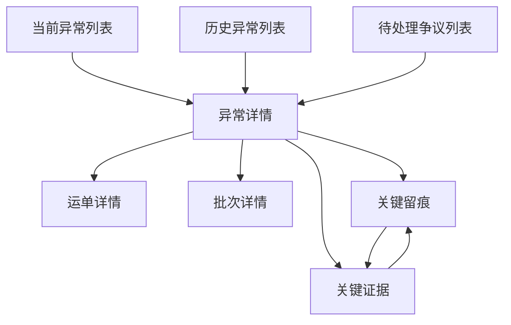

# 异常中心前端设计草案

适用范围：
- `ai-code/专题设计/前端设计/一期前端相关设计/` 中异常中心相关后台前端设计
- Odoo 物流后台中的当前异常、历史异常、待处理争议、异常详情相关页面

优先基准：
- `前端总体设计总览.md`
- `系统页面关系总览.md`
- `留痕与追溯模块前端设计草案.md`

关联文档：
- `04_来源资料与历史草图/03_页面草图与旧清单/当前异常列表页草图.md`
- `04_来源资料与历史草图/03_页面草图与旧清单/异常详情页草图.md`
- `04_来源资料与历史草图/03_页面草图与旧清单/页面字段清单.md`
- `04_来源资料与历史草图/03_页面草图与旧清单/页面动作清单.md`

---

## 1. 模块定位

异常中心不是追溯模块里的附属标签，而是从“问题对象”出发的独立入口。

它承接的是这条链：

```text
当前异常 / 历史异常 / 待处理争议
  -> 异常详情
  -> 关联运单 / 批次 / 留痕 / 证据
  -> 处理动作与处理记录
```

它要解决的不是“还原全部过程”，而是：

1. 快速找到当前最需要处理的问题
2. 判断问题严重度和优先级
3. 快速看到关键留痕和关键证据
4. 快速回到业务对象页继续深入
5. 在问题对象上完成处理动作和记录

---

## 2. 模块边界

## 2.1 这个模块负责什么

- 当前异常列表
- 历史异常列表
- 待处理争议列表
- 异常详情页
- 从问题对象跳到运单、批次、留痕、证据页
- 问题处理动作与处理记录入口

## 2.2 这个模块不负责什么

- 不替代运单详情的完整事实阅读职责
- 不替代工作台的优先级分流职责
- 不承担规则配置职责
- 不承担执行组织管理职责

## 2.3 当前最关键的边界判断

1. 异常中心从“问题对象”开始
2. 留痕与追溯模块从“业务对象”开始
3. 二者必须共享同一套事实来源

---

## 3. 菜单结构

当前建议在一级模块 `留痕与追溯` 或系统级异常分组下按下面结构组织：

```text
异常中心
├─ 当前异常
├─ 历史异常
└─ 待处理争议
```

说明：

- `当前异常` 是主入口
- `历史异常` 负责复盘和回查
- `待处理争议` 更像高优先级预设视图

---

## 4. 页面关系



关系说明：

- `异常详情` 是异常中心的中枢页
- 它必须能向对象、留痕、证据三个方向发散
- 但又要始终保持“问题对象”视角

---

## 5. 页面清单

| 页面 | 页面定位 | 页面类型 | 当前优先级 | 核心价值 |
|---|---|---|---|---|
| 当前异常列表页 | 问题主入口 | 列表页 | P0/P1 | 快速锁定待处理问题 |
| 历史异常列表页 | 复盘回查入口 | 列表页 | P1 | 看已处理或已关闭问题 |
| 待处理争议列表页 | 高优先级预设入口 | 列表页 | P1 | 快速聚焦最需要人工判断的问题 |
| 异常详情页 | 问题处理中枢页 | 详情页 | P0/P1 | 从问题对象直接读到证据链并做处理 |

---

## 6. 页面结构与布局

## 6.1 当前异常列表页

页面目标：

- 找到当前待处理问题
- 快速判断优先级
- 一键进入异常详情或跳业务对象

推荐字段：

- 异常编号
- 异常类型
- 严重程度
- 当前状态
- 当前责任人
- 最近处理时间
- 关联运单号
- 批次号
- 证据状态
- 最近留痕摘要

主动作：

- 查看详情
- 查看运单
- 查看关键留痕

页面重点：

- 问题分类清楚
- 优先级清楚
- 当前责任和证据状态清楚

## 6.2 历史异常列表页

页面目标：

- 支持复盘、核对和历史查证

推荐字段：

- 异常编号
- 异常类型
- 严重程度
- 关闭状态
- 关闭时间
- 关联运单号
- 处理结论摘要

主动作：

- 查看详情
- 查看运单

页面重点：

- 更偏回查
- 不强调待处理优先级

## 6.3 待处理争议列表页

页面目标：

- 把最需要人工判断的问题单独拉出来

推荐字段：

- 异常编号
- 争议类型
- 严重程度
- 当前状态
- 证据完整度
- 当前责任人
- 关联运单号

主动作：

- 查看详情
- 查看关键证据

页面重点：

- 它可以是列表页，也可以是异常列表的预设筛选动作
- 重点是“优先级拉出”，不是另造一套模型

## 6.4 异常详情页

页面目标：

- 从问题对象直接读到证据链
- 立刻做处理动作

推荐分区：

1. 头部摘要区
2. 异常摘要区
3. 关联对象区
4. 关键留痕区
5. 关键证据区
6. 处理状态区
7. 处理记录区

主动作：

- 标记处理中
- 标记已核实
- 添加处理备注
- 查看证据

页面重点：

- 先看问题，再看对象，再看证据，最后处理

---

## 7. 字段建议

## 7.1 异常层

一期建议优先字段：

- `exception_no`
- `exception_type`
- `severity_level`
- `current_status`
- `process_owner_name`
- `latest_process_time`
- `found_time`
- `source_type`

## 7.2 关联对象层

一期建议优先字段：

- `waybill_no`
- `batch_no`
- `waybill_status`
- `evidence_completeness`

## 7.3 关键留痕层

一期建议优先字段：

- `trace_time`
- `trace_type`
- `submit_user_name`
- `image_count`
- `trace_remark`

## 7.4 关键证据层

一期建议优先字段：

- `image_seq`
- `upload_time`
- `upload_user_name`
- `image_remark`
- `storage_status`

---

## 8. 动作建议

## 8.1 主动作

- 查看详情
- 查看运单
- 标记处理中
- 标记已核实

## 8.2 辅助动作

- 查看关键留痕
- 查看关键证据
- 复制异常编号

## 8.3 当前不建议在异常中心首页承接的动作

- 列表页大规模状态编辑
- 列表页复杂批量操作
- 直接在首页做证据重阅读

原因：

- 异常首页应优先服务优先级判断和下钻

---

## 9. 交互规范

## 9.1 问题优先级要一眼可见

必须明显表达：

- 严重程度
- 当前状态
- 证据是否足够
- 当前责任人

## 9.2 处理动作必须可追踪

涉及：

- 标记处理中
- 标记已核实
- 添加处理备注

建议全部进入处理记录区，不能只改状态不留痕。

## 9.3 问题对象与业务对象必须可双向跳转

推荐关系：

- 异常详情 -> 运单详情
- 运单详情 -> 异常详情

---

## 10. 与 Odoo 原生模块的关系

## 10.1 可复用能力

- `search`
- `tree`
- `form`
- `act_window`
- smart button

## 10.2 当前推荐

- 异常列表页优先走原生 `search + tree`
- 异常详情优先走原生 `form`
- 关键留痕区和关键证据区在一期先做可用版

---

## 11. 实现层建议

## 11.1 一期推荐实现方式

- 当前异常列表：`RPC + 聚合字段`
- 异常详情主体：`RPC + form`
- 关键留痕、关键证据：优先用原生区块承接

## 11.2 一期必须先稳定的前置

- 异常状态机口径
- 当前责任人口径
- 异常与运单/批次/留痕/证据的关联关系

## 11.3 一期可以接受的降级

- `待处理争议` 先做预设筛选视图
- 历史异常先做轻量回查页
- 关键证据区先展示重点图片，不强求复杂对比器

---

## 12. 当前阶段结论

异常中心的核心不是“多一个列表”，而是：

**让管理员能从问题对象直接读到证据链，并在问题对象上完成处理。**

只要这条链稳定，异常中心就会成为后台第二高频入口。

---

## 13. 下一步衔接

基于这份草案，下一步最自然的是：

1. 补 `工作台模块前端设计草案.md`
2. 再把工作台卡片和异常/运单/批次列表的下钻关系固定下来


