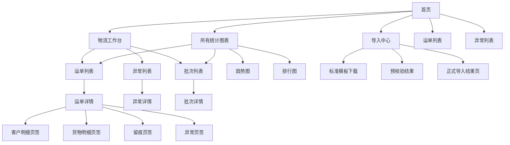

# 二期系统页面关系总览

适用范围：
- `专题设计/前端设计/二期前端优化设计/` 下二期系统级页面关系、入口层级和跨页面跳转
- 当前重点覆盖：首页、物流模块、所有统计图表、标准导入链路

优先基准：
- `2026-04-15_二期品牌化重构与首页及订单导入重设计方案.md`
- `二期前端模块结构与菜单总表.md`

关联文档：
- `../02_跨模块规范/01_接口与数据/二期接口设计总稿（领导阅读版）.md`
- `../02_验收与联调/二期前端落地与联调说明.md`

---

## 1. 文档定位

这份文档用于固定二期页面之间的关系。

它重点回答：

1. 首页之后用户先去哪
2. 哪些页面是对象列表，哪些是详情中枢
3. 首页、统计图表、运单详情、导入中心之间如何跳转
4. 哪些页面承担“阅读中枢”，哪些页面只承担入口分流

---

## 2. 二期页面关系总原则

二期页面关系统一按下面 5 条原则理解：

1. 首页是分流页，不承担完整分析页职责
2. `所有统计图表` 是完整分析入口，首页只展示摘要版
3. 运单详情承担“概览 + 客户明细 + 货物明细 + 留痕 + 异常”的中枢职责
4. 导入链路是完整业务路径，不再只是列表页旁路能力
5. 跨页面跳转优先保持“摘要 -> 列表 -> 详情 -> 处理/验证”的顺序

---

## 3. 页面分层总览

| 页面层级 | 页面角色 | 典型页面 | 主要回答的问题 |
| --- | --- | --- | --- |
| L1 入口层 | 总入口 / 分流 | 首页 | 我应该从哪里开始 |
| L2 工作区层 | 模块内入口 | 物流工作台、所有统计图表、导入中心 | 今天重点看什么 |
| L3 对象层 | 对象发现与阅读 | 运单列表、异常列表、批次列表、排行对象列表 | 要找哪个对象 |
| L4 详情层 | 阅读中枢 | 运单详情、异常详情、批次详情、导入结果页 | 这个对象现在是什么情况 |

---

## 4. 二期系统级页面关系图



---

## 5. 二期 4 条主路径

### 5.1 首页分流主路径

```text
首页
  -> 物流工作台
  -> 所有统计图表
  -> 导入中心
  -> 运单列表 / 异常列表
```

说明：

- 首页承担首次进入、角色引导和重点摘要
- 首页卡片必须能直接下钻到业务列表或统计页

### 5.2 数据分析主路径

```text
首页
  -> 所有统计图表
  -> 趋势图 / 排行图 / 统计总览
  -> 业务列表
  -> 运单详情 / 批次详情
```

说明：

- 首页给摘要
- 统计页给完整分析
- 统计页中的指标卡和排行项必须能继续下钻

### 5.3 运单阅读主路径

```text
首页 / 物流工作台 / 统计图表 / 异常列表
  -> 运单列表
  -> 运单详情
  -> 客户明细 / 货物明细 / 留痕 / 异常
```

说明：

- 运单详情是二期最重要的阅读中枢页
- 用户不应再通过技术子表去反推导入结果

### 5.4 导入主路径

```text
首页 / 物流模块
  -> 导入中心
  -> 标准模板下载
  -> 预校验
  -> 正式导入
  -> 导入结果页
  -> 运单详情验证
```

说明：

- 导入不再只是“点进去试试看”的原生旁路
- 导入结果必须能回到运单详情做验证

---

## 6. 关键页面关系表

| 起点页面 | 目标页面 | 关系类型 | 当前说明 |
| --- | --- | --- | --- |
| 首页 | 物流工作台 | 模块入口 | 首页物流重点区下钻 |
| 首页 | 所有统计图表 | 模块入口 | 首页统计摘要跳转 |
| 首页 | 导入中心 | 快捷入口 | 首页显性导入入口 |
| 首页 | 运单列表 | 快捷入口 | 首页业务快捷动作 |
| 首页 | 异常列表 | 快捷入口 | 首页异常快捷动作 |
| 物流工作台 | 运单列表 | 聚合卡片下钻 | 带预设筛选 |
| 物流工作台 | 异常列表 | 聚合卡片下钻 | 带待处理上下文 |
| 所有统计图表 | 运单列表 | 指标卡 / 趋势点下钻 | 带时间范围和筛选上下文 |
| 所有统计图表 | 批次列表 | 指标卡 / 排行项下钻 | 带排行维度上下文 |
| 运单列表 | 运单详情 | 主列表下钻 | 二期核心阅读入口 |
| 异常列表 | 异常详情 | 主列表下钻 | 问题处理入口 |
| 异常详情 | 运单详情 | 关联跳转 | 从问题对象回到事实主对象 |
| 导入中心 | 预校验结果 | 流程跳转 | 下载模板后进入预校验 |
| 预校验结果 | 导入结果页 | 流程跳转 | 正式导入成功后进入结果页 |
| 导入结果页 | 运单详情 | 验证跳转 | 回到对象页确认导入是否生效 |

---

## 7. 二期新增重点页面说明

### 7.1 首页

角色：

- 系统总入口
- 角色化引导页
- 重点摘要页

不承担：

- 完整统计分析
- 完整对象列表阅读

### 7.2 所有统计图表

角色：

- 完整统计分析入口
- 趋势、排行、环比展示页

不承担：

- 首次进入系统的引导职责

### 7.3 运单详情

角色：

- 事实阅读与验证中枢
- 三层数据结构阅读中枢

必须承接：

- 概览
- 客户明细
- 货物明细
- 留痕
- 异常

### 7.4 导入中心与结果页

角色：

- 标准模板主路径
- 预校验和正式导入承接页
- 导入结果反馈页

必须承接：

- 模板下载
- 错误反馈
- 结果摘要
- 回跳验证

---

## 8. 与一期的主要差异

| 项目 | 一期 | 二期 |
| --- | --- | --- |
| 总入口 | 工作台偏主入口 | 首页成为总入口 |
| 分析入口 | 看板/仪表盘分散 | 统一收口到 `所有统计图表` |
| 运单详情 | 更偏单层阅读 | 升级为多页签中枢 |
| 导入路径 | 更偏原生入口 | 升级为显性业务路径 |

---

## 9. 当前边界

- 本文档只固定页面关系，不展开字段级设计
- 接口与返回结构继续看 `../02_跨模块规范/01_接口与数据/`
- 人工验收与联调顺序继续看 `../02_验收与联调/二期前端落地与联调说明.md`

