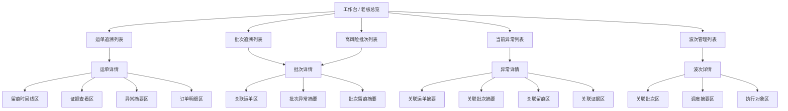
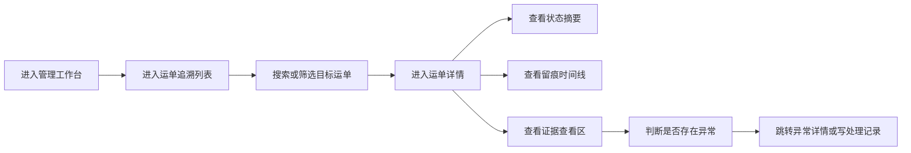
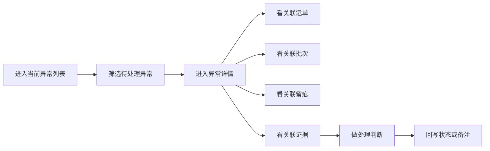
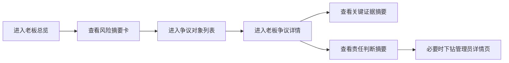

# 系统页面关系总览

适用范围：
- `ai-code/前端相关设计/` 下整套 Odoo 物流后台前端设计
- 系统级页面关系、入口层级、跨模块跳转与上下文传递设计

优先基准：
- `Odoo物流后台前端总体设计总览.md`
- `前端模块结构与菜单总表.md`

关联文档：
- `04_来源资料与历史草图/03_页面草图与旧清单/后台信息架构图.md`
- `04_来源资料与历史草图/03_页面草图与旧清单/后台页面改造清单.md`
- `接口路线决策文档.md`

---

## 1. 文档定位

这份文档用于回答一个在系统级设计里必须先固定的问题：

**整套后台里，页面与页面之间到底如何发生关系。**

它主要解决下面这些问题：

1. 哪些页面是首页和一级入口
2. 哪些页面是对象列表页，哪些是对象详情页
3. 哪些页面是详情页里的核心阅读区块
4. 跨模块页面之间如何下钻、回跳和反查
5. 哪些上下文应通过 Odoo 原生动作传递，哪些只做局部增强

这份文档不是页面草图，也不是接口文档。

它的作用是：

- 固定页面层级关系
- 固定主路径和下钻路径
- 固定跨模块跳转边界

---

## 2. 页面关系设计总原则

当前系统页面关系统一按下面 5 条原则理解：

1. 先有入口页，再有对象页，再有过程与证据页
2. 主路径必须围绕 `波次/批次/运单` 执行主线和 `运单/留痕/证据/异常` 阅读主线展开
3. 详情页必须承担“摘要 + 下钻 + 反查”的中枢职责
4. 时间线和证据默认依附主对象详情页，不优先做孤立页面
5. 跨模块跳转优先复用 Odoo `act_window + context + domain`

---

## 3. 页面分层总览

当前系统页面建议统一分成 4 层：

| 页面层级 | 页面角色 | 典型页面 | 主要回答的问题 |
|---|---|---|---|
| L1 入口层 | 首页 / 一级分流 | 管理工作台、老板总览 | 先看什么、先去哪 |
| L2 列表层 | 对象发现与筛选 | 运单追溯列表、批次追溯列表、当前异常列表、波次管理列表 | 去哪里找对象 |
| L3 对象层 | 详情与中枢页 | 运单详情、批次详情、异常详情、波次详情 | 这个对象现在是什么情况 |
| L4 过程层 | 事实与证据阅读层 | 留痕时间线区、证据查看区、处理记录区 | 发生过什么、证据够不够 |

说明：

- `L1` 页面负责分流，不承担完整事实阅读
- `L2` 页面负责找对象与初步判断
- `L3` 页面负责承接阅读和跳转
- `L4` 页面负责支撑最终判断

---

## 4. 系统级页面关系图



---

## 5. 两条核心主路径

## 5.1 执行管理主路径

```text
工作台 / 运输与调度
  -> 波次管理列表
  -> 波次详情
  -> 批次管理列表 / 批次详情
  -> 运单管理列表 / 运单管理详情
```

这条路径主要服务：

- 物流负责人
- 调度管理者
- 需要从执行组织视角查看问题的人

这条路径强调：

- 先看执行组织
- 再看批量状态
- 最后下钻到运单与异常

## 5.2 追溯阅读主路径

```text
工作台 / 留痕与追溯 / 异常中心
  -> 运单追溯列表 / 批次追溯列表 / 当前异常列表
  -> 运单详情 / 批次详情 / 异常详情
  -> 留痕时间线
  -> 证据查看
  -> 处理记录或异常处理
```

这条路径主要服务：

- 管理员
- 运营
- 客服
- 老板

这也是当前最应该优先打通的后台主路径。

---

## 6. 关键页面关系表

| 起点页面 | 目标页面 | 关系类型 | 当前说明 |
|---|---|---|---|
| 管理工作台 | 运单追溯列表 | 聚合卡片下钻 | 带预设筛选上下文 |
| 管理工作台 | 当前异常列表 | 聚合卡片下钻 | 带待处理/高优先级上下文 |
| 管理工作台 | 批次追溯列表 | 聚合卡片下钻 | 带高风险批次上下文 |
| 运单追溯列表 | 运单详情 | 主列表下钻 | 最核心阅读入口 |
| 批次追溯列表 | 批次详情 | 主列表下钻 | 聚合对象入口 |
| 当前异常列表 | 异常详情 | 主列表下钻 | 问题对象入口 |
| 波次管理列表 | 波次详情 | 管理页下钻 | 执行组织入口 |
| 批次详情 | 运单详情 | 子列表 / Smart Button 跳转 | 从聚合对象下钻事实主对象 |
| 异常详情 | 运单详情 | Smart Button 跳转 | 从问题对象回到事实主对象 |
| 运单详情 | 异常详情 | Smart Button / 摘要跳转 | 从事实主对象进入问题对象 |
| 运单详情 | 留痕时间线区 | 页内主阅读区 | 不建议脱离详情页优先独立 |
| 运单详情 | 证据查看区 | 页内主阅读区 | 不建议脱离详情页优先独立 |
| 仓储页面 | 运单详情 / 批次详情 | 关联入口跳转 | 反查链路 |
| 单据页面 | 运单详情 / 批次详情 | 关联入口跳转 | 反查链路 |

---

## 7. 管理员主路径



这条路径说明：

- `运单追溯列表 -> 运单详情` 是最核心页面关系
- `运单详情` 必须是事实阅读与处理判断的中枢页
- `时间线` 与 `证据` 必须在同一阅读链里互相支撑

---

## 8. 异常处理路径



这条路径说明：

- `异常详情` 不能只是异常字段页
- 异常页必须能回到对象、留痕、证据三条线
- 异常中心是和追溯中心并列的主入口，不是详情页附属标签

---

## 9. 物流负责人路径


这条路径说明：

- 执行组织页和追溯阅读页不是一回事
- `波次/批次/运单管理` 负责组织上下文
- `运单详情/异常详情` 负责事实阅读与判断

---

## 10. 老板决策路径



这条路径说明：

- 老板页是摘要优先，不是管理员页缩略版
- 老板页和管理员页应共享同一套事实来源
- 下钻到管理员页时应自动带对象上下文

---

## 11. 跨模块反查关系

## 11.1 从仓储管理反查

推荐关系：

- 仓储作业单据 -> 批次详情
- 仓储作业单据 -> 运单详情
- 仓储页面中的追溯 Smart Button -> 留痕与追溯主链

## 11.2 从业务单据反查

推荐关系：

- 销售订单 -> 运单详情
- 采购订单 -> 批次详情或运单详情
- 出入库单据 -> 批次详情 / 运单详情

## 11.3 从基础资料反查

推荐关系：

- 客户 / 门店 -> 相关运单列表
- 仓库 / 货位 -> 相关批次列表
- 商品 -> 相关运单或异常汇总

说明：

- 这类页面主要做“反查入口”
- 不建议让它们承担追溯主阅读职责

---

## 12. 详情页内部关系

当前所有关键详情页建议统一成“摘要区 + 主阅读区 + 快捷跳转区”的结构。

| 详情页 | 页内必备关系 |
|---|---|
| 运单详情 | 摘要区 -> 时间线区 -> 证据区 -> 异常摘要区 -> 处理记录区 |
| 批次详情 | 摘要区 -> 关联运单区 -> 批次异常摘要区 -> 批次留痕摘要区 |
| 异常详情 | 摘要区 -> 关联对象区 -> 关联留痕区 -> 关联证据区 -> 处理动作区 |
| 波次详情 | 摘要区 -> 调度摘要区 -> 关联批次区 -> 执行对象区 |

补充原则：

- 详情页不应先把所有字段摊开
- 摘要区必须优先服务判断，不优先服务编辑
- `运单详情` 仍是当前事实阅读中枢

---

## 13. 上下文传递建议

## 13.1 优先用 Odoo 原生上下文

页面跳转优先通过下面方式承接：

- `act_window`
- `context`
- `domain`
- `search_default_*`

## 13.2 当前建议传递的关键上下文

| 上下文键 | 主要使用场景 |
|---|---|
| `default_waybill_id` | 从异常或批次跳转到运单相关页 |
| `default_batch_id` | 从波次或运单跳到批次相关页 |
| `default_wave_id` | 从执行组织页进入下游对象页 |
| `default_exception_id` | 从工作台或运单详情进入异常页 |
| `search_default_has_exception` | 工作台卡片下钻到异常对象列表 |
| `search_default_evidence_insufficient` | 缺图卡片下钻到对象列表 |

## 13.3 Controller 侧上下文

如果局部增强区块使用 controller，建议只消费最小必要上下文：

- 当前对象 id
- 当前对象类型
- 当前时间筛选或风险筛选

不建议 controller 自己再发明一套独立跳转体系。

---

## 14. 一期冻结版页面关系

为了保证一期范围可控，当前建议先冻结下面这条最小关系链：

```text
管理工作台
  -> 运单追溯列表
  -> 运单详情
  -> 留痕时间线区
  -> 证据查看区
  -> 异常详情

管理工作台
  -> 当前异常列表
  -> 异常详情

运输与调度
  -> 波次管理
  -> 批次管理
  -> 运单管理
```

说明：

- 这条链先覆盖管理员最高频路径
- `批次追溯`、`历史异常` 可以作为一期扩展
- `老板总览`、`证据总览`、`缺图看板`、`异常闭环看板` 放到后续批次更稳

---

## 15. 当前阶段结论

当前这份总览的核心结论是：

1. 整套后台页面关系已经可以稳定收口到“入口层 -> 列表层 -> 对象层 -> 过程层”
2. `运单详情` 是当前系统里最关键的页面中枢
3. `异常详情` 是第二条主阅读链的关键中枢
4. `波次/批次/运单管理` 和 `运单/异常/证据阅读` 必须并行设计，但不能混成同一种页面
5. 仓储、单据、基础资料的价值主要体现在反查入口，而不是替代主阅读链

---

## 16. 下一步衔接

基于这份页面关系总览，下一步最自然的是：

1. 补 `运输与调度模块前端设计草案.md`
2. 补 `后台按波次批次运单追溯页面设计.md`
3. 再把现有草图收口成 `留痕与追溯模块前端设计草案.md` 和 `异常中心前端设计草案.md`

只有把模块级草案接上，这份系统页面关系图才能真正进入可指导开发的状态。

