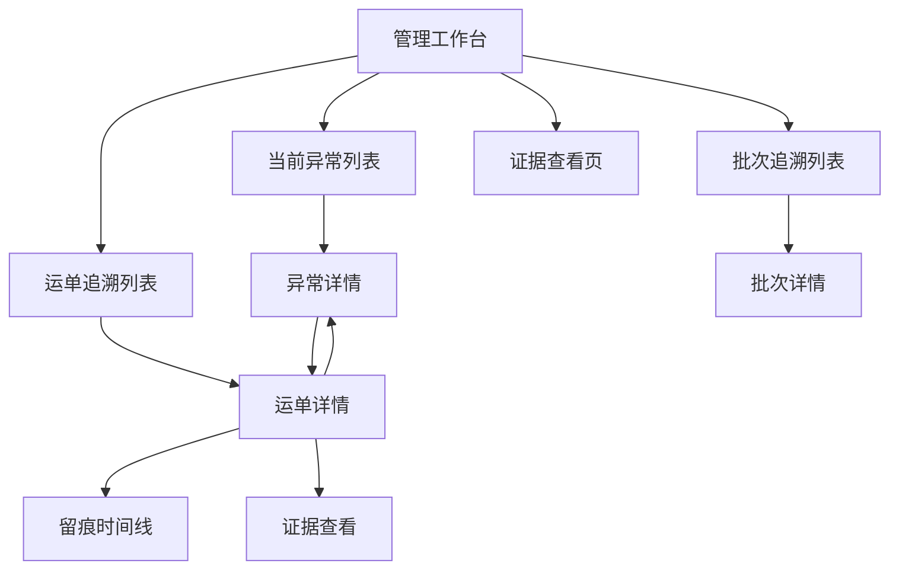

# 工作台模块前端设计草案

适用范围：
- `ai-code/前端相关设计/` 中工作台相关后台前端设计
- Odoo 物流后台中的管理工作台、卡片下钻、优先处理入口相关页面

优先基准：
- `Odoo物流后台前端总体设计总览.md`
- `系统页面关系总览.md`
- `留痕与追溯模块前端设计草案.md`
- `异常中心前端设计草案.md`

关联文档：
- `04_来源资料与历史草图/03_页面草图与旧清单/管理工作台草图.md`
- `04_来源资料与历史草图/03_页面草图与旧清单/页面字段清单.md`
- `04_来源资料与历史草图/03_页面草图与旧清单/页面动作清单.md`
- `聚合字段实现策略文档.md`

---

## 1. 模块定位

工作台模块不是完整分析平台，也不是运单详情的替代品。

它是管理员每天进入后台后的首页与分流入口。

它要帮助管理员先完成下面 4 件事：

1. 判断今天先看什么
2. 快速看到高风险对象分布
3. 一键下钻到异常、运单、批次等主页面
4. 不进入详情也能形成风险面貌的第一轮认识

所以它的核心价值是：

**优先级分发，而不是全量阅读。**

---

## 2. 模块边界

## 2.1 这个模块负责什么

- 管理工作台首页
- 概览卡区
- 优先处理对象列表
- 风险分布区
- 最近变化区
- 快捷下钻入口

## 2.2 这个模块不负责什么

- 不直接承担完整运单判责
- 不直接承担完整异常处理
- 不直接承担完整证据阅读
- 不把首页做成 BI 大屏

## 2.3 当前最关键的边界判断

1. 工作台负责“先看什么”
2. 运单详情负责“到底发生了什么”
3. 异常详情负责“问题怎么处理”

---

## 3. 菜单结构

当前建议在一级模块 `工作台` 下先保留：

```text
工作台
└─ 管理工作台
```

补充说明：

- 一期先把管理员工作台做稳
- 老板总览可后续单独归档

---

## 4. 页面关系



关系说明：

- 工作台不承担“终点页”角色
- 它所有价值都体现在下钻是否顺畅

---

## 5. 页面清单

| 页面 | 页面定位 | 页面类型 | 当前优先级 | 核心价值 |
|---|---|---|---|---|
| 管理工作台 | 首页与分流页 | 看板 / 聚合页 | P0/P1 | 先决定看什么，再跳主链页面 |

---

## 6. 页面结构与布局

## 6.1 管理工作台

页面目标：

- 让管理员 10 秒内知道今天先看什么
- 让卡片和优先处理对象都能稳定下钻

推荐分区：

1. 顶部筛选区
2. 概览卡区
3. 优先处理列表
4. 风险分布区
5. 最近变化区
6. 待处理争议对象区
7. 右侧辅助区

### 顶部筛选区

建议支持：

- 时间范围
- 责任人
- 仓/区域
- 风险等级
- 快捷筛选标签

重点：

- 筛选项应服务“先看什么”
- 不做报表式复杂过滤器

### 概览卡区

建议固定卡片：

- 待处理异常数
- 证据不足对象数
- 高风险批次数
- 今日新增争议数
- 今日新增留痕数

重点：

- 每张卡都必须支持下钻
- 卡片文案要贴近动作入口

### 优先处理列表

建议优先展示：

- 高严重度异常
- 证据不足且未闭环对象
- 异常集中批次

重点：

- 这里是首页最重要的主区
- 管理员最有可能从这里开始操作

### 风险分布区

建议展示：

- 异常类型分布
- 证据完整度分布
- 高风险批次 Top N

重点：

- 帮助形成全局风险认知
- 不追求复杂图表

### 最近变化区

建议展示：

- 新增高严重度异常
- 某批次风险跳升
- 证据不足对象增长

重点：

- 承担动态提醒作用

### 待处理争议对象区

建议展示：

- 争议异常对象
- 争议运单
- 争议批次

重点：

- 单独拉出需要人工判断的对象

### 右侧辅助区

建议放：

- 今日摘要卡
- 快速跳转卡
- 技术信息折叠区

重点：

- 只做辅助判断与导航

---

## 7. 字段建议

一期建议优先字段：

- `pending_exception_total`
- `evidence_insufficient_total`
- `high_risk_batch_total`
- `today_new_exception_total`
- `today_new_trace_total`
- `priority_queue_topn`
- `exception_type_distribution`
- `evidence_distribution`
- `batch_risk_rank_topn`

补充说明：

- 这些字段大多属于聚合字段或聚合接口结果
- 不建议前端自己临时拼装

---

## 8. 动作建议

## 8.1 主动作

- 查看异常
- 查看运单
- 查看批次
- 查看证据

## 8.2 辅助动作

- 查看全部争议对象
- 查看更多动态

## 8.3 当前不建议在工作台承接的动作

- 首页直接改大量状态
- 首页直接写复杂处理结论
- 首页直接做完整证据审阅

原因：

- 首页要轻
- 首页优先服务分流和进入主链

---

## 9. 交互规范

## 9.1 每张卡片都必须有明确去向

例如：

- `待处理异常` -> 当前异常列表
- `证据不足对象` -> 运单追溯列表并带证据不足筛选
- `高风险批次` -> 批次追溯列表并带高风险筛选

## 9.2 优先处理对象必须按对象类型跳转

推荐规则：

- 异常对象 -> 先跳异常详情
- 运单对象 -> 先跳运单详情
- 批次对象 -> 先跳批次详情

## 9.3 工作台上的统计必须可解释

必须能够回答：

- 统计来自哪些对象
- 用什么筛选口径
- 更新时间是什么

---

## 10. 与 Odoo 原生模块的关系

## 10.1 可复用能力

- `kanban`
- `act_window`
- 原生筛选与跳转

## 10.2 当前推荐

- 工作台可优先用 Odoo 承接基础壳子
- 卡片和优先处理对象区可做轻量增强
- 不在一期做重型 BI 或复杂 dashboard 容器

---

## 11. 实现层建议

## 11.1 一期推荐实现方式

- 工作台卡片和优先处理对象列表优先走聚合接口
- 卡片点击后统一回到 Odoo 原生列表页或详情页

## 11.2 一期必须先稳定的前置

- 聚合字段口径
- 卡片下钻上下文
- 优先处理队列生成逻辑

## 11.3 一期可接受的降级

- 图表做简版
- 最近变化区先做列表，不做消息流
- 只保留 3 到 5 张最重要卡片

---

## 12. 当前阶段结论

工作台模块的核心不是“信息多”，而是：

**让管理员一进后台就知道今天先看什么、点哪里、为什么点。**

只要它能稳定把用户送进异常、运单、批次这三条主链，它就达标。

---

## 13. 下一步衔接

基于这份草案，下一步最自然的是：

1. 继续补老板追溯页前端设计草案
2. 再进入仓储管理和业务单据接入设计

