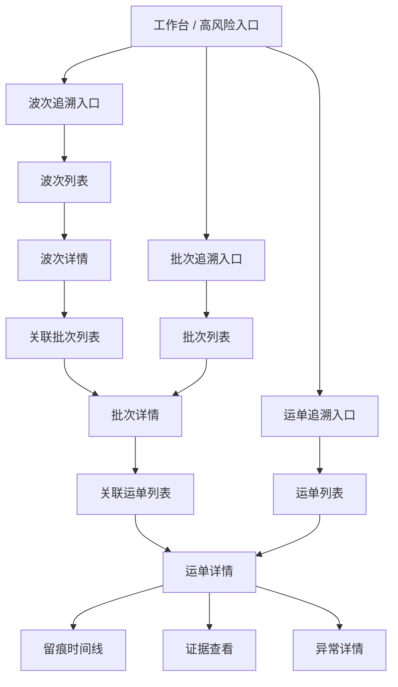

# 后台按波次批次运单追溯页面设计

适用范围：
- `ai-code/前端相关设计/` 中后台按波次、批次、运单分层追溯的页面设计
- Odoo 物流后台中执行主线与追溯阅读主线的衔接设计

优先基准：
- `系统页面关系总览.md`
- `运输与调度模块前端设计草案.md`
- `Odoo19物流留痕系统运单主对象与留痕主流程设计.md`

关联文档：
- `04_来源资料与历史草图/03_页面草图与旧清单/批次追溯列表页草图.md`
- `04_来源资料与历史草图/03_页面草图与旧清单/批次详情页草图.md`
- `04_来源资料与历史草图/03_页面草图与旧清单/运单详情页草图.md`
- `04_来源资料与历史草图/03_页面草图与旧清单/留痕时间线页草图.md`
- `04_来源资料与历史草图/03_页面草图与旧清单/证据查看页草图.md`

---

## 1. 文档定位

这份文档不再单独讨论“某个列表页长什么样”，而是专门回答：

**后台如果要按 `波次 -> 批次 -> 运单` 三层对象组织追溯，页面关系到底该怎么设计。**

它重点解决下面 5 个问题：

1. 按波次、批次、运单追溯，到底分别看什么
2. 这三层入口之间怎么下钻
3. 哪一层负责聚合判断，哪一层负责事实判断
4. 哪些页面属于管理主线，哪些属于追溯主线
5. 页面跳转上下文怎么传，才不会丢失阅读语境

---

## 2. 三层追溯的基本判断

## 2.1 波次层

波次层是调度组织视角。

它主要回答：

- 今天哪一波货出了问题
- 哪一波下有哪些高风险批次
- 哪一波整体执行是否异常集中

它不直接回答：

- 某张证据图拍了什么
- 某个门店交付是否成立

## 2.2 批次层

批次层是聚合执行视角。

它主要回答：

- 这辆车这一批任务整体是否健康
- 风险集中在哪些运单上
- 最近变化是来自发车、到店还是异常上报

它适合承载：

- 聚合判断
- 运单集合概览
- 异常分布摘要

它不适合承担：

- 最终门店交付判责
- 单证据细读

## 2.3 运单层

运单层是事实阅读视角。

它主要回答：

- 某个店铺这次交付到底发生了什么
- 留痕链是否完整
- 证据链是否足以支撑判断
- 当前异常是否已经有依据

也就是说：

**真正的事实追溯主对象仍然是运单。**

---

## 3. 三层页面关系总览



---

## 4. 三层页面的正确分工

| 层级 | 页面类型 | 页面目标 | 正确产出 | 不应承担的内容 |
|---|---|---|---|---|
| 波次 | 列表 + 详情 | 调度组织总览 | 波次摘要、批次分布、风险聚合 | 证据主阅读、单运单判责 |
| 批次 | 列表 + 详情 | 执行聚合判断 | 运单分布、异常摘要、最近变化 | 单张图片细读、最终事实判断 |
| 运单 | 列表 + 详情 | 事实与证据判断 | 时间线、证据、异常、处理记录 | 调度组织全景分析 |

---

## 5. 三条典型阅读路径

## 5.1 从波次进入

适用人群：

- 物流负责人
- 调度管理者

推荐路径：

```text
工作台 / 运输与调度
  -> 波次列表
  -> 波次详情
  -> 关联批次列表
  -> 批次详情
  -> 关联运单列表
  -> 运单详情
```

这条路径的价值：

- 先从调度组织层发现问题
- 再定位到具体批次
- 最后落到事实主对象

## 5.2 从批次进入

适用人群：

- 仓内运营
- 异常排查人员

推荐路径：

```text
工作台 / 批次追溯
  -> 批次列表
  -> 批次详情
  -> 关联运单列表
  -> 运单详情
  -> 留痕 / 证据 / 异常
```

这条路径的价值：

- 用更短链路看执行聚合问题
- 快速找到最值得看的运单对象

## 5.3 从运单直接进入

适用人群：

- 管理员
- 客服
- 老板

推荐路径：

```text
工作台 / 运单追溯
  -> 运单列表
  -> 运单详情
  -> 留痕时间线
  -> 证据查看
  -> 异常详情
```

这条路径的价值：

- 最高效
- 最适合直接做事实判断

---

## 6. 波次追溯入口设计

## 6.1 波次列表页

页面目标：

- 先从“今天哪一波有问题”切入

建议字段：

- 波次编号
- 调度日期
- 仓库
- 批次总数
- 运单总数
- 高风险批次数
- 最新更新时间
- 当前整体状态

主动作：

- 查看波次详情
- 查看高风险批次

## 6.2 波次详情页

页面目标：

- 让用户在波次层做“批次下钻前”的最后一轮判断

推荐分区：

1. 波次头部摘要
2. 调度上下文
3. 关联批次概览
4. 高风险批次摘要
5. 最近变化摘要

页面重点：

- 强调“批次分布”
- 不直接堆运单证据

---

## 7. 批次追溯入口设计

## 7.1 批次列表页

页面目标：

- 用聚合层视角识别问题批次

建议字段：

- 批次号
- 批次状态
- 运单总数
- 异常运单数
- 司机
- 车辆
- 证据完整度
- 最新留痕时间

主动作：

- 查看批次详情
- 查看异常对象
- 查看关联运单

## 7.2 批次详情页

页面目标：

- 用一个页面把“执行上下文 + 运单集合 + 异常摘要”组织起来

推荐分区：

1. 头部摘要区
2. 执行上下文区
3. 关联运单概览区
4. 最近留痕摘要区
5. 异常摘要区

页面重点：

- 它是中枢页
- 不是最终事实页

---

## 8. 运单追溯入口设计

## 8.1 运单列表页

页面目标：

- 快速锁定要看的事实主对象

建议字段：

- 运单号
- 店铺
- 批次号
- 当前状态
- 是否异常
- 最新留痕时间
- 最新留痕类型
- 证据完整度

主动作：

- 查看运单详情
- 查看异常
- 查看所属批次

## 8.2 运单详情页

页面目标：

- 用一个页面完成事实阅读与初步判断

推荐分区：

1. 头部摘要区
2. 执行上下文区
3. 留痕时间线区
4. 证据查看区
5. 异常摘要区
6. 处理记录区

页面重点：

- 它是三层追溯里最核心的阅读中枢
- 真正的证据阅读从这里展开

---

## 9. 管理主线与追溯主线的区分

## 9.1 管理主线页面

包括：

- 波次管理列表/详情
- 批次管理列表/详情
- 运单管理列表/详情

这些页面重点看：

- 当前对象状态
- 执行上下文
- 下级对象概览
- 是否值得下钻

## 9.2 追溯主线页面

包括：

- 波次追溯入口
- 批次追溯入口
- 运单追溯入口
- 运单详情
- 留痕时间线
- 证据查看
- 异常详情

这些页面重点看：

- 留痕事实
- 证据链
- 异常依据
- 处理判断

## 9.3 当前建议

如果一期资源有限，建议：

- `波次` 先用管理页承接，不急着做独立“波次追溯详情”
- `批次` 可兼顾管理与聚合阅读，但文案和动作要分清
- `运单` 明确作为最终事实主阅读层

---

## 10. 页面跳转与上下文传递

## 10.1 波次到批次

推荐传递：

- `default_wave_id`
- `search_default_wave_id`
- 当前时间范围

## 10.2 批次到运单

推荐传递：

- `default_batch_id`
- `search_default_batch_id`
- 当前风险筛选

## 10.3 运单到留痕/证据/异常

推荐传递：

- `default_waybill_id`
- `default_exception_id`
- 当前对象上下文摘要

## 10.4 当前建议

所有跨层跳转优先复用：

- Odoo `act_window`
- `context`
- `domain`
- `search_default_*`

不建议前端再自造一套层级导航。

---

## 11. 每层应保留的动作边界

| 层级 | 推荐动作 | 不推荐动作 |
|---|---|---|
| 波次 | 查看详情、查看关联批次、查看高风险批次 | 查看证据、直接改异常结论 |
| 批次 | 查看详情、查看关联运单、查看异常对象、添加处理备注 | 单图判责、复杂状态流转 |
| 运单 | 查看留痕、查看证据、查看异常、写处理记录 | 承担调度组织汇总 |

---

## 12. 一期冻结版设计

为了让第二阶段先落稳，当前建议冻结成下面这条最小可用方案：

```text
波次管理列表
  -> 波次详情
  -> 批次管理列表 / 批次详情
  -> 运单管理列表 / 运单追溯列表
  -> 运单详情
  -> 留痕时间线 / 证据查看 / 异常详情
```

说明：

- 波次层先重点解决“调度组织 -> 批次下钻”
- 批次层先重点解决“聚合判断 -> 运单下钻”
- 运单层先重点解决“事实阅读 -> 证据判断”

---

## 13. 实现层建议

## 13.1 一期推荐实现方式

- 波次、批次、运单三层列表与详情优先使用 Odoo 原生 `search/tree/form`
- 运单详情中的时间线和证据区优先用现有阅读链方案承接
- 波次和批次层聚合字段优先先补“摘要足够”的版本

## 13.2 一期优先依赖的聚合信息

波次层：

- 批次总数
- 运单总数
- 高风险批次数

批次层：

- 运单总数
- 异常运单数
- 已签收运单数
- 风险等级
- 最新留痕时间

运单层：

- 当前状态
- 最新留痕摘要
- 证据完整度
- 异常状态摘要

---

## 14. 当前阶段结论

后台按波次、批次、运单追溯的真正目标，不是做 3 套互相重复的页面，而是：

**用 3 层对象形成一条逐层收窄的阅读链，让用户先从组织层发现问题，再从聚合层定位对象，最后在事实层完成判断。**

也就是说：

- 波次层负责“先找哪一批”
- 批次层负责“先看哪一单”
- 运单层负责“到底发生了什么”

---

## 15. 下一步衔接

基于这份设计，下一步最自然的是：

1. 继续补 `留痕与追溯模块前端设计草案.md`
2. 继续补 `异常中心前端设计草案.md`
3. 再把工作台里“高风险波次 / 高风险批次 / 待处理运单”的下钻入口正式挂接起来

这样第二阶段和第三阶段就能顺畅接上。

