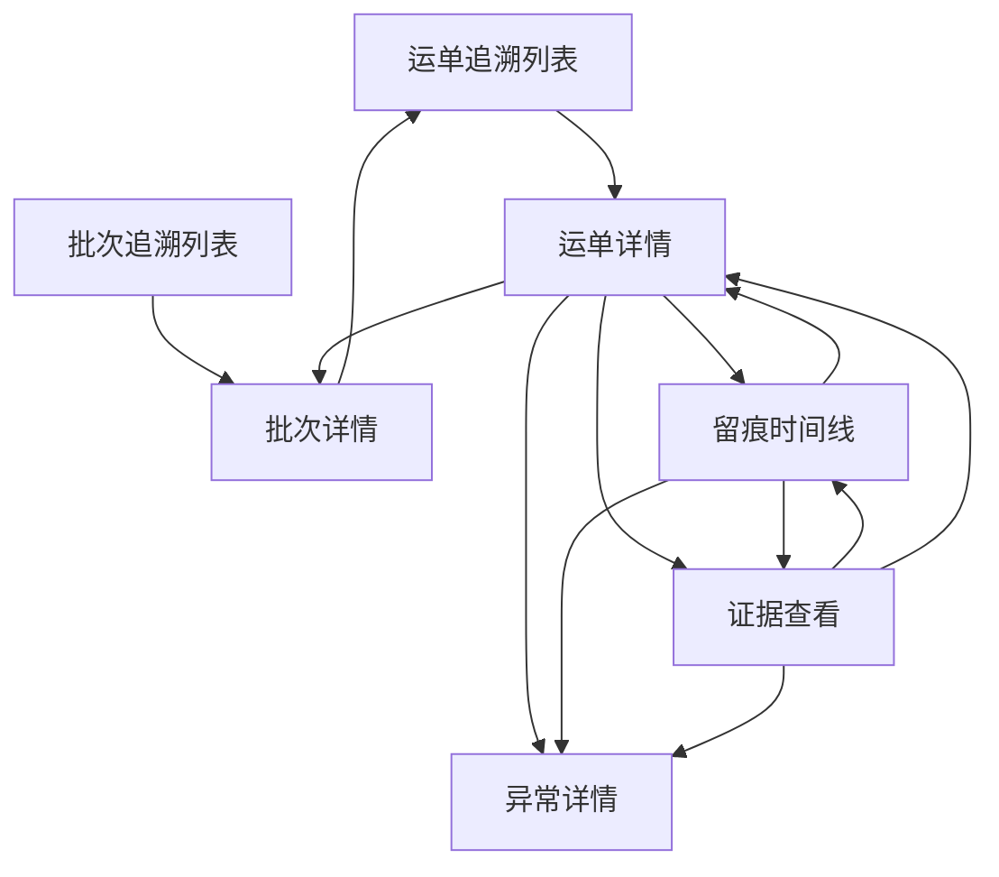

# 留痕与追溯模块前端设计草案

适用范围：
- `ai-code/前端相关设计/` 中留痕与追溯相关后台前端设计
- Odoo 物流后台中的运单追溯、批次追溯、留痕时间线、证据查看相关页面

优先基准：
- `Odoo物流后台前端总体设计总览.md`
- `系统页面关系总览.md`
- `后台按波次批次运单追溯页面设计.md`
- `Odoo19物流留痕系统运单主对象与留痕主流程设计.md`

关联文档：
- `04_来源资料与历史草图/03_页面草图与旧清单/运单追溯列表页草图.md`
- `04_来源资料与历史草图/03_页面草图与旧清单/运单详情页草图.md`
- `04_来源资料与历史草图/03_页面草图与旧清单/留痕时间线页草图.md`
- `04_来源资料与历史草图/03_页面草图与旧清单/证据查看页草图.md`
- `04_来源资料与历史草图/03_页面草图与旧清单/页面字段清单.md`
- `04_来源资料与历史草图/03_页面草图与旧清单/页面动作清单.md`

---

## 1. 模块定位

留痕与追溯模块是当前后台前端最核心的阅读模块。

它承接的是这条阅读链：

```text
运单追溯列表
  -> 运单详情
  -> 留痕时间线
  -> 证据查看
  -> 异常判断与处理入口
```

它要回答的不是“今天有哪些任务”，而是：

1. 这个对象现在是什么状态
2. 过程中到底发生了什么
3. 有没有足够证据支持判断
4. 当前问题是否已经形成异常
5. 下一步该回到哪个对象或问题页继续处理

也就是说：

- 运输与调度模块负责“组织执行上下文”
- 留痕与追溯模块负责“阅读事实和证据”

---

## 2. 模块边界

## 2.1 这个模块负责什么

- 运单追溯列表页
- 运单详情页
- 留痕时间线页
- 证据查看页
- 从运单阅读链跳向异常页、批次页、相关对象页

## 2.2 这个模块不负责什么

- 不直接承担波次、批次、车辆、司机的管理职责
- 不承担工作台级聚合分流职责
- 不承担规则配置和权限配置职责
- 不把批次、车辆页做成事实主阅读页

## 2.3 当前最重要的边界判断

1. `运单` 是当前追溯阅读的事实主对象
2. `留痕` 是事实事件对象
3. `证据` 是事实证据对象
4. `批次` 在本模块里承担上下文和聚合入口，不替代运单主阅读

---

## 3. 菜单结构

当前建议在一级模块 `留痕与追溯` 下按下面结构组织：

```text
留痕与追溯
├─ 运单追溯
├─ 批次追溯
├─ 留痕时间线
└─ 证据查看
```

补充说明：

- 一期的真正主入口是 `运单追溯`
- `批次追溯` 负责聚合判断，不替代运单阅读
- `留痕时间线`、`证据查看` 可以既支持页内展开，也支持独立下钻页

---

## 4. 页面关系



关系说明：

- `运单详情` 是本模块的绝对中枢页
- `留痕时间线` 是事实阅读扩展页
- `证据查看` 是证据阅读扩展页
- `批次追溯` 是聚合入口，不是事实终点

---

## 5. 页面清单

| 页面 | 页面定位 | 页面类型 | 当前优先级 | 核心价值 |
|---|---|---|---|---|
| 运单追溯列表页 | 事实主对象入口页 | 列表页 | P0 | 快速找对象、做第一轮判断 |
| 运单详情页 | 事实阅读中枢页 | 详情页 | P0 | 串起状态、留痕、证据、异常 |
| 留痕时间线页 | 事实历史阅读页 | 列表/卡片页 | P0 | 用时间顺序读过程 |
| 证据查看页 | 证据阅读页 | 详情/预览页 | P0 | 用图片和上下文做判断 |
| 批次追溯列表页 | 聚合判断入口页 | 列表页 | P1 | 先从批次层识别风险对象 |
| 批次详情页 | 聚合中枢页 | 详情页 | P1 | 组织运单概览、异常摘要、留痕摘要 |

---

## 6. 页面结构与布局

## 6.1 运单追溯列表页

页面目标：

- 快速定位目标运单
- 在列表层完成第一轮判断
- 一键进入运单详情或异常页

推荐字段：

- 运单号
- 当前状态
- 异常状态
- 最新留痕时间
- 最新留痕类型
- 证据完整度
- 批次号
- 最近责任人

主动作：

- 查看详情
- 查看异常
- 查看最新留痕

页面重点：

- 搜索强
- 状态清楚
- 证据摘要清楚
- 第一列必须可点击

## 6.2 运单详情页

页面目标：

- 用一个页面完成运单级追溯判断

推荐分区：

1. 头部摘要区
2. 当前状态区
3. 执行上下文区
4. 留痕时间线区
5. 证据查看区
6. 异常摘要区
7. 处理记录区

主动作：

- 查看完整时间线
- 查看证据
- 查看异常详情
- 添加处理备注

页面重点：

- 它是整个后台追溯阅读链的中心
- 阅读顺序必须是“摘要 -> 过程 -> 证据 -> 处理”

## 6.3 留痕时间线页

页面目标：

- 按时间顺序读清过程
- 快速识别异常节点和带图节点
- 决定下一步看证据、看异常，还是回对象详情

推荐分区：

1. 顶部上下文区
2. 搜索与筛选区
3. 时间线主区
4. 右侧摘要区

主动作：

- 查看证据
- 查看运单
- 查看异常

页面重点：

- 时间必须最先被看到
- 每条记录都必须带归属对象
- 时间线不能退化成无结构消息流

## 6.4 证据查看页

页面目标：

- 看清图片
- 看清图片属于谁
- 看清图片来自哪条留痕
- 快速决定回哪个对象继续判断

推荐分区：

1. 顶部上下文区
2. 搜索与筛选区
3. 图片主区
4. 缩略条
5. 图片备注与留痕摘要区
6. 图片列表区
7. 右侧上下文区

主动作：

- 上一张
- 下一张
- 查看原图
- 查看留痕
- 查看运单

页面重点：

- 先看图，再看归属
- 不允许图片脱离事实上下文单独漂浮

## 6.5 批次追溯页

页面目标：

- 先从聚合层发现问题批次
- 再把用户引到具体运单对象

页面重点：

- 批次页回答“这一批整体怎么样”
- 不直接回答“这单最终责任是什么”

---

## 7. 字段建议

## 7.1 运单层

一期建议优先字段：

- `waybill_no`
- `current_status`
- `exception_status`
- `latest_trace_time`
- `latest_trace_type`
- `latest_trace_user_name`
- `evidence_completeness`
- `batch_no`
- `driver_name`

## 7.2 留痕层

一期建议优先字段：

- `trace_time`
- `trace_type`
- `is_exception`
- `image_count`
- `submit_user_name`
- `owner_object_type`
- `owner_object_no`
- `trace_remark`

## 7.3 证据层

一期建议优先字段：

- `image_seq`
- `image_category`
- `upload_time`
- `upload_user_name`
- `trace_id`
- `trace_type`
- `trace_time`
- `image_remark`
- `storage_status`

## 7.4 批次聚合层

一期建议优先字段：

- `batch_no`
- `batch_status`
- `waybill_count`
- `exception_waybill_count`
- `risk_level`
- `latest_trace_time`
- `evidence_completeness`

---

## 8. 动作建议

## 8.1 主动作

- 查看详情
- 查看时间线
- 查看证据
- 查看异常

## 8.2 辅助动作

- 查看最新留痕
- 查看批次
- 复制编号

## 8.3 状态动作

- 标记处理中
- 添加处理备注

## 8.4 当前不建议在本模块页面承接的动作

- 大量原地状态编辑
- 波次/批次/车辆资源管理
- 复杂规则配置

原因：

- 本模块优先服务阅读与判断
- 编辑和配置应交给对应模块

---

## 9. 交互规范

## 9.1 阅读顺序必须稳定

本模块所有关键页面都应遵循：

1. 先看摘要
2. 再看当前状态或上下文
3. 再看过程
4. 再看证据
5. 最后处理或跳转

## 9.2 事实与证据必须互相可跳

推荐关系：

- 时间线每条记录都能跳证据
- 证据页能回到对应留痕
- 运单详情能同时看到时间线和证据入口

## 9.3 页面不能失去对象上下文

特别是：

- 时间线页不能脱离运单或批次上下文
- 证据页不能做成孤立附件中心

---

## 10. 与 Odoo 原生模块的关系

## 10.1 可复用能力

- `search`
- `tree`
- `form`
- `act_window`
- smart button
- stat button

## 10.2 当前推荐

- 运单列表页优先用原生 `search + tree`
- 运单详情页优先用原生 `form` 承接主体
- 时间线和证据区在一期先做原生可用版，必要时局部增强

---

## 11. 实现层建议

## 11.1 一期推荐实现方式

- 运单追溯列表：`RPC + 聚合字段`
- 运单详情主体：`RPC + form`
- 留痕时间线：先用原生列表/卡片可用版
- 证据查看：先用原生承接主体，局部预留轻量 widget

## 11.2 一期必须先稳定的前置

- 运单层聚合字段
- 留痕与证据的归属关系
- 异常状态摘要

## 11.3 一期可接受的降级

- 时间线先做简版
- 证据页先做轻增强，不做重型灯箱系统
- 批次页先以聚合判断为主，不做复杂 dashboard

---

## 12. 当前阶段结论

留痕与追溯模块的核心不是“页面多”，而是：

**围绕运单把状态、过程、证据、异常组织成一条可读、可跳、可判断的阅读链。**

只要这条链稳定，管理员和老板都能更快完成判断。

---

## 13. 下一步衔接

基于这份草案，下一步最自然的是：

1. 补 `异常中心前端设计草案.md`
2. 补 `工作台模块前端设计草案.md`
3. 再把字段、动作、接口消费进一步压实到实现桥接层

