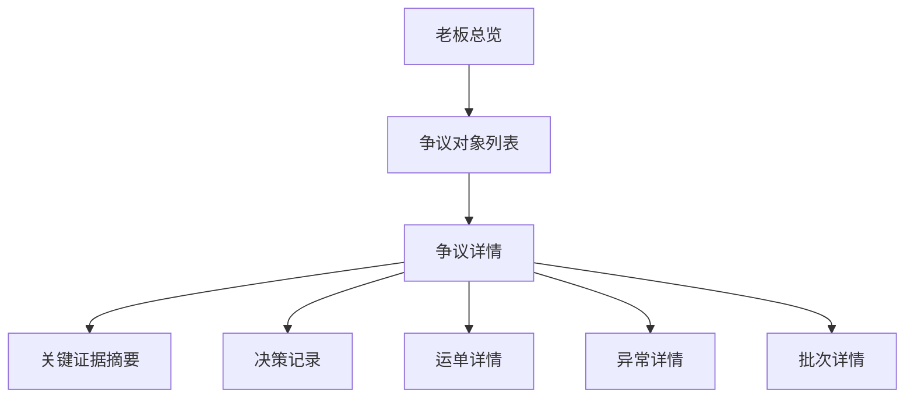

# 老板追溯页前端设计草案

适用范围：
- `ai-code/前端相关设计/` 中老板/管理层视角相关后台前端设计
- Odoo 物流后台中的老板总览、争议对象、关键证据摘要、决策记录相关页面

优先基准：
- `Odoo物流后台前端总体设计总览.md`
- `系统页面关系总览.md`
- `工作台模块前端设计草案.md`
- `留痕与追溯模块前端设计草案.md`
- `异常中心前端设计草案.md`

关联文档：
- `04_来源资料与历史草图/02_旧版方案/老板追溯界面改造方案.md`
- `04_来源资料与历史草图/03_页面草图与旧清单/老板追溯查看页草图.md`
- `04_来源资料与历史草图/03_页面草图与旧清单/页面字段清单.md`
- `04_来源资料与历史草图/03_页面草图与旧清单/页面动作清单.md`

---

## 1. 模块定位

老板追溯页不是管理员后台的缩小版，也不是工作台的高层摘要版。

它是专门为“判断、决策、追责”设计的一组页面。

它承接的是这条链：

```text
老板总览
  -> 争议对象列表
  -> 争议详情 / 对象摘要
  -> 关键证据摘要
  -> 决策记录
  -> 必要时下钻管理员详情页
```

它要解决的问题是：

1. 当前最值得关注的争议对象是什么
2. 当前证据是否足够支撑判断
3. 风险是集中在运单、批次还是异常对象上
4. 老板是否已经可以做出结论
5. 如果还不够，下一步应该下钻到哪里

所以它的核心价值是：

**先看结论，再看证据，再决定要不要看原始过程。**

---

## 2. 模块边界

## 2.1 这个模块负责什么

- 老板总览页
- 争议对象列表页
- 争议详情页
- 关键证据摘要区
- 决策记录区
- 老板页到管理员页的下钻入口

## 2.2 这个模块不负责什么

- 不承担日常运营处理
- 不承担大量状态机流转
- 不承担完整时间线主阅读
- 不承担资源管理、规则配置、执行组织管理

## 2.3 当前最关键的边界判断

1. 老板页先看“结论和风险”
2. 管理员页先看“过程和处理”
3. 老板页可以下钻管理员页，但不应默认等于管理员页

---

## 3. 菜单结构

当前建议在系统中单独保留老板视角分组：

```text
老板追溯
├─ 总览看板
├─ 争议对象
├─ 关键证据摘要
└─ 决策记录
```

补充说明：

- 一期先落稳 `总览看板` 与 `争议对象`
- `关键证据摘要` 与 `决策记录` 可先以页内区块或下级页面承接

---

## 4. 页面关系



关系说明：

- `老板总览` 是入口页
- `争议详情` 是老板视角的中枢页
- `运单详情 / 异常详情 / 批次详情` 只在需要时下钻

---

## 5. 页面清单

| 页面 | 页面定位 | 页面类型 | 当前优先级 | 核心价值 |
|---|---|---|---|---|
| 老板总览页 | 决策首页 | 看板 / 聚合页 | P0 | 先看今天整体风险和重点对象 |
| 争议对象列表页 | 争议入口页 | 列表页 | P0 | 快速定位最值得关注的争议 |
| 争议详情页 | 决策中枢页 | 详情页 | P1 | 看争议摘要、关键证据、责任判断 |
| 关键证据摘要页/区 | 证据摘要阅读页 | 详情/聚合页 | P1 | 快速核对关键证据链 |
| 决策记录页/区 | 决策收口页 | 详情/列表区 | P1/P2 | 留下判断结论与跟进记录 |

---

## 6. 页面结构与布局

## 6.1 老板总览页

页面目标：

- 让老板 10 秒内了解当前风险结构
- 快速看到最值得关注的争议对象
- 直接下钻到争议详情或对象详情

推荐分区：

1. 顶部筛选区
2. 结论卡区
3. 重点争议对象列表
4. 关键证据链摘要区
5. 风险分布摘要区
6. 最近变化区
7. 右侧摘要区

### 顶部筛选区

建议支持：

- 时间范围
- 风险等级
- 区域
- 对象类型
- 快捷筛选标签

重点：

- 筛选项少而稳定
- 只保留争议、风险、证据相关维度

### 结论卡区

建议固定卡片：

- 待处理争议数
- 证据不足对象数
- 高风险批次数
- 今日新增高风险数
- 闭环率

重点：

- 每张卡都应支持下钻
- 卡片先回答“今天整体怎样”

### 重点争议对象列表

建议展示：

- 对象编号
- 风险结论
- 证据状态
- 最近更新时间
- 主动作

重点：

- 列表应更短、更聚焦
- 强调“看结论”，不是“看明细”

### 关键证据链摘要区

建议每条摘要固定回答：

- 什么时候出现了关键异常
- 是否有图
- 证据够不够
- 当前责任是否可判

重点：

- 它是老板页的核心区域
- 老板不需要先看完整时间线

### 风险分布摘要区

建议展示：

- 异常类型分布
- 重点区域
- 多次异常对象数

重点：

- 支撑全局判断
- 不做深度 BI

### 最近变化区

建议展示：

- 新增高风险对象
- 风险升级对象
- 证据不足风险变化

重点：

- 快速感知最新变化
- 不做很长消息流

### 右侧摘要区

建议放：

- 老板摘要卡
- 快速跳转卡
- 当前结论说明
- 技术信息折叠区

重点：

- 只做决策辅助

## 6.2 争议对象列表页

页面目标：

- 让老板快速定位当前最值得关注的争议
- 基于争议摘要决定是否进入详情

推荐字段：

- 对象标识
- 争议摘要
- 双方证据摘要
- 责任线索
- 风险等级
- 最新更新时间

主动作：

- 查看争议详情
- 查看关键证据

页面重点：

- 默认按风险等级排序
- 不支持复杂批量操作
- 证据对比和责任线索要比技术字段更靠前

## 6.3 争议详情页

页面目标：

- 让老板在一个页面完成争议判断

推荐分区：

1. 争议摘要区
2. 关键证据对比区
3. 责任判断区
4. 决策记录区
5. 下钻入口区

主动作：

- 记录判断结论
- 标记已核实
- 指派跟进

页面重点：

- 先争议摘要，再关键证据，再责任判断
- 默认不展示完整原始时间线
- 需要时再下钻管理员页

## 6.4 关键证据摘要页/区

页面目标：

- 支持跨争议快速核对关键证据

推荐内容：

- 按争议对象分组的关键图
- 关键节点图合集
- 证据完整性结论

页面重点：

- 只做摘要，不替代对象详情中的证据查看

## 6.5 决策记录页/区

页面目标：

- 留下老板的判断与跟进指令

推荐内容：

- 判断结论
- 判断时间
- 判断人
- 跟进责任人
- 跟进状态摘要

页面重点：

- 它是“收口区”
- 不应抢主判断区

---

## 7. 字段建议

## 7.1 风险摘要层

一期建议优先字段：

- `pending_dispute_total`
- `evidence_insufficient_total`
- `high_risk_batch_total`
- `today_new_high_risk_total`
- `closure_rate`

## 7.2 争议对象层

一期建议优先字段：

- `object_no`
- `object_type`
- `dispute_summary`
- `risk_level`
- `evidence_status`
- `liability_hint`
- `latest_update_time`

## 7.3 关键证据层

一期建议优先字段：

- `key_trace_time`
- `key_trace_type`
- `key_image_count`
- `evidence_completeness`
- `decision_readiness`

## 7.4 决策记录层

一期建议优先字段：

- `decision_status`
- `decision_remark`
- `decision_user_name`
- `decision_time`
- `follow_up_owner_name`

---

## 8. 动作建议

## 8.1 主动作

- 查看争议详情
- 查看关键证据
- 记录判断结论
- 标记已核实

## 8.2 辅助动作

- 查看关联对象
- 查看全部争议对象
- 复制争议编号

## 8.3 当前不建议在老板页承接的动作

- 批量标记处理中
- 复杂状态机流转
- 技术字段编辑
- 原始时间线重阅读

原因：

- 老板页是决策页，不是操作页

---

## 9. 交互规范

## 9.1 先结论，后证据，最后下钻

老板页所有关键页面都应遵循：

1. 先看结论
2. 再看关键证据
3. 最后再决定是否下钻管理员页

## 9.2 信息密度必须明显低于管理员页

建议：

- 主卡片不超过 3 到 5 张
- 争议对象列表单屏不超过 10 条
- 关键证据默认不超过 3 到 5 张

## 9.3 老板页和管理员页必须共享同一套事实来源

推荐规则：

- 老板页做摘要视图
- 管理员页做事实视图
- 两边消费同一套对象和证据链

---

## 10. 与 Odoo 原生模块的关系

## 10.1 可复用能力

- `kanban`
- `tree`
- `form`
- `act_window`

## 10.2 当前推荐

- 总览看板优先用 `kanban` 或轻量 dashboard action 承接
- 争议对象列表优先用 `tree`
- 争议详情优先用 `form`
- 关键证据摘要区可做轻量增强，但不重写整套前端壳子

---

## 11. 实现层建议

## 11.1 一期推荐实现方式

- 老板总览与关键摘要优先走聚合接口
- 卡片下钻后优先回到 Odoo 原生列表页和详情页

## 11.2 一期必须先稳定的前置

- 风险口径
- 争议对象口径
- 关键证据摘要口径
- 老板页与管理员页的状态同步规则

## 11.3 一期可以接受的降级

- 争议详情先做轻摘要版
- 证据摘要中心先做区块版，不急着独立成完整频道
- 决策记录先做简版记录，不做复杂审批流

---

## 12. 当前阶段结论

老板追溯页的核心不是“看得更细”，而是：

**让老板先看到结论，再决定要不要继续往下看。**

只要老板能快速知道：

- 哪些对象最值得关注
- 当前证据是否足够
- 是否已经能判断责任
- 下一步该看摘要、看证据还是下钻管理员详情

这组页面就达标。

---

## 13. 下一步衔接

基于这份草案，下一步最自然的是：

1. 进入 `仓储管理前端接入设计草案.md`
2. 再进入 `业务单据前端接入设计草案.md`
3. 最后补 `业务单据与追溯链路入口设计.md` 和 `Smart Button设计清单.md`

