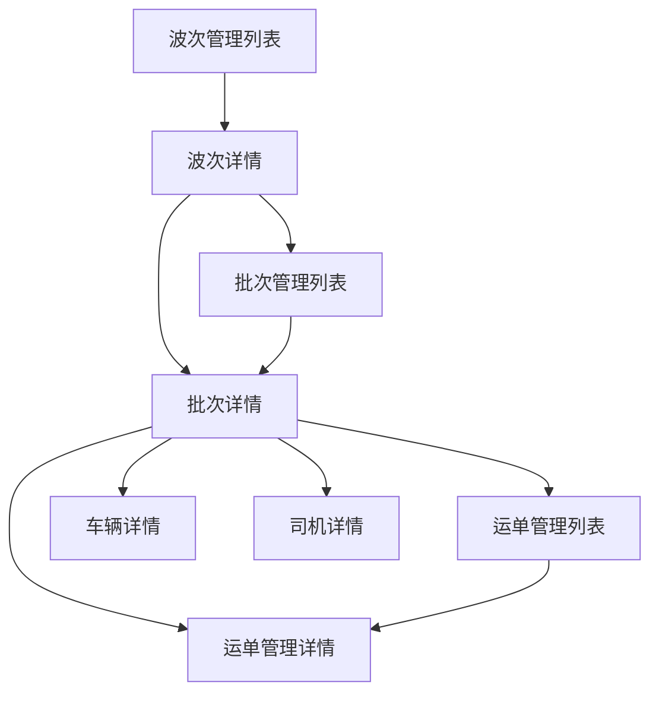
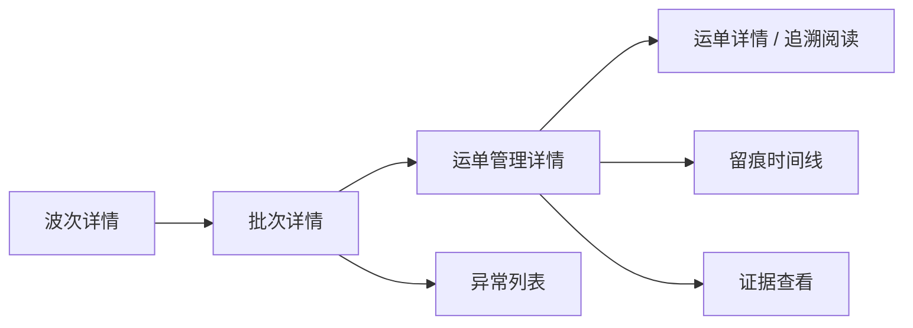

# 运输与调度模块前端设计草案

适用范围：
- `ai-code/前端相关设计/` 中运输与调度相关后台前端设计
- Odoo 物流后台中的波次、批次、运单、车辆、司机管理页面

优先基准：
- `Odoo物流后台前端总体设计总览.md`
- `前端模块结构与菜单总表.md`
- `系统页面关系总览.md`
- `Odoo19物流留痕系统运单主对象与留痕主流程设计.md`

关联文档：
- `前端设计新工作计划安排.md`
- `04_来源资料与历史草图/03_页面草图与旧清单/批次追溯列表页草图.md`
- `04_来源资料与历史草图/03_页面草图与旧清单/批次详情页草图.md`
- `04_来源资料与历史草图/03_页面草图与旧清单/页面动作清单.md`

---

## 1. 模块定位

运输与调度模块不是追溯模块的重复版本，而是后台执行主线的管理模块。

它要承接的是这条链：

```text
波次 -> 批次 -> 运单 -> 车辆 / 司机 / 仓侧执行上下文
```

它主要回答下面这些问题：

1. 今天有哪些波次、每波包含哪些批次
2. 每个批次由哪辆车、哪个司机执行
3. 哪些运单挂在当前批次下
4. 当前执行推进到了哪一步
5. 哪些对象值得继续下钻到追溯阅读链

这意味着：

- 运输与调度模块负责“组织执行上下文”
- 留痕与追溯模块负责“阅读事实与证据”

两者是一前一后的关系，不是同一组页面换个名字。

---

## 2. 模块边界

## 2.1 这个模块负责什么

- 波次管理
- 批次管理
- 运单管理
- 车辆管理
- 司机管理
- 从执行组织页跳到追溯页的入口设计

## 2.2 这个模块不负责什么

- 不直接承担完整证据阅读
- 不直接承担最终判责
- 不把批次页做成运单详情页的替代品
- 不把车辆页、司机页做成追溯事实主页面

## 2.3 当前最关键的边界判断

1. `波次` 是调度组织对象，不是留痕主对象
2. `批次` 是执行承载对象，不是门店交付事实主对象
3. `运单` 是执行对象，也是后续追溯事实主入口
4. `车辆`、`司机` 在当前阶段更偏执行资源对象，不是主阅读对象

---

## 3. 菜单结构

当前推荐在一级模块 `运输与调度` 下按下面结构组织：

```text
运输与调度
├─ 波次管理
├─ 批次管理
├─ 运单管理
├─ 车辆管理
└─ 司机管理
```

说明：

- 这 5 个入口都属于“管理主线”
- 其中 `波次管理 -> 批次管理 -> 运单管理` 是主链
- `车辆管理`、`司机管理` 是资源支撑页

---

## 4. 页面关系

## 4.1 模块内主关系



## 4.2 模块外下钻关系



说明：

- `运单管理详情` 是执行主线里最接近事实主线的页面
- 但完整事实阅读仍应回到追溯链中的 `运单详情`
- `批次详情` 更适合做“聚合组织中枢页”
- `波次详情` 更适合做“调度组织总览页”

---

## 5. 页面清单

| 页面 | 页面定位 | 页面类型 | 当前优先级 | 核心价值 |
|---|---|---|---|---|
| 波次管理列表页 | 调度组织主入口 | 列表页 | P0 | 先看今天有哪些波次 |
| 波次详情页 | 波次级中枢页 | 详情页 | P0 | 看本波次包含哪些批次、整体执行如何 |
| 批次管理列表页 | 执行聚合主入口 | 列表页 | P0 | 从执行层看整体健康度 |
| 批次详情页 | 批次级中枢页 | 详情页 | P0 | 组织运单、异常、留痕摘要 |
| 运单管理列表页 | 执行对象列表页 | 列表页 | P0 | 管理对象、看执行状态 |
| 运单管理详情页 | 执行对象中枢页 | 详情页 | P0 | 看执行上下文并跳追溯页 |
| 车辆管理列表/详情 | 执行资源页 | 列表 + 详情 | P1 | 看车辆当前承接哪些批次/波次 |
| 司机管理列表/详情 | 执行资源页 | 列表 + 详情 | P1 | 看司机当前承接哪些批次/波次 |

---

## 6. 页面结构与布局

## 6.1 波次管理列表页

页面目标：

- 快速知道今天有哪些波次
- 快速判断哪一波值得优先进入
- 快速下钻到批次层

推荐字段：

- 波次编号
- 调度日期
- 仓库
- 计划出发时间
- 批次总数
- 运单总数
- 车辆总数
- 当前整体状态
- 当前异常批次数
- 最近更新时间

主动作：

- 查看波次详情
- 查看关联批次

页面结构建议：

- 搜索栏
- 快捷筛选
- 双层摘要列表

## 6.2 波次详情页

页面目标：

- 从调度组织层看整体执行状态
- 判断问题集中在哪些批次
- 下钻到批次层继续看

推荐分区：

1. 头部摘要区
2. 调度上下文区
3. 批次概览区
4. 风险批次摘要区
5. 最近变更摘要区

页面重点：

- 不直接铺完整运单明细
- 不直接承担证据阅读
- 强调“波次 -> 批次”的组织视角

## 6.3 批次管理列表页

页面目标：

- 从执行层识别高风险批次、停滞批次、证据不足批次
- 快速进入批次详情、异常对象、关联运单

当前建议：

- 可直接吸收现有 `批次追溯列表页草图` 的聚合判断思路
- 但命名和定位必须明确为“管理页”

管理页应重点看：

- 批次状态
- 运单总数
- 异常运单数
- 司机与车辆
- 最近变化

而不是重点看：

- 单张证据
- 单次留痕细节

## 6.4 批次详情页

页面目标：

- 作为批次级执行中枢页
- 组织运单概览、异常摘要、留痕摘要和执行上下文

当前建议：

- 可直接吸收现有 `批次详情页草图`
- 继续保留“摘要 -> 执行上下文 -> 运单概览 -> 留痕摘要 -> 异常摘要”的阅读顺序

## 6.5 运单管理列表页

页面目标：

- 从执行视角管理运单对象
- 快速区分待执行、执行中、已完成、异常中的运单

推荐字段：

- 运单号
- 配送日期
- 店铺
- 所属波次
- 所属批次
- 车辆
- 司机
- 当前执行状态
- 是否异常
- 最近留痕时间
- 最近更新时间

说明：

- 这页是“执行管理列表页”
- 与“运单追溯列表页”不是同一页

## 6.6 运单管理详情页

页面目标：

- 先看执行上下文是否完整
- 再决定是否跳到完整追溯详情页

推荐分区：

1. 运单头部摘要
2. 执行上下文区
3. 订单明细摘要区
4. 最近留痕摘要区
5. 异常摘要区
6. 快捷跳转区

主动作：

- 查看完整追溯详情
- 查看留痕时间线
- 查看异常对象
- 查看所属批次

## 6.7 车辆管理页

页面定位：

- 资源对象页，不是追溯对象页

推荐内容：

- 车辆基础信息
- 当前承接波次/批次
- 今日执行摘要
- 当前状态
- 关联司机

重点：

- 看这辆车今天在执行什么
- 不在车辆页直接做事实判责

## 6.8 司机管理页

页面定位：

- 执行资源页，不是事实主阅读页

推荐内容：

- 司机基础信息
- 今日承接批次
- 今日承接运单数
- 当前状态
- 最近执行摘要

重点：

- 看这位司机当前承接了哪些任务
- 需要判责时仍下钻到运单、留痕、证据层

---

## 7. 字段建议

## 7.1 波次层

一期建议优先字段：

- `wave_no`
- `dispatch_date`
- `warehouse_id`
- `planned_departure_time`
- `batch_count`
- `waybill_count`
- `vehicle_count`
- `current_status`
- `exception_batch_count`
- `latest_update_time`

## 7.2 批次层

一期建议优先字段：

- `batch_no`
- `wave_id`
- `vehicle_id`
- `driver_id`
- `load_warehouse_id`
- `load_location`
- `planned_departure_time`
- `waybill_count`
- `signed_waybill_count`
- `exception_waybill_count`
- `risk_level`
- `latest_trace_time`

## 7.3 运单层

一期建议优先字段：

- `waybill_no`
- `delivery_date`
- `store_id`
- `batch_id`
- `wave_id`
- `vehicle_id`
- `driver_id`
- `route_seq`
- `current_status`
- `has_exception`
- `latest_trace_time`

## 7.4 资源层

车辆、司机页建议字段以“任务承接摘要”为主，不以深度追溯字段为主。

---

## 8. 动作建议

## 8.1 主动作

- 查看详情
- 查看下级对象
- 查看异常对象
- 查看完整追溯详情

## 8.2 辅助动作

- 复制编号
- 查看执行上下文
- 跳所属波次
- 跳所属批次

## 8.3 当前不建议在这组页面承接的动作

- 大量状态编辑
- 证据审核结论
- 复杂责任判断
- 大图证据主阅读

原因：

- 这些动作更适合在追溯阅读链里完成
- 管理页应优先服务“组织和下钻”

---

## 9. 交互规范

## 9.1 管理主线与追溯主线必须区分

建议统一按下面口径：

- `波次管理 / 批次管理 / 运单管理`：管理主线
- `运单追溯 / 批次追溯 / 当前异常`：阅读主线

管理主线重点：

- 对象状态
- 执行上下文
- 下级对象概览
- 快捷下钻

阅读主线重点：

- 留痕事实
- 证据链
- 异常与处理
- 最终判断

## 9.2 下钻优先级

推荐优先级：

1. 波次先下钻到批次
2. 批次先下钻到运单
3. 运单再下钻到留痕、证据、异常

## 9.3 页面层级控制

不建议：

- 在波次页堆运单细节
- 在批次页堆证据大图
- 在车辆页直接展开完整时间线

---

## 10. 与 Odoo 原生模块的关系

## 10.1 可复用能力

- `tree`
- `form`
- `search`
- `act_window`
- smart button
- stat button

## 10.2 可能复用的原生模块

- `stock`
- `fleet`
- `contacts`

## 10.3 当前建议

- 管理页优先用 Odoo 原生视图承接
- 先把执行主线上下文做稳
- 不在第二阶段就重写前端壳子

---

## 11. 实现层建议

## 11.1 一期推荐实现方式

- 列表页：`RPC + search/tree`
- 详情页：`RPC + form`
- 资源页：`RPC + 轻摘要字段`

## 11.2 一期必须先稳定的前置

- 波次、批次、运单三层对象关系
- 车辆、司机与批次/运单的挂接关系
- 执行状态字段口径

## 11.3 一期可以接受的降级

- 车辆页、司机页先做轻量资料+任务摘要页
- 波次页先做总览和下钻，不做复杂图表
- 运单管理详情先做中枢页，不做重交互

---

## 12. 当前阶段结论

运输与调度模块的核心不是“把更多对象做成管理页”，而是：

**把 `波次 -> 批次 -> 运单` 这条执行主线做成稳定、清晰、可下钻的后台组织链。**

只要这条主链稳住，后续追溯、异常、工作台、老板页都会有更稳定的上下文来源。

---

## 13. 下一步衔接

基于这份草案，下一步最自然的是：

1. 补 `后台按波次批次运单追溯页面设计.md`
2. 再把现有运单、异常、工作台草图收口成正式模块稿

也就是说，第二阶段先做“执行主线”，第三阶段再把“阅读主线”正式归档。

