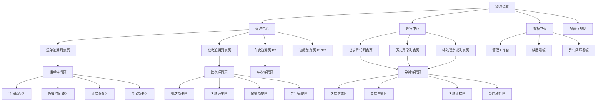
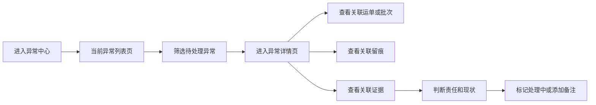
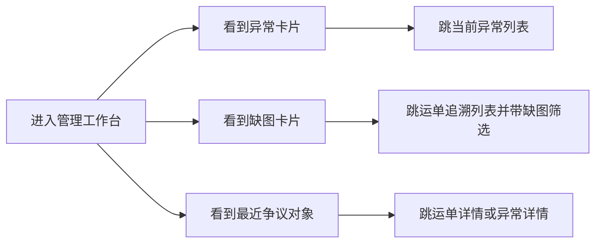

# 后台信息架构图

适用范围：
- 物流留痕系统管理员后台
- Odoo 后台菜单、动作、列表、详情、看板的结构设计

关联文档：
- `管理员后台界面改造方案.md`
- `于睿_后台前端与追溯界面工作大纲.md`
- `odoo-reconstruct/odoo-19.0/系统重构核心设计摘要.md`
- `odoo-reconstruct/odoo-19.0/doc/Odoo19物流留痕系统模块重设方案.md`

---

## 1. 文档目标

本文件用于回答 4 个问题：

1. 管理员后台的一级入口应该如何组织
2. 各个页面之间应该如何跳转
3. 哪些页面是一层主入口，哪些页面是详情页
4. 这套信息架构如何映射到 Odoo 的菜单和动作

这不是视觉原型，而是后台页面的结构蓝图。

---

## 2. 信息架构设计原则

## 2.1 追溯优先，不是配置优先

管理员进入后台后，最先要到的是：
- 找对象
- 看状态
- 看留痕
- 看证据

而不是先看到一堆配置和管理入口。

## 2.2 入口少而清晰

一级菜单不能太散。

建议只保留少量高价值一级入口：
- 追溯中心
- 异常中心
- 看板中心
- 配置与规则

## 2.3 详情页必须围绕主链组织

详情页不是静态字段堆叠页，而是追溯链阅读页。

必须围绕：

`当前状态 -> 留痕事实 -> 图片证据 -> 异常处理`

## 2.4 证据不单独漂浮

证据页可以有独立入口，但默认阅读入口必须挂在：
- 运单详情
- 批次详情
- 异常详情

不能做成孤立附件页。

---

## 3. 一级信息架构

管理员后台建议按下面 4 个一级入口组织。

```text
物流留痕
├─ 追溯中心
├─ 异常中心
├─ 看板中心
└─ 配置与规则
```

### 3.1 追溯中心

职责：
- 从业务对象出发做追溯

服务问题：
- 这票货现在怎么样
- 最近留痕是什么
- 历史证据在哪

### 3.2 异常中心

职责：
- 从问题对象出发处理争议

服务问题：
- 哪些对象有异常
- 哪些异常待处理
- 哪些异常证据不足

### 3.3 看板中心

职责：
- 从管理视角看风险分布和处理效率

服务问题：
- 今日异常多不多
- 缺图情况怎么样
- 哪些对象值得优先关注

### 3.4 配置与规则

职责：
- 承接系统运行所需的基础配置入口

注意：
- 不是管理员日常高频操作区
- 不应该压过追溯主入口

---

## 4. 二级信息架构

## 4.1 追溯中心

```text
追溯中心
├─ 运单追溯
├─ 批次追溯
├─ 波次追溯（P1/P2）
├─ 车次追溯（P2）
└─ 证据总览（P1/P2）
```

### 运单追溯

定位：
- 最核心的一层入口

原因：
- 运单是当前阶段最稳的追溯主对象
- 留痕和证据都应围绕运单展开阅读

下层页面：
- 运单追溯列表页
- 运单详情页

### 批次追溯

定位：
- 管理者从仓内 / 批量问题视角切入的入口

下层页面：
- 批次追溯列表页
- 批次详情页

说明：
- 批次页主要承担聚合判断
- 运单仍是批次下钻后的直接追溯对象

### 波次追溯（P1/P2）

定位：
- 更高一层的调度与执行组织视角

当前状态：
- 作为结构预留，不强行进入一期主战场

### 车次追溯（P2）

定位：
- 后续从运输执行视角补强

当前状态：
- 暂不进入一期主范围

### 证据总览（P1/P2）

定位：
- 作为辅助性汇总入口

当前原则：
- 不作为一期主入口
- 优先通过运单 / 异常详情查看证据

## 4.2 异常中心

```text
异常中心
├─ 当前异常
├─ 历史异常
└─ 待处理争议
```

### 当前异常

定位：
- 当前待管理员判断和处理的问题集合

### 历史异常

定位：
- 已处理或已关闭异常的回查入口

### 待处理争议

定位：
- 优先级更高的一组异常对象

说明：
- 可以是异常列表的一个预设筛选视图
- 不一定要独立一套模型

## 4.3 看板中心

```text
看板中心
├─ 管理工作台
├─ 缺图看板
└─ 异常闭环看板
```

### 管理工作台

定位：
- 管理员进入后台后的总览页

建议显示：
- 今日待处理异常数
- 证据不完整对象数
- 最近争议运单
- 快捷进入运单追溯和异常中心

### 缺图看板

定位：
- 关注证据完整度

### 异常闭环看板

定位：
- 关注异常发现到处理的闭环情况

## 4.4 配置与规则

```text
配置与规则
├─ 留痕类型
├─ 异常类型
└─ 留痕规则
```

说明：
- 这些入口更多是后端和管理配置承接
- 前端负责人只需保证入口位置和信息结构合理
- 不作为一期后台体验主战场

---

## 5. 页面层级结构图

下面这张图表达“入口页 -> 列表页 -> 详情页 -> 子区块”的层级关系。



---

## 6. 管理员主路径图

这是管理员最核心的使用路径，后续页面设计必须围绕它收口。


这个路径说明：
- 运单追溯页是最核心入口
- 运单详情页是最核心阅读页
- 时间线和证据区是最核心判断区

---

## 7. 异常处理路径图

异常中心不是附属页面，而是管理员第二高频入口。



这个路径说明：
- 异常详情必须能读到完整证据链
- 异常页不能只是状态字段页

---

## 8. 看板路径图

看板中心的作用不是替代追溯，而是帮助管理员快速决定“先看什么”。



这个路径说明：
- 看板页必须支持下钻
- 看板页不直接替代列表和详情

---

## 9. Odoo 菜单建议映射

建议后续按下面口径映射成 Odoo `menuitem`。

## 9.1 一级菜单

- `menu_logistics_trace_root`
  - 名称：`物流留痕`

## 9.2 二级菜单

- `menu_logistics_trace_tracking`
  - 名称：`追溯中心`
- `menu_logistics_trace_exception`
  - 名称：`异常中心`
- `menu_logistics_trace_dashboard`
  - 名称：`看板中心`
- `menu_logistics_trace_config`
  - 名称：`配置与规则`

## 9.3 三级菜单建议

追溯中心下：
- `menu_logistics_trace_waybill`
- `menu_logistics_trace_batch`
- `menu_logistics_trace_wave`
- `menu_logistics_trace_trip`
- `menu_logistics_trace_evidence`

异常中心下：
- `menu_logistics_trace_exception_current`
- `menu_logistics_trace_exception_history`
- `menu_logistics_trace_exception_pending`

看板中心下：
- `menu_logistics_trace_dashboard_workbench`
- `menu_logistics_trace_dashboard_missing_evidence`
- `menu_logistics_trace_dashboard_exception_closure`

## 9.4 菜单ID命名规范

为确保菜单ID在整个Odoo项目中保持一致性和可维护性，制定以下命名规范：

### 基本原则
1. **前缀统一**：所有菜单ID以 `menu_logistics_trace_` 开头
2. **层级分隔**：使用下划线分隔不同层级，不使用驼峰或连字符
3. **语义明确**：ID应反映菜单的功能和位置层级
4. **长度控制**：单个ID不超过50个字符

### 命名模式
```
menu_logistics_trace_{一级入口}_{二级入口}_{三级入口}_{功能}
```

### 各级命名规则
| 层级 | 命名规则 | 示例 |
|---|---|---|
| 一级入口 | 使用模块根标识 | `root` |
| 二级入口 | 使用中心/区域英文名 | `tracking`（追溯中心）、`exception`（异常中心）、`dashboard`（看板中心）、`config`（配置与规则） |
| 三级入口 | 使用业务对象或页面类型 | `waybill`（运单追溯）、`batch`（批次追溯）、`wave`（波次追溯）、`trip`（车次追溯）、`evidence`（证据总览） |
| 功能/页面 | 使用页面功能描述 | `list`（列表页）、`detail`（详情页）、`workbench`（管理工作台） |

### 完整示例
- `menu_logistics_trace_root` - 一级根菜单
- `menu_logistics_trace_tracking` - 二级追溯中心
- `menu_logistics_trace_tracking_waybill` - 三级运单追溯
- `menu_logistics_trace_tracking_waybill_list` - 四级运单列表页（如有需要）
- `menu_logistics_trace_exception_current` - 异常中心下的当前异常列表

### 特殊场景处理
1. **详情页菜单**：详情页通常不独立创建菜单，而是通过列表页进入。如需独立菜单，可添加 `_detail` 后缀。
2. **看板页菜单**：看板页使用 `_dashboard_` 作为二级入口，后跟看板类型。
3. **配置页菜单**：配置页使用 `_config_` 作为二级入口，后跟配置项名称。

### 实施建议
1. 在 `__manifest__.py` 的 `data` 数组中按层级顺序声明菜单
2. 为每个菜单添加清晰的 `name` 和 `sequence` 属性
3. 使用 `parent` 属性建立层级关系，而不是依赖ID命名
4. 在模块初始化时验证菜单ID唯一性

---


## 10. 页面与动作映射建议

建议后续一页一个 `act_window` 主入口，不要让页面关系混乱。

推荐映射：

| 页面 | 建议动作 |
|---|---|
| 运单追溯列表页 | `action_logistics_trace_waybill_list` |
| 批次追溯列表页 | `action_logistics_trace_batch_list` |
| 当前异常列表页 | `action_logistics_trace_exception_current` |
| 历史异常列表页 | `action_logistics_trace_exception_history` |
| 待处理争议列表页 | `action_logistics_trace_exception_pending` |
| 管理工作台 | `action_logistics_trace_dashboard_workbench` |

详情页进入方式建议：
- 通过列表点击主对象进入 `form`
- 通过 smart button 在对象之间跳转
- 不单独把所有详情页都做成顶层菜单

---

## 11. 一期推荐架构冻结版

为了避免范围漂移，当前建议先冻结一期架构为：

```text
物流留痕
├─ 追溯中心
│  ├─ 运单追溯
│  └─ 批次追溯
├─ 异常中心
│  ├─ 当前异常
│  └─ 历史异常
└─ 看板中心
   └─ 管理工作台
```

说明：
- 这是当前最稳的一期版本
- 证据通过详情页区块进入，不强行单独顶层化
- 车次和证据总览留到 P2
- 配置与规则保留后台入口，但不作为一期体验重点

---

## 12. 当前不建议的结构

当前不建议采用以下结构：

### 方案 A：菜单太平铺

问题：
- 一级菜单过多
- 用户进入后台后不知道先去哪

### 方案 B：证据作为独立第一入口

问题：
- 证据脱离对象和留痕上下文后，不利于判断

### 方案 C：异常埋在运单详情里，不做独立入口

问题：
- 管理员无法从问题对象直接开始处理

### 方案 D：先做复杂配置中心

问题：
- 稀释追溯主闭环

---

## 13. 下一步衔接

这份信息架构图落地后，下一步最自然的是补下面两份：

1. 《后台页面改造清单》
2. 《页面字段清单》

建议先从这 3 个页面开始细化：

1. 运单追溯列表页
2. 运单详情页
3. 当前异常列表页

---

## 14. 结论

管理员后台的信息架构，不应该按“系统里有哪些模型”来长，而应该按“管理员怎么完成追溯判断”来长。

因此当前最合理的结构是：

- 追溯中心负责找对象和看事实
- 异常中心负责从问题出发做判断
- 看板中心负责决定先看什么
- 配置与规则作为支撑层存在

只要这四层入口结构稳定，后续页面、字段、动作和 Odoo 菜单落地都会更顺。
