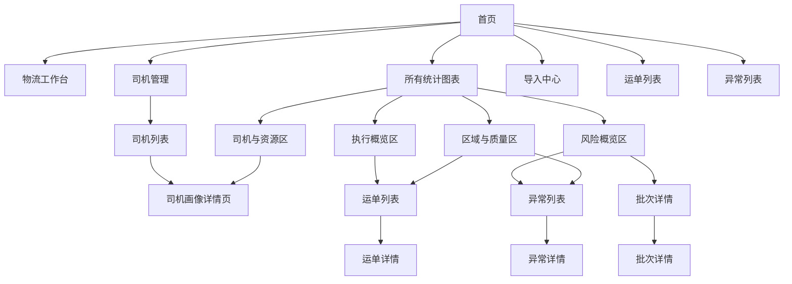

# 三期系统页面关系总览

适用范围：
- `前端设计/三期前端优化设计/` 下三期系统级页面关系、入口层级和跨页面跳转
- 当前重点覆盖：首页、司机管理、所有统计图表、界面系统化美化影响页

优先基准：
- `2026-04-17_Odoo物流后台三期前端优化设计总纲.md`
- `三期前端模块结构与菜单总表.md`

关联文档：
- `../01_专题方案/2026-04-16_Odoo物流后台员工模块分层与司机管理专题方案.md`
- `../01_专题方案/2026-04-16_Odoo物流后台统计图表专题方案.md`
- `../02_验收与联调/三期前端落地与联调说明.md`

---

## 1. 文档定位

这份文档用于固定三期页面之间的关系。

它重点回答：

1. 首页之后用户先去哪
2. 司机管理和统计图表分别处于什么层级
3. 统计图表页如何下钻到列表和详情页
4. 哪些页面是三期界面系统化美化的重点承载页

---

## 2. 三期页面关系总原则

三期页面关系统一按下面 5 条原则理解：

1. 首页继续是系统分流页，不承担完整分析页和对象画像页职责
2. `所有统计图表` 是完整分析入口，首页只承接摘要入口
3. `司机画像详情页` 是执行资源对象的阅读中枢
4. 统计图表页优先下钻到可继续处理的列表页或对象详情页
5. 界面系统化美化优先作用于高频入口页和高感知页面，不一次性波及全部历史页

---

## 3. 页面分层总览

| 页面层级 | 页面角色 | 典型页面 | 主要回答的问题 |
| --- | --- | --- | --- |
| L1 入口层 | 总入口 / 分流 | 首页 | 我应该从哪里开始 |
| L2 工作区层 | 模块内入口 | 物流工作台、司机管理、所有统计图表、导入中心 | 今天重点看什么 |
| L3 对象层 | 对象发现与列表阅读 | 司机列表、运单列表、异常列表、批次列表 | 要找哪个对象 |
| L4 详情层 | 阅读中枢 | 司机画像详情页、运单详情、异常详情、批次详情 | 这个对象现在是什么情况 |

---

## 4. 三期系统级页面关系图



---

## 5. 三期 5 条主路径

### 5.1 首页分流主路径

```text
首页
  -> 物流工作台
  -> 司机管理
  -> 所有统计图表
  -> 导入中心
  -> 运单列表 / 异常列表
```

说明：

- 首页承担首次进入、角色引导和重点摘要
- 三期首页继续是总入口，但顶部栏和右上角操作区将纳入美化优化线

### 5.2 司机管理主路径

```text
首页 / 物流模块
  -> 司机管理
  -> 司机列表
  -> 司机画像详情页
  -> 最近运单 / 最近异常 / 关联列表
```

说明：

- 司机画像详情页是三期新增的关键阅读中枢页

### 5.3 数据分析主路径

```text
首页
  -> 所有统计图表
  -> 趋势图 / 排行图 / 分布图
  -> 业务列表
  -> 运单详情 / 异常详情 / 批次详情 / 司机画像详情页
```

说明：

- 统计页负责横向比较
- 司机画像页负责单对象纵向解释

### 5.4 对象阅读主路径

```text
首页 / 司机管理 / 所有统计图表 / 异常列表
  -> 运单列表 / 异常列表 / 批次列表
  -> 对象详情页
```

### 5.5 界面系统化美化观察主路径

```text
首页
  -> 顶部栏与导航区
  -> 右上角操作区
  -> 司机列表页
  -> 司机画像详情页
  -> 所有统计图表页
```

说明：

- 这条路径不是业务流，而是三期界面问题持续观察与归档路径

---

## 6. 关键页面关系表

| 起点页面 | 目标页面 | 关系类型 | 当前说明 |
| --- | --- | --- | --- |
| 首页 | 司机管理 | 模块入口 | 首页或物流模块进入司机管理 |
| 司机管理 | 司机列表 | 列表入口 | 三期新增对象列表 |
| 司机列表 | 司机画像详情页 | 主列表下钻 | 三期核心阅读入口 |
| 首页 | 所有统计图表 | 模块入口 | 首页统计摘要跳转 |
| 所有统计图表 | 运单列表 | 图表下钻 | 带时间范围和地区上下文 |
| 所有统计图表 | 异常列表 | 图表下钻 | 带异常类型或时间上下文 |
| 所有统计图表 | 批次详情/批次列表 | 图表下钻 | 来自高风险批次排行 |
| 所有统计图表 | 司机画像详情页 | 图表下钻 | 来自司机月均异常率排行 |
| 运单列表 | 运单详情 | 主列表下钻 | 延续二期中枢页 |
| 异常列表 | 异常详情 | 主列表下钻 | 问题处理入口 |

---

## 7. 三期新增重点页面说明

### 7.1 司机列表页

角色：

- 执行资源对象发现入口
- 查找、筛选、初步风险识别页

### 7.2 司机画像详情页

角色：

- 三期执行资源对象阅读中枢
- 指标、趋势、风险和关联记录承接页

### 7.3 所有统计图表

角色：

- 三期物流分析中心
- 趋势、排行、分布与下钻入口

### 7.4 首页

角色：

- 系统总入口
- 当前三期界面系统化美化的首批重点承载页

---

## 8. 与二期的主要差异

| 项目 | 二期 | 三期 |
| --- | --- | --- |
| 总入口 | 首页继续为总入口 | 不变，但开始处理首页顶部体验问题 |
| 新对象管理 | 未形成司机画像式详情 | 新增司机管理与司机画像页 |
| 统计页 | 已有完整入口 | 升级为更成熟的物流分析中心 |
| 美化线 | 仍偏零散说明 | 开始形成独立设计线 |

---

## 9. 当前边界

- 本文档只固定页面关系，不展开字段级设计
- 接口与返回结构继续看 `../02_跨模块规范/01_接口与数据/`
- 人工验收与联调顺序继续看 `../02_验收与联调/三期前端落地与联调说明.md`
