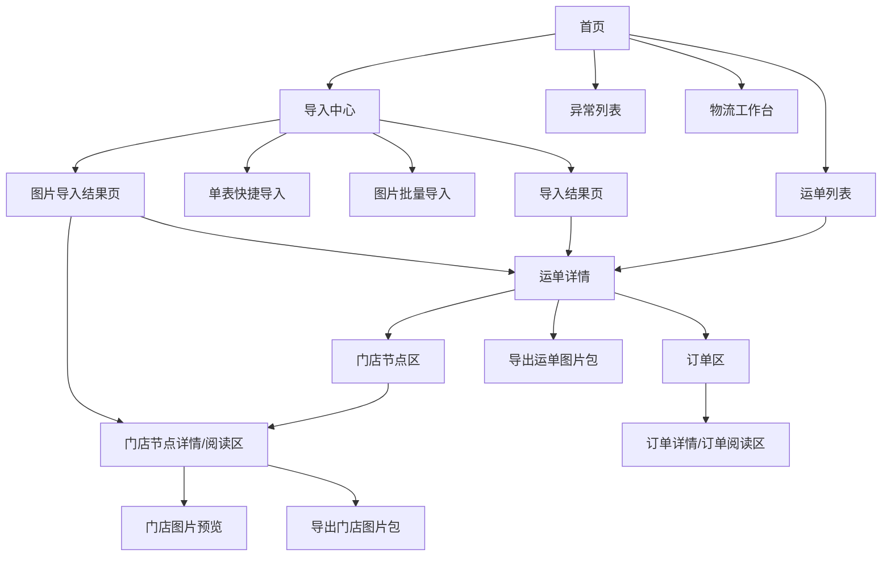

# 2026-04-21 四期页面信息架构与阅读链方案

适用范围：
- `前端设计/四期前端优化设计/` 下四期页面层级、入口关系和阅读链设计
- 当前重点覆盖：导入中心、运单、门店节点、订单、图片结果页与图片阅读页

优先基准：
- `2026-04-20_Odoo物流后台四期前端优化设计总纲.md`
- `../01_专题方案/2026-04-21_Odoo物流后台导入模板结构重构专题方案.md`
- `../02_跨模块规范/02_交互与组件/2026-04-21_四期图片模块前端交互与结果反馈方案.md`
- `../../三期前端优化设计/00_导航与总纲/三期系统页面关系总览.md`

---

## 1. 文档定位

这份文档用于固定四期页面之间的关系。

它重点回答：

1. 四期的页面主入口有哪些
2. 四期页面结构围绕哪几个核心对象组织
3. 导入、阅读、图片三条链分别怎么走
4. 哪些页面是四期真正的阅读中枢

---

## 2. 四期页面关系总原则

四期页面关系统一按下面 6 条原则理解：

1. 单表快捷导入是前端默认主入口，三 Sheet 入口可隐藏为高级入口。
2. `waybill` 仍是执行总容器，但首轮主阅读不再停在运单头。
3. `customer_line` 是门店交付节点，也是图片与门店现场事实的首轮业务挂点。
4. `order_line` 是四期首轮主阅读层，承接订单快照和订单对应货物的主展示信息。
5. `goods_line` 作为事实源保留，但不作为首轮主阅读层。
6. 图片阅读优先从门店节点展开，运单页只做汇总和打包导出入口。

---

## 3. 页面分层总览

| 页面层级 | 页面角色 | 典型页面 | 主要回答的问题 |
| --- | --- | --- | --- |
| L1 入口层 | 总入口 / 模块分流 | 首页、导入中心 | 今天从哪里开始 |
| L2 工作区层 | 四期核心能力入口 | 单表导入、图片批量导入、运单列表 | 今天要导什么、查什么 |
| L3 对象层 | 对象发现与列表阅读 | 运单列表、门店节点列表、订单列表 | 要找哪个运单、门店、订单 |
| L4 详情层 | 阅读中枢 | 运单详情、门店节点页、订单详情、图片导入结果页 | 这个对象当前是什么情况 |
| L5 证据层 | 证据阅读与导出 | 门店图片预览、运单图片结果页/导出入口 | 图片证据完整吗、能不能导出 |

---

## 4. 四期系统级页面关系图



---

## 5. 四期 5 条主路径

### 5.1 单表导入主路径

```text
首页 / 导入中心
  -> 单表快捷导入
  -> 预校验
  -> 导入结果页
  -> 运单详情
  -> 门店节点
  -> 订单阅读
```

说明：

- 这是四期最核心的新主路径
- 用户先看到的是单表，而不是三 Sheet
- 结果阅读最终会进入运单、门店、订单三层阅读链

### 5.2 图片导入主路径

```text
首页 / 导入中心 / 运单详情
  -> 图片批量导入
  -> 图片导入结果页
  -> 运单页汇总
  -> 门店图片预览
```

说明：

- 图片链与 XLSX 主数据链并行
- 图片结果页不是孤立终点，而是通向运单和门店阅读的中间页

### 5.3 运单阅读主路径

```text
运单列表
  -> 运单详情
  -> 门店节点区
  -> 订单区
```

说明：

- 运单页继续是执行总览页
- 但它不再独占四期的阅读重心

### 5.4 门店节点阅读主路径

```text
运单详情
  -> 门店节点详情/阅读区
  -> 门店图片预览
  -> 留痕/证据阅读
```

说明：

- 门店节点是四期最关键的新阅读节点
- 图片、留痕、签收、地址、顺序等现场事实都会逐步在这里汇合

### 5.5 订单阅读主路径

```text
运单详情
  -> 订单区
  -> 订单详情/订单阅读区
```

说明：

- `order_line` 是首轮主阅读层
- 订单页直接展示该订单对应货物的规格、条码、单位、数量、重量、体积、备注等主信息

---

## 6. 四期关键页面关系表

| 起点页面 | 目标页面 | 关系类型 | 当前说明 |
| --- | --- | --- | --- |
| 首页 | 导入中心 | 模块入口 | 四期单表导入与图片导入总入口 |
| 导入中心 | 单表快捷导入 | 主入口 | 默认业务导入入口 |
| 导入中心 | 图片批量导入 | 主入口 | 默认图片导入入口 |
| 单表快捷导入 | 导入结果页 | 提交后承接 | 继续回到统一结果链 |
| 图片批量导入 | 图片导入结果页 | 提交后承接 | 图片结果专用回看页 |
| 运单列表 | 运单详情 | 主列表下钻 | 保持执行总容器阅读入口 |
| 运单详情 | 门店节点阅读区 | 页内下钻 | 四期门店级阅读入口 |
| 运单详情 | 订单区 | 页内下钻 | 四期订单阅读主入口 |
| 门店节点阅读区 | 门店图片预览 | 主阅读下钻 | 首轮图片主阅读入口 |
| 图片导入结果页 | 运单详情 | 结果回看下钻 | 结果页回到业务页 |
| 图片导入结果页 | 门店节点阅读区 | 结果回看下钻 | 结果页回到真实挂点页 |

---

## 7. 四期新增重点页面说明

### 7.1 单表快捷导入页

角色：

- 四期业务用户主导入入口
- 负责简化输入，不直接暴露三 Sheet 复杂度

### 7.2 图片批量导入页

角色：

- 四期图片上传与导入入口
- 负责运单包/门店包上传说明和上传动作

### 7.3 图片导入结果页

角色：

- 单次图片导入的回看页
- 显示运单包、门店包和单图失败三层结果

### 7.4 门店节点阅读区

角色：

- 四期现场事实的首轮阅读中枢
- 承接门店地址、联系人、停靠点顺序、经纬度、签收要求、图片和后续留痕

### 7.5 订单阅读区

角色：

- 四期首轮业务主阅读层
- 直接展示订单快照和订单对应货物的主要展示信息

---

## 8. 阅读链总判断

四期的 3 条阅读链要明确分开：

### 8.1 执行阅读链

`运单 -> 门店节点 -> 订单`

### 8.2 事实源链

`订单 -> goods_line`

说明：

- 这条链首轮保留但不作为用户主阅读链

### 8.3 图片与证据阅读链

`运单汇总 -> 门店节点 -> 图片预览 / 留痕 / 证据`

说明：

- 图片首轮只认门店节点
- 运单页只承担汇总和导出入口

---

## 9. 当前边界

- 本文档只固定页面关系和阅读链，不展开字段级设计
- 接口与返回结构继续看 `../02_跨模块规范/01_接口与数据/`
- 图片前端交互细节继续看 `../02_跨模块规范/02_交互与组件/2026-04-21_四期图片模块前端交互与结果反馈方案.md`
- 联调勾验顺序继续看 `../02_验收与联调/2026-04-21_四期联调与验收清单.md`

---

## Next Suggestion

建议下一步继续围绕这条页面结构收口：

1. 运单详情页改造草案
2. 门店节点阅读区结构草案
3. 订单阅读区结构草案
