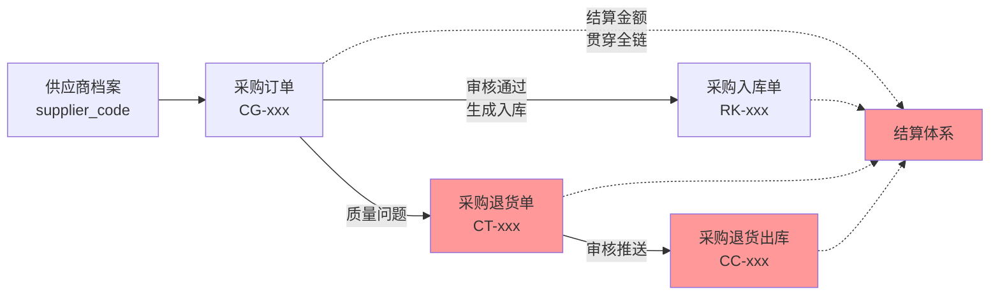

# 3.3-采购退货单

> 数据来源: `结果表数据库/采购管理/采购业务/采购退货单_0501-0525.xlsx`
> 数据量: 约 10 行

## 字段清单

| #   | 字段名   | 类型     | 业务含义 |
| --- | ----- | ------ | ---- |
| 1   | 单据号   | string |      |
| 2   | 单据日期  | number |      |
| 3   | 组织    | string |      |
| 4   | 仓库    | string |      |
| 5   | 部门    | string |      |
| 6   | 供应商编号 | string |      |
| 7   | 供应商名称 | string |      |
| 8   | 采购员   | string |      |
| 9   | 商品名称  | string |      |
| 10  | 商品编号  | number |      |
| 11  | 规格    | string |      |
| 12  | 条码    | number |      |
| 13  | 生产日期  | number |      |
| 14  | 基本单位  | string |      |
| 15  | 基本数量  | number |      |
| 16  | 单据单位  | string |      |
| 17  | 单据数量  | number |      |
| 18  | 单据单价  | number |      |
| 19  | 单据金额  | number |      |
| 20  | 已结算金额 | number |      |
| 21  | 未结算金额 | number |      |
| 22  | 结算状态  | string |      |
| 23  | 审核状态  | enum   |      |
| 24  | 创建人   | string |      |
| 25  | 创建时间  | string |      |
| 26  | 审核人   | string |      |
| 27  | 审核日期  | string |      |
| 28  | 主表备注  | string |      |
| 29  | 明细备注  | string |      |
| 30  | 配送方式  | string |      |

## 示例数据

| 单据号                | 单据日期       | 组织         | 仓库   | 部门  | 供应商编号    | 供应商名称          | 采购员      | 商品名称                  | 商品编号 | 规格       | 条码            | 生产日期       | 基本单位 | 基本数量 | 单据单位 | 单据数量 | 单据单价 | 单据金额  | 已结算金额 | 未结算金额  | 结算状态 | 审核状态 | 创建人      | 创建时间                | 审核人      | 审核日期                | 主表备注 | 明细备注 | 配送方式 |
| ------------------ | ---------- | ---------- | ---- | --- | -------- | -------------- | -------- | --------------------- | ---- | -------- | ------------- | ---------- | ---- | ---- | ---- | ---- | ---- | ----- | ----- | ------ | ---- | ---- | -------- | ------------------- | -------- | ------------------- | ---- | ---- | ---- |
| CT1002026052400001 | 2026-05-24 | 广州同超贸易有限公司 | 默认主仓 |     | GSY0079  | 广州市汇城贸易有限公司-珠江 | 采购2号【常温】 | 珠江 9°1997纯生黑罐500ml*12 | 157  | 500ml*12 | 6970644596693 | 2000-01-01 | 罐    | 12.0 | 件    | 1.0  | 47.0 | 47.0  | 0.00  | 47.00  | 未结算  | 已审核  | 采购2号【常温】 | 2026-05-24 09:34:13 | 采购2号【常温】 | 2026-05-24 09:34:20 | 破损   |      | 自提   |
| CT1002026052200001 | 2026-05-22 | 广州同超贸易有限公司 | 默认主仓 |     | GYS00013 | 珠海可口可乐饮料有限公司   | 采购2号【常温】 | 可口可乐 矮罐330ml*24       | 374  | 330ml*24 | 6907878033014 | 2000-01-01 | 罐    | 72.0 | 件    | 3.0  | 37.0 | 111.0 | 0.00  | 111.00 | 未结算  | 已审核  | 采购2号【常温】 | 2026-05-22 17:41:24 | 采购2号【常温】 | 2026-05-22 17:41:29 | 破损   |      | 自提   |
| CT1002026052100001 | 2026-05-21 | 广州同超贸易有限公司 | 默认主仓 |     | GSY0079  | 广州市汇城贸易有限公司-珠江 | 采购2号【常温】 | 珠江 9°1997纯生瓶装528ml*12 | 161  | 528ml*12 | 6970644596709 | 2000-01-01 | 瓶    | 12.0 | 件    | 1.0  | 47.0 | 47.0  | 47.00 | 0.00   | 全部结算 | 已审核  | 采购2号【常温】 | 2026-05-21 15:07:24 | 采购2号【常温】 | 2026-05-21 15:07:37 | 破损   |      | 自提   |
| CT1002026052000001 | 2026-05-20 | 广州同超贸易有限公司 | 默认主仓 |     | GSY0079  | 广州市汇城贸易有限公司-珠江 | 采购2号【常温】 | 珠江 9°1997纯生瓶装528ml*12 | 161  | 528ml*12 | 6970644596709 | 2000-01-01 | 瓶    | 12.0 | 件    | 1.0  | 47.0 | 47.0  | 0.00  | 47.00  | 未结算  | 已审核  | 采购2号【常温】 | 2026-05-20 18:01:16 | 采购2号【常温】 | 2026-05-20 18:01:32 | 外箱破损 |      | 自提   |
| CT1002026051800002 | 2026-05-18 | 广州同超贸易有限公司 | 默认主仓 |     | GSY0075  | 玖丰商贸-果子熟了      | 采购2号【常温】 | 果子熟了 茉莉龙井500ml*15     | 170  | 500ml*15 | 6973497202964 | 2000-01-01 | 瓶    | 45.0 | 件    | 3.0  | 45.0 | 135.0 | 0.00  | 135.00 | 未结算  | 未审核  | 采购2号【常温】 | 2026-05-18 17:02:50 |          |                     |      |      | 自提   |

## 与其他表的关系

（待对比 odoo 模型后补充）

