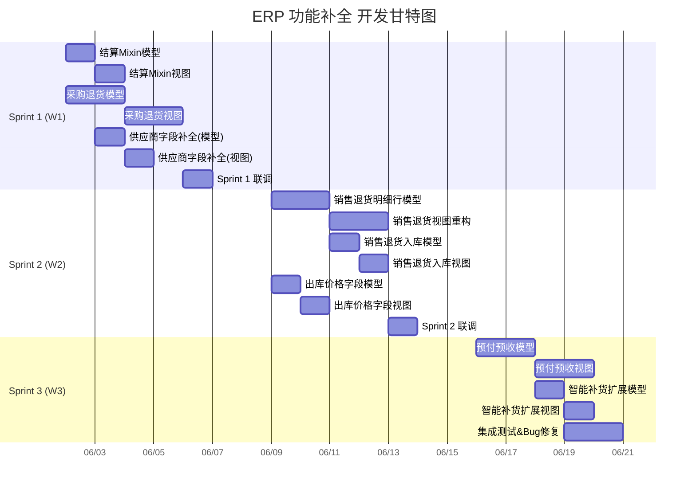

# ERP 功能补全 — 开发计划

> 版本: v1.0
> 日期: 2026-06-01
> 总工期: 15 个工作日（3 周）
> 团队: 2 人

---

## 一、人员分工

| 角色 | 代号 | 职责范围 | 技术要求 |
|------|------|----------|----------|
| **开发 A — 模型设计** | A | 后端模型定义、字段扩展、业务逻辑（Python）、数据迁移 | 熟悉 Odoo ORM、模型继承、computed field、安全规则 |
| **开发 B — 接口&前端** | B | XML 视图定义、Action/Menu、API接口、权限配置、前端展示 | 熟悉 Odoo QWeb/XML View、OWL组件、RPC调用、Access Rules |

### 协作规则

1. A 先完成模型定义 → B 再做对应视图（有依赖关系的任务需串行）
2. 每个模块的 A/B 任务之间留 **0.5 天** buffer 用于联调
3. **每日站会** 同步进度，**每周五** 代码评审
4. 公共分支 `feature/erp-gap-fill`，A/B 各建子分支，合回公共分支需 CR

---

## 二、里程碑规划



---

## 三、任务明细

### Sprint 1：结算体系 + 采购退货（W1: 6/2 - 6/6）

#### 开发 A — 模型设计

| # | 任务 | 产出 | 工时 | 依赖 |
|---|------|------|------|------|
| A-1.1 | 创建 `erp.settlement.mixin` AbstractModel | `erp_base/models/erp_settlement_mixin.py` | 0.5d | — |
| A-1.2 | 在 PO/SO/Picking/SaleReturn 上继承 Mixin | 各 ext 文件追加 `_inherit` | 0.5d | A-1.1 |
| A-1.3 | `purchase.order` 添加 `order_type/return_reason/source_picking_id/source_order_id` | `purchase_order_ext.py` | 0.5d | — |
| A-1.4 | 实现退货确认逻辑 `action_confirm_return` → 自动生成 picking | 同上 | 1d | A-1.3 |
| A-1.5 | `res.partner` 补 `arrival_days/supplier_external_code/purchase_price_type` | `res_partner.py` | 0.5d | — |
| A-1.6 | 单元测试：退货流程 + 结算计算 | `tests/test_purchase_return.py` | 0.5d | A-1.4 |

#### 开发 B — 接口 & 前端

| # | 任务 | 产出 | 工时 | 依赖 |
|---|------|------|------|------|
| B-1.1 | 结算字段在各 Form/Tree View 中展示 | XML views 修改 | 1d | A-1.2 |
| B-1.2 | 采购退货单独立菜单 + Tree/Form View | `views/purchase_return_views.xml` | 1d | A-1.3 |
| B-1.3 | 采购退货出库列表视图（domain 过滤） | `views/stock_picking_views.xml` | 0.5d | A-1.4 |
| B-1.4 | 供应商表单补充字段显示 | XML view 修改 | 0.5d | A-1.5 |
| B-1.5 | 表格样式：客户要求表格化展示，配置 Tree View 的 editable="bottom" | 各表格视图 | 0.5d | B-1.1 |

#### Sprint 1 交付标准
- [x] 能创建采购退货单，选择原入库单，填写退货原因
- [x] 确认退货单后自动生成退货出库单（picking）
- [x] 所有单据能看到结算金额/未结算金额/状态
- [x] 供应商表单能录入新增的 3 个字段

---

### Sprint 2：销售退货 + 出库价格（W2: 6/9 - 6/13）

#### 开发 A — 模型设计

| # | 任务 | 产出 | 工时 | 依赖 |
|---|------|------|------|------|
| A-2.1 | 创建 `erp.sale.return.line` 模型 | `erp_base/models/erp_sale_return_line.py` | 0.5d | — |
| A-2.2 | `erp.sale.return` 补 `line_ids/user_id/department_id/warehouse_id` 等字段 | `erp_sale_return.py` | 0.5d | A-2.1 |
| A-2.3 | 实现退货确认 → 自动生成退货入库 picking | `erp_sale_return.py` | 1d | A-2.2 |
| A-2.4 | `stock.picking` 补 `sale_return_id/recovery_status` | `stock_picking.py` | 0.5d | — |
| A-2.5 | `stock.move` 补 `sale_price_unit/sale_price_subtotal` + 同步逻辑 | `stock_move.py` | 0.5d | — |
| A-2.6 | 单元测试：销售退货全流程 | `tests/test_sale_return.py` | 0.5d | A-2.3 |

#### 开发 B — 接口 & 前端

| # | 任务 | 产出 | 工时 | 依赖 |
|---|------|------|------|------|
| B-2.1 | 销售退货单 Form View 重构（含明细行 Tree in Form） | `views/erp_sale_return_views.xml` | 1d | A-2.2 |
| B-2.2 | 销售退货入库列表视图 | `views/stock_picking_views.xml` 追加 | 0.5d | A-2.4 |
| B-2.3 | 出库单 Tree View 增加价格列 | 修改已有 views | 0.5d | A-2.5 |
| B-2.4 | 退货入库单 → 退货主单的跳转按钮（Smart Button） | XML + Python action | 0.5d | A-2.4 |
| B-2.5 | 表格化展示：退货明细行 editable="bottom"，行内编辑 | View 配置 | 0.5d | B-2.1 |

#### Sprint 2 交付标准
- [x] 销售退货单能添加明细行（按商品）
- [x] 确认退货后自动生成退货入库单
- [x] 退货入库单与退货主单可互相跳转
- [x] 出库单列表/表单能看到销售单价和金额

---

### Sprint 3：预付预收 + 智能补货 + 集成测试（W3: 6/16 - 6/20）

#### 开发 A — 模型设计

| # | 任务 | 产出 | 工时 | 依赖 |
|---|------|------|------|------|
| A-3.1 | `purchase.order` 补预付款字段 + computed 逻辑 | `purchase_order_ext.py` | 0.5d | — |
| A-3.2 | `sale.order` 补预收款字段 + computed 逻辑 | `sale_order_ext.py` | 0.5d | — |
| A-3.3 | 预付/预收的 `account.payment` 创建向导 | `wizard/advance_payment_wizard.py` | 1d | A-3.1 |
| A-3.4 | `stock.warehouse.orderpoint` 扩展字段 | `stock_orderpoint_ext.py` | 0.5d | — |
| A-3.5 | 在途数量 `_compute_in_transit` 实现 | 同上 | 0.5d | A-3.4 |
| A-3.6 | 数据迁移脚本（已有数据的默认值填充） | `data/migration.py` | 0.5d | 全部模型完成 |

#### 开发 B — 接口 & 前端

| # | 任务 | 产出 | 工时 | 依赖 |
|---|------|------|------|------|
| B-3.1 | 采购订单 Form 预付款区域 + 按钮 | View 修改 | 1d | A-3.1 |
| B-3.2 | 销售订单 Form 预收款区域 + 按钮 | View 修改 | 0.5d | A-3.2 |
| B-3.3 | 预付/预收向导 Form View | `views/advance_payment_wizard_views.xml` | 0.5d | A-3.3 |
| B-3.4 | 智能补货列表增强（新增列 + 筛选） | 修改 reorder views | 0.5d | A-3.4 |
| B-3.5 | 全模块菜单结构整理 + 权限 ACL 配置 | `security/`, `views/menu.xml` | 1d | 全部视图完成 |
| B-3.6 | 集成测试：全流程串通 | 手动测试用例执行 | 1d | 全部完成 |

#### Sprint 3 交付标准
- [x] 采购订单能创建预付款，状态联动显示
- [x] 销售订单能创建预收款
- [x] 智能补货列表显示策略、在途数量等新字段
- [x] 全部菜单可用，权限区分管理员/普通用户
- [x] 全流程（采购→入库→退货→出库）无阻断

---

## 四、质量规范

### 4.1 代码规范

| 项目 | 标准 |
|------|------|
| Python 风格 | PEP 8，行宽 120 |
| 模型命名 | 小写 + 点分隔：`erp.sale.return.line` |
| 字段命名 | snake_case，带 `_id`/`_ids` 后缀表关系 |
| XML id 命名 | `module_name.view_model_name_type`，如 `erp_base.view_purchase_return_form` |
| 提交消息 | `[模块名] 类型: 简要描述`，如 `[erp_base] feat: add settlement mixin` |

### 4.2 测试要求

| 层级 | 覆盖目标 | 责任人 |
|------|----------|--------|
| 单元测试 | computed field、onchange、约束 | A |
| 集成测试 | 全流程串通（采购→退货→结算） | A + B |
| 前端测试 | 视图渲染、按钮响应、domain 过滤 | B |

### 4.3 评审规则

- 每个 PR 需 **另一人 Review**
- 模型变更必须附带 **字段文档注释**（`help=` 参数）
- 视图变更必须附带 **截图** 说明效果

---

## 五、风险 & 缓冲

| 风险 | 影响 | 缓解措施 |
|------|------|----------|
| `erp.settlement.mixin` 与现有字段冲突 | 阻塞全部单据 | 先在独立模块测试 |
| 退货自动生成 picking 逻辑复杂 | 延期 1-2d | A-1.4 预留 1d buffer |
| 客户对表格样式有追加要求 | B 工时膨胀 | Sprint 3 预留 1d 调整 |
| `account.payment` 原生流程变化 | 预付逻辑需调整 | Sprint 3 安排，有前置调研时间 |

---

## 六、文件结构预览（新增/修改）

```
custom_addons/erp_base/
├── models/
│   ├── __init__.py                    (修改：注册新模型)
│   ├── erp_settlement_mixin.py        (新建)
│   ├── erp_sale_return.py             (修改：补字段)
│   ├── erp_sale_return_line.py        (新建)
│   ├── purchase_order_ext.py          (修改：退货+预付)
│   ├── sale_order_ext.py              (修改：预收)
│   ├── res_partner.py                 (修改：补字段)
│   └── stock_orderpoint_ext.py        (新建)
├── wizard/
│   ├── __init__.py                    (新建)
│   └── advance_payment_wizard.py      (新建)
├── views/
│   ├── purchase_return_views.xml      (新建)
│   ├── erp_sale_return_views.xml      (修改)
│   ├── stock_picking_views.xml        (修改)
│   ├── advance_payment_wizard_views.xml (新建)
│   └── menu.xml                       (修改)
├── security/
│   └── ir.model.access.csv           (修改：新模型权限)
└── tests/
    ├── test_purchase_return.py        (新建)
    └── test_sale_return.py            (新建)

custom_addons/wms_task_core/
├── models/
│   ├── stock_picking.py               (修改：补字段)
│   └── stock_move.py                  (修改：补价格字段)
└── views/
    └── stock_picking_views.xml        (修改)
```
