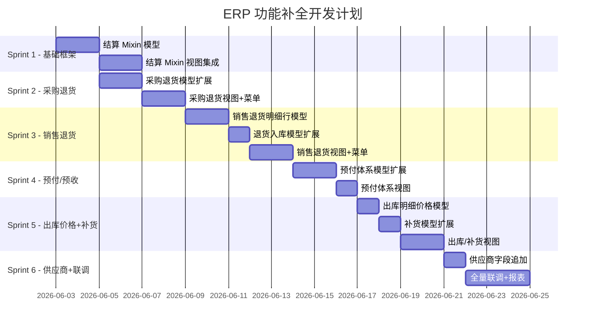

# ERP 功能补全 — 开发计划

> 版本: v1.0
> 日期: 2026-06-02
> 依据: `00-ERP功能补全-主要逻辑文档.md`

---

## 一、团队分工

| 角色 | 代号 | 职责范围 |
|------|------|---------|
| 后端开发（模型设计） | **Dev-A** | 模型定义、字段添加、Mixin、compute 方法、安全规则、数据迁移、单元测试 |
| 前端+接口开发 | **Dev-B** | XML 视图(tree/form/search)、菜单/动作、权限组配置、API 接口、前端表格组件、集成测试 |

**协作方式**：
- Dev-A 完成某模块模型后，Dev-B 随即开始该模块的视图开发
- 使用 Git Feature Branch，命名：`feat/erp-{模块名}-{model/view}`
- 每日同步：Dev-A 输出模型字段清单 → Dev-B 对照构建视图

---

## 二、开发里程碑



---

## 三、详细任务清单

### Sprint 1：结算 Mixin（基础设施）

> 优先完成，后续所有模块依赖此 Mixin

#### Dev-A 任务

| # | 任务 | 文件 | 预估 | 验收标准 |
|---|------|------|------|---------|
| A-1.1 | 创建 `erp.settlement.mixin` Abstract Model | `erp_base/models/erp_settlement_mixin.py` | 2h | compute 方法正确计算三种状态 |
| A-1.2 | `purchase.order` 继承 mixin | `erp_base/models/purchase_order_ext.py` | 1h | PO 表单显示结算字段 |
| A-1.3 | `sale.order` 继承 mixin | `erp_base/models/sale_order_ext.py` | 1h | SO 表单显示结算字段 |
| A-1.4 | `stock.picking` 继承 mixin + amount_total 计算 | `erp_base/models/stock_picking_ext.py` | 2h | picking 金额汇总正确 |
| A-1.5 | `erp.sale.return` 继承 mixin | `erp_base/models/erp_sale_return.py` | 0.5h | 退货单显示结算字段 |
| A-1.6 | 模型 __init__.py 注册 | `erp_base/models/__init__.py` | 0.5h | 模块可正常安装 |
| A-1.7 | 安全规则 (ir.model.access.csv) | `erp_base/security/` | 1h | 权限正确 |

**小计**: 8h

#### Dev-B 任务

| # | 任务 | 文件 | 预估 | 验收标准 |
|---|------|------|------|---------|
| B-1.1 | PO list view 增加结算列 | `erp_base/views/purchase_order_views.xml` | 1h | 列表显示已结/未结/状态 |
| B-1.2 | PO form view 增加结算 tab | 同上 | 1h | 表单有"结算信息"页签 |
| B-1.3 | SO list/form 同理 | `erp_base/views/sale_order_views.xml` | 1.5h | 同上 |
| B-1.4 | stock.picking list/form 同理 | `erp_base/views/stock_picking_views.xml` | 1.5h | 同上 |
| B-1.5 | erp.sale.return list/form 同理 | `erp_base/views/erp_sale_return_views.xml` | 1h | 同上 |
| B-1.6 | search view 增加结算状态筛选 | 各 views.xml | 1h | 可按结算状态过滤 |

**小计**: 7h

---

### Sprint 2：采购退货

#### Dev-A 任务

| # | 任务 | 文件 | 预估 | 验收标准 |
|---|------|------|------|---------|
| A-2.1 | PO 新增 `order_type` + 退货字段 | `purchase_order_ext.py` | 2h | 可创建退货类型 PO |
| A-2.2 | PO 确认逻辑：退货时生成 outgoing picking | `purchase_order_ext.py` (override) | 3h | 确认退货单 → 自动生成出库 |
| A-2.3 | 序列号配置（CT 前缀） | `erp_base/data/ir_sequence_data.xml` | 0.5h | 退货单编号为 CT-xxxx |
| A-2.4 | 单元测试 | `erp_base/tests/test_purchase_return.py` | 2h | 流程可通过自动化测试 |

**小计**: 7.5h

#### Dev-B 任务

| # | 任务 | 文件 | 预估 | 验收标准 |
|---|------|------|------|---------|
| B-2.1 | 采购退货单独立菜单+动作 | `erp_base/views/purchase_return_views.xml` | 1h | 侧边栏有"采购退货"入口 |
| B-2.2 | 采购退货 list view (table) | 同上 | 2h | 表格含: 单号/日期/供应商/金额/状态 |
| B-2.3 | 采购退货 form view | 同上 | 2h | 主表+明细行inline编辑 |
| B-2.4 | 采购退货出库 list view | `erp_base/views/stock_picking_views.xml` | 1.5h | 按 domain 过滤的独立菜单 |
| B-2.5 | search view (供应商/日期/状态) | 同上 | 1h | 筛选功能完整 |

**小计**: 7.5h

---

### Sprint 3：销售退货体系

#### Dev-A 任务

| # | 任务 | 文件 | 预估 | 验收标准 |
|---|------|------|------|---------|
| A-3.1 | 新建 `erp.sale.return.line` 模型 | `erp_base/models/erp_sale_return_line.py` | 2h | 模型正确注册 |
| A-3.2 | `erp.sale.return` 增加 line_ids + 其他字段 | `erp_sale_return.py` | 1.5h | 一对多关联正常 |
| A-3.3 | `stock.picking` 增加 sale_return_id, recovery_status | `stock_picking_ext.py` | 1h | 字段可用 |
| A-3.4 | 退货确认 → 自动生成入库单逻辑 | `erp_sale_return.py` (method) | 2h | 确认后自动创建 picking |
| A-3.5 | 单元测试 | `erp_base/tests/test_sale_return.py` | 1.5h | 覆盖流程 |
| A-3.6 | 安全规则（erp.sale.return.line） | `security/ir.model.access.csv` | 0.5h | 权限正确 |

**小计**: 8.5h

#### Dev-B 任务

| # | 任务 | 文件 | 预估 | 验收标准 |
|---|------|------|------|---------|
| B-3.1 | 销售退货单 form view (含明细行 tree) | `erp_sale_return_views.xml` | 3h | 主表+inline表格编辑行 |
| B-3.2 | 销售退货单 list view (table) | 同上 | 1.5h | 表格完整列展示 |
| B-3.3 | 销售退货入库 独立菜单+list view | `stock_picking_views.xml` | 2h | 可独立查看退货入库单 |
| B-3.4 | 销售退货入库 form view (回收状态) | 同上 | 1h | 表单含回收状态选择 |
| B-3.5 | 报表: 销售退货汇总 pivot view | `erp_sale_return_views.xml` | 1.5h | 可按客户/日期汇总 |

**小计**: 9h

---

### Sprint 4：预付/预收体系

#### Dev-A 任务

| # | 任务 | 文件 | 预估 | 验收标准 |
|---|------|------|------|---------|
| A-4.1 | PO 新增预付款关联字段 | `purchase_order_ext.py` | 1.5h | many2many 关联 account.payment |
| A-4.2 | PO 预付 compute 方法 | 同上 | 1h | 金额/状态正确计算 |
| A-4.3 | SO 新增预收款关联字段 | `sale_order_ext.py` | 1.5h | 同上 |
| A-4.4 | SO 预收 compute 方法 | 同上 | 1h | 同上 |

**小计**: 5h

#### Dev-B 任务

| # | 任务 | 文件 | 预估 | 验收标准 |
|---|------|------|------|---------|
| B-4.1 | PO form 增加"预付款"tab | `purchase_order_views.xml` | 1.5h | 可查看/关联预付款 |
| B-4.2 | SO form 增加"预收款"tab | `sale_order_views.xml` | 1.5h | 同上 |
| B-4.3 | 预付/预收 快捷入口按钮(smart button) | 各 views | 1h | 表单头部显示计数按钮 |

**小计**: 4h

---

### Sprint 5：出库价格 + 智能补货

#### Dev-A 任务

| # | 任务 | 文件 | 预估 | 验收标准 |
|---|------|------|------|---------|
| A-5.1 | stock.move 新增 sale_price_unit/subtotal | `wms_task_core/models/stock_move.py` | 1h | compute 正确 |
| A-5.2 | picking 确认时同步价格逻辑 | `stock_picking_ext.py` | 1.5h | 从 sale.order.line 同步 |
| A-5.3 | stock.warehouse.orderpoint 扩展 | `erp_base/models/stock_orderpoint_ext.py` | 2h | 新策略字段可用 |
| A-5.4 | in_transit_qty compute（查在途 PO） | 同上 | 1.5h | 正确计算在途 |

**小计**: 6h

#### Dev-B 任务

| # | 任务 | 文件 | 预估 | 验收标准 |
|---|------|------|------|---------|
| B-5.1 | 出库单 form 明细行增加价格列 | `stock_picking_views.xml` | 1h | move tree 显示单价/金额 |
| B-5.2 | 补货规则 list view (table) | `erp_base/views/stock_orderpoint_views.xml` | 1.5h | 表格含策略/在途/安全库存 |
| B-5.3 | 补货规则 form view | 同上 | 1h | 完整表单编辑 |
| B-5.4 | 补货菜单入口 | 同上 | 0.5h | 侧边栏可达 |

**小计**: 4h

---

### Sprint 6：供应商字段 + 联调 + 报表

#### Dev-A 任务

| # | 任务 | 文件 | 预估 | 验收标准 |
|---|------|------|------|---------|
| A-6.1 | res.partner 新增 3 字段 | `erp_base/models/res_partner.py` | 0.5h | 字段可用 |
| A-6.2 | 数据迁移脚本（已有供应商数据初始化） | `erp_base/data/` | 1h | 升级无错误 |
| A-6.3 | 全流程联调（采购链） | — | 2h | 订单→入库→退货→出库 打通 |
| A-6.4 | 全流程联调（销售链） | — | 2h | 订单→出库→退货→入库 打通 |
| A-6.5 | 全流程联调（结算链） | — | 1h | 结算状态自动流转 |

**小计**: 6.5h

#### Dev-B 任务

| # | 任务 | 文件 | 预估 | 验收标准 |
|---|------|------|------|---------|
| B-6.1 | 供应商 form 增加字段 | `res_partner_views.xml` | 0.5h | 可编辑新字段 |
| B-6.2 | 采购报表（4 张 pivot/graph） | `erp_base/views/purchase_report_views.xml` | 3h | 汇总表+筛选 |
| B-6.3 | 销售报表（4 张 pivot/graph） | `erp_base/views/sale_report_views.xml` | 3h | 同上 |
| B-6.4 | 前端体验优化(列宽/对齐/颜色标记) | 各 views.xml | 2h | 表格美观规整 |
| B-6.5 | UAT 支持 + 缺陷修复 | — | 2h | 客户验收通过 |

**小计**: 10.5h

---

## 四、工时汇总

| 角色 | Sprint 1 | Sprint 2 | Sprint 3 | Sprint 4 | Sprint 5 | Sprint 6 | **合计** |
|------|----------|----------|----------|----------|----------|----------|---------|
| Dev-A (后端) | 8h | 7.5h | 8.5h | 5h | 6h | 6.5h | **41.5h** |
| Dev-B (前端) | 7h | 7.5h | 9h | 4h | 4h | 10.5h | **42h** |
| **Sprint 总计** | 15h | 15h | 17.5h | 9h | 10h | 17h | **83.5h** |

> 按每人每天 6h 有效产出计算：
> - Dev-A: ~7 个工作日
> - Dev-B: ~7 个工作日
> - **总工期**: 约 4 周（考虑并行开发 + buffer）

---

## 五、开发规范

### 5.1 代码规范

| 规范项 | 要求 |
|--------|------|
| Python 风格 | PEP8 + Odoo 官方 Guidelines |
| 模型命名 | `模块名.功能名`（如 `erp.sale.return.line`） |
| 字段命名 | snake_case，动词+名词 |
| 文件拆分 | 每模型独立文件，不超过 300 行 |
| 方法注释 | 所有 public method 必须有 docstring |
| 安全 | 每模型配 ir.model.access.csv |

### 5.2 分支管理

```
main
  └── develop
       ├── feat/erp-settlement-mixin-model  (Dev-A)
       ├── feat/erp-settlement-mixin-view   (Dev-B)
       ├── feat/erp-purchase-return-model
       ├── feat/erp-purchase-return-view
       └── ...
```

### 5.3 提交规范

```
feat(erp_base): add settlement mixin with compute methods

- Implement ErpSettlementMixin abstract model
- Add amount_settled, amount_unsettled, settlement_state fields
- Compute logic: unsettled/partial/settled based on amount_total

Refs: ERP-001
```

### 5.4 Code Review 清单

- [ ] 字段有 string 属性（中文 label）
- [ ] compute 字段有 store=True（如需搜索）
- [ ] Many2one 有 ondelete 策略
- [ ] 新模型有 _description
- [ ] views.xml 有 groups 权限控制
- [ ] list view 列数 ≤ 12（避免水平滚动）

### 5.5 测试规范

| 类型 | 要求 | 责任人 |
|------|------|--------|
| 单元测试 | 每个模型 create/write/compute 正确 | Dev-A |
| 集成测试 | 全流程打通（确认→生成关联单据） | Dev-A + Dev-B |
| 视图测试 | 手动验证表格显示/筛选/编辑 | Dev-B |
| UAT | 客户使用场景验收 | Dev-B 支持 |

---

## 六、风险与依赖

| 风险 | 影响 | 缓解措施 |
|------|------|---------|
| 结算逻辑涉及 amount_total 来源不统一 | 中 | Sprint 1 统一在 Mixin 中处理 |
| 客户对表格样式要求频繁变更 | 高 | Dev-B 先出 Demo → 客户确认 → 再完善 |
| stock.picking 扩展字段与 WMS 模块冲突 | 中 | 与 wms_task_core 作者确认依赖 |
| 预付/预收涉及 account 模块权限 | 低 | 确认 account.payment 读写权限 |

---

## 七、交付物清单

| # | 交付物 | 路径 |
|---|--------|------|
| 1 | 主要逻辑文档 | `docs/implementation/00-ERP功能补全-主要逻辑文档.md` |
| 2 | 开发计划（本文件） | `docs/implementation/01-开发计划-分工排期.md` |
| 3 | ERP字段对比文档 | `ai-code/docs/context/gap_analysis/field_comparison.md` |
| 4 | 源代码 | `custom_addons/erp_base/` |
| 5 | 视图 XML | `custom_addons/erp_base/views/` |
| 6 | 测试用例 | `custom_addons/erp_base/tests/` |
