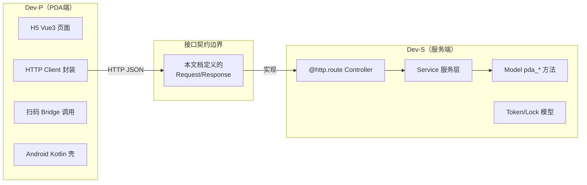

# PDA 接口契约——服务端与PDA端统一接口规格

> 版本: v2.0（合并自 04 + 08）
> 日期: 2026-06-05
> 目的: 作为 Dev-S（服务端）和 Dev-P（PDA端）之间的**唯一接口合约**，
>       包含完整的请求/响应 JSON 示例和服务端实现规范
> 对齐规范: 基于项目现有 `logistics_web` Controller 代码风格
> 设备: 优博讯 i6310 | 架构: Android WebView 壳 + Vue3 H5 + Odoo API

---

## 一、接口总体架构

### 1.1 模块结构（Dev-S 交付物）

```
custom_addons/
└── wms_pda_api/                         # 新建 addon
    ├── __manifest__.py
    ├── __init__.py
    ├── controllers/
    │   ├── __init__.py
    │   ├── base.py                      # WmsPdaBaseController（公共基类）
    │   ├── auth.py                      # WmsPdaAuthController
    │   ├── receipt.py                   # WmsPdaReceiptController
    │   ├── putaway.py                   # WmsPdaPutawayController
    │   ├── pick.py                      # WmsPdaPickController
    │   ├── return_op.py                 # WmsPdaReturnController
    │   ├── sale_return.py              # WmsPdaSaleReturnController
    │   ├── inventory.py                 # WmsPdaInventoryController
    │   └── review.py                    # WmsPdaReviewController（PC审核）
    ├── models/
    │   ├── __init__.py
    │   ├── wms_api_token.py            # Token 模型
    │   ├── wms_task_photo.py           # 拍照留痕
    │   └── wms_task_lock.py            # 任务锁
    ├── services/
    │   ├── __init__.py
    │   ├── barcode_parser.py           # 条码解析服务
    │   ├── task_lock_service.py        # 任务锁服务
    │   └── pda_auth_service.py         # 认证服务
    └── security/
        ├── ir.model.access.csv
        └── wms_pda_security.xml        # 权限组定义
```

### 1.2 路由前缀约定

| 前缀 | 用途 | 认证方式 |
|------|------|---------|
| `/api/admin/logistics/` | 管理后台 | `auth="user"` (session) |
| `/api/mini/logistics/` | 小程序/移动端 | `auth="public"` + Token |
| `/api/open/logistics/b2b/` | B2B 开放接口 | `auth="user"` (session) |
| **`/api/pda/wms/v1/`** | **PDA 仓储** | **`auth="public"` + Bearer Token** |

### 1.3 认证方式

采用 **自定义 Bearer Token**（对齐 `LogisticsMiniApiAuthMixin` 模式）：

```
Authorization: Bearer {wms_api_token}
```

> 为什么不用 `auth="user"` (session)：PDA 设备不便管理浏览器 cookie，
> 且设备级 token 更适合长时间免登录场景。
>
> 为什么不用 Odoo 原生 `auth="bearer"`：项目内无先例，且需绑定
> `warehouse_id` 和 `device_id`，原生方案不支持。

### 1.4 请求头约定

| Header | 必填 | 说明 | 示例 |
|--------|------|------|------|
| `Authorization` | 是（除登录外） | Bearer Token | `Bearer eyJhbG...` |
| `Content-Type` | POST 必填 | 固定 JSON | `application/json` |
| `X-Device-Id` | 推荐 | 设备 IMEI | `860123456789012` |
| `X-Request-Id` | 关键操作必填 | 幂等键 | `uuid-xxx` |

### 1.5 统一响应格式

```json
{
  "code": 0,
  "message": "success",
  "data": { ... },
  "tts": "操作成功"
}
```

### 1.6 错误码完整清单

| code | HTTP Status | 含义 | Dev-P 处理方式 |
|------|-------------|------|---------------|
| 0 | 200 | 成功 | 正常处理 data |
| 1001 | 401 | Token 过期/无效 | 跳转登录页 |
| 1002 | 403 | 权限不足 | Toast 提示，禁用操作 |
| 2001 | 400 | 参数错误 | Toast 显示 message |
| 2002 | 404 | 记录不存在 | Toast 提示 |
| 2003 | 409 | 状态不允许操作 | Toast + 刷新页面 |
| 2004 | 400 | 条码无法识别 | 语音播报"未识别" + Toast |
| 3001 | 409 | 库存不足 | Toast + 标记异常 |
| 3002 | 409 | 数量超限 | 弹窗确认是否继续 |
| 3003 | 409 | 任务已被他人锁定 | Toast 显示锁定人 |
| 5000 | 500 | 服务端内部错误 | Toast"服务器异常" + 重试 |

### 1.7 分页参数

列表接口统一支持：

| 参数 | 类型 | 默认 | 说明 |
|------|------|------|------|
| offset | int | 0 | 跳过条数 |
| limit | int | 20 | 每页条数 |

响应中附带 `total` 字段。

---

## 二、公共基类定义（Dev-S 实现）

```python
"""controllers/base.py — 所有 PDA Controller 的公共基类"""
import json
import uuid
from functools import wraps

from odoo import http
from odoo.exceptions import AccessError, ValidationError
from odoo.http import Response, request


class WmsPdaBaseController(http.Controller):
    """PDA API 公共基类，提供认证、参数解析、统一响应、异常处理"""

    # ========== 认证 ==========

    def _authenticate(self):
        """从 Authorization header 中提取 token 并验证，返回 (user, warehouse)"""
        auth_header = request.httprequest.headers.get("Authorization", "")
        if not auth_header.startswith("Bearer "):
            raise AccessError("Missing or invalid Authorization header")
        token_str = auth_header[7:]
        token_rec = (
            request.env["wms.api.token"]
            .sudo()
            .search([("token", "=", token_str), ("is_active", "=", True)], limit=1)
        )
        if not token_rec or token_rec.is_expired:
            raise AccessError("Token expired or invalid")
        return token_rec.user_id, token_rec.warehouse_id

    # ========== 参数获取 ==========

    def _get_payload(self):
        """合并 query params 和 JSON body（对齐 logistics_web 的 _merged_payload）"""
        payload = dict(request.params)
        if request.httprequest.mimetype == "application/json":
            json_body = request.httprequest.get_json(silent=True) or {}
            if isinstance(json_body, dict):
                payload.update(
                    {k: v for k, v in json_body.items() if v is not None}
                )
        return payload

    # ========== 统一响应 ==========

    def _success(self, data=None, tts=""):
        """成功响应"""
        body = {"code": 0, "message": "success", "data": data or {}}
        if tts:
            body["tts"] = tts
        return self._make_response(body)

    def _error(self, code, message, status=400, data=None, tts=""):
        """错误响应"""
        body = {"code": code, "message": message, "data": data or {}}
        if tts:
            body["tts"] = tts
        return self._make_response(body, status=status)

    def _make_response(self, payload, *, status=200):
        """构建 HTTP Response（对齐 logistics_web_stats._json_response）"""
        return Response(
            json.dumps(payload, ensure_ascii=False, default=str),
            status=status,
            headers=[("Content-Type", "application/json; charset=utf-8")],
        )

    # ========== 错误码常量 ==========

    ERR_AUTH_FAILED = 1001
    ERR_PERMISSION = 1002
    ERR_BAD_PARAM = 2001
    ERR_NOT_FOUND = 2002
    ERR_STATE_CONFLICT = 2003
    ERR_BARCODE_UNKNOWN = 2004
    ERR_STOCK_INSUFFICIENT = 3001
    ERR_QTY_EXCEED = 3002
    ERR_TASK_LOCKED = 3003
    ERR_INTERNAL = 5000

    # ========== 异常处理 ==========

    def _handle_request(self, callback, require_auth=True):
        """
        统一异常处理包装器（对齐 logistics_web_stats._handle_payload）
        用法: return self._handle_request(lambda user, wh: self._do_xxx(user, wh, payload))
        """
        try:
            if require_auth:
                user, warehouse = self._authenticate()
            else:
                user, warehouse = None, None
            result = callback(user, warehouse)
            if isinstance(result, Response):
                return result
            return self._success(result)
        except AccessError as exc:
            return self._error(self.ERR_AUTH_FAILED, str(exc), status=401)
        except ValidationError as exc:
            return self._error(self.ERR_BAD_PARAM, str(exc), status=400)
        except Exception as exc:
            return self._error(self.ERR_INTERNAL, str(exc), status=500)
```

---

## 三、接口详细定义

> 每个接口包含：路由声明 + 完整 JSON 示例 + Dev-S 实现要点

---

### 模块 A：认证与基础（4 个）

#### A1. 登录

```
POST /api/pda/wms/v1/auth/login
```

**Dev-S 路由声明：**

```python
@http.route("/api/pda/wms/v1/auth/login", type="http", auth="public", methods=["POST"], csrf=False)
def pda_login(self, **kwargs):
    ...
```

**请求：**

```json
{
  "login": "warehouse_user1",
  "password": "xxxx",
  "device_id": "860123456789012"
}
```

**响应：**

```json
{
  "code": 0,
  "data": {
    "token": "eyJhbGciOi...",
    "expires_in": 86400,
    "user": {
      "id": 15,
      "name": "张三",
      "role": "warehouse_worker"
    },
    "warehouses": [
      {"id": 1, "name": "默认主仓"},
      {"id": 2, "name": "冷链仓"}
    ]
  }
}
```

**Dev-S 实现要点：**
- 调用 `request.session.authenticate(db, login, password)` 验证凭据
- 验证用户属于 `wms_pda_api.group_pda_user` 权限组
- 创建 `wms.api.token` 记录，生成 UUID token
- Token 有效期 24 小时
- 同一用户+设备只保留一个有效 token（新登录使旧 token 失效）

---

#### A2. 切换仓库

```
POST /api/pda/wms/v1/auth/switch-warehouse
```

**请求：**

```json
{
  "warehouse_id": 1
}
```

**响应：**

```json
{
  "code": 0,
  "data": {
    "warehouse_id": 1,
    "warehouse_name": "默认主仓",
    "location_count": 86
  }
}
```

**Dev-S 实现要点：**
- 更新 `wms.api.token.warehouse_id`
- 验证用户对该仓库有访问权限

---

#### A3. 条码解析（万能扫码入口）

```
POST /api/pda/wms/v1/barcode/parse
```

**请求：**

```json
{
  "barcode": "6901209257452"
}
```

**响应（商品）：**

```json
{
  "code": 0,
  "data": {
    "type": "product",
    "record": {
      "id": 109,
      "name": "光明 新鲜牧场鲜牛奶950ml",
      "default_code": "109",
      "barcode": "6901209257452",
      "uom": "盒",
      "spec": "950ml*12",
      "weight": 1.5,
      "volume": 0.006
    }
  }
}
```

**响应（库位）：**

```json
{
  "code": 0,
  "data": {
    "type": "location",
    "record": {
      "id": 45,
      "name": "A-02-03",
      "barcode": "LOC-A0203",
      "usage_type": "pick_face",
      "warehouse_id": 1
    }
  }
}
```

**响应（任务）：**

```json
{
  "code": 0,
  "data": {
    "type": "task",
    "task_type": "pick",
    "record": {
      "id": 128,
      "name": "WMS-PICK-000128",
      "state": "waiting_pick"
    }
  }
}
```

**Dev-S 实现要点：**
- 按优先级解析：库位(`LOC-`前缀) → WMS任务(`WMS-`前缀) → 商品(EAN/default_code) → 单据(picking.name)
- 未识别返回 `code=2004`
- 使用 `services/barcode_parser.py` 封装：

```python
def parse_barcode(self, barcode, warehouse_id):
    # 1. 库位
    location = self.env['stock.location'].search([('barcode', '=', barcode)], limit=1)
    if location:
        return {'type': 'location', 'record': self._format_location(location)}
    # 2. WMS 任务
    if barcode.startswith('WMS-'):
        task = self._find_wms_task(barcode)
        if task:
            return {'type': 'task', 'task_type': task._name.split('.')[1], 'record': ...}
    # 3. 商品
    product = self.env['product.product'].search([
        '|', ('barcode', '=', barcode), ('default_code', '=', barcode)
    ], limit=1)
    if product:
        return {'type': 'product', 'record': self._format_product(product)}
    # 4. 单据
    picking = self.env['stock.picking'].search([('name', '=', barcode)], limit=1)
    if picking:
        return {'type': 'picking', 'record': ...}
    return {'type': 'unknown'}
```

**条码编码规范：**

| 类型 | 格式 | 示例 |
|------|------|------|
| 商品 EAN-13 | 13位纯数字 | `6901209257452` |
| 库位 | `LOC-` + 编号 | `LOC-A0203` |
| 收货任务 | `WMS-REC-` + 序号 | `WMS-REC-000201` |
| 拣货任务 | `WMS-PICK-` + 序号 | `WMS-PICK-000128` |
| 入库单 | `RK` + 编号 | `RK1002026060500018` |
| 出库单 | `XC` + 编号 | `XC1002026060500389` |

---

#### A4. 获取基础配置

```
GET /api/pda/wms/v1/config/options
```

**响应：**

```json
{
  "code": 0,
  "data": {
    "return_reasons": [
      {"value": "damaged", "label": "破损"},
      {"value": "expired", "label": "过期"},
      {"value": "oversupply", "label": "补货过多"},
      {"value": "slow_moving", "label": "不好卖"}
    ],
    "quality_states": [
      {"value": "good", "label": "完好"},
      {"value": "damaged", "label": "损坏"},
      {"value": "expired", "label": "过期"}
    ],
    "operation_types": [
      {"value": "warehouse_return", "label": "退供应商"},
      {"value": "internal_return", "label": "退仓"}
    ]
  }
}
```

---

### 模块 B：入库收货（4 个）

#### B1. 查询待收货任务列表

```
GET /api/pda/wms/v1/receipt/tasks?offset=0&limit=20
```

**Dev-S 路由声明：**

```python
@http.route("/api/pda/wms/v1/receipt/tasks", type="http", auth="public", methods=["GET"], csrf=False)
def list_receipt_tasks(self, **kwargs):
    return self._handle_request(lambda user, wh: self._list_receipt_tasks(user, wh))
```

**响应：**

```json
{
  "code": 0,
  "data": {
    "total": 15,
    "records": [
      {
        "id": 201,
        "name": "WMS-REC-000201",
        "state": "waiting_receipt",
        "state_label": "待收货",
        "picking_name": "RK1002026060500018",
        "partner_name": "广州华农大食品科技有限公司",
        "scheduled_date": "2026-06-05",
        "line_count": 5,
        "source_type": "purchase"
      }
    ]
  }
}
```

**Dev-S 实现要点：**
- Model: `wms.receipt.task`
- Domain: `[('warehouse_id', '=', wh.id), ('state', 'in', ['waiting_receipt', 'receiving'])]`
- `line_count` = `len(task.stock_picking_id.move_ids)`
- `source_type` 通过 `picking.picking_type_code` 或 `picking.origin` 推断

---

#### B2. 获取收货任务明细

```
GET /api/pda/wms/v1/receipt/tasks/{task_id}/lines
```

**Dev-S 路由声明：**

```python
@http.route("/api/pda/wms/v1/receipt/tasks/<int:task_id>/lines", type="http", auth="public", methods=["GET"], csrf=False)
def get_receipt_task_lines(self, task_id, **kwargs):
    ...
```

**响应：**

```json
{
  "code": 0,
  "data": {
    "task": {
      "id": 201,
      "name": "WMS-REC-000201",
      "state": "receiving",
      "partner_name": "广州华农大食品科技有限公司",
      "picking_name": "RK1002026060500018",
      "note": "6.5到货，供应商自己卸货",
      "locked_by": null
    },
    "lines": [
      {
        "move_id": 1501,
        "product_id": 34,
        "product_name": "华农 学士奶236ml",
        "barcode": "6940817700226",
        "spec": "236ml",
        "uom": "盒",
        "expected_qty": 4080.0,
        "received_qty": 0.0,
        "is_gift": false
      },
      {
        "move_id": 1502,
        "product_id": 33,
        "product_name": "华农 原味酸奶150g",
        "barcode": "6940817701117",
        "spec": "150g",
        "uom": "杯",
        "expected_qty": 800.0,
        "received_qty": 0.0,
        "is_gift": false
      }
    ]
  }
}
```

**Dev-S 实现要点：**
- 进入明细时自动加锁 `task_lock_service.acquire(task_id, user_id)`
- `expected_qty` = `stock.move.product_uom_qty`
- `received_qty` = `stock.move.quantity`
- 如任务已被他人锁定，返回 `code=3003` 和锁定人信息

---

#### B3. 确认收货行

```
POST /api/pda/wms/v1/receipt/tasks/{task_id}/confirm-line
```

**请求：**

```json
{
  "move_id": 1501,
  "barcode": "6940817700226",
  "done_qty": 4080.0,
  "lot_name": "",
  "note": "",
  "request_id": "uuid-a1b2c3d4"
}
```

**响应：**

```json
{
  "code": 0,
  "data": {
    "move_id": 1501,
    "product_name": "华农 学士奶236ml",
    "done_qty": 4080.0,
    "remaining_lines": 4
  },
  "tts": "华农学士奶，已收4080盒"
}
```

**校验规则：**
- `barcode` 必须与 move 对应的商品条码一致（防错扫）
- `done_qty` > 0
- `done_qty` 可以与 `expected_qty` 不同（允许多收/少收）

**Dev-S 实现要点：**
- 写入 `stock.move.quantity = done_qty`
- 首次确认时自动将 `task.state` 从 `waiting_receipt` 改为 `receiving`
- 幂等：`request_id` 重复时直接返回上次结果
- 校验任务锁属于当前用户

---

#### B4. 完成收货

```
POST /api/pda/wms/v1/receipt/tasks/{task_id}/complete
```

**请求：**

```json
{
  "force_complete": false,
  "request_id": "uuid-e5f6g7h8"
}
```

**响应：**

```json
{
  "code": 0,
  "data": {
    "task_state": "received",
    "putaway_task_id": 305,
    "putaway_task_name": "WMS-PUT-000305",
    "summary": {
      "total_lines": 5,
      "completed_lines": 5,
      "total_qty": 5880.0
    }
  },
  "tts": "收货完成，已生成上架任务"
}
```

**业务逻辑：**
- `force_complete=false`: 有未确认行时返回 `code=2003`
- `force_complete=true`: 允许部分收货完成
- 调用 `receipt_task.action_mark_received()`
- 在方法内部执行 `picking.button_validate()` 完成入库单
- 自动创建上架任务
- 释放任务锁

---

### 模块 C：上架作业（3 个）

#### C1. 查询待上架任务列表

```
GET /api/pda/wms/v1/putaway/tasks?offset=0&limit=20
```

**响应：**

```json
{
  "code": 0,
  "data": {
    "total": 8,
    "records": [
      {
        "id": 305,
        "name": "WMS-PUT-000305",
        "state": "waiting_putaway",
        "state_label": "待上架",
        "receipt_task_name": "WMS-REC-000201",
        "source_location": "收货暂存区",
        "product_summary": "华农 学士奶 等5种商品",
        "total_qty": 5880.0,
        "create_date": "2026-06-05 10:30:00"
      }
    ]
  }
}
```

**Dev-S 实现要点：**
- Domain: `[('warehouse_id', '=', wh.id), ('state', 'in', ['waiting_putaway', 'putaway_ing'])]`
- `product_summary` 需汇总 `receipt_task.stock_picking_id.move_ids` 的商品名

---

#### C2. 确认上架

```
POST /api/pda/wms/v1/putaway/tasks/{task_id}/confirm
```

**请求：**

```json
{
  "product_barcode": "6940817700226",
  "dest_location_barcode": "LOC-A0203",
  "qty": 4080.0,
  "request_id": "uuid-i9j0k1"
}
```

**响应：**

```json
{
  "code": 0,
  "data": {
    "product_name": "华农 学士奶236ml",
    "dest_location": "A-02-03",
    "qty": 4080.0,
    "remaining_products": 4
  },
  "tts": "华农学士奶，上架到A-02-03，4080盒"
}
```

**Dev-S 实现要点：**
- 验证 `dest_location_barcode` 存在且属于当前仓库
- 创建 internal `stock.move`（暂存区 → 目标库位）
- 执行 `move._action_confirm()` → `_action_assign()` → `_action_done()`
- 首次确认时将 `task.state` 改为 `putaway_ing`
- 可分批上架（同一产品分到多个库位）

---

#### C3. 完成上架

```
POST /api/pda/wms/v1/putaway/tasks/{task_id}/complete
```

**请求：**

```json
{
  "request_id": "uuid-l2m3n4"
}
```

**响应：**

```json
{
  "code": 0,
  "data": {
    "task_state": "putaway_done",
    "summary": {
      "products_count": 5,
      "locations_used": 3,
      "total_qty": 5880.0
    }
  },
  "tts": "上架完成"
}
```

**Dev-S 实现要点：**
- 调用 `putaway_task.action_mark_done()`
- 释放任务锁

---

### 模块 D：出库拣货（5 个）

#### D1. 查询待拣货任务列表

```
GET /api/pda/wms/v1/pick/tasks?offset=0&limit=20
```

**响应：**

```json
{
  "code": 0,
  "data": {
    "total": 36,
    "records": [
      {
        "id": 128,
        "name": "WMS-PICK-000128",
        "state": "waiting_pick",
        "state_label": "待拣货",
        "outbound_task_name": "WMS-OUT-000095",
        "picking_name": "XC1002026060500389",
        "partner_name": "美宜多【黎冲店】",
        "line_count": 5,
        "total_demand_qty": 284.0,
        "priority": "normal",
        "create_date": "2026-06-05 13:39:57"
      }
    ]
  }
}
```

**Dev-S 实现要点：**
- Domain: `[('warehouse_id', '=', wh.id), ('state', 'in', ['waiting_pick', 'picking'])]`
- `partner_name` = `pick_task.store_partner_id.name`
- `total_demand_qty` = `sum(line_ids.demand_qty)`
- 排序：`priority desc, create_date asc`

---

#### D2. 获取拣货任务明细

```
GET /api/pda/wms/v1/pick/tasks/{task_id}/lines
```

**响应（按 path_seq 排序）：**

```json
{
  "code": 0,
  "data": {
    "task": {
      "id": 128,
      "name": "WMS-PICK-000128",
      "state": "picking",
      "partner_name": "美宜多【黎冲店】",
      "picking_name": "XC1002026060500389",
      "locked_by": null
    },
    "lines": [
      {
        "line_id": 501,
        "seq": 1,
        "product_id": 109,
        "product_name": "光明 新鲜牧场鲜牛奶950ml",
        "barcode": "6901209257452",
        "spec": "950ml*12",
        "uom": "盒",
        "demand_qty": 60.0,
        "done_qty": 0.0,
        "source_location": "A-01-02",
        "source_location_barcode": "LOC-A0102",
        "path_seq": 1
      },
      {
        "line_id": 502,
        "seq": 2,
        "product_id": 26,
        "product_name": "卡士 原味鲜酪乳120g*3",
        "barcode": "6924810801326",
        "spec": "120g*3*8",
        "uom": "杯",
        "demand_qty": 192.0,
        "done_qty": 0.0,
        "source_location": "A-02-01",
        "source_location_barcode": "LOC-A0201",
        "path_seq": 5
      }
    ],
    "progress": {
      "total_lines": 5,
      "completed_lines": 0,
      "total_demand_qty": 284.0,
      "total_done_qty": 0.0
    }
  }
}
```

**Dev-S 实现要点：**
- 进入明细时加锁 + 自动调用 `pick_task.action_start_pick()`
- `lines` 按 `path_seq` 排序（拣货路径优化）

---

#### D3. 确认拣货行

```
POST /api/pda/wms/v1/pick/tasks/{task_id}/confirm-line
```

**请求：**

```json
{
  "line_id": 501,
  "product_barcode": "6901209257452",
  "location_barcode": "LOC-A0102",
  "done_qty": 60.0,
  "request_id": "uuid-o5p6q7"
}
```

**响应：**

```json
{
  "code": 0,
  "data": {
    "line_id": 501,
    "product_name": "光明 新鲜牧场鲜牛奶950ml",
    "done_qty": 60.0,
    "demand_qty": 60.0,
    "status": "full",
    "next_line": {
      "line_id": 502,
      "product_name": "卡士 原味鲜酪乳120g*3",
      "source_location": "A-02-01",
      "demand_qty": 192.0
    }
  },
  "tts": "光明鲜牛奶60盒，下一个，A-02-01，卡士鲜酪乳192杯"
}
```

**校验规则：**
- `product_barcode` 与 line 对应商品一致
- `location_barcode` 与 `line.source_location_id.barcode` 一致（防拣错库位）
- `done_qty` > 0
- `done_qty` > `demand_qty` 时需确认（允许多拣但给提醒）

**Dev-S 实现要点：**
- 写入 `line.done_qty = done_qty`
- `status` 判断：`==` → "full", `<` → "partial", `>` → "over"
- `next_line`：按 `path_seq` 排序的下一个未完成行

---

#### D4. 完成拣货

```
POST /api/pda/wms/v1/pick/tasks/{task_id}/complete
```

**请求：**

```json
{
  "staging_location_barcode": "LOC-STAGE-01",
  "photo_urls": ["https://oss.xxx/photo1.jpg"],
  "request_id": "uuid-r8s9t0"
}
```

**响应：**

```json
{
  "code": 0,
  "data": {
    "task_state": "picked",
    "summary": {
      "total_lines": 5,
      "total_done_qty": 284.0,
      "short_lines": 0
    },
    "next_step": "check"
  },
  "tts": "拣货完成，等待复核"
}
```

**Dev-S 实现要点：**
- 调用 `pick_task.action_mark_picked()`
- 同步 `line.done_qty` → 对应 `stock.move.quantity`
- 调用 `picking.button_validate()` 完成出库单库存扣减
- 保存拍照记录到 `wms.task.photo`（如有）
- 如有 `short_lines > 0` 且非 force，标记异常待 PC 审核
- 释放任务锁

---

#### D5. 查询拣货任务汇总

```
GET /api/pda/wms/v1/pick/tasks/{task_id}/summary
```

**响应：**

```json
{
  "code": 0,
  "data": {
    "task_id": 128,
    "state": "picking",
    "progress": {
      "total_lines": 5,
      "completed_lines": 2,
      "pending_lines": 3,
      "total_demand_qty": 284.0,
      "total_done_qty": 120.0,
      "completion_pct": 42.2
    },
    "exceptions": []
  }
}
```

---

### 模块 E：退库操作（3 个）

#### E1. 创建退库单

```
POST /api/pda/wms/v1/return/create
```

**请求：**

```json
{
  "operation_type": "warehouse_return",
  "note": "补货过多，退供应商"
}
```

**响应：**

```json
{
  "code": 0,
  "data": {
    "operation_id": 88,
    "name": "WMS-INV-000088",
    "state": "draft"
  }
}
```

**Dev-S 实现要点：**
- 创建 `wms.inventory.operation` 记录
- 关联当前仓库和操作员

---

#### E2. 添加退库行

```
POST /api/pda/wms/v1/return/{operation_id}/add-line
```

**请求：**

```json
{
  "product_barcode": "6970644596877",
  "qty": 1.0,
  "reason": "damaged",
  "note": "外箱破损"
}
```

**响应：**

```json
{
  "code": 0,
  "data": {
    "line_id": 201,
    "product_name": "珠江 11°原浆罐980ml*6",
    "qty": 1.0,
    "reason_label": "破损",
    "current_line_count": 3
  },
  "tts": "珠江原浆1件，破损"
}
```

---

#### E3. 提交退库单

```
POST /api/pda/wms/v1/return/{operation_id}/confirm
```

**请求：**

```json
{
  "request_id": "uuid-u1v2w3"
}
```

**响应：**

```json
{
  "code": 0,
  "data": {
    "operation_state": "confirmed",
    "generated_picking": "INT/00123",
    "summary": {
      "line_count": 3,
      "total_qty": 9.0
    }
  },
  "tts": "退库单已提交，共3种9件"
}
```

**Dev-S 实现要点：**
- 从 `wms.inventory.operation` 的行生成 `stock.picking`（内部调拨类型）
- 状态变为 `confirmed`

---

### 模块 F：退货入库（3 个）

#### F1. 查询待退货入库任务

```
GET /api/pda/wms/v1/sale-return/tasks?offset=0&limit=20
```

**响应：**

```json
{
  "code": 0,
  "data": {
    "total": 3,
    "records": [
      {
        "id": 210,
        "name": "WMS-REC-000210",
        "state": "waiting_receipt",
        "state_label": "待收货",
        "picking_name": "RK1002026060500051",
        "sale_return_name": "XT1002026060500002",
        "partner_name": "熊猫很忙（东升店-广东中山）",
        "line_count": 2,
        "source_type": "sale_return",
        "scheduled_date": "2026-06-05"
      }
    ]
  }
}
```

**Dev-S 实现要点：**
- 复用 `wms.receipt.task`，通过 `source_type=sale_return` 区分
- 需在 `wms.receipt.task` 上增加 `source_type` 计算字段

---

#### F2. 确认退货收货行

```
POST /api/pda/wms/v1/sale-return/tasks/{task_id}/confirm-line
```

**请求：**

```json
{
  "move_id": 1601,
  "barcode": "6970644596877",
  "done_qty": 3.0,
  "quality_state": "good",
  "request_id": "uuid-x4y5z6"
}
```

**响应：**

```json
{
  "code": 0,
  "data": {
    "move_id": 1601,
    "product_name": "珠江 11°原浆罐980ml*6",
    "done_qty": 3.0,
    "quality_state": "good",
    "remaining_lines": 1
  },
  "tts": "珠江原浆3件，品质完好"
}
```

**Dev-S 实现要点：**
- 与 B3 逻辑相似，额外记录 `quality_state`
- 可在 `stock.move` 上扩展字段存储品质状态

---

#### F3. 完成退货收货

```
POST /api/pda/wms/v1/sale-return/tasks/{task_id}/complete
```

**请求：**

```json
{
  "photo_urls": ["https://oss.xxx/return_photo1.jpg"],
  "request_id": "uuid-a7b8c9"
}
```

**响应：**

```json
{
  "code": 0,
  "data": {
    "task_state": "received",
    "putaway_task_id": 310,
    "recovery_status": "recovered",
    "summary": {
      "total_lines": 2,
      "good_qty": 3.0,
      "damaged_qty": 1.0
    }
  },
  "tts": "退货收货完成，完好3件，损坏1件"
}
```

---

### 模块 G：库存查询（2 个）

#### G1. 按商品查库存

```
GET /api/pda/wms/v1/inventory/by-product?barcode=6901209257452
```

**响应：**

```json
{
  "code": 0,
  "data": {
    "product": {
      "id": 109,
      "name": "光明 新鲜牧场鲜牛奶950ml",
      "barcode": "6901209257452",
      "total_qty": 2400.0,
      "reserved_qty": 600.0,
      "available_qty": 1800.0
    },
    "locations": [
      {"location": "A-01-02", "qty": 1200.0, "reserved": 300.0},
      {"location": "A-01-03", "qty": 800.0, "reserved": 200.0},
      {"location": "B-02-01", "qty": 400.0, "reserved": 100.0}
    ]
  }
}
```

**Dev-S 实现要点：**
- 查询 `stock.quant` where `product_id` + `location_id.warehouse_id`
- `reserved_qty` = `stock.quant.reserved_quantity` 汇总
- 按库位分组展示

---

#### G2. 按库位查库存

```
GET /api/pda/wms/v1/inventory/by-location?barcode=LOC-A0102
```

**响应：**

```json
{
  "code": 0,
  "data": {
    "location": {
      "id": 45,
      "name": "A-01-02",
      "usage_type": "pick_face",
      "barcode": "LOC-A0102"
    },
    "products": [
      {
        "product_id": 109,
        "product_name": "光明 新鲜牧场鲜牛奶950ml",
        "barcode": "6901209257452",
        "qty": 1200.0,
        "reserved": 300.0,
        "available": 900.0
      },
      {
        "product_id": 26,
        "product_name": "卡士 原味鲜酪乳120g*3",
        "barcode": "6924810801326",
        "qty": 480.0,
        "reserved": 0.0,
        "available": 480.0
      }
    ]
  }
}
```

---

### 模块 H：PC 端审核（第二阶段，Dev-S 实现）

> 路由前缀为管理后台：`/api/admin/wms/`，使用 `auth="user"` (session)

#### H1. 获取待审核列表

```
GET /api/admin/wms/review/tasks
```

**响应：**

```json
{
  "code": 0,
  "data": {
    "total": 2,
    "records": [
      {
        "id": 128,
        "task_type": "pick",
        "task_name": "WMS-PICK-000128",
        "review_state": "pending_review",
        "exception_note": "短拣：光明鲜牛奶 需60 实拣58",
        "operator_name": "张三",
        "submitted_at": "2026-06-05 15:30:00",
        "picking_name": "XC1002026060500389",
        "diff_summary": "预期284, 实拣282, 差2"
      }
    ]
  }
}
```

---

#### H2. 审核通过/驳回

```
POST /api/admin/wms/review/tasks/{task_id}/resolve
```

**请求：**

```json
{
  "action": "approve",
  "reason": "实际盘点确认少2盒，允许出库",
  "adjusted_qty": null
}
```

**响应：**

```json
{
  "code": 0,
  "data": {
    "task_id": 128,
    "review_state": "reviewed",
    "reviewer": "李主管",
    "review_date": "2026-06-05 16:00:00"
  }
}
```

---

## 四、认证方案详细设计

### 4.1 Token 生命周期

```
登录 → 生成 token（有效期 24h）
    → 每次请求在 Header 中带 token
    → token 过期 → 返回 code=1001
    → 客户端跳转登录页重新获取
```

### 4.2 Odoo 模型实现

```python
class WmsApiToken(models.Model):
    _name = "wms.api.token"
    _description = "WMS PDA API Token"

    user_id = fields.Many2one("res.users", required=True, index=True)
    token = fields.Char(required=True, index=True)
    device_id = fields.Char(index=True)
    warehouse_id = fields.Many2one("stock.warehouse")
    expires_at = fields.Datetime()
    is_active = fields.Boolean(default=True)
    last_used_at = fields.Datetime()

    is_expired = fields.Boolean(compute="_compute_is_expired")

    def _compute_is_expired(self):
        now = fields.Datetime.now()
        for rec in self:
            rec.is_expired = rec.expires_at and rec.expires_at < now

    def generate_token(self, user_id, device_id=None):
        """创建新 token，使同用户+设备旧 token 失效"""
        self.search([
            ('user_id', '=', user_id),
            ('device_id', '=', device_id),
            ('is_active', '=', True),
        ]).write({'is_active': False})
        return self.create({
            'user_id': user_id,
            'token': str(uuid.uuid4()),
            'device_id': device_id,
            'expires_at': fields.Datetime.now() + timedelta(hours=24),
            'is_active': True,
        })
```

### 4.3 权限模型

| 角色 | 权限组 | 可用模块 |
|------|--------|---------|
| warehouse_worker | `group_pda_user` | 入库、上架、拣货、库存查询 |
| warehouse_leader | `group_pda_leader` | 全部 + 退库操作 |
| warehouse_admin | `group_pda_admin` | 全部 + 配置管理 + PC审核 |

---

## 五、Model 方法接口契约

> Dev-S 需实现的扩展方法，Controller 调用这些方法完成业务逻辑

### 5.1 wms.receipt.task 扩展

```python
class WmsReceiptTask(models.Model):
    _inherit = "wms.receipt.task"

    source_type = fields.Selection(
        [("purchase", "采购入库"), ("sale_return", "退货入库"), ("internal", "内部")],
        compute="_compute_source_type", store=True
    )
    operator_id = fields.Many2one("res.users", string="操作员")
    started_at = fields.Datetime()
    completed_at = fields.Datetime()
    review_state = fields.Selection(
        [("normal", "正常"), ("pending_review", "待审核"),
         ("reviewed", "已审核"), ("force_completed", "强制完成")],
        default="normal"
    )

    def pda_confirm_line(self, move_id, barcode, done_qty, lot_name=None, request_id=None):
        """PDA 确认收货行"""
        ...

    def pda_complete(self, force_complete=False, request_id=None):
        """PDA 完成收货，调用 action_mark_received + picking.button_validate"""
        ...
```

### 5.2 wms.putaway.task 扩展

```python
class WmsPutawayTask(models.Model):
    _inherit = "wms.putaway.task"

    operator_id = fields.Many2one("res.users")

    def pda_confirm_putaway(self, product_barcode, dest_location_barcode, qty, request_id=None):
        """PDA 确认上架，创建 internal stock.move 并完成"""
        ...

    def pda_complete(self, request_id=None):
        """PDA 完成上架任务"""
        ...
```

### 5.3 wms.pick.task 扩展

```python
class WmsPickTask(models.Model):
    _inherit = "wms.pick.task"

    operator_id = fields.Many2one("res.users")
    started_at = fields.Datetime()
    completed_at = fields.Datetime()
    staging_location_id = fields.Many2one("stock.location", string="排线位")
    review_state = fields.Selection(
        [("normal", "正常"), ("pending_review", "待审核"),
         ("reviewed", "已审核"), ("force_completed", "强制完成")],
        default="normal"
    )

    def pda_confirm_line(self, line_id, product_barcode, location_barcode, done_qty, request_id=None):
        """PDA 确认拣货行，返回 next_line 信息"""
        ...

    def pda_complete(self, staging_location_barcode, photo_urls=None, request_id=None):
        """PDA 完成拣货，调用 action_mark_picked + 同步库存"""
        ...
```

### 5.4 任务锁模型

```python
class WmsTaskLock(models.Model):
    _name = "wms.task.lock"

    task_model = fields.Char(required=True, index=True)
    task_id = fields.Integer(required=True, index=True)
    user_id = fields.Many2one("res.users", required=True)
    locked_at = fields.Datetime(default=fields.Datetime.now)
    expires_at = fields.Datetime()

    def acquire(self, task_model, task_id, user_id, timeout_minutes=30):
        """获取锁，超时锁自动释放。返回 True/False"""
        ...

    def release(self, task_model, task_id, user_id):
        """释放锁"""
        ...

    def get_lock_holder(self, task_model, task_id):
        """返回锁持有者 user name 或 None"""
        ...
```

---

## 六、错误处理与离线策略

### 6.1 网络异常处理（Dev-P 实现）

```
H5 发起请求
  ↓
网络不可达？
  → 是：提示"网络异常，已缓存本地"
       → 存入 localStorage 队列（第二阶段）
       → 网络恢复后自动重试
  → 否：正常请求
         ↓
       响应超时（>10s）？
         → 重试 1 次
         → 仍失败：提示用户
```

### 6.2 幂等性保证

关键写操作请求带 `request_id`：

```json
{
  "request_id": "uuid-xxx-xxx",
  "move_id": 1501,
  "done_qty": 4080.0
}
```

服务端去重逻辑（Dev-S 实现）：

```python
def _check_idempotency(self, request_id, task_model, task_id):
    existing = self.env["wms.api.request.log"].search([
        ("request_id", "=", request_id),
        ("task_model", "=", task_model),
        ("task_id", "=", task_id),
    ], limit=1)
    if existing:
        return json.loads(existing.response_data)
    return None
```

### 6.3 并发控制

- 同一任务同时只允许一个操作员操作
- 进入任务时加锁，退出/完成时释放
- 超时 30 分钟自动释放（cron 清理）

---

## 七、开发分工与协作

### 7.1 职责矩阵



### 7.2 Mock 策略（Dev-P 先行开发）

```javascript
// mock/receipt.js — Dev-P 使用 json-server 或 MSW
export default {
  "GET /api/pda/wms/v1/receipt/tasks": {
    code: 0,
    message: "success",
    data: {
      total: 2,
      records: [
        { id: 201, name: "WMS-REC-000201", state: "waiting_receipt",
          state_label: "待收货", picking_name: "RK1002026060500018",
          partner_name: "华农大食品", scheduled_date: "2026-06-07",
          line_count: 3, source_type: "purchase" }
      ]
    }
  }
}
```

### 7.3 Dev-S 测试方式

```bash
# 测试登录
curl -X POST http://localhost:8069/api/pda/wms/v1/auth/login \
  -H "Content-Type: application/json" \
  -d '{"login":"warehouse_user1","password":"xxx","device_id":"test"}'

# 测试收货列表
curl http://localhost:8069/api/pda/wms/v1/receipt/tasks \
  -H "Authorization: Bearer {token}"
```

### 7.4 Dev-P HTTP Client 封装参考

```typescript
// src/api/client.ts
import { useAuthStore } from '@/stores/auth'

const BASE_URL = import.meta.env.VITE_API_BASE || '/api/pda/wms/v1'

interface ApiResponse<T = any> {
  code: number
  message: string
  data: T
  tts?: string
}

export async function request<T>(
  method: 'GET' | 'POST',
  path: string,
  data?: Record<string, any>
): Promise<ApiResponse<T>> {
  const auth = useAuthStore()
  const url = `${BASE_URL}${path}`
  const headers: Record<string, string> = {
    'Authorization': `Bearer ${auth.token}`,
    'Content-Type': 'application/json',
  }
  const options: RequestInit = { method, headers }
  if (method === 'POST' && data) {
    options.body = JSON.stringify(data)
  }
  const res = await fetch(
    method === 'GET' && data
      ? `${url}?${new URLSearchParams(data as any)}`
      : url,
    options
  )
  const json: ApiResponse<T> = await res.json()
  if (json.code === 1001) {
    auth.logout()
    throw new Error('Token expired')
  }
  return json
}

export const receiptApi = {
  listTasks: (params?: { offset?: number; limit?: number }) =>
    request<{ total: number; records: any[] }>('GET', '/receipt/tasks', params),
  getTaskLines: (taskId: number) =>
    request<{ task: any; lines: any[] }>('GET', `/receipt/tasks/${taskId}/lines`),
  confirmLine: (taskId: number, body: { move_id: number; barcode: string; done_qty: number; request_id: string }) =>
    request('POST', `/receipt/tasks/${taskId}/confirm-line`, body),
  complete: (taskId: number, body: { force_complete: boolean; request_id: string }) =>
    request('POST', `/receipt/tasks/${taskId}/complete`, body),
}
```

---

## 八、Odoo Controller 编写规范速查

对齐项目 `logistics_web` 风格的完整 Controller 示例：

```python
import json
from odoo import http
from odoo.http import Response, request
from .base import WmsPdaBaseController


class WmsPdaReceiptController(WmsPdaBaseController):
    """入库收货 API"""

    @http.route(
        "/api/pda/wms/v1/receipt/tasks",
        type="http", auth="public", methods=["GET"], csrf=False,
    )
    def list_receipt_tasks(self, **kwargs):
        return self._handle_request(
            lambda user, wh: self._list_receipt_tasks(user, wh)
        )

    @http.route(
        "/api/pda/wms/v1/receipt/tasks/<int:task_id>/lines",
        type="http", auth="public", methods=["GET"], csrf=False,
    )
    def get_receipt_task_lines(self, task_id, **kwargs):
        return self._handle_request(
            lambda user, wh: self._get_receipt_lines(user, wh, task_id)
        )

    @http.route(
        "/api/pda/wms/v1/receipt/tasks/<int:task_id>/confirm-line",
        type="http", auth="public", methods=["POST"], csrf=False,
    )
    def confirm_receipt_line(self, task_id, **kwargs):
        payload = self._get_payload()
        return self._handle_request(
            lambda user, wh: self._confirm_receipt_line(user, wh, task_id, payload)
        )

    @http.route(
        "/api/pda/wms/v1/receipt/tasks/<int:task_id>/complete",
        type="http", auth="public", methods=["POST"], csrf=False,
    )
    def complete_receipt(self, task_id, **kwargs):
        payload = self._get_payload()
        return self._handle_request(
            lambda user, wh: self._complete_receipt(user, wh, task_id, payload)
        )

    # ========== 私有实现 ==========

    def _list_receipt_tasks(self, user, warehouse):
        payload = self._get_payload()
        offset = int(payload.get("offset", 0))
        limit = int(payload.get("limit", 20))
        domain = [
            ("warehouse_id", "=", warehouse.id),
            ("state", "in", ["waiting_receipt", "receiving"]),
        ]
        Task = request.env["wms.receipt.task"].sudo()
        total = Task.search_count(domain)
        records = Task.search(domain, offset=offset, limit=limit, order="scheduled_date asc")
        return {
            "total": total,
            "records": [self._format_receipt_task(r) for r in records],
        }

    def _format_receipt_task(self, task):
        picking = task.stock_picking_id
        return {
            "id": task.id,
            "name": task.name,
            "state": task.state,
            "state_label": dict(task._fields["state"].selection).get(task.state, ""),
            "picking_name": picking.name if picking else "",
            "partner_name": task.partner_id.name or "",
            "scheduled_date": str(task.scheduled_date.date()) if task.scheduled_date else "",
            "line_count": len(picking.move_ids) if picking else 0,
            "source_type": task.source_type or "purchase",
        }
```

---

## 九、安全要求

### 9.1 Token 安全

- Token 不可在 URL 中明文传递（必须在 Header 中）
- Token 有效期 24h，过期需重新登录
- 同一用户同一设备只允许一个有效 Token
- 失败尝试超过 5 次锁定 15 分钟

### 9.2 数据安全

- 所有接口仅返回当前仓库范围内的数据
- `sudo()` 仅在必要的 ORM 查询中使用
- 敏感操作（退库、强制完成）需要高权限角色

---

## 十、接口变更管理

### 10.1 变更流程

1. 提出方在群里说明变更需求
2. 双方确认影响范围
3. 更新本文档（标注版本号 + 日期）
4. 双方同步修改代码

### 10.2 兼容规则

- **新增字段**：响应中新增，Dev-P 做兼容（未收到用默认值）
- **删除字段**：先标记 deprecated 保留 1 Sprint，再移除
- **改字段类型**：禁止，必须新增字段替代
- **改路由 URL**：禁止，可新增新路由

---

## 变更日志

| 版本 | 日期 | 变更内容 |
|------|------|---------|
| v1.0 | 2026-06-05 | 初始版本（原 04 号文档） |
| v2.0 | 2026-06-05 | 合并 04 + 08，统一为唯一接口合约；增加 Controller 基类代码、Model 方法签名、Mock 策略、Dev-P 前端参考 |
