# ERP 单据与 PDA 任务——状态流转交互设计

> 版本: v1.0
> 日期: 2026-06-05
> 目的: 完整描述 ERP 单据从创建到仓库 PDA 执行完毕的全生命周期，
>       明确各环节的状态变化、任务派发、数量回写机制

---

## 一、核心问题

ERP 系统的单据（入库单、出库单等）需要经过仓库人员实际操作才能"完成"。
这里有三层对象需要协调：

```
┌───────────────────────────────────────────────────────────┐
│ 第一层：ERP 单据（业务单据）                                │
│ stock.picking / purchase.order / sale.order / erp.sale.return │
│ 老板/采购/销售 在 PC 端操作                                 │
├───────────────────────────────────────────────────────────┤
│ 第二层：WMS 任务（仓库作业任务）                            │
│ wms.receipt.task / wms.putaway.task / wms.outbound.task     │
│ wms.pick.task / wms.check.task / wms.handover.order         │
│ 系统自动从单据生成，派发给仓库                              │
├───────────────────────────────────────────────────────────┤
│ 第三层：PDA 操作（仓库人员实际执行）                        │
│ 扫码确认数量 → 回写 WMS 任务 → 回写 ERP 单据               │
│ 仓库工人在 PDA 上操作                                      │
└───────────────────────────────────────────────────────────┘
```

**关键原则：ERP 单据的"完成"优先由 PDA 实际操作驱动；异常情况下，主管可在 PC 端审核处理。**

---

## 二、全生命周期总览

### 2.1 采购入库全流程

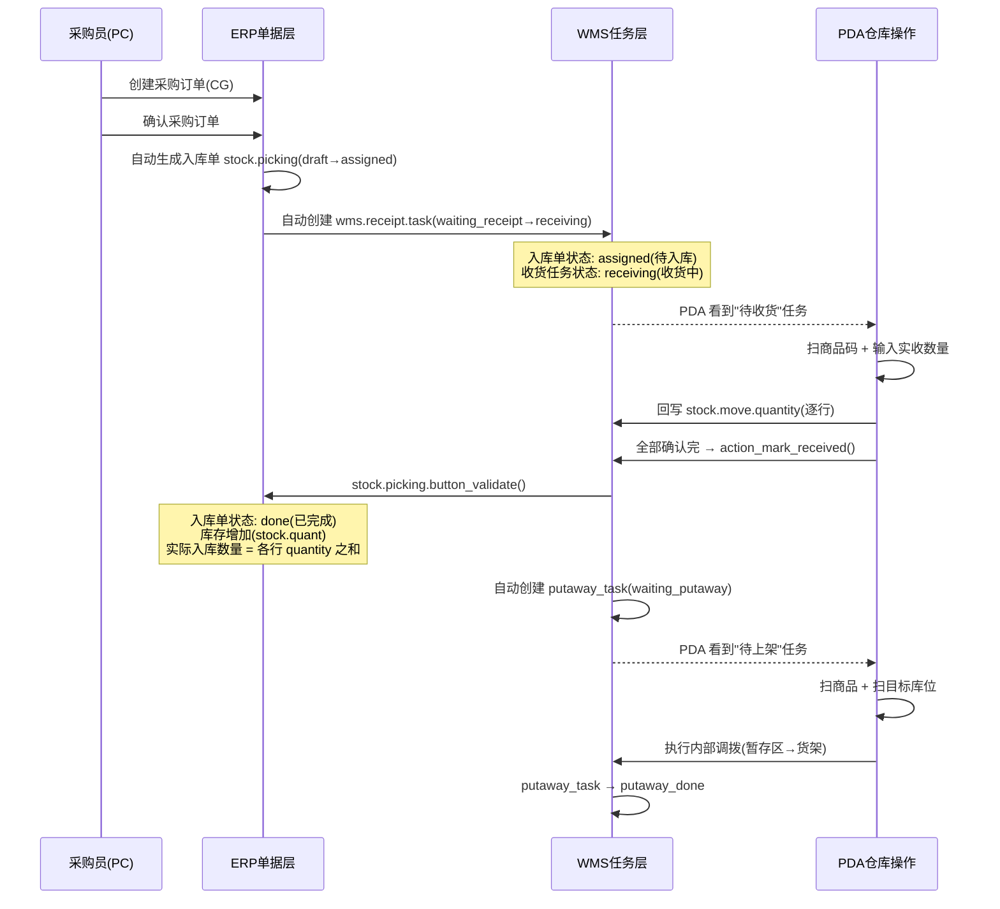

### 2.2 销售出库全流程

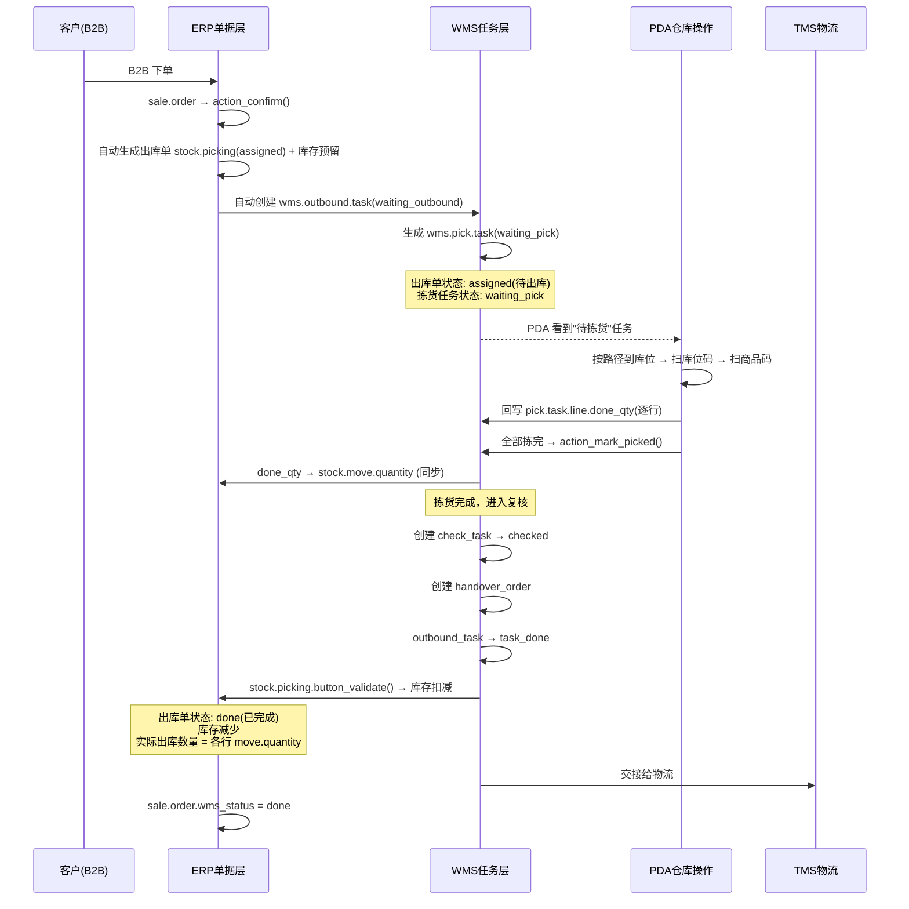

### 2.3 采购退货出库全流程

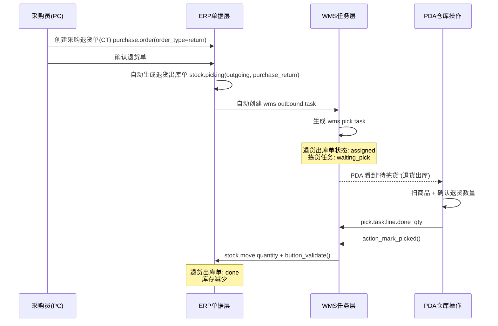

### 2.4 销售退货入库全流程

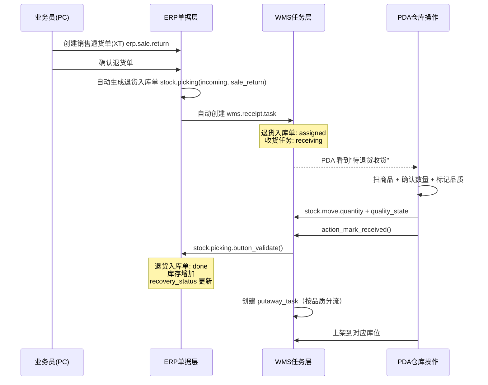

### 2.5 补货退库全流程

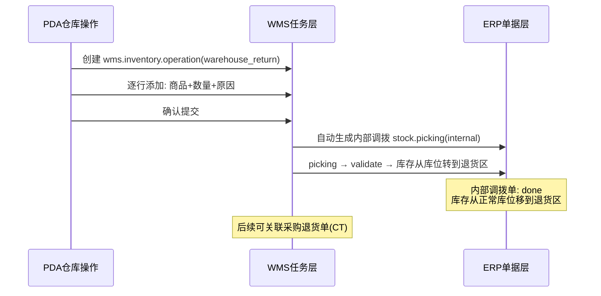

---

## 三、状态对照表

### 3.1 入库链路状态映射

| 阶段 | purchase.order | stock.picking | wms.receipt.task | wms.putaway.task | PDA 显示 |
|------|---------------|---------------|-----------------|-----------------|---------|
| 采购员创建 | draft | — | — | — | 不可见 |
| 采购员确认 | purchase | assigned | — | — | 不可见 |
| 系统派发任务 | purchase | assigned | **receiving** | — | "待收货" |
| PDA 逐行确认 | purchase | assigned | receiving | — | "收货中" |
| PDA 完成收货 | purchase | **done** | **received** | **waiting_putaway** | "待上架" |
| PDA 上架完成 | purchase | done | received | **putaway_done** | "已完成" |

**数量流转：**

```
预期数量: purchase.order.line.product_qty
    ↓ (生成入库单时复制)
预期入库: stock.move.product_uom_qty
    ↓ (PDA 扫码确认)
实际入库: stock.move.quantity  ← PDA 回写
    ↓ (button_validate)
库存增加: stock.quant.quantity
```

### 3.2 出库链路状态映射

| 阶段 | sale.order | stock.picking | wms.outbound | wms.pick | PDA 显示 |
|------|-----------|---------------|-------------|---------|---------|
| 客户下单 | draft | — | — | — | 不可见 |
| 订单确认 | sale | assigned | — | — | 不可见 |
| 系统派发任务 | sale | assigned | **task_created** | **waiting_pick** | "待拣货" |
| PDA 开始拣货 | sale | assigned | task_processing | **picking** | "拣货中" |
| PDA 完成拣货 | sale | assigned | task_processing | **picked** | "已拣完" |
| 复核通过 | sale | assigned | task_processing | picked | — |
| 交接完成 | sale | **done** | **task_done** | picked | "已完成" |

**数量流转：**

```
订单数量: sale.order.line.product_uom_qty
    ↓ (确认时生成)
需求数量: stock.move.product_uom_qty → pick.task.line.demand_qty
    ↓ (PDA 扫码确认)
实际拣货: pick.task.line.done_qty  ← PDA 回写
    ↓ (action_mark_picked 同步)
实际出库: stock.move.quantity
    ↓ (button_validate)
库存扣减: stock.quant.quantity
```

### 3.3 销售退货入库状态映射

| 阶段 | erp.sale.return | stock.picking | wms.receipt.task | PDA 显示 |
|------|----------------|---------------|-----------------|---------|
| 业务员创建 | draft | — | — | 不可见 |
| 确认退货 | confirmed | assigned | — | 不可见 |
| 系统派发 | confirmed | assigned | **receiving** | "待退货收货" |
| PDA 确认 | confirmed | assigned | receiving | "退货收货中" |
| PDA 完成 | **done** | **done** | **received** | "已完成" |

**数量流转：**

```
退货申请数量: erp.sale.return.line.qty
    ↓
预期入库: stock.move.product_uom_qty
    ↓ (PDA 确认)
实际入库: stock.move.quantity  ← PDA 回写
    ↓ (button_validate)
库存增加: stock.quant.quantity
```

### 3.4 采购退货出库状态映射

| 阶段 | purchase.order(return) | stock.picking | wms.outbound | wms.pick | PDA 显示 |
|------|----------------------|---------------|-------------|---------|---------|
| 采购员创建 | draft | — | — | — | 不可见 |
| 确认退货 | purchase | assigned | — | — | 不可见 |
| 系统派发 | purchase | assigned | task_created | **waiting_pick** | "待退货拣货" |
| PDA 拣货 | purchase | assigned | task_processing | **picking** | "退货拣货中" |
| PDA 完成 | purchase | **done** | **task_done** | **picked** | "已完成" |

---

## 四、当前缺失清单

### 4.1 ERP 单据层缺失

| 单据 | 缺失 | 说明 |
|------|------|------|
| stock.picking (入库) | `wms_receipt_state` 字段 | ERP 侧需要展示仓库执行进度 |
| stock.picking (出库) | 实际出库数量汇总 | `amount_total` 基于 move.quantity 而非 product_uom_qty |
| stock.picking | `pda_completed_at` 字段 | PDA 完成操作的时间戳 |
| stock.picking | `pda_operator_id` 字段 | 实际操作人（可能非单据创建人） |
| purchase.order | 入库单执行状态展示 | 采购员在 PC 上需看到仓库收货进度 |
| sale.order | 出库单执行状态展示 | 已有 `wms_status` 字段 ✅ |
| erp.sale.return | 入库执行状态 | 退货单需展示仓库是否已收到 |

### 4.2 WMS 任务层缺失

| 任务 | 缺失 | 说明 |
|------|------|------|
| wms.receipt.task | `actual_qty_total` compute | 汇总已确认的实收数量 |
| wms.receipt.task | `expected_qty_total` compute | 汇总预期数量 |
| wms.receipt.task | `completion_rate` compute | 完成百分比 |
| wms.receipt.task | `operator_id` 字段 | 实际收货人 |
| wms.putaway.task | 真实库存移动逻辑 | action_mark_done 需创建 internal move |
| wms.pick.task | `completion_rate` compute | 拣货完成百分比 |
| wms.pick.task | `operator_id` 字段 | 实际拣货人 |
| 全部任务 | `started_at` / `completed_at` | 实际开始/完成时间 |

### 4.3 状态反写缺失

| 触发点 | 需要反写 | 当前状态 |
|--------|---------|---------|
| 收货完成 | stock.picking → done | ❌ 缺失（需调 button_validate） |
| 上架完成 | 无需反写 picking | — |
| 拣货完成 | pick.line.done_qty → stock.move.quantity | ✅ 已修复 |
| 出库完成 | stock.picking → done (button_validate) | ✅ 已修复 |
| 退货收货完成 | stock.picking → done | ❌ 同入库缺失 |
| 退库确认 | 生成 internal picking | ✅ 已有 |

---

## 五、需要新增的字段与逻辑

### 5.1 stock.picking 新增字段

```python
# erp_base/models/stock_picking_ext.py 补充

pda_state = fields.Selection([
    ('not_started', '未开始'),
    ('in_progress', '执行中'),
    ('completed', '已完成'),
    ('exception', '异常'),
], string="PDA执行状态", default='not_started', compute='_compute_pda_state', store=True)

pda_operator_id = fields.Many2one('res.users', string="实际操作人")
pda_started_at = fields.Datetime(string="PDA开始时间")
pda_completed_at = fields.Datetime(string="PDA完成时间")
actual_qty_total = fields.Float(string="实际数量合计", compute='_compute_actual_qty')
expected_qty_total = fields.Float(string="预期数量合计", compute='_compute_expected_qty')
completion_rate = fields.Float(string="完成率%", compute='_compute_completion_rate')
```

### 5.2 WMS 任务新增字段

```python
# wms_task_core/models/wms_task_models.py 补充（所有任务通用）

operator_id = fields.Many2one('res.users', string="操作人")
started_at = fields.Datetime(string="开始时间")
completed_at = fields.Datetime(string="完成时间")
```

### 5.3 收货完成时的回写逻辑

```python
# wms.receipt.task.action_mark_received() 补充
def action_mark_received(self):
    for record in self:
        record.write({
            "state": "received",
            "completed_at": fields.Datetime.now(),
        })
        picking = record.stock_picking_id
        if picking:
            # 关键：触发 Odoo 原生入库确认
            picking.button_validate()
            picking.write({
                "pda_state": "completed",
                "pda_completed_at": fields.Datetime.now(),
                "pda_operator_id": self.env.uid,
            })
        # 创建上架任务
        if not record.putaway_task_ids:
            record.action_create_putaway_task()
    return True
```

### 5.4 上架完成时的库存移动逻辑

```python
# wms.putaway.task.action_mark_done() 补充
def action_mark_done(self):
    for record in self:
        if not record.dest_location_id:
            raise ValidationError("请先扫描目标库位")
        # 创建内部调拨移动
        move = self.env['stock.move'].create({
            'name': f'上架: {record.name}',
            'product_id': ...,  # 从 receipt 的 move 获取
            'location_id': record.source_location_id.id,
            'location_dest_id': record.dest_location_id.id,
            'product_uom_qty': record.qty,
            'product_uom': ...,
        })
        move._action_confirm()
        move._action_assign()
        move.write({'quantity': record.qty})
        move._action_done()

        record.write({
            "state": "putaway_done",
            "completed_at": fields.Datetime.now(),
        })
    return True
```

---

## 六、完整状态流转图

### 6.1 入库链路端到端

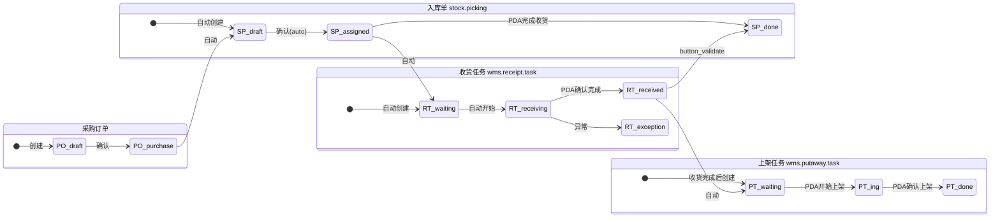

### 6.2 出库链路端到端

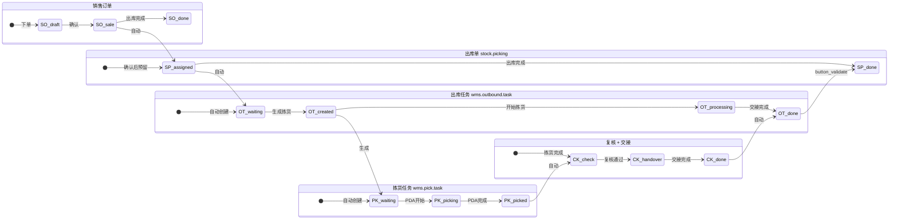

### 6.3 数量回写时机图

```mermaid
flowchart TD
    subgraph 入库["入库: 数量如何流转"]
        A1[purchase.order.line.product_qty<br/>采购数量: 4080] 
        A1 -->|"生成入库单"| A2[stock.move.product_uom_qty<br/>预期入库: 4080]
        A2 -->|"PDA扫码确认"| A3[stock.move.quantity<br/>实际入库: 4080 ← PDA写入]
        A3 -->|"button_validate"| A4[stock.quant.quantity<br/>库存+4080]
    end
    
    subgraph 出库["出库: 数量如何流转"]
        B1[sale.order.line.product_uom_qty<br/>订单数量: 60]
        B1 -->|"确认→出库单"| B2[stock.move.product_uom_qty<br/>需求: 60 → pick.line.demand_qty]
        B2 -->|"PDA拣货确认"| B3[pick.task.line.done_qty<br/>实拣: 60 ← PDA写入]
        B3 -->|"action_mark_picked"| B4[stock.move.quantity<br/>实际出库: 60]
        B4 -->|"button_validate"| B5[stock.quant.quantity<br/>库存-60]
    end
    
    style A3 fill:#e8f5e9
    style B3 fill:#e8f5e9
```

---

## 七、ERP 单据对 PDA 状态的展示需求

### 7.1 采购员在 PC 上看入库进度

```
采购订单详情页:
┌─────────────────────────────────────┐
│ 采购订单 CG10020260605              │
│ 状态: 已确认                         │
├─────────────────────────────────────┤
│ 关联入库单:                          │
│ ┌─────────────────────────────────┐│
│ │ RK10020260605018                ││
│ │ PDA状态: 🟡 执行中 (3/5行已收)  ││
│ │ 操作人: 张三                     ││
│ │ 开始时间: 2026-06-05 10:30       ││
│ │ 完成率: 60%                      ││
│ └─────────────────────────────────┘│
└─────────────────────────────────────┘
```

### 7.2 销售人员看出库进度

```
销售订单详情页:
┌─────────────────────────────────────┐
│ 销售订单 XS10020260605              │
│ WMS状态: 🟡 拣货中                  │
├─────────────────────────────────────┤
│ 关联出库单:                          │
│ ┌─────────────────────────────────┐│
│ │ XC10020260605389                 ││
│ │ PDA状态: 🟡 拣货中 (2/5行已拣)  ││
│ │ 操作人: 李四                     ││
│ │ 完成率: 42%                      ││
│ └─────────────────────────────────┘│
│                                     │
│ 物流状态: 待交接                     │
└─────────────────────────────────────┘
```

---

## 八、异常场景处理

### 8.1 入库异常：实收 ≠ 预期

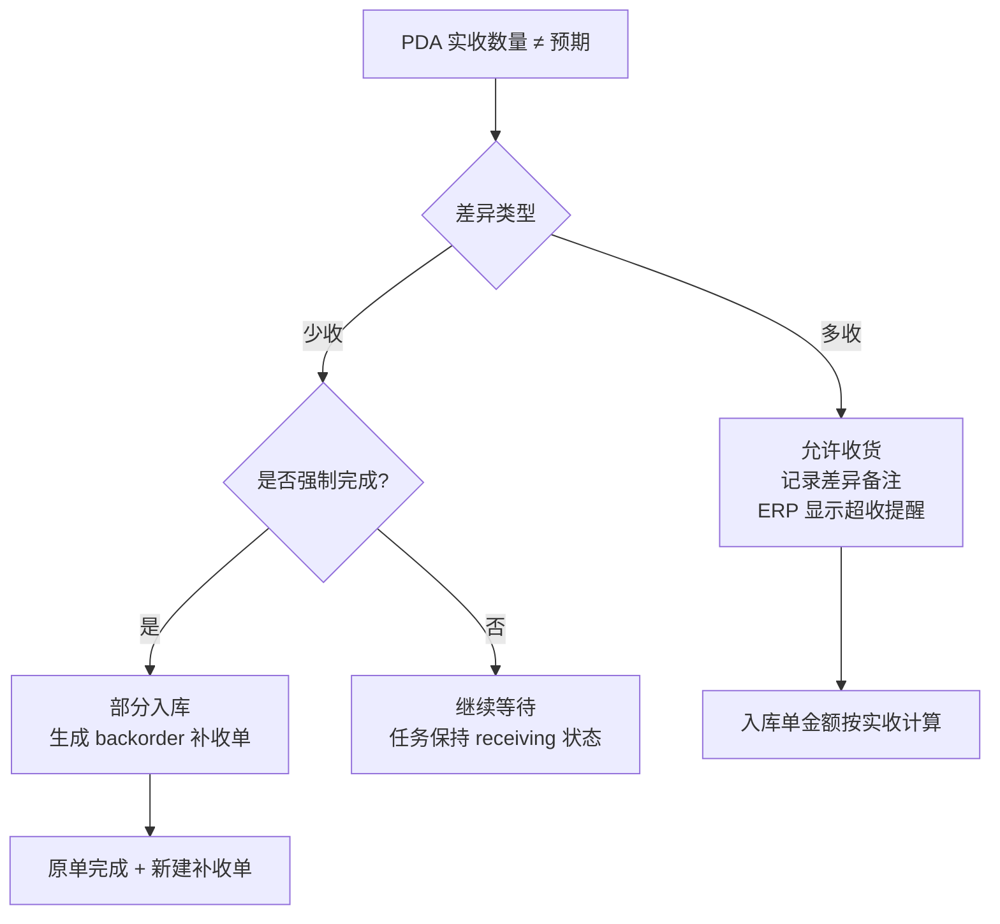

### 8.2 出库异常：库存不足

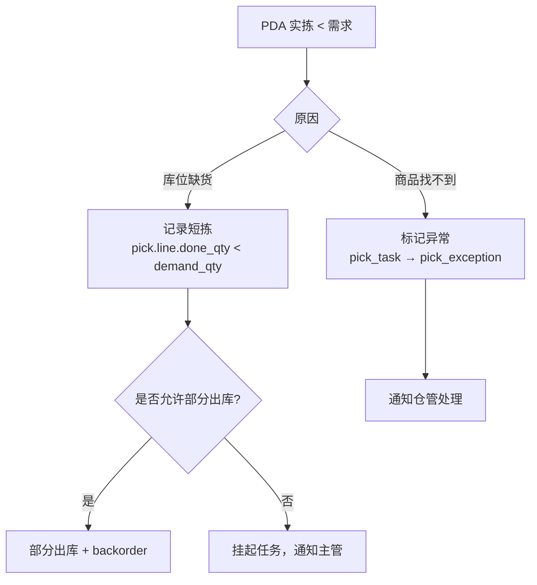

### 8.3 退货异常：品质问题

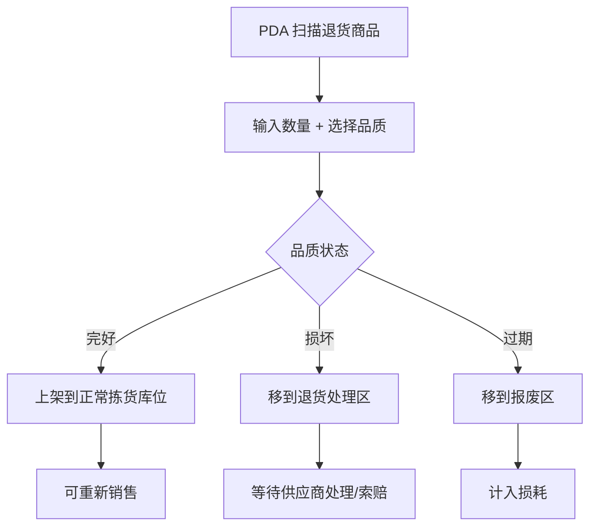

---

## 九、开发实施清单

基于以上分析，以下是需要新增/修改的代码清单：

| # | 改动 | 文件 | 依赖 | 优先级 |
|---|------|------|------|--------|
| 1 | stock.picking 新增 pda_state 等字段 | `erp_base/models/stock_picking_ext.py` | — | P0 |
| 2 | WMS 任务新增 operator_id/started_at/completed_at | `wms_task_core/models/wms_task_models.py` | — | P0 |
| 3 | receipt.action_mark_received 增加 button_validate | `wms_task_models.py` | #1 | P0 |
| 4 | putaway.action_mark_done 实现真实移库 | `wms_task_models.py` | — | P0 |
| 5 | stock.picking compute 字段(actual_qty/rate) | `stock_picking_ext.py` | #1 | P1 |
| 6 | purchase.order 关联 picking 的 pda_state 展示 | `purchase_order_views.xml` | #1 | P1 |
| 7 | erp.sale.return 确认后生成 picking + receipt_task | `erp_sale_return.py` | #3 | P0 |
| 8 | 部分收货/出库的 backorder 处理 | `wms_task_models.py` | — | P1 |
| 9 | 退货品质分流上架逻辑 | `wms_task_models.py` | #4 | P2 |

---

## 十、PC 端审核机制

### 10.1 设计原则

正常流程由 PDA 驱动完成，但以下场景需要 PC 端介入：

| 场景 | 触发条件 | PC 端操作 |
|------|---------|----------|
| 收货数量有差异 | PDA 标记为 `receipt_exception` | 主管审核：接受差异 / 要求重收 |
| 拣货短拣 | PDA 标记为 `pick_exception` | 主管确认：允许部分出库 / 重新分配 |
| 设备故障 | PDA 无法操作 | 主管在 PC 端手动完成任务 |
| 商品破损 | PDA 标记品质异常 | 主管审核：报废 / 退供应商 / 折价入库 |
| 系统数据错误 | 实际无此商品 | 主管修正数量 / 取消行 |

### 10.2 权限控制

```
仓库操作员（PDA）：
  ✅ 正常流程操作（扫码/确认数量/完成任务）
  ✅ 标记异常（数量不符/商品损坏/找不到货）
  ❌ 不能直接跳过异常
  ❌ 不能修改已确认的数量

仓库主管（PC）：
  ✅ 审核异常任务
  ✅ 手动调整数量
  ✅ 强制完成任务（设备故障场景）
  ✅ 取消/重新分配任务
  ❌ 不能直接完成未经 PDA 操作的正常任务（除非标记为异常后审核）
```

### 10.3 状态流转（含审核）

```mermaid
stateDiagram-v2
    direction LR
    
    state "PDA 正常流转" as NORMAL {
        waiting --> in_progress: PDA开始
        in_progress --> completed: PDA完成
    }
    
    state "异常+审核" as EXCEPTION {
        in_progress --> exception: PDA标记异常
        exception --> pending_review: 提交审核
        pending_review --> completed: 主管审核通过
        pending_review --> in_progress: 主管驳回(要求重做)
        pending_review --> cancelled: 主管取消任务
    }
    
    state "特殊场景" as SPECIAL {
        waiting --> force_complete: 主管强制完成(设备故障)
        force_complete --> completed: 需填写原因+确认
    }
```

### 10.4 审核操作详细流程

#### 场景 A：入库数量差异

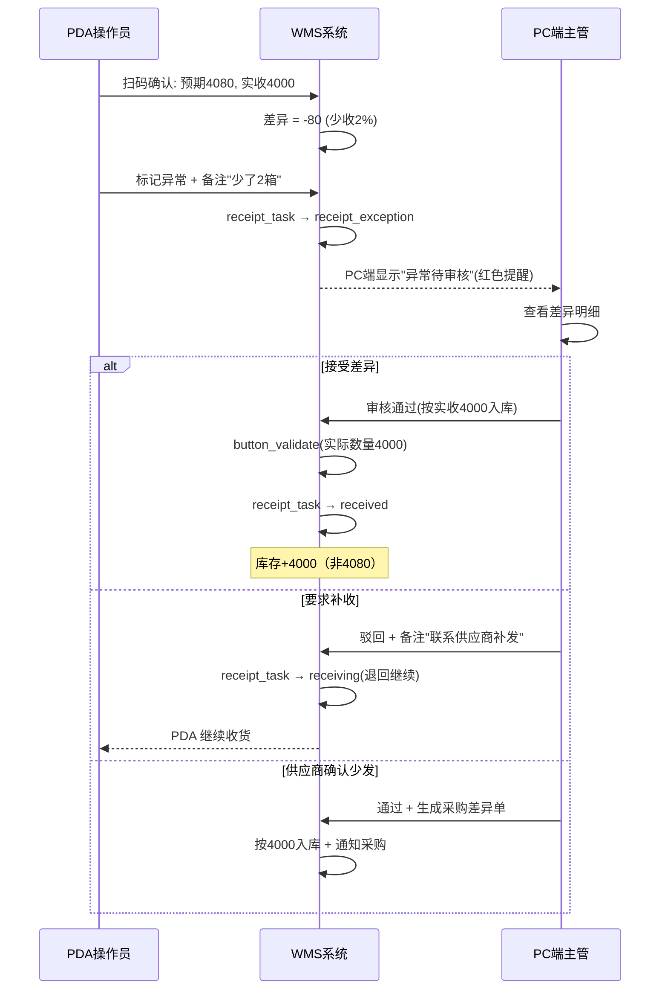

#### 场景 B：拣货短拣

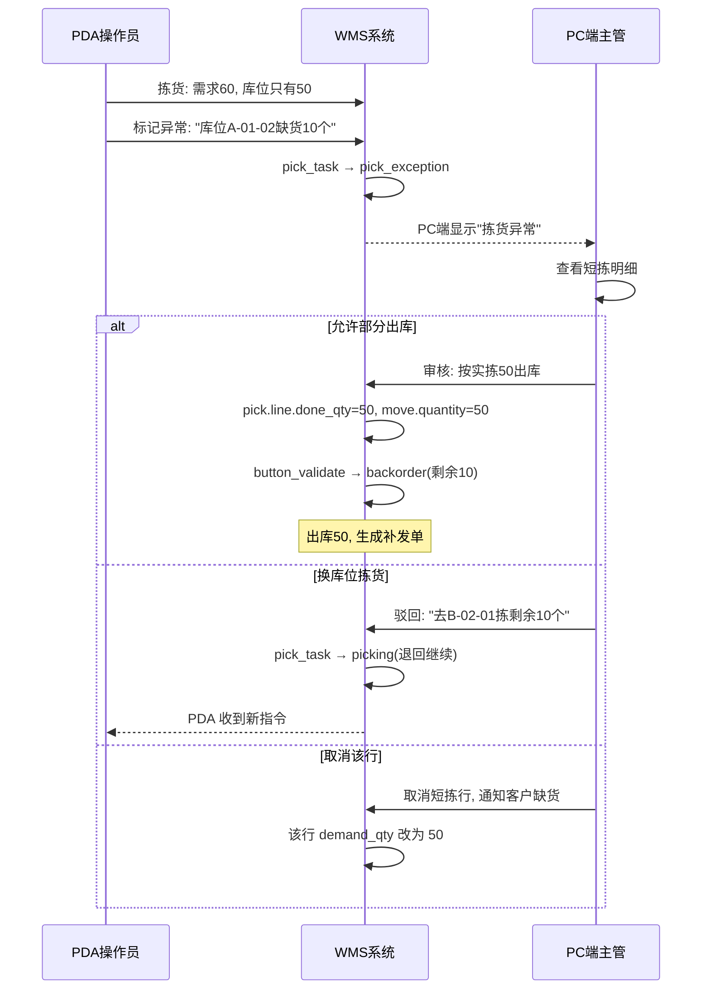

#### 场景 C：设备故障强制完成

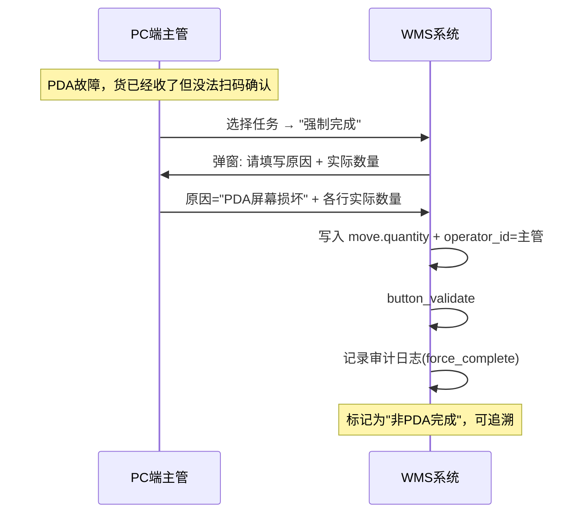

### 10.5 需要新增的字段

```python
# WMS 任务通用字段补充
review_state = fields.Selection([
    ('normal', '正常'),
    ('pending_review', '待审核'),
    ('reviewed', '已审核'),
    ('force_completed', '强制完成'),
], default='normal', string="审核状态")

review_user_id = fields.Many2one('res.users', string="审核人")
review_date = fields.Datetime(string="审核时间")
review_note = fields.Text(string="审核备注")
exception_note = fields.Text(string="异常说明")  # PDA 标记异常时填写
force_complete_reason = fields.Text(string="强制完成原因")
```

### 10.6 PC 端审核界面

```
┌─────────────────────────────────────────────────┐
│ 异常任务审核                               筛选 ▼ │
├─────────────────────────────────────────────────┤
│                                                 │
│ 🔴 WMS-REC-000201  入库收货异常                  │
│    操作员: 张三  时间: 2026-06-05 10:35          │
│    异常说明: 华农学士奶少收80盒                   │
│    差异: 预期4080 / 实收4000                     │
│    [通过(按实收)] [驳回(重收)] [查看详情]         │
│                                                 │
│ 🟡 WMS-PICK-000128  拣货短拣                     │
│    操作员: 李四  时间: 2026-06-05 14:20          │
│    异常说明: A-01-02库位缺货                      │
│    差异: 需求60 / 实拣50                          │
│    [允许部分出库] [换库位] [查看详情]             │
│                                                 │
└─────────────────────────────────────────────────┘
```

### 10.7 规则总结

| 规则 | 说明 |
|------|------|
| PDA 不能跳过异常 | 发现问题必须标记，不能强行完成 |
| PC 不能无中生有 | 只能处理 PDA 标记的异常或设备故障 |
| 强制完成需记录 | 所有非 PDA 完成的操作都有审计记录 |
| 审核有时限 | 超过 24h 未审核自动提醒主管 |
| 审核可追溯 | who/when/why 全部记录 |

---

## 十一、总结

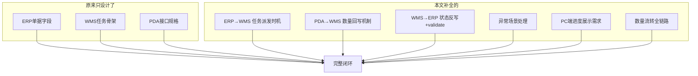

**核心结论：**

1. **ERP 单据** → 确认后自动生成 WMS 任务 → PDA 可见
2. **PDA 操作** → 回写实际数量到 WMS 任务 → 同步到 stock.move
3. **WMS 任务完成** → 触发 button_validate → ERP 单据变为 done + 库存变动
4. **每个环节**都有状态、有数量、有操作人、有时间，形成完整审计链
