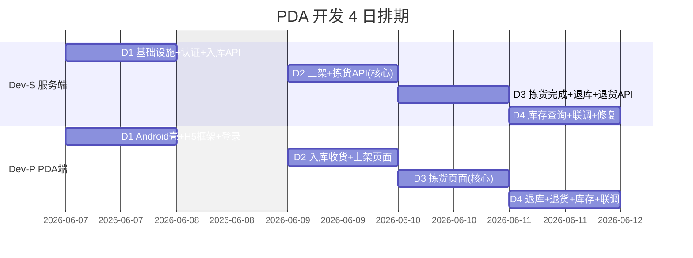
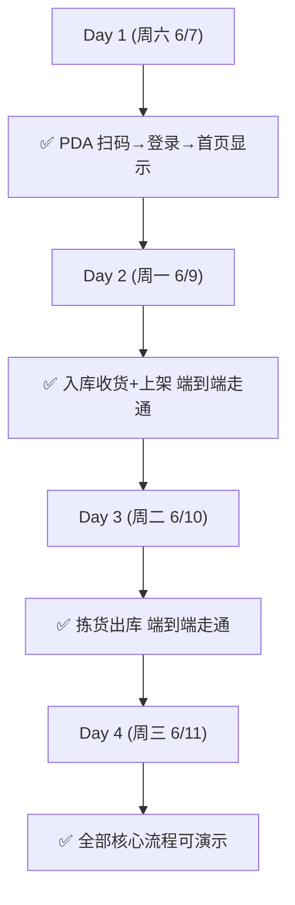
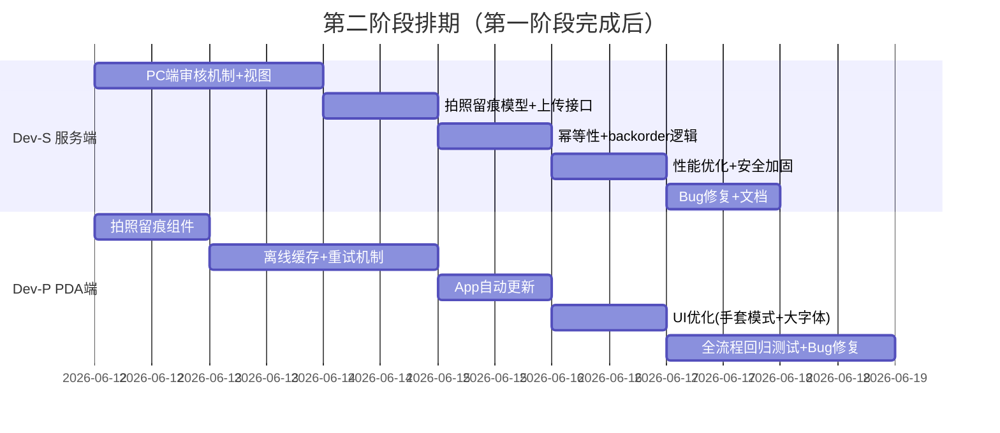
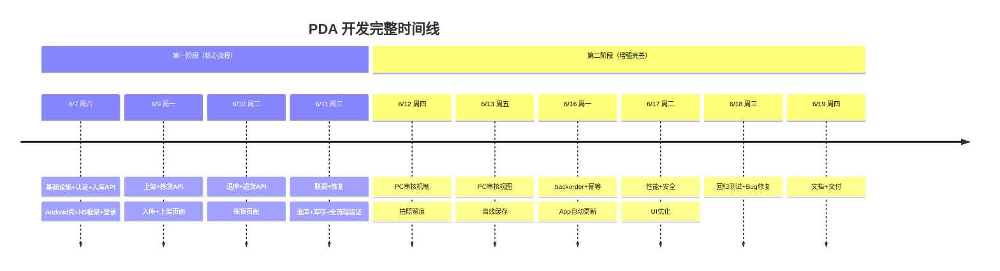

# PDA 开发计划 — 双人分工（4日版）

> 版本: v2.0
> 日期: 2026-06-05（更新）
> 截止: **2026-06-11（周三）**
> 工作日: 周六6/7、周一6/9、周二6/10、周三6/11（共4天）
> 设备: 优博讯 i6310
> 依据: 02~08 号设计文档

---

## 一、团队分工

| 角色 | 代号 | 职责范围 | 技术栈 |
|------|------|---------|--------|
| 服务端开发 | **Dev-S** | Odoo API Controller、WMS 模型补全、条码解析、认证 | Python + Odoo |
| PDA 端开发 | **Dev-P** | Android 壳（Kotlin）、H5 前端（Vue3）、扫码集成、UI | Kotlin + Vue3 + Vant |

**协作方式：**
- 接口契约即合约：`08-PDA接口契约-开发分工接口定义.md`
- Dev-P 第一天使用 Mock 数据并行开发，不等 Dev-S
- Dev-S 优先产出认证 + 入库 API → Dev-P 当天切换真实接口
- 每天下班前 15 分钟快速同步

---

## 二、总览排期



---

## 三、每日工时预算

| 日期 | 星期 | 有效工时/人 | 说明 |
|------|------|------------|------|
| 6/7 | 周六 | 10h | 高强度启动日 |
| 6/9 | 周一 | 10h | 核心功能日 |
| 6/10 | 周二 | 10h | 功能完成日 |
| 6/11 | 周三 | 8h | 联调+收尾日 |
| **合计/人** | | **38h** | |

> 裁剪策略：拍照留痕、离线缓存、自动更新、PC审核视图 → 移至第二阶段
> 本阶段目标：**核心业务流程跑通**（入库→上架→拣货→退库→库存查询）

---

## 四、详细任务清单

### Day 1：周六 6/7 — 基础设施 + 入库

#### Dev-S 任务（10h）

| # | 任务 | 产出 | 预估 | 完成标志 |
|---|------|------|------|---------|
| S-1.1 | 创建 `wms_pda_api` 模块骨架 | 目录结构 + manifest | 0.5h | 模块可安装 |
| S-1.2 | `WmsPdaBaseController` 基类 | 认证/响应/错误处理 | 1.5h | 基类代码可用 |
| S-1.3 | Token 认证（wms.api.token） | 登录接口可调通 | 2h | curl 测试登录成功 |
| S-1.4 | 条码解析服务 | `POST /barcode/parse` | 1.5h | 商品/库位/任务解析正确 |
| S-1.5 | 基础配置接口 | `GET /config/options` | 0.5h | 返回选项列表 |
| S-1.6 | 入库收货列表 API | `GET /receipt/tasks` | 1h | 返回待收货任务 |
| S-1.7 | 收货任务明细 API | `GET /receipt/tasks/{id}/lines` | 1h | 返回 move 行 |
| S-1.8 | 确认收货行 API | `POST .../confirm-line` | 1.5h | move.quantity 写入 |

**小计**: 10h

**Day 1 结束 Dev-S 产出：** 登录 + 条码解析 + 入库收货（列表/明细/确认行）接口可用

---

#### Dev-P 任务（10h）

| # | 任务 | 产出 | 预估 | 完成标志 |
|---|------|------|------|---------|
| P-1.1 | 创建 Android 项目 + WebView | APK 壳可安装运行 | 2h | H5 页面在 PDA 上显示 |
| P-1.2 | 集成 Urovo i6310 扫码 SDK | 扫码广播触发 | 2h | 扫码能收到内容 |
| P-1.3 | JS Bridge（beep/vibrate/scan） | bridge 调用正常 | 1h | H5 调用蜂鸣成功 |
| P-1.4 | 创建 Vue3 + Vite H5 项目 | 项目骨架 | 1h | 本地 dev server 跑通 |
| P-1.5 | HTTP Client + Mock 数据 | api 封装 + mock json | 1h | 模拟请求可返回 |
| P-1.6 | 登录页 + token 存储 | `/login` | 1.5h | 登录流程可走通 |
| P-1.7 | 首页（任务看板 + 功能入口） | `/home` | 1.5h | 首页显示模块入口 |

**小计**: 10h

**Day 1 结束 Dev-P 产出：** PDA 壳 + 扫码 + 登录 + 首页可运行（Mock 数据）

---

**Day 1 验收点（周六晚）：** PDA 扫码 → H5 收到条码 → 调用 Dev-S 的登录接口 → 返回 token ✅

---

### Day 2：周一 6/9 — 入库完成 + 上架 + 拣货开始

#### Dev-S 任务（10h）

| # | 任务 | 产出 | 预估 | 完成标志 |
|---|------|------|------|---------|
| S-2.1 | 完成收货 API（含 button_validate） | `POST .../complete` | 2.5h | 入库单变 done |
| S-2.2 | 上架任务列表 API | `GET /putaway/tasks` | 1h | 返回待上架列表 |
| S-2.3 | 确认上架 API（含真实移库） | `POST .../confirm` | 2h | stock.move 创建+完成 |
| S-2.4 | 完成上架 API | `POST .../complete` | 0.5h | 任务状态→done |
| S-2.5 | 拣货任务列表 API | `GET /pick/tasks` | 1h | 返回待拣货列表 |
| S-2.6 | 拣货明细 API（含路径排序） | `GET /pick/tasks/{id}/lines` | 1.5h | 返回行+progress |
| S-2.7 | 确认拣货行 API（双校验） | `POST .../confirm-line` | 1.5h | line.done_qty 写入 |

**小计**: 10h

**Day 2 结束 Dev-S 产出：** 入库全流程 + 上架全流程 + 拣货（列表/明细/确认行）可用

---

#### Dev-P 任务（10h）

| # | 任务 | 产出 | 预估 | 完成标志 |
|---|------|------|------|---------|
| P-2.1 | 收货任务列表页 | `/receipt/list` | 1.5h | 列表展示正常 |
| P-2.2 | 收货操作页（逐行扫码确认） | `/receipt/:id` | 3.5h | 扫码→确认→进度更新 |
| P-2.3 | 上架任务列表页 | `/putaway/list` | 1h | 列表展示 |
| P-2.4 | 上架操作页（扫商品→扫库位） | `/putaway/:id` | 2.5h | 扫码流程走通 |
| P-2.5 | 切换 Mock → 真实接口（认证+入库） | 联调 | 1.5h | 真实数据展示 |

**小计**: 10h

**Day 2 验收点（周一晚）：** PDA 真机完成一次完整入库 + 上架 → Odoo 库存增加 ✅

---

### Day 3：周二 6/10 — 拣货完成 + 退库 + 退货入库

#### Dev-S 任务（10h）

| # | 任务 | 产出 | 预估 | 完成标志 |
|---|------|------|------|---------|
| S-3.1 | 完成拣货 API（move 同步 + validate） | `POST .../complete` | 2.5h | 出库单完成 |
| S-3.2 | 拣货汇总 API | `GET .../summary` | 0.5h | progress 数据 |
| S-3.3 | 创建退库单 API | `POST /return/create` | 1h | 退库单创建 |
| S-3.4 | 添加退库行 API | `POST /return/{id}/add-line` | 1h | 行添加成功 |
| S-3.5 | 提交退库 API | `POST /return/{id}/confirm` | 1.5h | 生成 picking |
| S-3.6 | 退货入库任务列表 API | `GET /sale-return/tasks` | 1h | 列表返回 |
| S-3.7 | 确认退货收货行 API（含品质） | `POST .../confirm-line` | 1.5h | qty + quality 写入 |
| S-3.8 | 完成退货收货 API | `POST .../complete` | 1h | 入库完成 |

**小计**: 10h（紧凑）

**Day 3 结束 Dev-S 产出：** 全部 24 个核心 API 开发完成

---

#### Dev-P 任务（10h）

| # | 任务 | 产出 | 预估 | 完成标志 |
|---|------|------|------|---------|
| P-3.1 | 拣货任务列表页 | `/pick/list` | 1.5h | 列表展示 |
| P-3.2 | 拣货操作页（路径导航+逐行扫码） | `/pick/:id` | 5h | 扫库位→扫商品→确认 |
| P-3.3 | 拣货完成确认（放排线位） | 弹窗 | 1.5h | 提交完成 |
| P-3.4 | 扫码步骤状态机封装 | composable | 1h | 可复用逻辑 |
| P-3.5 | 切换拣货接口为真实接口 | 联调 | 1h | 拣货流程走通 |

**小计**: 10h

**Day 3 验收点（周二晚）：** PDA 完成一次完整拣货 → Odoo 出库单 done + 库存扣减 ✅

---

### Day 4：周三 6/11 — 剩余页面 + 全流程联调

#### Dev-S 任务（8h）

| # | 任务 | 产出 | 预估 | 完成标志 |
|---|------|------|------|---------|
| S-4.1 | 库存查询 API（按商品/按库位） | 2 个 GET 接口 | 1.5h | quant 查询正确 |
| S-4.2 | 任务锁机制 | `wms.task.lock` | 1.5h | 并发保护 |
| S-4.3 | 幂等性处理（request_id 去重） | 中间件 | 1h | 重复请求不重复写入 |
| S-4.4 | 全流程联调（入库→上架→拣货→退库） | 与 Dev-P 配合 | 2.5h | 全链路走通 |
| S-4.5 | Bug 修复 + 边界情况 | — | 1.5h | 无阻塞性 bug |

**小计**: 8h

---

#### Dev-P 任务（8h）

| # | 任务 | 产出 | 预估 | 完成标志 |
|---|------|------|------|---------|
| P-4.1 | 退库操作页（创建+扫码添加行+提交） | `/return/create` | 2h | 退库流程走通 |
| P-4.2 | 退货入库页 | `/sale-return/:id` | 2h | 退货收货走通 |
| P-4.3 | 库存查询页（扫码查库存） | `/inventory` | 1.5h | 扫码查看结果 |
| P-4.4 | 全流程真机联调 | 端到端验证 | 2h | 无阻塞 |
| P-4.5 | UI 细节修复（字号/间距/反馈） | 体验优化 | 0.5h | 可演示 |

**小计**: 8h

**Day 4 验收点（周三下班）：** 全部核心流程端到端可演示 ✅

---

## 五、每日验收检查表



---

## 六、工时汇总

| 角色 | Day 1 (周六) | Day 2 (周一) | Day 3 (周二) | Day 4 (周三) | **合计** |
|------|-------------|-------------|-------------|-------------|---------|
| Dev-S | 10h | 10h | 10h | 8h | **38h** |
| Dev-P | 10h | 10h | 10h | 8h | **38h** |
| **日合计** | 20h | 20h | 20h | 16h | **76h** |

---

## 七、范围裁剪（移至第二阶段）

以下功能不在本次 4 天范围内，留到下一阶段：

| 功能 | 预估 | 原因 |
|------|------|------|
| 拍照留痕（CameraManager） | 5h | 非核心流程阻塞项 |
| 离线缓存（localStorage 队列） | 3h | 仓库 WiFi 正常情况不需要 |
| App 自动更新 | 2h | 初期手动安装即可 |
| PC 端审核视图 | 6h | 先用 Odoo 后台直接操作 |
| 部分收货 backorder | 2h | 先用 force_complete |
| UI 极致优化（手套模式等） | 2h | 基本可用即可 |
| **合计** | **20h/人** | **留到 6/12 以后** |

---

## 八、并行策略与依赖关系

```mermaid
flowchart TB
    subgraph "Day 1 周六"
        direction LR
        S1["Dev-S: 基类+认证+条码+入库API"]
        P1["Dev-P: 壳+扫码+H5框架+登录"]
        S1 -.->|"晚上: 认证接口可用"| P1
    end
    
    subgraph "Day 2 周一"
        direction LR
        S2["Dev-S: 完成入库+上架+拣货前半"]
        P2["Dev-P: 入库页面+上架页面<br/>切换真实接口"]
        S2 -.->|"上午: 入库API全可用"| P2
    end
    
    subgraph "Day 3 周二"
        direction LR
        S3["Dev-S: 拣货完成+退库+退货全部"]
        P3["Dev-P: 拣货页面(核心)<br/>切换拣货真实接口"]
        S3 -.->|"上午: 拣货API全可用"| P3
    end
    
    subgraph "Day 4 周三"
        direction LR
        S4["Dev-S: 库存查询+锁+幂等+联调"]
        P4["Dev-P: 退库+退货+库存页面<br/>全流程联调"]
        S4 <-->|"全天: 联调修复"| P4
    end
```



**关键原则：Dev-S 始终领先 Dev-P 半天**
- Dev-S 上午完成的接口 → Dev-P 下午对接
- Dev-P 对接不上的 → 当天晚上 Dev-S 修复
- 问题不过夜

---

## 九、分支管理（简化版）

```
main
  └── develop
       ├── feat/pda-api       (Dev-S, 全部服务端代码)
       └── feat/pda-client    (Dev-P, 全部 PDA 端代码)
```

> 4 天期间不拆细分支，避免合并冲突消耗时间。
> 结束后统一 code review → merge to develop。

---

## 十、风险与应对

| 风险 | 概率 | 影响 | 应对 |
|------|------|------|------|
| i6310 扫码 SDK 集成失败 | 中 | 高 | Day 1 上午第一件事验证；备选：USB 扫码枪 |
| button_validate 产生 backorder | 高 | 中 | 本阶段 force_complete=True，下阶段处理 |
| 接口联调字段不对 | 高 | 低 | 以 08 号文档为准，发现问题即时修改 |
| 单日 10h 产出不够 | 中 | 中 | 优先完成当日验收点任务，非核心任务降级 |
| 测试数据不足 | 中 | 中 | Dev-S Day 1 下午准备 demo 数据脚本 |

---

## 十一、每日站会（5 分钟）

```
时间: 每天中午 12:00 (或晚上 21:00 远程同步)

格式:
  Dev-S: [当前任务号] 完成了 X / 遇到 Y 问题
  Dev-P: [当前任务号] 完成了 X / 需要 Y 接口
  对齐: 下午/明天的集成点确认
```

---

## 十二、交付物清单

| # | 交付物 | 责任人 | 截止 |
|---|--------|--------|------|
| 1 | `wms_pda_api` 模块（可安装运行） | Dev-S | 周三 |
| 2 | `wms_task_core` 模型补全 | Dev-S | 周三 |
| 3 | Android APK（可安装到 i6310） | Dev-P | 周三 |
| 4 | H5 构建产物（部署到测试服务器） | Dev-P | 周三 |
| 5 | Postman 接口测试集 | Dev-S | 周三 |
| 6 | 全流程演示视频/截图 | 双方 | 周三 |

---

## 十三、第二阶段计划（6/12 起，第一阶段完成后启动）

> 前置条件：第一阶段全部核心流程走通且可演示
> 预计工期：5-6 个工作日（6/12 ~ 6/19）
> 优先级从高到低排列

### 13.1 第二阶段排期总览



### 13.2 第二阶段任务详情

#### 优先级 P0（必须做）

| # | 任务 | 责任人 | 预估 | 说明 |
|---|------|--------|------|------|
| Ⅱ-1 | PC 端审核机制 | Dev-S | 6h | 异常任务 PC 审核/强制完成，含 review_state 字段、审核接口、操作日志 |
| Ⅱ-2 | PC 端 pda_state 视图 | Dev-S | 3h | purchase/sale order 表单上展示 PDA 执行状态和进度 |
| Ⅱ-3 | 拍照留痕 | 双方 | 5h (S:2h + P:3h) | `wms.task.photo` 模型 + CameraX 拍照 + OSS 上传 + URL 回写 |
| Ⅱ-4 | 部分收货/出库 backorder | Dev-S | 2h | 实收≠预期时正确生成 backorder 而非 force |

#### 优先级 P1（应该做）

| # | 任务 | 责任人 | 预估 | 说明 |
|---|------|--------|------|------|
| Ⅱ-5 | 离线缓存+网络恢复重试 | Dev-P | 3h | localStorage 队列，网络恢复自动重发 |
| Ⅱ-6 | 幂等性完善（request_id） | Dev-S | 2h | 关键写操作去重，wms.api.request.log 模型 |
| Ⅱ-7 | App 自动更新 | Dev-P | 2h | 版本检查 + APK 下载安装 |
| Ⅱ-8 | 任务锁超时自动释放 | Dev-S | 1h | cron job 每 5 分钟清理过期锁 |

#### 优先级 P2（锦上添花）

| # | 任务 | 责任人 | 预估 | 说明 |
|---|------|--------|------|------|
| Ⅱ-9 | UI 极致优化（手套模式） | Dev-P | 2h | 大按钮、高对比色、触控区域加大 |
| Ⅱ-10 | 语音播报优化 | Dev-P | 1h | TTS 播报精简化，连续操作不打断 |
| Ⅱ-11 | 操作日志/审计追踪完善 | Dev-S | 2h | 所有关键操作记录到 mail.message |
| Ⅱ-12 | 批量拣货支持（合单拣货） | Dev-S | 4h | 多个 pick task 合并为一次拣货路径 |
| Ⅱ-13 | 仓库数据看板（PDA首页） | Dev-S + P | 3h | 今日入/出/退 统计数字 |
| Ⅱ-14 | 安全加固（登录失败锁定等） | Dev-S | 1.5h | 5次失败锁15分钟，token 单设备互斥 |

### 13.3 第二阶段工时汇总

| 优先级 | Dev-S | Dev-P | 合计 |
|--------|-------|-------|------|
| P0（必须做） | 13h | 3h | 16h |
| P1（应该做） | 3h | 5h | 8h |
| P2（锦上添花） | 7.5h | 3h | 10.5h |
| **合计** | **23.5h** | **11h** | **34.5h** |

> 按每人每天 8h 有效产出：
> - Dev-S: ~3 个工作日（P0+P1）；含 P2 约 4 天
> - Dev-P: ~1.5 个工作日（P0+P1）；含 P2 约 2 天
> - P0+P1 全部完成预计 **3-4 个工作日**

### 13.4 第二阶段验收标准

| 验收点 | 标准 |
|--------|------|
| PC 审核 | 主管可在 Odoo 后台查看异常任务、审核通过/驳回 |
| 拍照留痕 | PDA 拍照 → 图片出现在 Odoo 任务记录中 |
| 离线缓存 | 断网操作 → 恢复网络 → 数据自动同步无丢失 |
| 自动更新 | 发布新版本 → PDA 弹窗提示更新 → 安装成功 |
| backorder | 收货 80/100 完成 → 剩余 20 自动生成新入库单 |

### 13.5 两阶段整体时间线


