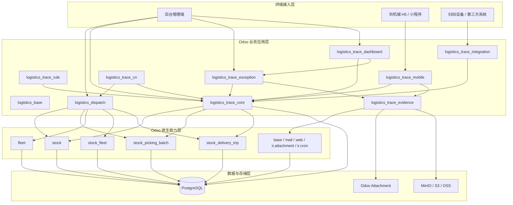
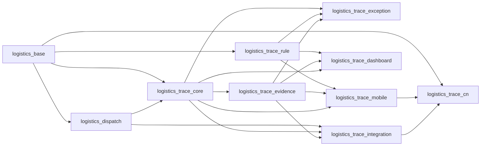

# Odoo 19 物流留痕系统模块重设方案

本文档基于以下已有材料继续向下推进：

- `../00-总览/系统重构核心设计摘要.md`
- `Odoo19物流留痕系统扩展规划.md`
- `../01-治理与范围/明确暂不需要的模块和功能.md`

本文档目标：

1. 根据“物流留痕取证”这个核心目标，判断还需要补充哪些模块
2. 将已有模块想法重新设计成一套更贴近 Odoo 的模块结构
3. 给出带 Odoo 的整体框架图和模块依赖图

---

## 1. 先给结论

如果只基于 [系统重构核心设计摘要](../00-%E6%80%BB%E8%A7%88/%E7%B3%BB%E7%BB%9F%E9%87%8D%E6%9E%84%E6%A0%B8%E5%BF%83%E8%AE%BE%E8%AE%A1%E6%91%98%E8%A6%81.md) 里的高层能力来落地，当前模块集合还不够。

目前最明显缺少的，不是“又多几个业务页面”，而是下面四类**支撑性模块**：

- 基础能力模块
- 调度执行模块
- 合规规则模块
- 对外接入/集成模块

所以在原先规划的基础上，建议把模块体系从“6 个核心模块”扩展成“`Odoo 原生底座 + 8 个自定义模块`”。

---

## 2. 为什么现有模块还不够

你在重构摘要里已经明确了系统的核心：

- 留痕证据闭环
- 司机端效率
- 后台追溯

但如果要真正做成一个可运行、可交付、可持续扩展的 Odoo 系统，只做下面这些模块还不够：

- `logistics_trace_core`
- `logistics_trace_evidence`
- `logistics_trace_mobile`
- `logistics_trace_exception`
- `logistics_trace_dashboard`
- `logistics_trace_cn`

原因是：

### 2.1 缺少统一基础层

现在还缺一个承接通用字典、编号规则、共享字段、共享 mixin、统一配置的基础模块。

否则后面每个模块都会重复定义：

- 留痕类型
- 异常类型
- 证据分类
- 司机端来源枚举
- 通用状态字段

### 2.2 缺少“执行组织”模块

你现在已有：

- 订单
- 批次
- 车次
- 留痕

但还缺一个清晰的“执行组织层”设计。

也就是说，系统需要一个明确承接：

- 仓内批次组织
- 装车组织
- 出车任务
- 车次执行状态

的模块，而不是只靠 `stock.picking.batch` 和 `stock.delivery.trip` 的原始字段自然长出来。

### 2.3 缺少“留痕合规规则”模块

你的系统最终卖点之一，不只是“能拍图”，更是：

- 该拍的时候必须拍
- 缺图时能发现
- 不合规能预警
- 节点质量能统计

这部分不能只写死在代码里，更适合做成一个可配置的规则模块。

### 2.4 缺少“对外接入层”模块

司机端、小程序、扫码枪、第三方物流接口、对象存储，未来都会需要统一接入点。

如果没有独立接入层，后续会出现：

- 移动端逻辑散在业务模块里
- 对接代码混到核心模块
- 扩展时边界越来越乱

---

## 3. 重新设计后的整体框架

建议把系统分成四层：

1. 终端接入层
2. Odoo 业务应用层
3. Odoo 原生能力层
4. 数据与存储层

### 3.1 整体框架图



### 3.2 设计口径

这张图表达的是：

- Odoo 原生模块负责订单、库存、批次、车辆、车次、权限、任务、附件等底座能力
- 自定义模块负责留痕产品层
- 司机端、小程序、第三方接口不直接碰 Odoo 后台视图，而是走专用接入模块
- 证据文件逻辑上属于 `logistics_trace_evidence`，物理上可落 Odoo 附件或对象存储

---

## 4. Odoo 原生模块与自定义模块分工

### 4.1 Odoo 原生模块保留职责

建议继续复用这些模块作为底座：

- `stock`
  承接履约执行、拣货单、收发货、签收等主对象
- `stock_picking_batch`
  承接仓内批次/波次
- `fleet`
  承接车辆对象
- `stock_fleet`
  承接运输组织扩展
- `stock_delivery_trip`
  承接车次、出车、交付证明上下文
- `base / web / mail / ir.attachment / ir.cron`
  承接系统基础设施

### 4.2 自定义模块负责产品层

真正体现“物流留痕系统”差异化价值的，全部放在自定义模块中。

这样做的好处是：

- 不把核心产品逻辑混到 Odoo 原生模块里
- 升级时边界清晰
- 商用合规更容易控制

---

## 5. 重新设计后的模块清单

下面给出建议的 8 个自定义模块。

---

## 5.1 `logistics_base`

### 定位

物流留痕系统基础模块。

### 为什么必须补

这个模块在之前规划里没有被单独抬出来，但实际上非常必要。

没有它，后面所有模块都会重复造基础设施。

### 核心职责

- 提供共享基础字段和 mixin
- 提供通用字典模型
- 提供编号规则
- 提供统一配置项
- 提供共享安全组和菜单根节点

### 建议承接内容

- 留痕类型字典
- 异常类型字典
- 证据分类字典
- 终端来源枚举
- 统一 sequence
- 统一 settings

### 依赖

- `base`
- `mail`

---

## 5.2 `logistics_dispatch`

### 定位

执行组织与调度中心。

### 为什么必须补

现在订单、批次、车次都有了，但“执行组织层”还不够清晰。

这个模块用来明确：

- 仓内批次如何组织
- 批次如何转为出车任务
- 车次如何承接订单
- 司机如何与车次绑定

### 核心职责

- 扩展 `stock.picking.batch`
- 扩展 `stock.delivery.trip`
- 明确批次与车次的边界
- 给司机端提供执行上下文
- 给后台提供批次/车次视图

### 建议承接内容

- 装车任务
- 出车任务
- 司机指派
- 车次执行状态
- 批次到车次映射

### 依赖

- `stock`
- `stock_picking_batch`
- `fleet`
- `stock_fleet`
- `stock_delivery_trip`
- `logistics_base`

---

## 5.3 `logistics_trace_core`

### 定位

留痕中心。

### 核心职责

- 定义留痕事件模型
- 统一承接运单级、批次级留痕，并兼容车次执行上下文
- 管理留痕来源、类型、提交人、提交时间、备注
- 提供留痕时间线

### 建议模型

- `logistics.trace.event`
- `logistics.trace.timeline.mixin`

### 必须保留的业务能力

- 一次留痕属于哪个业务对象
- 谁提交的
- 什么节点提交的
- 是否异常
- 何时提交的

### 依赖

- `logistics_base`
- `logistics_dispatch`

---

## 5.4 `logistics_trace_evidence`

### 定位

证据中心。

### 核心职责

- 管理图片、签名、备注附件等证据材料
- 建立留痕与证据的正式关系
- 区分普通附件与证据附件
- 支持预览、下载、状态校验

### 建议模型

- `logistics.trace.evidence`
- `logistics.trace.evidence.group`

### 为什么不能只用 `ir.attachment`

因为 `ir.attachment` 只适合做底层文件容器，不适合直接承接：

- 证据归属
- 证据分类
- 节点合规检查
- 缺图统计

### 依赖

- `logistics_trace_core`
- `mail`
- `base`

---

## 5.5 `logistics_trace_rule`

### 定位

留痕合规规则中心。

### 为什么必须补

这是之前规划里缺得比较明显的一个模块。

如果没有它，系统只能“允许上传”，不能“要求合规”。

### 核心职责

(现在的实现先简单处理这一块，默认所有节点都需要留痕)

- 定义哪些节点必须留痕
- 定义哪些节点必须有图片
- 定义最少证据数量
- 定义是否必须签名
- 定义是否必须备注
- 为看板和异常提供规则判断基础

### 建议模型

- `logistics.trace.rule`
- `logistics.trace.rule.line`
- `logistics.trace.check.result`

### 依赖

- `logistics_base`
- `logistics_trace_core`
- `logistics_trace_evidence`

---

## 5.6 `logistics_trace_mobile`

### 定位

司机端 / 现场端接入模块。

### 核心职责

- 提供移动端专用接口
- 提供扫码识别和订单校验
- 发起快速留痕提交
- 调用证据上传
- 返回清晰结果

### 设计原则

- 不是 Odoo 标准后台页面的移动适配版
- 而是独立的轻交互入口

### 建议承接内容

- 小程序 API
- H5 API
- 扫码识别
- 连续录入
- 弱网重试

### 依赖

- `logistics_dispatch`
- `logistics_trace_core`
- `logistics_trace_evidence`
- `logistics_trace_rule`

---

## 5.7 `logistics_trace_exception`

### 定位

异常与争议中心。

### 核心职责

- 将异常正式对象化
- 管理当前异常与历史异常
- 关联留痕与证据
- 支持从异常回看运单、订单、批次、车次、留痕和证据

### 建议模型

- `logistics.trace.exception`
- `logistics.trace.exception.history`

### 依赖

- `logistics_trace_core`
- `logistics_trace_evidence`
- `logistics_trace_rule`

---

## 5.8 `logistics_trace_dashboard`

### 定位

老板与管理层看板。

### 核心职责

- 展示缺图率
- 展示节点留痕完成率
- 展示异常数量与闭环率
- 展示司机留痕质量
- 展示批次/车次证据完整度

### 依赖

- `logistics_trace_core`
- `logistics_trace_evidence`
- `logistics_trace_exception`
- `logistics_trace_rule`

---

## 5.9 `logistics_trace_integration`

### 定位

对外接口与集成模块。

### 为什么建议补

这个模块在早期很容易被忽略，但一旦后续接：

- 微信小程序
- 第三方物流平台
- 对象存储
- OCR / AI 审核
- 外部司机系统

没有统一集成层会很乱。

### 核心职责

- 对外 API 编排
- 回调接入
- 第三方物流状态同步
- 对象存储接入抽象
- 后续 AI / OCR / 水印能力接入

### 依赖

- `logistics_trace_core`
- `logistics_trace_evidence`
- `logistics_dispatch`

---

## 5.10 `logistics_trace_cn`

### 定位

中国物流场景适配层。

### 核心职责

- 运单号规则
- 中文状态字典
- 本地打印口径
- 微信生态适配
- 国内物流接口适配

### 依赖

- `logistics_base`
- `logistics_dispatch`
- `logistics_trace_mobile`
- `logistics_trace_integration`

---

## 6. 模块依赖关系图



这张图表达的重点是：

- `logistics_base` 是全局基础层
- `logistics_dispatch` 是执行组织层
- `logistics_trace_core` 是主心骨
- `logistics_trace_evidence`、`logistics_trace_rule` 是两大支撑层
- `mobile`、`exception`、`dashboard` 是业务应用层
- `integration`、`cn` 是外部适配层

---

## 7. 建议的目录结构

建议自定义模块未来放在类似结构中：

```text
custom_addons/
├── logistics_base/
├── logistics_dispatch/
├── logistics_trace_core/
├── logistics_trace_evidence/
├── logistics_trace_rule/
├── logistics_trace_mobile/
├── logistics_trace_exception/
├── logistics_trace_dashboard/
├── logistics_trace_integration/
└── logistics_trace_cn/
```

每个模块内部保持统一结构：

```text
module_name/
├── __manifest__.py
├── models/
├── views/
├── security/
├── data/
├── controllers/
├── static/
└── README.md
```

---

## 8. 对原设计摘要的重设结论

结合 [系统重构核心设计摘要](../00-%E6%80%BB%E8%A7%88/%E7%B3%BB%E7%BB%9F%E9%87%8D%E6%9E%84%E6%A0%B8%E5%BF%83%E8%AE%BE%E8%AE%A1%E6%91%98%E8%A6%81.md)，现在建议做如下调整：

### 8.1 原来保留，但重新定位的模块

- 留痕中心
  重新落为 `logistics_trace_core`
- 图片证据能力
  重新落为 `logistics_trace_evidence`
- 异常管理
  重新落为 `logistics_trace_exception`
- 司机端 / 小程序端
  重新落为 `logistics_trace_mobile`
- 看板
  重新落为 `logistics_trace_dashboard`

### 8.2 原来缺失，现在补出来的模块

- `logistics_base`
- `logistics_dispatch`
- `logistics_trace_rule`
- `logistics_trace_integration`

这 4 个模块是本轮重设里最重要的补充。

### 8.3 原来属于 Odoo 原生底座，现在明确不重造的部分

- 订单履约对象
- 批次对象
- 车辆对象
- 车次基础对象
- 权限、菜单、附件、定时任务

这些优先复用 Odoo。

---

## 9. 当前推荐的开发顺序

### P0

- `logistics_base`
- `logistics_dispatch`
- `logistics_trace_core`
- `logistics_trace_evidence`
- `logistics_trace_mobile`

先打通：

- 运单/批次/车次上下文
- 留痕事件
- 证据上传
- 司机端提交
- 后台查看

### P1

- `logistics_trace_rule`
- `logistics_trace_exception`
- `logistics_trace_dashboard`

把系统从“能留痕”升级成“能管质量、能查异常、能看整体情况”。

### P2

- `logistics_trace_integration`
- `logistics_trace_cn`

再做本地化和外部生态扩展。

---

## 10. 本轮最终结论

如果现在重新设计模块体系，建议不要再把系统理解成“订单模块 + 图片模块 + 小程序模块”的松散组合。

更适合 Odoo 的设计方式是：

**Odoo 原生模块承接经营与履约底座，自定义模块分成基础层、执行层、留痕层、证据层、规则层、应用层、接入层。**

其中真正的主心骨是：

- `logistics_dispatch`
- `logistics_trace_core`
- `logistics_trace_evidence`
- `logistics_trace_rule`

只要这四层设计清楚，司机端、异常、看板、对外接入都会更顺，整个系统也会更像一套长期可维护的 Odoo 产品，而不是一组临时拼接的功能页。
