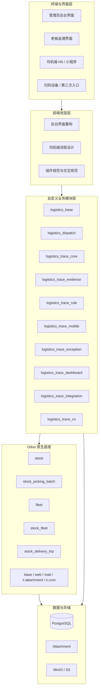

# Odoo19物流留痕系统五人分工与前端改造安排

本文档用于补充和替代四人分工版本。

新增前提是：

- 当前系统不仅需要模块级开发
- 还需要有人专门承担前端改造与体验收口
- 重点包括司机端小程序/H5，以及管理员看到的后台界面改造

因此，团队分工从“4 人版”升级为“5 人版”更合理。

相关文档：

- `../02-业务与模块/Odoo19物流留痕系统模块重设方案.md`
- `Odoo19物流留痕系统四人分工与首轮工作安排.md`
- `../00-总览/系统重构核心设计摘要.md`

---

## 1. 为什么必须单独设前端改造负责人

如果没有单独的前端负责人，项目很容易出现下面的问题：

- 后端模块都定义完了，但司机端操作路径没人真正收口
- 管理员后台虽然能用，但页面还是 Odoo 原生拼装感，体验不适合你的业务
- 小程序/H5 和后台页面由后端同学顺手兼做，最后往往谁都没空打磨
- 接口已经有了，但没有人把“页面、交互、流程、反馈”连成完整闭环

而你的系统恰好非常依赖两个前端入口：

- 司机端的快速留痕入口
- 管理员/老板的追溯查看入口

所以前端改造不是“后面再美化一下”，而是一期能力能不能真正被用起来的关键角色。

## 3. 与 Odoo 的整体协作框架

这张图要表达的是：

- Odoo 负责底层业务对象和后台基础设施
- 自定义模块负责留痕、证据、规则、异常、看板、集成
- 前端改造层负责把这些能力变成真正可用的司机端和后台界面
- 前端改造不是附属工作，而是独立的一层

---

## 4. 建议的五人分工

## 4.1 jq：总览与评审负责人

### 负责范围

- 总体架构
- 跨模块边界
- 接口风格审核
- 数据模型与数据库审核
- 阶段验收
- `logistics_base`
- `logistics_trace_rule`

### 首先要做的工作

1. 输出《总体设计与边界说明》
2. 输出《跨模块接口与数据约束总规范》
3. 输出《统一命名、状态机、编号规则》
4. 审核其他 4 组的设计文档

### 首轮产出

- 总体架构说明
- 接口总规范
- 数据审核清单
- 公共字典与状态机清单
- 留痕规则矩阵

---

## 4.2 jq：调度与执行组织负责人

### 负责模块

- `logistics_dispatch`
- `logistics_trace_cn`

### 核心职责

- 理顺订单、批次、车次、司机、车辆之间的执行关系
- 明确仓内组织与出车组织的边界
- 给留痕中心与司机端提供执行上下文

### 首先要做的工作

1. 写《调度执行模块设计文档》
2. 画清楚 `batch -> trip -> picking` 关系图
3. 明确司机指派、车辆指派、出车状态流转
4. 定义给留痕中心和司机端提供的上下文接口

### 首轮产出

- 调度领域模型设计
- 执行状态机
- 任务查询接口定义
- 批次/车次/订单关系说明

---

## 4.3 pn：留痕与证据中心负责人

### 负责模块

- `logistics_trace_core`
- `logistics_trace_evidence`

### 核心职责

- 定义留痕事件模型
- 定义证据对象模型
- 管理图片、签名、备注、元数据与留痕的关系
- 提供后台时间线与证据查看基础能力

### 首先要做的工作

1. 写《留痕中心模块设计文档》
2. 写《证据中心模块设计文档》
3. 定义留痕提交接口、证据挂接接口、留痕查询接口
4. 明确证据落地抽象

### 首轮产出

- 留痕事件模型说明
- 证据模型说明
- 留痕时间线说明
- 留痕与证据接口定义

---

## 4.4 zl：司机端小程序/H5 负责人

### 负责范围

- 司机端小程序/H5 页面设计
- 司机端流程设计
- 司机端交互反馈
- 司机端页面字段设计
- 司机端接口消费定义

### 这个角色的核心目标

他不直接拥有业务主模型，但拥有“司机端是否顺手”的最终责任。

他要保障的不是页面好不好看，而是司机能不能最快完成这条链：

- 扫码/识别
- 查看任务或订单摘要
- 拍照/选图
- 提交
- 收到明确反馈
- 继续下一单

### 需要协作的模块

- `logistics_trace_mobile`
- `logistics_dispatch`
- `logistics_trace_core`
- `logistics_trace_evidence`

### 首先要做的工作

1. 写《司机端前端改造方案》
2. 画出司机端关键流程图
3. 列出小程序/H5 页面清单
4. 定义司机端页面字段清单
5. 定义司机端接口消费清单
6. 定义弱网、补传、重试、成功反馈规则

### 首轮产出

- 司机端页面流程图
- 小程序/H5 页面清单
- 页面字段清单
- 前端接口消费清单
- 页面状态与反馈规范
- 关键页面原型草图

### 这个角色最重要的交付

不是做一个完整前端壳子，而是把“司机现场留痕闭环”打顺。

---

## 4.5 于睿：后台前端与追溯界面负责人

### 负责范围

- 管理员后台界面改造
- 老板追溯查看界面改造
- 后台导航与菜单结构优化
- 搜索、列表、详情、时间线、证据查看等页面设计
- 后台组件规范和页面信息架构

### 这个角色的核心目标

他不直接拥有业务主模型，但拥有“后台是否清晰可用”的最终责任。

他要把下面这条链打顺：

- 管理员查询
- 筛选订单/批次/异常
- 进入详情
- 查看留痕时间线
- 查看证据图
- 做出处理判断

老板视角则要更进一步做到：

- 快速找到争议对象
- 快速看到证据链
- 快速判断责任和现状

### 需要协作的模块

- `logistics_trace_core`
- `logistics_trace_evidence`
- `logistics_trace_exception`
- `logistics_trace_dashboard`
- Odoo 后台视图、菜单、动作、搜索、列表、看板页面

### 首先要做的工作

1. 写《管理员后台界面改造方案》
2. 写《老板追溯界面改造方案》
3. 画出后台信息架构图
4. 列出后台页面改造清单
5. 定义各页面字段和动作清单
6. 定义后台页面的统一交互规范

### 首轮产出

- 后台导航与信息架构
- 后台页面改造清单
- 列表页/详情页/时间线/证据查看页面草图
- 页面字段清单
- 页面动作清单
- 后台接口消费清单
- 搜索与筛选规范

### 这个角色最重要的交付

不是把 Odoo 页面“换个皮”，而是把“后台追溯与管理闭环”做顺。

## 5. 前端负责人和后端模块负责人如何配合

这是五人版里最需要提前说清楚的地方。

建议按下面方式协作：

### 佩楠负责“提供能力”

- 留痕模型
- 证据模型
- 留痕与证据接口

### 于睿和梓良负责“把能力变成体验”

- 司机端页面和交互
- 后台页面和交互
- 页面流程和反馈机制

---

## 6. 第一阶段必须先完成的不是编码，而是这几类设计包

每个负责人先交自己的设计包。

设计包统一至少包含：

1. 模块目标
2. 模块边界
3. 依赖 Odoo 原生模块
4. 依赖其他自定义模块
5. 核心模型与字段
6. 状态流转
7. 页面或流程
8. 对外接口
9. 对内接口
10. 权限与角色
11. 是否需要 SQL
12. 一期做什么，不做什么

其中前端负责人额外必须补：

13. 页面信息架构
14. 页面原型或线框图
15. 交互反馈规范
16. 页面字段清单

---

## 7. 推荐的首轮推进顺序

### 第 0 步：你先定总规范

先定：

- 命名规范
- 接口风格
- 数据审核口径
- 留痕规则总表
- 页面设计评审口径

### 第 1 步：第 2、3、4、5 人同时补设计文档

重点不是编码，而是把边界先定住。

### 第 2 步：先做一次“能力评审”

评审内容：

- 调度模块是否能给留痕和司机端提供足够上下文
- 留痕和证据模型是否稳定
- 异常和看板是否建立在稳定事实之上

### 第 3 步：再做一次“前端评审”

评审内容：

- 司机端操作路径是否最短
- 后台页面是否真的适合管理员和老板
- 页面字段是否完整
- 页面动作是否和后端接口一致

### 第 4 步：最后再进入开发排期

只有前后端接口、页面流程、数据模型都过一遍后，再大规模编码。

---

## 8. 现在最适合马上安排的任务

1. 你输出《总体设计与评审规则》
2. 第 2 人输出《调度执行模块设计文档》
3. 第 3 人输出《留痕中心与证据中心设计文档》
4. 第 4 人输出《司机端前端改造方案》和《管理员后台界面改造方案》
5. 第 5 人输出《异常中心、看板、集成设计文档》
6. 你组织一次“后端能力评审”
7. 你再组织一次“前端体验评审”

这样推进，团队不会出现“后端做完了，前端还没想清楚”的断层。

---

## 9. 结论

你现在这个系统，确实应该单独设一个“前端改造与体验负责人”。

因为你真正依赖的，不只是后端模块能跑，而是：

- 司机端要足够顺手
- 管理员后台要足够清晰
- 老板追溯界面要足够直接

所以更合理的组织方式，不是继续压在四人分工里兼着做，而是升级成五人分工：

- 你负责总览、规范、评审
- 1 人负责调度执行
- 1 人负责留痕与证据
- 1 人负责前端改造与体验
- 1 人负责异常、看板与集成

这样模块能力、界面体验、运营闭环三条线都会有人真正兜底。

## 4.4 第 4 人：司机端小程序/H5 负责人

### 负责范围

- 司机端小程序/H5 页面设计
- 司机端流程设计
- 司机端交互反馈
- 司机端页面字段设计
- 司机端接口消费定义

### 这个角色的核心目标

他不直接拥有业务主模型，但拥有“司机端是否顺手”的最终责任。

他要保障的不是页面好不好看，而是司机能不能最快完成这条链：

- 扫码/识别
- 查看任务或订单摘要
- 拍照/选图
- 提交
- 收到明确反馈
- 继续下一单

### 需要协作的模块

- `logistics_trace_mobile`
- `logistics_dispatch`
- `logistics_trace_core`
- `logistics_trace_evidence`

### 首先要做的工作

1. 写《司机端前端改造方案》
2. 画出司机端关键流程图
3. 列出小程序/H5 页面清单
4. 定义司机端页面字段清单
5. 定义司机端接口消费清单
6. 定义弱网、补传、重试、成功反馈规则

### 首轮产出

- 司机端页面流程图
- 小程序/H5 页面清单
- 页面字段清单
- 前端接口消费清单
- 页面状态与反馈规范
- 关键页面原型草图

### 这个角色最重要的交付

不是做一个完整前端壳子，而是把“司机现场留痕闭环”打顺。

---

## 4.5 第 5 人：后台前端与追溯界面负责人

### 负责范围

- 管理员后台界面改造
- 老板追溯查看界面改造
- 后台导航与菜单结构优化
- 搜索、列表、详情、时间线、证据查看等页面设计
- 后台组件规范和页面信息架构

### 这个角色的核心目标

他不直接拥有业务主模型，但拥有“后台是否清晰可用”的最终责任。

他要把下面这条链打顺：

- 管理员查询
- 筛选订单/批次/异常
- 进入详情
- 查看留痕时间线
- 查看证据图
- 做出处理判断

老板视角则要更进一步做到：

- 快速找到争议对象
- 快速看到证据链
- 快速判断责任和现状

### 需要协作的模块

- `logistics_trace_core`
- `logistics_trace_evidence`
- `logistics_trace_exception`
- `logistics_trace_dashboard`
- Odoo 后台视图、菜单、动作、搜索、列表、看板页面

### 首先要做的工作

1. 写《管理员后台界面改造方案》
2. 写《老板追溯界面改造方案》
3. 画出后台信息架构图
4. 列出后台页面改造清单
5. 定义各页面字段和动作清单
6. 定义后台页面的统一交互规范

### 首轮产出

- 后台导航与信息架构
- 后台页面改造清单
- 列表页/详情页/时间线/证据查看页面草图
- 页面字段清单
- 页面动作清单
- 后台接口消费清单
- 搜索与筛选规范

### 这个角色最重要的交付

不是把 Odoo 页面“换个皮”，而是把“后台追溯与管理闭环”做顺。
