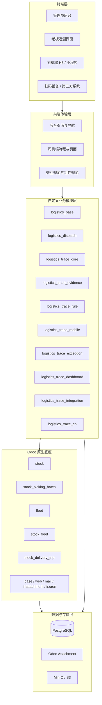

# Odoo19物流留痕系统总体设计与边界说明

本文档用于作为当前 Odoo 物流留痕系统重构工作的总入口文档。

它回答 4 个最关键的问题：

1. 这套系统到底是什么
2. Odoo 在里面承担什么，不承担什么
3. 自定义模块之间如何分层
4. 当前阶段哪些内容在范围内，哪些内容暂不进入

相关文档：

- `../系统重构核心设计摘要.md`
- `Odoo19物流留痕系统扩展规划.md`
- `Odoo19物流留痕系统模块重设方案.md`
- `../Odoo19物流留痕系统五人分工与前端改造安排.md`

---

## 1. 系统定位

这套系统不再按“通用仓储系统”或“订单管理系统”来理解。

当前统一定位为：

**一套以物流留痕取证为核心、以司机端快速提交为入口、以后台追溯查证为管理闭环的 Odoo 扩展系统。**

它的核心价值只有两条：

- 给仓库老板和管理者留下可回看、可追溯、可举证的证据链
- 让司机和现场人员用尽量少的步骤完成留痕提交

因此，运单、订单、批次、车次、异常、看板这些能力都很重要，但都应围绕“证据链”服务，而不是反过来喧宾夺主。

---

## 2. 总体边界

## 2.1 Odoo 承担什么

Odoo 承担业务底座和后台基础设施，主要包括：

- 订单履约对象
- 库存与出库流程
- 批次对象
- 车辆与车次对象
- 用户、权限、菜单、视图、报表
- 附件、定时任务、消息跟踪、多公司能力

简化理解就是：

**Odoo 负责把业务跑起来。**

## 2.2 自定义模块承担什么

自定义模块承担真正构成产品差异化的部分，主要包括：

- 留痕事件
- 证据对象
- 合规规则
- 司机端专用接口
- 异常追溯
- 留痕质量看板
- 第三方接入与本地化适配

简化理解就是：

**自定义模块负责把证据链沉淀下来。**

## 2.3 当前明确不做什么

当前阶段不把系统做成下面这些东西：

- 不把 Odoo 原生后台直接当司机端使用
- 不在第一阶段追求大而全的 ERP 覆盖
- 不以复杂审批和复杂报表为第一优先级
- 不重新造一套与 Odoo 平行的订单、库存、调度主模型
- 不把图片只当普通附件处理
- 不把 chatter 当留痕主表

---

## 3. 分层架构

建议统一按 5 层理解当前系统。



---

## 4. 核心模块边界

## 4.1 `logistics_base`

基础能力层。

负责：

- 公共字典
- 共享字段与 mixin
- 编号规则
- 公共配置
- 公共安全组和菜单根节点

不负责：

- 具体业务页面
- 具体留痕逻辑
- 调度逻辑

## 4.2 `logistics_dispatch`

执行组织层。

负责：

- 运单、订单、批次、车次、司机、车辆的执行关系
- 仓内组织与出车组织的衔接
- 给司机端和留痕中心提供执行上下文

不负责：

- 证据存储
- 留痕事实本体
- 异常处置逻辑

## 4.3 `logistics_trace_core`

留痕主心骨。

负责：

- 留痕事件模型
- 留痕归属对象
- 留痕来源、类型、提交人、提交时间
- 留痕时间线

不负责：

- 底层附件读写
- 对外存储适配

## 4.4 `logistics_trace_evidence`

证据层。

负责：

- 证据对象模型
- 留痕与证据关联
- 图片、签名、附件的业务归属
- 证据预览、下载、有效性状态

不负责：

- 批次调度
- 司机任务分派

## 4.5 `logistics_trace_rule`

规则层。

负责：

- 节点留痕规则
- 最少证据数量
- 是否必须备注或签名
- 规则校验结果

不负责：

- 页面表现
- 存储实现

## 4.6 `logistics_trace_mobile`

司机端接入层。

负责：

- 司机端 H5/小程序轻量接口
- 扫码识别
- 快速留痕提交
- 连续录入和弱网策略

不负责：

- 后台主控页面
- Odoo 标准后台视图适配

## 4.7 `logistics_trace_exception`

异常层。

负责：

- 异常对象化
- 异常与订单、车次、留痕、证据的关联
- 当前异常与历史异常

不负责：

- 证据存储
- 调度主链路

## 4.8 `logistics_trace_dashboard`

运营与老板看板层。

负责：

- 缺图率
- 留痕完成率
- 异常数量与闭环率
- 司机留痕质量
- 批次/车次证据完整度

不负责：

- 底层事实写入

## 4.9 `logistics_trace_integration`

对外集成层。

负责：

- 小程序、扫码设备、第三方物流系统接入
- 对象存储适配
- 回调和异步编排

不负责：

- 主业务规则定义

## 4.10 `logistics_trace_cn`

本地化适配层。

负责：

- 中文状态字典
- 本地物流编号口径
- 微信生态适配
- 国内接口适配

---

## 5. 业务主链路

统一承认 3 条主链。

## 5.1 订单证据链

```text
stock.picking
-> logistics.trace.event
-> logistics.trace.evidence
```

这是最核心的证据闭环。

## 5.2 运输执行链

```text
stock.delivery.trip
-> stock.picking
-> logistics.trace.event
-> logistics.trace.evidence
```

这是司机端与车次视角的主链。

## 5.3 仓内组织链

```text
stock.picking.batch
-> stock.picking
-> logistics.trace.event
```

这是批次与波次视角的主链。

---

## 6. 关键设计原则

## 6.1 证据优先，不是附件优先

图片、签名、备注、附件不是普通文件，而是业务证据对象。

## 6.2 留痕是正式业务事实，不是聊天记录

`mail.thread` 可作为协作补充，但不能替代留痕主表。

## 6.3 批次和车次不是证据主对象

批次和车次提供执行上下文，真正的留痕主对象应当是运单号；订单作为运单下的履约明细参与追溯。

## 6.4 后台和司机端必须分开设计

- 后台优先考虑查询、追溯、管理
- 司机端优先考虑少步骤、弱网可用、连续提交

## 6.5 优先扩展，不改核心源码

优先通过 `custom_addons/` 自定义模块扩展，不直接改官方核心源码。

---

## 7. 当前阶段范围

## 7.1 P0

必须最先打通：

- 调度上下文
- 留痕事件
- 证据上传
- 司机端提交
- 后台查看留痕和证据

## 7.2 P1

尽快补齐：

- 异常中心
- 留痕质量看板
- 批次/车次视角追溯

## 7.3 P2

后续增强：

- 第三方接入
- 对象存储优化
- 更细规则引擎
- 本地化增强

---

## 8. 当前总边界结论

从现在开始，团队应该统一按下面这句话理解这套系统：

**Odoo 是业务底座和运营后台，自定义模块是物流留痕产品层，司机端和后台界面是两条独立体验线，而整套系统的真正中心是“留痕事件 + 证据对象 + 可追溯证据链”。**

只要这个边界不乱，后面模块设计、接口设计、页面设计、数据库审核就都能稳定收敛。
