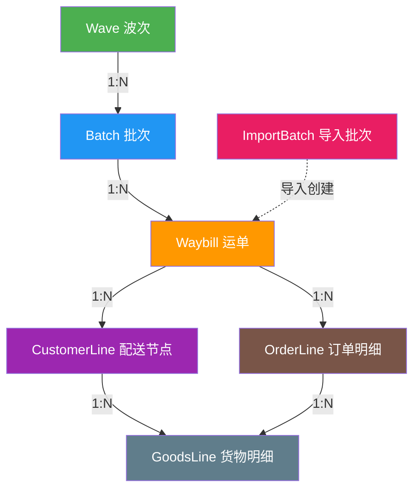
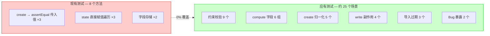
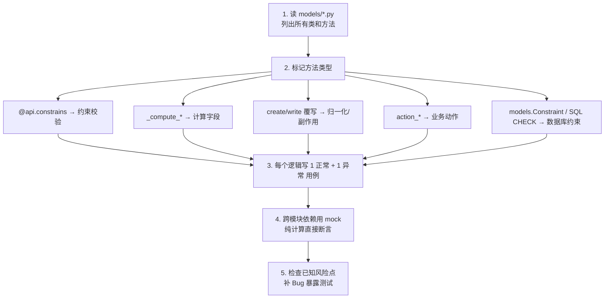

# 单测分析示例 — logistics_dispatch 模块

> **用途**：本文档以 `logistics_dispatch` 模块为例，展示"现有测试到底测了什么"以及"真正该测什么"的完整分析过程。  
> 可作为其他模块补测的参考模板。

---

## 一、模块概览

`logistics_dispatch` 是物流调度的核心模块，包含以下主要模型：

| 模型 | 文件 | 说明 |
|---|---|---|
| `logistics.dispatch.wave` | `logistics_dispatch_wave.py` | 波次（一次发车计划） |
| `logistics.dispatch.batch` | `logistics_dispatch_batch.py` | 批次（一车货物） |
| `logistics.dispatch.waybill` | `logistics_dispatch_waybill.py` | 运单（具体配送任务） |
| `logistics.dispatch.waybill.order.line` | `logistics_dispatch_waybill_order_line.py` | 运单订单明细 |
| `logistics.dispatch.waybill.customer.goods.line` | `logistics_dispatch_waybill_customer_goods_line_v2.py` | 运单货物明细 |
| `logistics.import.batch` | `logistics_import_batch.py` | 导入批次管理 |

### 模型层级关系



---

## 二、现有测试分析（test_dispatch_models.py）

### 2.1 现有测试清单

当前共 3 个测试类、8 个测试方法：

| # | 类 | 方法 | 代码行为 | 判定 |
|---|---|---|---|---|
| 1 | `TestDispatchBatch` | `test_01_create_batch` | `create(state="draft")` → `assertEqual(state, "draft")` | **无效** |
| 2 | | `test_02_state_flow` | `batch.state = s` 遍历 5 个状态值 | **无效** |
| 3 | | `test_03_batch_no_required` | `create(batch_no="PC...")` → `assertEqual(batch_no, "PC...")` | **无效** |
| 4 | `TestDispatchWave` | `test_01_create_wave` | `create(state="draft")` → `assertEqual(state, "draft")` | **无效** |
| 5 | | `test_02_state_flow` | `wave.state = s` 遍历 4 个状态值 | **无效** |
| 6 | `TestDispatchWaybill` | `test_01_create_waybill` | `create(state="draft")` → `assertEqual(state, "draft")` | **无效** |
| 7 | | `test_02_state_flow_all` | `wb.state = s` 遍历 6 个状态值 | **无效** |
| 8 | | `test_03_waybill_no_storage` | `create(waybill_no="YD...")` → `assertEqual(waybill_no, "YD...")` | **无效** |

### 2.2 为什么判定"无效"

**问题 1：断言"输入值 = 输入值"**

```python
# ❌ 现有写法 — 传入 "draft"，断言还是 "draft"，等于什么都没测
batch = self.env["logistics.dispatch.batch"].create({
    "name": "TEST", "state": "draft", "warehouse_id": self.wh.id,
})
self.assertEqual(batch.state, "draft")
```

这只是在测 ORM 的 `create()` 能不能存值，不是在测业务逻辑。

**问题 2：直接赋值绕过 `write()` 钩子**

```python
# ❌ 现有写法 — 直接赋值不会触发 write() 中的副作用逻辑
for s in states:
    batch.state = s  # 不经过 write()，不触发 _auto_create_trace_event 等
    self.assertEqual(batch.state, s)
```

运单 `write()` 中有状态变更时自动创建留痕事件、自动生成 TMS 对象等关键逻辑，直接赋值完全绕过了。

**问题 3：`setUp` 依赖 `search([], limit=1)`**

```python
# ❌ 如果数据库里没有 warehouse 记录，self.wh 为空，后续测试全靠运气
self.wh = self.env["stock.warehouse"].search([], limit=1)
```

应该在 `setUp` 中自建测试数据，不依赖数据库已有记录。

---

## 三、真正该测什么（完整清单）

### 3.1 约束校验（@api.constrains / SQL Constraint）

代码里有明确的 if → raise 逻辑，传入违规数据应该抛异常。每个约束需要 **1 个正常用例 + 1 个触发异常用例**。

| # | 模型 | 约束 | 逻辑说明 | 代码位置 |
|---|---|---|---|---|
| C1 | waybill | `_check_batch_warehouse_consistency` | 运单仓库必须与批次仓库一致 | `waybill.py:392-398` |
| C2 | batch | `_check_wave_warehouse_consistency` | 批次仓库必须与波次仓库一致 | `batch.py:116-120` |
| C3 | waybill | `_uniq_waybill_no` | 运单号唯一（SQL 约束） | `waybill.py:11-14` |
| C4 | batch | `_uniq_batch_no` | 批次号唯一（SQL 约束） | `batch.py:10-13` |
| C5 | wave | `_uniq_wave_no` | 波次号唯一（SQL 约束） | `wave.py:9-12` |
| C6 | order_line | `_check_non_negative_summary_values` | 整件数/散件数不能为负 | `order_line.py:97-101` |
| C7 | order_line | `_check_business_key_presence` | 至少需要一个业务键字段 | `order_line.py:103-122` |
| C8 | order_line | `_check_customer_line_belongs_to_waybill` | 订单行的配送节点必须属于同一运单 | `order_line.py:124-128` |
| C9 | goods_line | SQL CHECK | 数量/件数/重量/体积 >= 0 | `goods_line_v2.py:10-13` |

#### 示例代码（C1 — 批次仓库一致性）

```python
def test_waybill_warehouse_must_match_batch(self):
    """运单仓库与批次仓库不一致 → 抛 ValidationError"""
    wh_a = self.env["stock.warehouse"].create({"name": "仓库A", "code": "WHA"})
    wh_b = self.env["stock.warehouse"].create({"name": "仓库B", "code": "WHB"})
    batch = self.env["logistics.dispatch.batch"].create({
        "name": "BATCH-WH-TEST", "warehouse_id": wh_a.id,
    })
    with self.assertRaises(ValidationError):
        self.env["logistics.dispatch.waybill"].create({
            "name": "YD-WH-MISMATCH",
            "batch_id": batch.id,
            "warehouse_id": wh_b.id,  # 故意不一致
        })

def test_waybill_warehouse_match_batch_ok(self):
    """运单仓库与批次仓库一致 → 正常创建"""
    wh = self.env["stock.warehouse"].create({"name": "仓库C", "code": "WHC"})
    batch = self.env["logistics.dispatch.batch"].create({
        "name": "BATCH-WH-OK", "warehouse_id": wh.id,
    })
    waybill = self.env["logistics.dispatch.waybill"].create({
        "name": "YD-WH-MATCH",
        "batch_id": batch.id,
        "warehouse_id": wh.id,
    })
    self.assertEqual(waybill.warehouse_id, wh)
```

---

### 3.2 compute 字段（输入依赖 → 断言计算输出）

设置依赖字段后，断言 **计算结果** 而非输入值。

| # | 模型 | compute 方法 | 输入 | 预期输出 |
|---|---|---|---|---|
| P1 | waybill | `_compute_order_line_count` | 关联 3 条 order_line | `order_line_count == 3` |
| P2 | waybill | `_compute_order_summary` | order_line 有 sales_order_no = "SO1","SO2","SO1" | `order_refs_summary == "SO1 / SO2"` (去重) |
| P3 | waybill | `_compute_detail_counts` | goods_line(qty=10, weight=5, volume=2, pkg=3) × 2 | `total_goods_qty==20, total_goods_weight==10, total_goods_volume==4, total_package_count==6` |
| P4 | batch | `_compute_counts` | batch + 3 waybill(state: draft/done/done, exception: none/open/none) | `total==3, finished==2, exception==1` |
| P5 | wave | `_compute_counts` | wave + 2 batch, 各 2 waybill | `total_batch==2, total_waybill==4` |
| P6 | waybill | `_compute_customer_no` | partner(external="E01", logistics_customer="L01") | 取优先级最高的 → `customer_no == "E01"` |

#### 示例代码（P3 — 货物汇总）

```python
def test_compute_detail_counts_sums_goods(self):
    """goods_line 数量/重量/体积/件数应正确汇总到运单"""
    waybill = self._create_waybill()
    cust_line = self.env["logistics.dispatch.waybill.customer.line"].create({
        "waybill_id": waybill.id, "partner_id": self.partner.id,
    })
    for i in range(3):
        self.env["logistics.dispatch.waybill.customer.goods.line"].create({
            "customer_line_id": cust_line.id,
            "goods_name": f"货物{i}",
            "quantity": 10.0,
            "package_count": 2,
            "weight": 5.0,
            "volume": 1.5,
        })
    waybill.invalidate_recordset()
    self.assertEqual(waybill.total_goods_qty, 30.0)
    self.assertEqual(waybill.total_package_count, 6)
    self.assertAlmostEqual(waybill.total_goods_weight, 15.0)
    self.assertAlmostEqual(waybill.total_goods_volume, 4.5)
```

---

### 3.3 create() 归一化逻辑

`_normalize_partner_vals` 是运单创建的核心入口，负责把导入字段统一解析为标准字段。

| # | 输入字段 | 逻辑 | 预期结果 |
|---|---|---|---|
| N1 | `customer_no="CUST-001"` | 按编码查找 partner | `waybill.partner_id == partner` |
| N2 | `partner_name="测试客户"` | 按名称查找 partner | `waybill.partner_id == partner` |
| N3 | `batch_no="PC001"` | 按批次号查找 batch，自动填充 warehouse_id | `waybill.batch_id == batch, waybill.warehouse_id == batch.warehouse_id` |
| N4 | `customer_no="不存在"` | 找不到 → 报错 | `assertRaises(ValidationError)` |
| N5 | 两个 partner 同名 | `_ensure_unique_record` → 报多条匹配 | `assertRaises(ValidationError)` |

#### 示例代码（N1 — customer_no 解析）

```python
def test_create_waybill_resolves_customer_no(self):
    """通过 customer_no 创建运单 → 自动解析到 partner"""
    partner = self.env["res.partner"].create({
        "name": "测试物流客户",
        "is_logistics_partner": True,
        "external_customer_code": "CUST-001",
    })
    batch = self.env["logistics.dispatch.batch"].create({
        "name": "BATCH-FOR-RESOLVE", "warehouse_id": self.warehouse.id,
    })
    waybill = self.env["logistics.dispatch.waybill"].create({
        "name": "YD-RESOLVE-TEST",
        "customer_no": "CUST-001",
        "batch_id": batch.id,
        "warehouse_id": self.warehouse.id,
    })
    self.assertEqual(waybill.partner_id, partner)
    self.assertEqual(waybill.customer_id, partner)
    self.assertEqual(waybill.store_id, partner)
```

---

### 3.4 write() 副作用（状态变更 → 触发动作）

运单的 `write()` 方法中包含核心业务联动。这里**需要 mock 跨模块依赖**。

| # | 触发条件 | 副作用 | mock 方式 |
|---|---|---|---|
| W1 | `write(state="ready")` | 创建 `logistics.trace.event`(trace_type="arrive") | mock `self.env.registry` 判断，或建真实 trace.event |
| W2 | `write(state="in_transit")` | 创建 trace.event(type="leave") + 调用 `_auto_generate_tms_objects` | mock `tms.dispatch.order` 的 create |
| W3 | `write(state="signed")` | 创建 trace.event(type="sign") + 写 `evidence_status` | 断言 evidence_status 值 |
| W4 | 同一状态写两次 | 第二次不应重复创建 trace.event | 调两次 write，断言 event 只有 1 条 |

#### 示例代码（W1 — 状态变更创建留痕，需要 mock）

```python
from unittest.mock import patch, MagicMock

def test_write_state_ready_creates_trace_event(self):
    """运单状态变为 ready → 自动创建 arrive 类型的留痕事件"""
    waybill = self._create_waybill()

    # 如果 logistics.trace.event 未安装，mock 它
    mock_event_model = MagicMock()
    mock_event_model.sudo.return_value = mock_event_model
    mock_event_model.search.return_value = self.env["logistics.dispatch.waybill"]  # 空记录集
    mock_event_model.create.return_value = MagicMock()

    with patch.dict(self.env.registry.models, {"logistics.trace.event": True}):
        with patch.object(type(self.env), '__getitem__', side_effect=lambda s, key:
            mock_event_model if key == "logistics.trace.event" else self.env.__class__.__getitem__(self.env, key)
        ):
            waybill.write({"state": "ready"})
            mock_event_model.create.assert_called_once()
            call_args = mock_event_model.create.call_args[0][0]
            self.assertEqual(call_args["trace_type"], "arrive")
            self.assertEqual(call_args["waybill_id"], waybill.id)
```

> **更简单的方式**：如果 `logistics_trace_core` 已安装在测试环境中，不需要 mock，直接断言数据库中多了一条 trace.event。

---

### 3.5 导入批次过期逻辑

| # | 场景 | 预期 |
|---|---|---|
| E1 | state=prechecked, expires_at=过去时间 → 调用 `mark_expired_if_needed()` | state 变 "expired" |
| E2 | state=finished → 调用 | state 不变 |
| E3 | expires_at=未来时间 → 调用 | state 不变 |

#### 示例代码（E1）

```python
from datetime import timedelta

def test_mark_expired_changes_state(self):
    """过期的导入批次应标记为 expired"""
    batch = self.env["logistics.import.batch"].create({
        "template_code": "TSL-TEST",
        "template_version": "v1",
        "expires_at": fields.Datetime.now() - timedelta(hours=1),
    })
    batch.mark_expired_if_needed()
    # 注意：当前代码用 record.state = "expired" 直接赋值
    # 可能不会落库，这里刷新后检查
    batch.invalidate_recordset()
    self.assertEqual(batch.state, "expired")
```

---

### 3.6 已知 Bug（测试应主动暴露）

| # | 位置 | Bug 描述 | 测试暴露方式 |
|---|---|---|---|
| B1 | `waybill.py:498` | 签收后写 `evidence_status="available"`，但该字段的合法值是 `missing/partial/complete`，不包含 `available` | `write(state="signed")` → `assertEqual(evidence_status, "complete")` —— 如果代码写的是 `available`，断言会失败 |
| B2 | `import_batch.py:125` | `record.state = "expired"` 直接赋值，可能不触发 ORM 写入 | `mark_expired_if_needed()` 后 `read()` 验证是否持久化 |

---

## 四、覆盖全景对比



---

## 五、分析方法论（可复制到其他模块）

对任意一个 Odoo 模块，按以下步骤提取"真正该测什么"：



### 分类速查表

| 代码特征 | 测试类型 | 断言方式 | 是否需要 mock |
|---|---|---|---|
| `@api.constrains` + `raise ValidationError` | 正例 + 反例 | `assertRaises(ValidationError)` | 一般不需要 |
| `models.Constraint("unique/check...")` | 反例 | `assertRaises(Exception)` | 不需要 |
| `_compute_*` + `@api.depends` | 设置依赖字段 → 断言输出 | `assertEqual/assertAlmostEqual` | 不需要 |
| `create()` 覆写 + `_normalize_*` | 传导入字段 → 断言标准字段 | `assertEqual(record.field, expected)` | 跨模块查询可 mock |
| `write()` 覆写 + 副作用 | 写特定值 → 断言关联对象被创建/修改 | 检查关联记录或 mock.assert_called | 跨模块 create 需 mock |
| `action_*` 方法 | 调用 → 断言返回值和副作用 | `assertEqual` + 检查状态变化 | 看具体依赖 |

---

## 六、优先级建议

| 优先级 | 测试场景 | 数量 | 理由 |
|---|---|---|---|
| **P0** | 约束校验（C1-C9） | 9 | 数据完整性的最后防线，不测等于裸奔 |
| **P0** | create 归一化（N1-N5） | 5 | 导入功能的核心路径，出错影响批量数据 |
| **P1** | compute 字段（P1-P6） | 6 | 界面展示的数据来源，算错用户直接可见 |
| **P1** | write 副作用（W1-W4） | 4 | 跨模块联动，出错影响留痕和 TMS |
| **P2** | 导入过期（E1-E3） | 3 | 影响较小，但逻辑简单容易补 |
| **P2** | Bug 暴露（B1-B2） | 2 | 已知问题，补测顺手修 |
