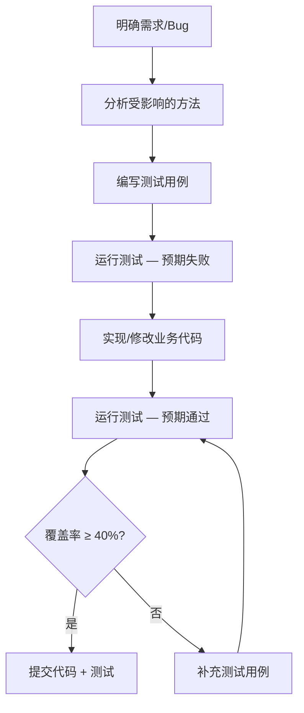
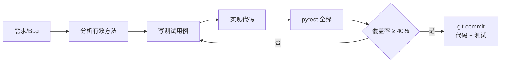

# BDD 验证优先开发规范 — odoo-reconstruct

> **核心理念**：每次功能开发或 Bug 修复，**先写/补测试，再提交代码**。测试不是事后补丁，而是开发交付物的一部分。

---

## 一、总则

### 1.1 BDD 验证优先原则

```
传统流程：写代码 → 手动验证 → （有空再补测试）→ 提交
BDD 流程：明确行为预期 → 编写测试用例 → 实现/修改代码 → 测试通过 → 提交
```

**每次代码提交必须包含对应的单元测试**。不接受"先合入代码，后续再补测试"的做法。

### 1.2 覆盖率要求

| 指标 | 目标 | 说明 |
|---|---|---|
| **有效方法覆盖率** | **40% – 50%** | 只计算有业务逻辑的方法（`_compute_*`、`@api.constrains`、`action_*`、核心 service 方法） |
| 不纳入统计 | — | 纯字段声明、`__manifest__.py`、`__init__.py`、空壳方法、视图 XML、静态资源 |

### 1.3 什么是"有效方法"

```
纳入覆盖率统计              不纳入
─────────────────────────────────────────────
_compute_* 计算字段          纯字段声明（fields.Char/Integer...）
@api.constrains 约束         __init__.py 导入
action_* 业务动作            __manifest__.py 配置
write/create override        空的 setUp/tearDown
service 层核心方法           日志打印方法
controller 路由处理          纯 pass 方法
wizard 业务逻辑              ORM 默认行为（未 override 的 CRUD）
```

---

## 二、开发流程

### 2.1 标准开发循环



### 2.2 提交检查清单

每次提交前，开发者需确认：

- [ ] 新增/修改的每个有效方法都有对应测试
- [ ] 每个 `@api.constrains` 至少 1 个正常 + 1 个触发异常的用例
- [ ] 每个 `_compute_*` 至少 1 个断言**计算结果**（不是断言输入值）
- [ ] 每个核心 `action_*` 至少 1 正常路径 + 1 异常路径
- [ ] 至少包含 1 个负面用例（非法参数/非法状态/边界条件）
- [ ] `pytest` 全部通过
- [ ] 无 `hasattr` / `if` 静默跳过

---

## 三、测试架构

### 3.1 当前项目测试基础设施

项目使用 **mock-based 测试架构**，不依赖 Odoo 数据库和运行时环境：

```
odoo-reconstruct/
├── conftest.py              # pytest 全局配置 — mock Odoo 框架
├── test_helpers.py          # MockRecord / MockRecordset 工具类
└── custom_addons/
    └── <模块名>/
        └── tests/
            └── test_*.py    # 各模块的测试文件
```

**运行方式**：

```bash
# 运行全部测试
pytest -v

# 运行单个模块测试
pytest -v custom_addons/logistics_dispatch/tests/

# 运行并显示覆盖率（需安装 pytest-cov）
pytest --cov=custom_addons --cov-report=term-missing
```

### 3.2 核心测试原则：测输入→输出的变换

```
方法类型          怎么测                              mock 策略
─────────────────────────────────────────────────────────────────
纯计算方法        直接传参 → 断言返回值                 不需要 mock
compute 字段      设置依赖字段 → 断言计算结果            不需要 mock
@api.constrains   传入违规值 → assertRaises              不需要 mock
action 方法       调用 action → 断言状态+副作用           mock 内部数据库调用
调外部 API        mock 外部调用 → 断言行为               必须 mock
跨模块依赖        mock 不存在的模型 → 断言不崩溃          mock env 访问
```

### 3.3 关于 mock 数据库

**本项目要求 mock 数据库交互**，不依赖真实数据库连接：

```python
# ✅ 正确：mock 数据库返回
from test_helpers import MockRecord, MockRecordset

rec = MockRecord(id=1, name="测试运单", state="draft")
rs = MockRecordset([rec])

# 调用被测方法
result = MyModel._compute_something(rs)

# 断言输出
assert rs.computed_field == expected_value
```

```python
# ❌ 错误：依赖真实数据库
class TestMyModel(TransactionCase):
    def test_something(self):
        record = self.env["my.model"].create({...})  # 需要数据库
```

### 3.4 关于直接赋值

直接赋值**不是问题**，关键看断言什么：

```python
# ✅ OK：赋值输入，断言计算后的输出
line.qty = 3
line.unit_price = 50.0
assert line.subtotal == 150.0  # 断言 compute 的结果

# ❌ 没意义：赋值后断言赋的值
line.qty = 3
assert line.qty == 3  # 在测 Python 能不能存数字
```

---

## 四、各类方法的测试模板

### 4.1 compute 字段测试

```python
def test_compute_total_qty_with_multiple_lines(self):
    """购物车合计：多行明细应正确求和"""
    line1 = MockRecord(id=1, qty=3, unit_price=50.0)
    line2 = MockRecord(id=2, qty=5, unit_price=30.0)
    cart = MockRecord(id=10, line_ids=MockRecordset([line1, line2]))
    rs = MockRecordset([cart])

    CartModel._compute_total(rs)

    assert cart.total_qty == 8
    assert cart.total_amount == 300.0

def test_compute_total_qty_empty_cart(self):
    """空购物车：合计应为 0"""
    cart = MockRecord(id=10, line_ids=MockRecordset([]))
    rs = MockRecordset([cart])

    CartModel._compute_total(rs)

    assert cart.total_qty == 0
    assert cart.total_amount == 0.0
```

### 4.2 constrains 测试

```python
def test_warehouse_consistency_violation(self):
    """运单仓库与批次仓库不一致时应抛 ValidationError"""
    batch = MockRecord(id=1, warehouse_id=MockRecord(id=100))
    rec = MockRecord(id=10, batch_id=batch, warehouse_id=MockRecord(id=200))
    rs = MockRecordset([rec])

    with pytest.raises(ValidationError):
        WaybillModel._check_warehouse_consistency(rs)

def test_warehouse_consistency_pass(self):
    """运单仓库与批次仓库一致时不应报错"""
    wh = MockRecord(id=100)
    batch = MockRecord(id=1, warehouse_id=wh)
    rec = MockRecord(id=10, batch_id=batch, warehouse_id=wh)
    rs = MockRecordset([rec])

    WaybillModel._check_warehouse_consistency(rs)  # 不抛异常即通过
```

### 4.3 action 方法测试

```python
def test_action_close_from_draft(self):
    """草稿状态结账应成功"""
    rec = MockRecord(id=1, state="draft")
    rs = MockRecordset([rec])

    PeriodClose.action_close(rs)

    assert rec.state == "closed"

def test_action_close_already_closed_raises(self):
    """已结账状态重复结账应抛 UserError"""
    rec = MockRecord(id=1, state="closed")
    rs = MockRecordset([rec])

    with pytest.raises(UserError):
        PeriodClose.action_close(rs)
```

### 4.4 状态机测试

```python
def test_state_transition_open_to_processing(self):
    """open → processing 应允许"""
    # ...

def test_state_transition_closed_to_open_rejected(self):
    """closed → open 应被拒绝"""
    # ...

def test_final_state_requires_summary(self):
    """进入终态时必须有 summary"""
    # ...
```

---

## 五、Mock 速查

### 5.1 MockRecord / MockRecordset 使用

```python
from test_helpers import MockRecord, MockRecordset

# 创建单条记录
rec = MockRecord(id=1, name="Test", state="draft", amount=100.0)

# 创建记录集
rs = MockRecordset([rec1, rec2, rec3])

# 记录集操作
rs.mapped("name")           # → ["Test1", "Test2", "Test3"]
rs.filtered(lambda r: r.amount > 50)  # → 过滤后的 MockRecordset
rs.sorted(key=lambda r: r.amount)     # → 排序后的 MockRecordset
rs.ensure_one()              # 记录集只有一条时返回自身
rs.sudo()                    # 返回自身（mock 中不做权限变化）
rec.write({"state": "done"}) # 直接更新属性
```

### 5.2 Mock env 和外部依赖

```python
from unittest.mock import MagicMock, patch

# mock self.env
env = MagicMock()
env.__getitem__ = MagicMock(return_value=MockRecordset([...]))

# mock 外部 HTTP 调用
with patch("urllib.request.urlopen") as mock_url:
    mock_url.return_value.__enter__ = lambda s: MagicMock(
        read=lambda: b'{"status":"1","geocodes":[{"location":"113.5,23.0"}]}'
    )
    result = my_method()

# mock 时间
with patch("odoo.fields.Datetime.now", return_value=datetime(2026, 6, 1)):
    record._compute_is_overdue()
```

---

## 六、模块级覆盖优先级

按业务风险排序，优先保障核心链路的测试覆盖：

| 优先级 | 模块 | 原因 | 目标覆盖率 |
|---|---|---|---|
| P0 | `logistics_dispatch` | 运单 write 有复杂副作用链，constrains 最多 | ≥ 50% |
| P0 | `b2b_storefront` | 前台用户直接操作，compute 密集 | ≥ 50% |
| P1 | `tms_dispatch_core` | 派车全流程 action，外部 API 需 mock | ≥ 40% |
| P1 | `logistics_trace_core` | 留痕是审计链基础，compute 密集 | ≥ 40% |
| P1 | `logistics_web` | 最大模块，controller + service | ≥ 40% |
| P2 | `wms_task_core` | 任务链路长，stock 集成 | ≥ 40% |
| P2 | `erp_base` | 底座模块 | ≥ 40% |
| P3 | `logistics_trace_evidence` | 图片存储逻辑 | ≥ 40% |
| P3 | `logistics_trace_exception` | 状态机 + 时间逻辑 | ≥ 40% |
| P3 | `logistics_base` | constrains 覆盖 | ≥ 40% |

---

## 七、已知 Bug 备忘

以下是代码审查中发现但**尚未修复**的潜在 Bug，开发时请注意：

| # | 位置 | 问题描述 | 风险 |
|---|---|---|---|
| B1 | `logistics_dispatch_waybill.py:498` | 签收后写 `evidence_status="available"`，但该字段合法值为 `missing/partial/complete`，不含 `available` | 数据不一致或运行时报错 |
| B2 | `logistics_import_batch.py:125` | `record.state = "expired"` 直接赋值，可能不触发 ORM `write()` 钩子 | 状态可能不落库 |

---

## 八、禁止事项

| 编号 | 禁止行为 | 正确做法 |
|---|---|---|
| F1 | 提交代码不带测试 | 每次提交必须包含对应测试 |
| F2 | 断言输入值等于输入值 | 断言方法的**输出/副作用** |
| F3 | `hasattr` / `if` 静默跳过 | 方法不存在应直接报错暴露问题 |
| F4 | `search([], limit=1)` + skipTest | 在测试中自建所有需要的数据 |
| F5 | 零负面用例 | 每个功能至少 1 个异常路径测试 |
| F6 | 依赖真实数据库运行 | mock 数据库交互 |
| F7 | 测试名与实际验证内容不符 | 命名格式 `test_<场景>_<预期结果>` |

---

## 九、AI 辅助写测试 Prompt 模板

### 9.1 通用前缀

```
你是 Odoo 19 单测专家。请为指定模块编写 mock-based 单元测试。

## 核心原则
1. 使用 unittest.TestCase，不依赖 Odoo 数据库
2. 使用 MockRecord / MockRecordset 模拟 Odoo 记录（参见 test_helpers.py）
3. 测试验证方法的 **输出/副作用**，不是输入值能否被存储
4. 每个测试方法只测一个行为，命名格式 test_<场景>_<预期结果>
5. 不要用 hasattr / if 守卫
6. 每个 @api.constrains 至少 1 正常 + 1 触发异常
7. 每个 _compute_* 至少 1 个断言计算结果
8. 每个核心 action 至少 1 正常 + 1 异常路径
9. 至少 1 个负面用例

## Mock 策略
- 数据库交互：用 MockRecord/MockRecordset 模拟
- 外部 HTTP 调用：用 unittest.mock.patch 模拟
- 时间敏感逻辑：用 patch 控制 Datetime.now
- self.env 访问：用 MagicMock 模拟
```

### 9.2 使用方式

1. 将通用前缀 + 目标模块的 `models/*.py` 代码 + `test_helpers.py` + `conftest.py` 一起提供给 AI
2. AI 生成测试后，运行 `pytest -v custom_addons/<模块>/tests/`
3. 测试失败 → 区分"测试写错了"还是"暴露了真实 bug"
4. 确认通过后提交

---

## 十、执行流程总结



**口号：没有测试的代码，不接受合入。**
